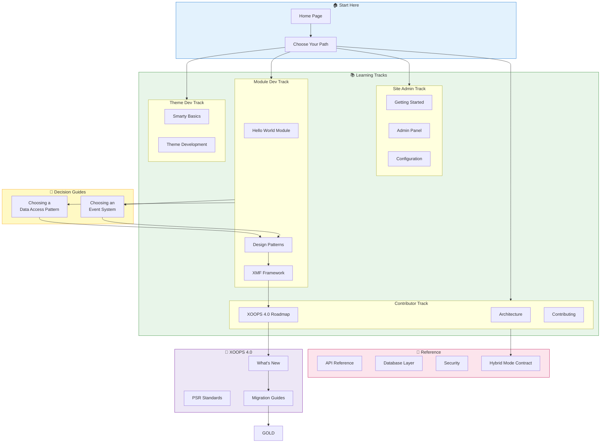
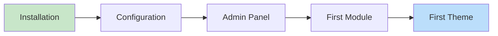
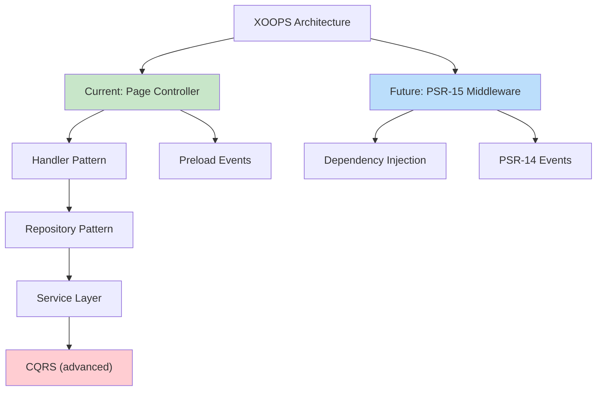
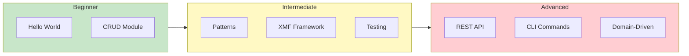
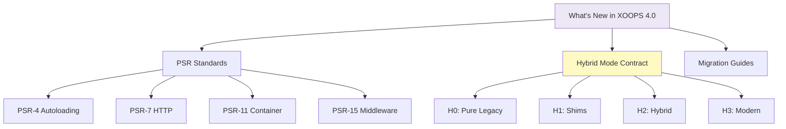

# 🗺️ Documentation Map

> **Visual guide to finding what you need in the XOOPS Knowledge Base.**

---

## How It All Connects

---

## By Topic

### 🎯 Getting Started

| Page | Description | Audience |
|------|-------------|----------|
| [Installation](../01-Getting-Started/Installation/Installation.md) | Set up XOOPS on your server | Everyone |
| [Server Requirements](../01-Getting-Started/Installation/Server-Requirements.md) | PHP/MySQL version requirements | Everyone |
| [Basic Configuration](../01-Getting-Started/Configuration/Basic-Configuration.md) | Essential settings | Admins |
| [Admin Panel](../01-Getting-Started/First-Steps/Admin-Panel-Overview.md) | Dashboard walkthrough | Admins |

---

### 🏗️ Architecture & Patterns

| Page | What You'll Learn | Version       |
|------|-------------------|---------------|
| [XOOPS Architecture](../02-Core-Concepts/Architecture/XOOPS-Architecture.md) | System layers, request lifecycle | 2.5.x/4.0 |
| [Design Patterns](../02-Core-Concepts/Architecture/Design-Patterns.md) | MVC, Singleton, Factory, Observer | 2.5.x/4.0    |
| [Choosing Patterns](../03-Module-Development/Choosing-Data-Access-Pattern.md) | Decision tree for data access | 2.5.x/4.0    |
| [Choosing Events](../02-Core-Concepts/Choosing-Event-System.md) | Preloads vs PSR-14 | 2.5.x/4.0    |

---

### 🔧 Module Development

| Page | Skill Level | Time |
|------|-------------|------|
| [Hello World](../03-Module-Development/Tutorials/Hello-World-Module.md) | 🟢 Beginner | 1 hour |
| [CRUD Module](../03-Module-Development/Tutorials/Building-a-CRUD-Module.md) | 🟢 Beginner | 2-3 hours |
| [Repository Pattern](../03-Module-Development/Patterns/Repository-Pattern.md) | 🟡 Intermediate | 2 hours |
| [XMF Framework](../05-XMF-Framework/XMF-Framework.md) | 🟡 Intermediate | 4 hours |
| [REST API](../07-XOOPS-4.0/Tutorials/Adding-REST-API-to-Your-Module.md) | 🔴 Advanced | 1 day |

---

### 🔮 XOOPS 4.0 Track

| Page                                                                           | Description |
|--------------------------------------------------------------------------------|-------------|
| [What's New in XOOPS 4.0](../07-XOOPS-4.0/Whats-New-in-4.0.md)                 | Quick overview of all changes |
| [Hybrid Mode Contract](../07-XOOPS-4.0/Specifications/Hybrid-Mode-Contract.md) | Compatibility guarantees |
| [PSR Standards](../07-XOOPS-4.0/PSR-Standards/PSR-Standards-Overview.md)       | Modern PHP standards |
| [Migration Guide](../07-XOOPS-4.0/Migration-Guides/From-2.5-to-4.0.md)         | Step-by-step migration |

---

## Quick Links by Role

### 👤 Site Administrator

1. [Install XOOPS](../01-Getting-Started/Installation/Installation.md)
2. [Configure basics](../01-Getting-Started/Configuration/Basic-Configuration.md)
3. [Learn admin panel](../01-Getting-Started/First-Steps/Admin-Panel-Overview.md)
4. [Troubleshoot issues](../08-Troubleshooting/Troubleshooting.md)

### 🔧 Module Developer

1. [Build first module](../03-Module-Development/Tutorials/Hello-World-Module.md)
2. [Choose patterns](../03-Module-Development/Choosing-Data-Access-Pattern.md)
3. [Use XMF](../05-XMF-Framework/XMF-Framework.md)
4. [Reference API](../04-API-Reference/API-Reference.md)

### 🎨 Theme Developer

1. [Learn Smarty](../02-Core-Concepts/Templates/Smarty-Basics.md)
2. [Use Smarty variables](../02-Core-Concepts/Templates/Template-Variables.md)
3. [Build themes](../02-Core-Concepts/Themes/Theme-Development.md)
4. [Prepare for Smarty 4](../02-Core-Concepts/Templates/Smarty-4-Migration.md)

### 🚀 Core Contributor

1. [Understand architecture](../02-Core-Concepts/Architecture/XOOPS-Architecture.md)
2. [Study roadmap](../07-XOOPS-4.0/XOOPS-4.0-Roadmap.md)
3. [Learn compatibility](../07-XOOPS-4.0/Specifications/Hybrid-Mode-Contract.md)
4. [Contribute](../09-Contributing/Contributing.md)

---

## Legend

| Badge                                                            | Meaning |
|------------------------------------------------------------------|---------|
| 2.5.x ✅           | Works in current stable XOOPS |
| 4.0 ✅             | Works in XOOPS 4.0 |
| XMF Required      | Requires XMF Framework |
| Deprecated | Will be removed in future |

---

#navigation #sitemap #guide
