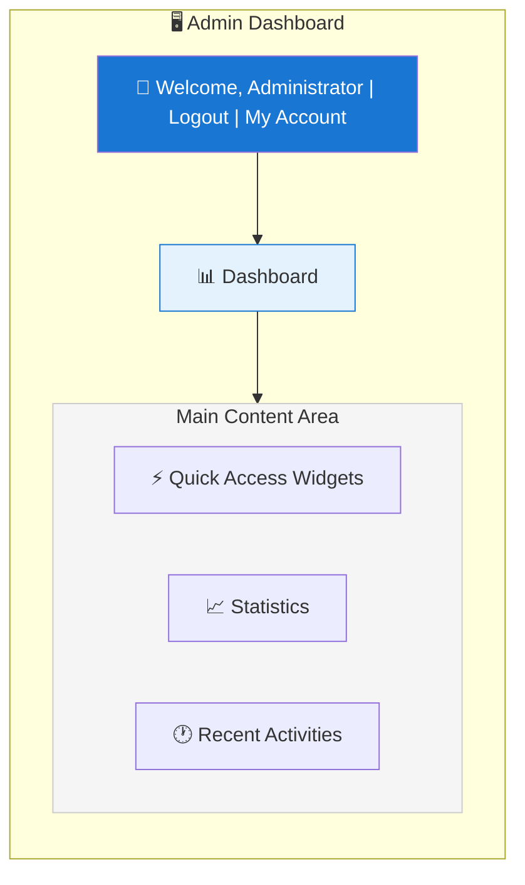
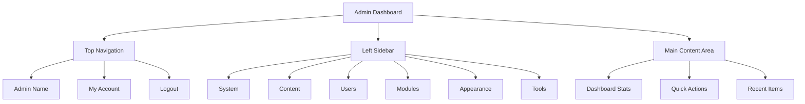

# XOOPS Admin Panel Overview

Complete guide to navigating and using the XOOPS administrator dashboard.

## Accessing the Admin Panel

### Admin Login

Open your browser and navigate to:

```
http://your-domain.com/xoops/admin/
```

Or if XOOPS is in root:

```
http://your-domain.com/admin/
```

Enter your administrator credentials:

```
Username: [Your admin username]
Password: [Your admin password]
```

### After Login

You'll see the main admin dashboard:



## Admin Panel Layout



## Dashboard Components

### Top Bar

The top bar contains essential controls:

| Element | Purpose |
|---|---|
| **Admin Logo** | Click to return to dashboard |
| **Welcome Message** | Shows logged-in admin name |
| **My Account** | Edit admin profile and password |
| **Help** | Access documentation |
| **Logout** | Sign out of admin panel |

### Left Navigation Sidebar

Main menu organized by function:

```
├── System
│   ├── Dashboard
│   ├── Preferences
│   ├── Admin Users
│   ├── Groups
│   ├── Permissions
│   ├── Modules
│   └── Tools
├── Content
│   ├── Pages
│   ├── Categories
│   ├── Comments
│   └── Media Manager
├── Users
│   ├── Users
│   ├── User Requests
│   ├── Online Users
│   └── User Groups
├── Modules
│   ├── Modules
│   ├── Module Settings
│   └── Module Updates
├── Appearance
│   ├── Themes
│   ├── Templates
│   ├── Blocks
│   └── Images
└── Tools
    ├── Maintenance
    ├── Email
    ├── Statistics
    ├── Logs
    └── Backups
```

### Main Content Area

Displays information and controls for selected section:

- Forms for configuration
- Data tables with lists
- Charts and statistics
- Quick action buttons
- Help text and tooltips

### Dashboard Widgets

Quick access to key information:

- **System Information:** PHP version, MySQL version, XOOPS version
- **Quick Statistics:** User count, total posts, modules installed
- **Recent Activity:** Latest logins, content changes, errors
- **Server Status:** CPU, memory, disk usage
- **Notifications:** System alerts, pending updates

## Core Admin Functions

### System Management

**Location:** System > [Various Options]

#### Preferences

Configure basic system settings:

```
System > Preferences > [Settings Category]
```

Categories:
- General Settings (site name, timezone)
- User Settings (registration, profiles)
- Email Settings (SMTP configuration)
- Cache Settings (caching options)
- URL Settings (friendly URLs)
- Meta Tags (SEO settings)

See [[../Configuration/Basic-Configuration|Basic Configuration]] and [[../Configuration/System-Settings|System Settings]].

#### Admin Users

Manage administrator accounts:

```
System > Admin Users
```

Functions:
- Add new administrators
- Edit admin profiles
- Change admin passwords
- Delete admin accounts
- Set admin permissions

### Content Management

**Location:** Content > [Various Options]

#### Pages/Articles

Manage site content:

```
Content > Pages (or your module)
```

Functions:
- Create new pages
- Edit existing content
- Delete pages
- Publish/unpublish
- Set categories
- Manage revisions

#### Categories

Organize content:

```
Content > Categories
```

Functions:
- Create category hierarchy
- Edit categories
- Delete categories
- Assign to pages

#### Comments

Moderate user comments:

```
Content > Comments
```

Functions:
- View all comments
- Approve comments
- Edit comments
- Delete spam
- Block commenters

### User Management

**Location:** Users > [Various Options]

#### Users

Manage user accounts:

```
Users > Users
```

Functions:
- View all users
- Create new users
- Edit user profiles
- Delete accounts
- Reset passwords
- Change user status
- Assign to groups

#### Online Users

Monitor active users:

```
Users > Online Users
```

Shows:
- Currently online users
- Last activity time
- IP address
- User location (if configured)

#### User Groups

Manage user roles and permissions:

```
Users > Groups
```

Functions:
- Create custom groups
- Set group permissions
- Assign users to groups
- Delete groups

### Module Management

**Location:** Modules > [Various Options]

#### Modules

Install and configure modules:

```
Modules > Modules
```

Functions:
- View installed modules
- Enable/disable modules
- Update modules
- Configure module settings
- Install new modules
- View module details

#### Check for Updates

```
Modules > Modules > Check for Updates
```

Displays:
- Available module updates
- Changelog
- Download and install options

### Appearance Management

**Location:** Appearance > [Various Options]

#### Themes

Manage site themes:

```
Appearance > Themes
```

Functions:
- View installed themes
- Set default theme
- Upload new themes
- Delete themes
- Theme preview
- Theme configuration

#### Blocks

Manage content blocks:

```
Appearance > Blocks
```

Functions:
- Create custom blocks
- Edit block content
- Arrange blocks on page
- Set block visibility
- Delete blocks
- Configure block caching

#### Templates

Manage templates (advanced):

```
Appearance > Templates
```

For advanced users and developers.

### System Tools

**Location:** System > Tools

#### Maintenance Mode

Prevent user access during maintenance:

```
System > Maintenance Mode
```

Configure:
- Enable/disable maintenance
- Custom maintenance message
- Allowed IP addresses (for testing)

#### Database Management

```
System > Database
```

Functions:
- Check database consistency
- Run database updates
- Repair tables
- Optimize database
- Export database structure

#### Activity Logs

```
System > Logs
```

Monitor:
- User activity
- Administrative actions
- System events
- Error logs

## Quick Actions

Common tasks accessible from dashboard:

```
Quick Links:
├── Create New Page
├── Add New User
├── Create Content Block
├── Upload Image
├── Send Mass Email
├── Update All Modules
└── Clear Cache
```

## Admin Panel Keyboard Shortcuts

Quick navigation:

| Shortcut | Action |
|---|---|
| `Ctrl+H` | Go to help |
| `Ctrl+D` | Go to dashboard |
| `Ctrl+Q` | Quick search |
| `Ctrl+L` | Logout |

## User Account Management

### My Account

Access your administrator profile:

1. Click "My Account" in top right
2. Edit profile information:
   - Email address
   - Real name
   - User information
   - Avatar

### Change Password

Change your admin password:

1. Go to **My Account**
2. Click "Change Password"
3. Enter current password
4. Enter new password (twice)
5. Click "Save"

**Security Tips:**
- Use strong passwords (16+ characters)
- Include uppercase, lowercase, numbers, symbols
- Change password every 90 days
- Never share admin credentials

### Logout

Sign out of admin panel:

1. Click "Logout" in top right
2. You'll be redirected to login page

## Admin Panel Statistics

### Dashboard Stats

Quick overview of site metrics:

| Metric | Value |
|--------|-------|
| Users Online | 12 |
| Total Users | 256 |
| Total Posts | 1,234 |
| Total Comments | 5,678 |
| Total Modules | 8 |

### System Status

Server and performance information:

| Component | Version/Value |
|-----------|---------------|
| XOOPS Version | 2.5.11 |
| PHP Version | 8.2.x |
| MySQL Version | 8.0.x |
| Server Load | 0.45, 0.42 |
| Uptime | 45 days |

### Recent Activity

Timeline of recent events:

```
12:45 - Admin login
12:30 - New user registered
12:15 - Page published
12:00 - Comment posted
11:45 - Module updated
```

## Notification System

### Admin Alerts

Receive notifications for:

- New user registrations
- Comments awaiting moderation
- Failed login attempts
- System errors
- Module updates available
- Database issues
- Disk space warnings

Configure alerts:

**System > Preferences > Email Settings**

```
Notify Admin on Registration: Yes
Notify Admin on Comments: Yes
Notify Admin on Errors: Yes
Alert Email: admin@your-domain.com
```

## Common Admin Tasks

### Create a New Page

1. Go to **Content > Pages** (or relevant module)
2. Click "Add New Page"
3. Fill in:
   - Title
   - Content
   - Description
   - Category
   - Metadata
4. Click "Publish"

### Manage Users

1. Go to **Users > Users**
2. View user list with:
   - Username
   - Email
   - Registration date
   - Last login
   - Status

3. Click username to:
   - Edit profile
   - Change password
   - Edit groups
   - Block/unblock user

### Configure Module

1. Go to **Modules > Modules**
2. Find module in list
3. Click the module name
4. Click "Preferences" or "Settings"
5. Configure module options
6. Save changes

### Create a New Block

1. Go to **Appearance > Blocks**
2. Click "Add New Block"
3. Enter:
   - Block title
   - Block content (HTML allowed)
   - Position on page
   - Visibility (all pages or specific)
   - Module (if applicable)
4. Click "Submit"

## Admin Panel Help

### Built-in Documentation

Access help from admin panel:

1. Click "Help" button in top bar
2. Context-sensitive help for current page
3. Links to documentation
4. Frequently asked questions

### External Resources

- XOOPS Official Site: https://xoops.org/
- Community Forum: https://xoops.org/modules/newbb/
- Module Repository: https://xoops.org/modules/repository/
- Bugs/Issues: https://github.com/XOOPS/XoopsCore/issues

## Customizing Admin Panel

### Admin Theme

Choose admin interface theme:

**System > Preferences > General Settings**

```
Admin Theme: [Select theme]
```

Available themes:
- Default (light)
- Dark mode
- Custom themes

### Dashboard Customization

Choose which widgets appear:

**Dashboard > Customize**

Select:
- System information
- Statistics
- Recent activity
- Quick links
- Custom widgets

## Admin Panel Permissions

Different admin levels have different permissions:

| Role | Capabilities |
|---|---|
| **Webmaster** | Full access to all admin functions |
| **Admin** | Limited admin functions |
| **Moderator** | Content moderation only |
| **Editor** | Content creation and editing |

Manage permissions:

**System > Permissions**

## Security Best Practices for Admin Panel

1. **Strong Password:** Use 16+ character password
2. **Regular Changes:** Change password every 90 days
3. **Monitor Access:** Check "Admin Users" logs regularly
4. **Limit Access:** Rename admin folder for additional security
5. **Use HTTPS:** Always access admin via HTTPS
6. **IP Whitelisting:** Restrict admin access to specific IPs
7. **Regular Logout:** Logout when done
8. **Browser Security:** Clear browser cache regularly

See [[../Configuration/Security-Configuration|Security Configuration]].

## Troubleshooting Admin Panel

### Can't Access Admin Panel

**Solution:**
1. Verify login credentials
2. Clear browser cache and cookies
3. Try different browser
4. Check if admin folder path is correct
5. Verify file permissions on admin folder
6. Check database connection in mainfile.php

### Blank Admin Page

**Solution:**
```bash
# Check PHP errors
tail -f /var/log/apache2/error.log

# Enable debug mode temporarily
sed -i "s/define('XOOPS_DEBUG', 0)/define('XOOPS_DEBUG', 1)/" /var/www/html/xoops/mainfile.php

# Check file permissions
ls -la /var/www/html/xoops/admin/
```

### Slow Admin Panel

**Solution:**
1. Clear cache: **System > Tools > Clear Cache**
2. Optimize database: **System > Database > Optimize**
3. Check server resources: `htop`
4. Review slow queries in MySQL

### Module Not Appearing

**Solution:**
1. Verify module installed: **Modules > Modules**
2. Check module enabled
3. Verify permissions assigned
4. Check module files exist
5. Review error logs

## Next Steps

After familiarizing yourself with admin panel:

1. [[Creating-Your-First-Page|Create your first page]]
2. [[Managing-Users|Set up user groups]]
3. [[Installing-Modules|Install additional modules]]
4. [[../Configuration/Basic-Configuration|Configure basic settings]]
5. [[../Configuration/Security-Configuration|Implement security]]

---

**Tags:** #admin-panel #dashboard #navigation #getting-started

**Related Articles:**
- [[../Configuration/Basic-Configuration]]
- [[../Configuration/System-Settings]]
- [[Creating-Your-First-Page]]
- [[Managing-Users]]
- [[Installing-Modules]]
