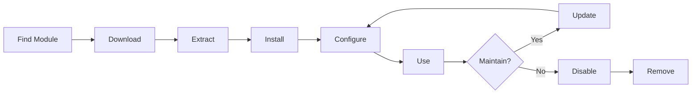

# Installing and Managing XOOPS Modules

Learn how to extend XOOPS functionality by installing and configuring modules.

## Understanding XOOPS Modules

### What are Modules?

Modules are extensions that add functionality to XOOPS:

| Type | Purpose | Examples |
|---|---|---|
| **Content** | Manage specific content types | News, Blog, Tickets |
| **Community** | User interaction | Forum, Comments, Reviews |
| **eCommerce** | Selling products | Shop, Cart, Payments |
| **Media** | Handle files/images | Gallery, Downloads, Videos |
| **Utility** | Tools and helpers | Email, Backup, Analytics |

### Core vs. Optional Modules

| Module | Type | Included | Removable |
|---|---|---|---|
| **System** | Core | Yes | No |
| **User** | Core | Yes | No |
| **Profile** | Recommended | Yes | Yes |
| **PM (Private Message)** | Recommended | Yes | Yes |
| **WF-Channel** | Optional | Often | Yes |
| **News** | Optional | No | Yes |
| **Forum** | Optional | No | Yes |

## Module Lifecycle



## Finding Modules

### XOOPS Module Repository

Official XOOPS module repository:

**Visit:** https://xoops.org/modules/repository/

```
Directory > Modules > [Browse Categories]
```

Browse by category:
- Content Management
- Community
- eCommerce
- Multimedia
- Development
- Site Administration

### Evaluating Modules

Before installing, check:

| Criteria | What to Look For |
|---|---|
| **Compatibility** | Works with your XOOPS version |
| **Rating** | Good user reviews and ratings |
| **Updates** | Recently maintained |
| **Downloads** | Popular and widely used |
| **Requirements** | Compatible with your server |
| **License** | GPL or similar open source |
| **Support** | Active developer and community |

### Read Module Information

Each module listing shows:

```
Module Name: [Name]
Version: [X.X.X]
Requires: XOOPS [Version]
Author: [Name]
Last Update: [Date]
Downloads: [Number]
Rating: [Stars]
Description: [Brief description]
Compatibility: PHP [Version], MySQL [Version]
```

## Installing Modules

### Method 1: Admin Panel Installation

**Step 1: Access Modules Section**

1. Log in to admin panel
2. Navigate to **Modules > Modules**
3. Click **"Install New Module"** or **"Browse Modules"**

**Step 2: Upload Module**

Option A - Direct Upload:
1. Click **"Choose File"**
2. Select module .zip file from computer
3. Click **"Upload"**

Option B - URL Upload:
1. Paste module URL
2. Click **"Download and Install"**

**Step 3: Review Module Info**

```
Module Name: [Name shown]
Version: [Version]
Author: [Author info]
Description: [Full description]
Requirements: [PHP/MySQL versions]
```

Review and click **"Proceed with Installation"**

**Step 4: Choose Install Type**

```
☐ Fresh Install (New installation)
☐ Update (Upgrade existing)
☐ Delete Then Install (Replace existing)
```

Select appropriate option.

**Step 5: Confirm Installation**

Review final confirmation:
```
Module will be installed to: /modules/modulename/
Database: xoops_db
Proceed? [Yes] [No]
```

Click **"Yes"** to confirm.

**Step 6: Installation Complete**

```
Installation successful!

Module: [Module Name]
Version: [Version]
Tables created: [Number]
Files installed: [Number]

[Go to Module Settings]  [Return to Modules]
```

### Method 2: Manual Installation (Advanced)

For manual installation or troubleshooting:

**Step 1: Download Module**

1. Download module .zip from repository
2. Extract to `/var/www/html/xoops/modules/modulename/`

```bash
# Extract module
unzip module_name.zip
cp -r module_name /var/www/html/xoops/modules/

# Set permissions
chmod -R 755 /var/www/html/xoops/modules/module_name
```

**Step 2: Run Installation Script**

```
Visit: http://your-domain.com/xoops/modules/module_name/admin/index.php?op=install
```

Or through admin panel (System > Modules > Update DB).

**Step 3: Verify Installation**

1. Go to **Modules > Modules** in admin
2. Look for your module in list
3. Verify it shows as "Active"

## Module Configuration

### Access Module Settings

1. Go to **Modules > Modules**
2. Find your module
3. Click on module name
4. Click **"Preferences"** or **"Settings"**

### Common Module Settings

Most modules offer:

```
Module Status: [Enabled/Disabled]
Display in Menu: [Yes/No]
Module Weight: [1-999] (display order)
Visible To Groups: [Checkboxes for user groups]
```

### Module-Specific Options

Each module has unique settings. Examples:

**News Module:**
```
Items Per Page: 10
Show Author: Yes
Allow Comments: Yes
Moderation Required: Yes
```

**Forum Module:**
```
Topics Per Page: 20
Posts Per Page: 15
Maximum Attachment Size: 5MB
Enable Signatures: Yes
```

**Gallery Module:**
```
Images Per Page: 12
Thumbnail Size: 150x150
Maximum Upload: 10MB
Watermark: Yes/No
```

Review your module documentation for specific options.

### Save Configuration

After adjusting settings:

1. Click **"Submit"** or **"Save"**
2. You'll see confirmation:
   ```
   Settings saved successfully!
   ```

## Managing Module Blocks

Many modules create "blocks" - widget-like content areas.

### View Module Blocks

1. Go to **Appearance > Blocks**
2. Look for blocks from your module
3. Most modules show "[Module Name] - [Block Description]"

### Configure Blocks

1. Click on block name
2. Adjust:
   - Block title
   - Visibility (all pages or specific)
   - Position on page (left, center, right)
   - User groups who can see
3. Click **"Submit"**

### Display Block on Homepage

1. Go to **Appearance > Blocks**
2. Find the block you want
3. Click **"Edit"**
4. Set:
   - **Visible to:** Select groups
   - **Position:** Choose column (left/center/right)
   - **Pages:** Homepage or all pages
5. Click **"Submit"**

## Installing Specific Module Examples

### Installing News Module

**Perfect for:** Blog posts, announcements

1. Download News module from repository
2. Upload via **Modules > Modules > Install**
3. Configure in **Modules > News > Preferences**:
   - Stories per page: 10
   - Allow comments: Yes
   - Approve before publishing: Yes
4. Create blocks for latest news
5. Start publishing stories!

### Installing Forum Module

**Perfect for:** Community discussion

1. Download Forum module
2. Install via admin panel
3. Create forum categories in module
4. Configure settings:
   - Topics/page: 20
   - Posts/page: 15
   - Enable moderation: Yes
5. Assign user groups permissions
6. Create blocks for latest topics

### Installing Gallery Module

**Perfect for:** Image showcase

1. Download Gallery module
2. Install and configure
3. Create photo albums
4. Upload images
5. Set permissions for viewing/uploading
6. Display gallery on website

## Updating Modules

### Check for Updates

```
Admin Panel > Modules > Modules > Check for Updates
```

This shows:
- Available module updates
- Current vs. new version
- Changelog/release notes

### Update a Module

1. Go to **Modules > Modules**
2. Click module with available update
3. Click **"Update"** button
4. Select **"Update" from Install Type**
5. Follow installation wizard
6. Module updated!

### Important Update Notes

Before updating:

- [ ] Backup database
- [ ] Backup module files
- [ ] Review changelog
- [ ] Test on staging server first
- [ ] Note any custom modifications

After updating:
- [ ] Verify functionality
- [ ] Check module settings
- [ ] Review for warnings/errors
- [ ] Clear cache

## Module Permissions

### Assign User Group Access

Control which user groups can access modules:

**Location:** System > Permissions

For each module, configure:

```
Module: [Module Name]

Admin Access: [Select groups]
User Access: [Select groups]
Read Permission: [Groups allowed to view]
Write Permission: [Groups allowed to post]
Delete Permission: [Administrators only]
```

### Common Permission Levels

```
Public Content (News, Pages):
├── Admin Access: Webmaster
├── User Access: All logged-in users
└── Read Permission: Everyone

Community Features (Forum, Comments):
├── Admin Access: Webmaster, Moderators
├── User Access: All logged-in users
└── Write Permission: All logged-in users

Admin Tools:
├── Admin Access: Webmaster only
└── User Access: Disabled
```

## Disabling and Removing Modules

### Disable Module (Keep Files)

Keep module but hide from site:

1. Go to **Modules > Modules**
2. Find module
3. Click module name
4. Click **"Disable"** or set status to Inactive
5. Module hidden but data preserved

Re-enable anytime:
1. Click module
2. Click **"Enable"**

### Remove Module Completely

Delete module and its data:

1. Go to **Modules > Modules**
2. Find module
3. Click **"Uninstall"** or **"Delete"**
4. Confirm: "Delete module and all data?"
5. Click **"Yes"** to confirm

**Warning:** Uninstalling deletes all module data!

### Reinstall After Uninstall

If you uninstall a module:
- Module files deleted
- Database tables deleted
- All data lost
- Must reinstall to use again
- Can restore from backup

## Troubleshooting Module Installation

### Module Not Appearing After Install

**Symptom:** Module listed but not visible on site

**Solution:**
```
1. Check module is "Active" (Modules > Modules)
2. Enable module blocks (Appearance > Blocks)
3. Verify user permissions (System > Permissions)
4. Clear cache (System > Tools > Clear Cache)
5. Check .htaccess doesn't block module
```

### Installation Error: "Table Already Exists"

**Symptom:** Error during module installation

**Solution:**
```
1. Module partially installed before
2. Try "Delete then Install" option
3. Or uninstall first, then install fresh
4. Check database for existing tables:
   mysql> SHOW TABLES LIKE 'xoops_module%';
```

### Module Missing Dependencies

**Symptom:** Module won't install - requires other module

**Solution:**
```
1. Note required modules from error message
2. Install required modules first
3. Then install the module
4. Install in correct order
```

### Blank Page When Accessing Module

**Symptom:** Module loads but shows nothing

**Solution:**
```
1. Enable debug mode in mainfile.php:
   define('XOOPS_DEBUG', 1);

2. Check PHP error log:
   tail -f /var/log/php_errors.log

3. Verify file permissions:
   chmod -R 755 /var/www/html/xoops/modules/modulename

4. Check database connection in module config

5. Disable module and reinstall
```

### Module Breaks Site

**Symptom:** Installing module breaks website

**Solution:**
```
1. Disable the problematic module immediately:
   Admin > Modules > [Module] > Disable

2. Clear cache:
   rm -rf /var/www/html/xoops/cache/*
   rm -rf /var/www/html/xoops/templates_c/*

3. Restore from backup if needed

4. Check error logs for root cause

5. Contact module developer
```

## Module Security Considerations

### Only Install from Trusted Sources

```
✓ Official XOOPS Repository
✓ GitHub official XOOPS modules
✓ Trusted module developers
✗ Unknown websites
✗ Unverified sources
```

### Check Module Permissions

After installation:

1. Review module code for suspicious activity
2. Check database tables for anomalies
3. Monitor file changes
4. Keep modules updated
5. Remove unused modules

### Permissions Best Practice

```
Module directory: 755 (readable, not writable by web server)
Module files: 644 (readable only)
Module data: Protected by database
```

## Module Development Resources

### Learn Module Development

- Official Documentation: https://xoops.org/
- GitHub Repository: https://github.com/XOOPS/
- Community Forum: https://xoops.org/modules/newbb/
- Developer Guide: Available in docs folder

## Best Practices for Modules

1. **Install One at a Time:** Monitor for conflicts
2. **Test After Install:** Verify functionality
3. **Document Custom Config:** Note your settings
4. **Keep Updated:** Install module updates promptly
5. **Remove Unused:** Delete modules not needed
6. **Backup Before:** Always backup before installing
7. **Read Documentation:** Check module instructions
8. **Join Community:** Ask for help if needed

## Module Installation Checklist

For each module installation:

- [ ] Research and read reviews
- [ ] Verify XOOPS version compatibility
- [ ] Backup database and files
- [ ] Download latest version
- [ ] Install via admin panel
- [ ] Configure settings
- [ ] Create/position blocks
- [ ] Set user permissions
- [ ] Test functionality
- [ ] Document configuration
- [ ] Schedule for updates

## Next Steps

After installing modules:

1. [[Creating-Your-First-Page|Create content for modules]]
2. [[Managing-Users|Set up user groups]]
3. [[Admin-Panel-Overview|Explore admin features]]
4. [[../Configuration/Performance-Optimization|Optimize performance]]
5. Install additional modules as needed

---

**Tags:** #modules #installation #extension #management

**Related Articles:**
- [[Admin-Panel-Overview]]
- [[Managing-Users]]
- [[Creating-Your-First-Page]]
- [[../Configuration/System-Settings]]
