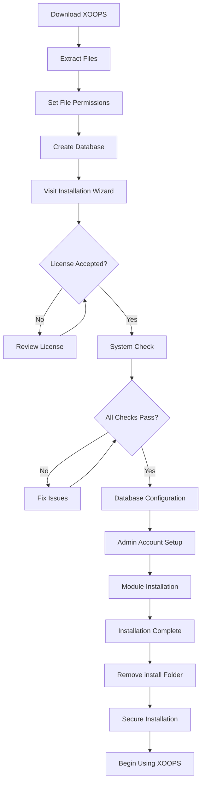

# Complete XOOPS Installation Guide

This guide provides a comprehensive walkthrough for installing XOOPS from scratch using the installation wizard.

## Prerequisites

Before starting the installation, ensure you have:

- Access to your web server via FTP or SSH
- Administrator access to your database server
- A registered domain name
- [[Server-Requirements|Server requirements]] verified
- Backup tools available

## Installation Process



## Step-by-Step Installation

### Step 1: Download XOOPS

Download the latest version from [https://xoops.org/](https://xoops.org/):

```bash
# Using wget
wget https://xoops.org/download/xoops-2.5.8.zip

# Using curl
curl -O https://xoops.org/download/xoops-2.5.8.zip
```

### Step 2: Extract Files

Extract the XOOPS archive to your web root:

```bash
# Navigate to web root
cd /var/www/html

# Extract XOOPS
unzip xoops-2.5.8.zip

# Rename folder (optional, but recommended)
mv xoops-2.5.8 xoops
cd xoops
```

### Step 3: Set File Permissions

Set proper permissions for XOOPS directories:

```bash
# Make directories writable (755 for dirs, 644 for files)
find . -type d -exec chmod 755 {} \;
find . -type f -exec chmod 644 {} \;

# Make specific directories writable by web server
chmod 777 uploads/
chmod 777 templates_c/
chmod 777 var/
chmod 777 cache/

# Secure mainfile.php after installation
chmod 644 mainfile.php
```

### Step 4: Create Database

Create a new database for XOOPS using MySQL:

```sql
-- Create database
CREATE DATABASE xoops_db CHARACTER SET utf8mb4 COLLATE utf8mb4_unicode_ci;

-- Create user
CREATE USER 'xoops_user'@'localhost' IDENTIFIED BY 'secure_password_here';

-- Grant privileges
GRANT ALL PRIVILEGES ON xoops_db.* TO 'xoops_user'@'localhost';
FLUSH PRIVILEGES;
```

Or using phpMyAdmin:

1. Log in to phpMyAdmin
2. Click "Databases" tab
3. Enter database name: `xoops_db`
4. Select "utf8mb4_unicode_ci" collation
5. Click "Create"
6. Create a user with the same name as database
7. Grant all privileges

### Step 5: Run Installation Wizard

Open your browser and navigate to:

```
http://your-domain.com/xoops/install/
```

#### System Check Phase

The wizard checks your server configuration:

- PHP version >= 5.6.0
- MySQL/MariaDB available
- Required PHP extensions (GD, PDO, etc.)
- Directory permissions
- Database connectivity

**If checks fail:**

See [[#Common-Installation-Issues]] section for solutions.

#### Database Configuration

Enter your database credentials:

```
Database Host: localhost
Database Name: xoops_db
Database User: xoops_user
Database Password: [your_secure_password]
Table Prefix: xoops_
```

**Important Notes:**
- If your database host differs from localhost (e.g., remote server), enter the correct hostname
- The table prefix helps if running multiple XOOPS instances in one database
- Use a strong password with mixed case, numbers, and symbols

#### Admin Account Setup

Create your administrator account:

```
Admin Username: admin (or choose custom)
Admin Email: admin@your-domain.com
Admin Password: [strong_unique_password]
Confirm Password: [repeat_password]
```

**Best Practices:**
- Use a unique username, not "admin"
- Use a password with 16+ characters
- Store credentials in a secure password manager
- Never share admin credentials

#### Module Installation

Choose default modules to install:

- **System Module** (required) - Core XOOPS functionality
- **User Module** (required) - User management
- **Profile Module** (recommended) - User profiles
- **PM (Private Message) Module** (recommended) - Internal messaging
- **WF-Channel Module** (optional) - Content management

Select all recommended modules for a complete installation.

### Step 6: Complete Installation

After all steps, you'll see a confirmation screen:

```
Installation Complete!

Your XOOPS installation is ready to use.
Admin Panel: http://your-domain.com/xoops/admin/
User Panel: http://your-domain.com/xoops/
```

### Step 7: Secure Your Installation

#### Remove Installation Folder

```bash
# Remove the install directory (CRITICAL for security)
rm -rf /var/www/html/xoops/install/

# Or rename it
mv /var/www/html/xoops/install/ /var/www/html/xoops/install.bak
```

**WARNING:** Never leave the install folder accessible in production!

#### Secure mainfile.php

```bash
# Make mainfile.php read-only
chmod 644 /var/www/html/xoops/mainfile.php

# Set ownership
chown www-data:www-data /var/www/html/xoops/mainfile.php
```

#### Set Proper File Permissions

```bash
# Recommended production permissions
find . -type f -name "*.php" -exec chmod 644 {} \;
find . -type d -exec chmod 755 {} \;

# Writable directories for web server
chmod 777 uploads/ var/ cache/ templates_c/
```

#### Enable HTTPS/SSL

Configure SSL in your web server (nginx or Apache).

**For Apache:**
```apache
<VirtualHost *:443>
    ServerName your-domain.com
    DocumentRoot /var/www/html/xoops

    SSLEngine on
    SSLCertificateFile /etc/ssl/certs/your-cert.crt
    SSLCertificateKeyFile /etc/ssl/private/your-key.key

    # Force HTTPS redirect
    <IfModule mod_rewrite.c>
        RewriteEngine On
        RewriteCond %{HTTPS} off
        RewriteRule ^(.*)$ https://%{HTTP_HOST}%{REQUEST_URI} [L,R=301]
    </IfModule>
</VirtualHost>
```

## Post-Installation Configuration

### 1. Access Admin Panel

Navigate to:
```
http://your-domain.com/xoops/admin/
```

Login with your admin credentials.

### 2. Configure Basic Settings

[[../Configuration/Basic-Configuration|Configure]] the following:

- Site name and description
- Admin email address
- Timezone and date format
- Search engine optimization

### 3. Test Installation

- [ ] Visit homepage
- [ ] Check modules load
- [ ] Verify user registration works
- [ ] Test admin panel functions
- [ ] Confirm SSL/HTTPS works

### 4. Schedule Backups

Set up automatic backups:

```bash
# Create backup script (backup.sh)
#!/bin/bash
DATE=$(date +%Y%m%d_%H%M%S)
BACKUP_DIR="/backups/xoops"
XOOPS_DIR="/var/www/html/xoops"

# Backup database
mysqldump -u xoops_user -p[password] xoops_db > $BACKUP_DIR/db_$DATE.sql

# Backup files
tar -czf $BACKUP_DIR/files_$DATE.tar.gz $XOOPS_DIR

echo "Backup completed: $DATE"
```

Schedule with cron:
```bash
# Daily backup at 2 AM
0 2 * * * /usr/local/bin/backup.sh
```

## Common Installation Issues

### Issue: Permission Denied Errors

**Symptom:** "Permission denied" when uploading or creating files

**Solution:**
```bash
# Check web server user
ps aux | grep apache  # For Apache
ps aux | grep nginx   # For Nginx

# Fix permissions (replace www-data with your web server user)
chown -R www-data:www-data /var/www/html/xoops
chmod -R 755 /var/www/html/xoops
chmod 777 uploads/ var/ cache/ templates_c/
```

### Issue: Database Connection Failed

**Symptom:** "Cannot connect to database server"

**Solution:**
1. Verify database credentials in the installation wizard
2. Check MySQL/MariaDB is running:
   ```bash
   service mysql status  # or mariadb
   ```
3. Verify database exists:
   ```sql
   SHOW DATABASES;
   ```
4. Test connection from command line:
   ```bash
   mysql -h localhost -u xoops_user -p xoops_db
   ```

### Issue: Blank White Screen

**Symptom:** Visiting XOOPS shows blank page

**Solution:**
1. Check PHP error logs:
   ```bash
   tail -f /var/log/apache2/error.log
   ```
2. Enable debug mode in mainfile.php:
   ```php
   define('XOOPS_DEBUG', 1);
   ```
3. Check file permissions on mainfile.php and config files
4. Verify PHP-MySQL extension is installed

### Issue: Cannot Write to Uploads Directory

**Symptom:** Upload feature fails, "Cannot write to uploads/"

**Solution:**
```bash
# Check current permissions
ls -la uploads/

# Fix permissions
chmod 777 uploads/
chown www-data:www-data uploads/

# For specific files
chmod 644 uploads/*
```

### Issue: PHP Extensions Missing

**Symptom:** System check fails with missing extensions (GD, MySQL, etc.)

**Solution (Ubuntu/Debian):**
```bash
# Install PHP GD library
apt-get install php-gd

# Install PHP MySQL support
apt-get install php-mysql

# Restart web server
systemctl restart apache2  # or nginx
```

**Solution (CentOS/RHEL):**
```bash
# Install PHP GD library
yum install php-gd

# Install PHP MySQL support
yum install php-mysql

# Restart web server
systemctl restart httpd
```

### Issue: Slow Installation Process

**Symptom:** Installation wizard times out or runs very slowly

**Solution:**
1. Increase PHP timeout in php.ini:
   ```ini
   max_execution_time = 300  # 5 minutes
   ```
2. Increase MySQL max_allowed_packet:
   ```sql
   SET GLOBAL max_allowed_packet = 256M;
   ```
3. Check server resources:
   ```bash
   free -h  # Check RAM
   df -h    # Check disk space
   ```

### Issue: Admin Panel Not Accessible

**Symptom:** Cannot access admin panel after installation

**Solution:**
1. Verify admin user exists in database:
   ```sql
   SELECT * FROM xoops_users WHERE uid = 1;
   ```
2. Clear browser cache and cookies
3. Check if sessions folder is writable:
   ```bash
   chmod 777 var/
   ```
4. Verify htaccess rules don't block admin access

## Verification Checklist

After installation, verify:

- [x] XOOPS homepage loads correctly
- [x] Admin panel is accessible at /xoops/admin/
- [x] SSL/HTTPS is working
- [x] Install folder is removed or inaccessible
- [x] File permissions are secure (644 for files, 755 for dirs)
- [x] Database backups are scheduled
- [x] Modules load without errors
- [x] User registration system works
- [x] File upload functionality works
- [x] Email notifications send properly

## Next Steps

Once installation is complete:

1. Read [[../Configuration/Basic-Configuration|Basic Configuration guide]]
2. [[../Configuration/Security-Configuration|Secure your installation]]
3. [[../First-Steps/Admin-Panel-Overview|Explore the admin panel]]
4. [[../First-Steps/Installing-Modules|Install additional modules]]
5. [[../First-Steps/Managing-Users|Set up user groups and permissions]]

---

**Tags:** #installation #setup #getting-started #troubleshooting

**Related Articles:**
- [[Server-Requirements]]
- [[Upgrading-XOOPS]]
- [[../Configuration/Security-Configuration]]
