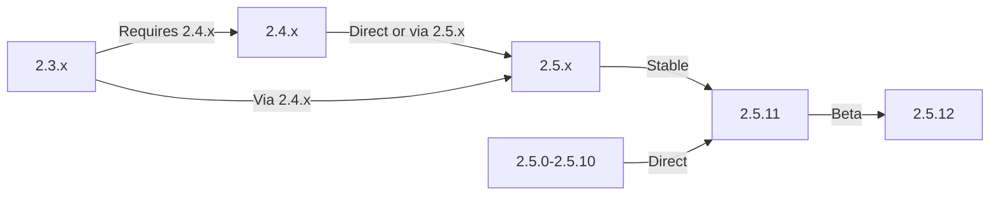

# Upgrading XOOPS

This guide covers upgrading XOOPS from older versions to the latest release while preserving your data and customizations.

> **Version Information**
> - **Stable:** XOOPS 2.5.11
> - **Beta:** XOOPS 2.5.12 (testing)
> - **Future:** XOOPS 4.0 (in development - see [[../../07-XOOPS-4.0/XOOPS-4.0-Roadmap|Roadmap]])

## Pre-Upgrade Checklist

Before beginning the upgrade, verify:

- [ ] Current XOOPS version documented
- [ ] Target XOOPS version identified
- [ ] Full system backup completed
- [ ] Database backup verified
- [ ] Installed modules list recorded
- [ ] Custom modifications documented
- [ ] Test environment available
- [ ] Upgrade path checked (some versions skip intermediate releases)
- [ ] Server resources verified (enough disk space, memory)
- [ ] Maintenance mode enabled

## Upgrade Path Guide

Different upgrade paths depending on current version:



**Important:** Never skip major versions. If upgrading from 2.3.x, first upgrade to 2.4.x, then to 2.5.x.

## Step 1: Complete System Backup

### Database Backup

Use mysqldump to backup the database:

```bash
# Full database backup
mysqldump -u xoops_user -p xoops_db > /backups/xoops_db_backup_$(date +%Y%m%d_%H%M%S).sql

# Compressed backup
mysqldump -u xoops_user -p xoops_db | gzip > /backups/xoops_db_backup_$(date +%Y%m%d_%H%M%S).sql.gz
```

Or using phpMyAdmin:

1. Select your XOOPS database
2. Click "Export" tab
3. Choose "SQL" format
4. Select "Save as file"
5. Click "Go"

Verify backup file:

```bash
# Check backup size
ls -lh /backups/xoops_db_backup*.sql

# Verify backup integrity (uncompressed)
head -20 /backups/xoops_db_backup_*.sql

# Verify compressed backup
zcat /backups/xoops_db_backup_*.sql.gz | head -20
```

### File System Backup

Backup all XOOPS files:

```bash
# Compressed file backup
tar -czf /backups/xoops_files_$(date +%Y%m%d_%H%M%S).tar.gz /var/www/html/xoops

# Uncompressed (faster, requires more disk space)
tar -cf /backups/xoops_files_$(date +%Y%m%d_%H%M%S).tar /var/www/html/xoops

# Show backup progress
tar -czf /backups/xoops_files_$(date +%Y%m%d_%H%M%S).tar.gz --verbose /var/www/html/xoops | tail
```

Store backups securely:

```bash
# Secure backup storage
chmod 600 /backups/xoops_*
ls -lah /backups/

# Optional: Copy to remote storage
scp /backups/xoops_* user@backup-server:/secure/backups/
```

### Test Backup Restoration

**CRITICAL:** Always test your backup works:

```bash
# Verify tar archive contents
tar -tzf /backups/xoops_files_*.tar.gz | head -20

# Extract to test location
mkdir /tmp/restore_test
cd /tmp/restore_test
tar -xzf /backups/xoops_files_*.tar.gz

# Verify key files exist
ls -la xoops/mainfile.php
ls -la xoops/install/
```

## Step 2: Enable Maintenance Mode

Prevent users from accessing the site during upgrade:

### Option 1: XOOPS Admin Panel

1. Log in to admin panel
2. Go to System > Maintenance
3. Enable "Site Maintenance Mode"
4. Set maintenance message
5. Save

### Option 2: Manual Maintenance Mode

Create a maintenance file at web root:

```html
<!-- /var/www/html/maintenance.html -->
<!DOCTYPE html>
<html>
<head>
    <title>Under Maintenance</title>
    <style>
        body { font-family: Arial; text-align: center; padding: 50px; }
        h1 { color: #333; }
        p { color: #666; margin: 20px 0; }
    </style>
</head>
<body>
    <h1>Site Under Maintenance</h1>
    <p>We're currently upgrading our site.</p>
    <p>Expected time: approximately 30 minutes.</p>
    <p>Thank you for your patience!</p>
</body>
</html>
```

Configure Apache to show maintenance page:

```apache
# In .htaccess or vhost config
ErrorDocument 503 /maintenance.html

# Redirect all traffic to maintenance page
<IfModule mod_rewrite.c>
    RewriteEngine On
    RewriteCond %{REMOTE_ADDR} !^192\.168\.1\.100$  # Your IP
    RewriteRule ^(.*)$ - [R=503,L]
</IfModule>
```

## Step 3: Download New Version

Download XOOPS from official site:

```bash
# Download latest version
cd /tmp
wget https://xoops.org/download/xoops-2.5.8.zip

# Verify checksum (if provided)
sha256sum xoops-2.5.8.zip
# Compare with official SHA256 hash

# Extract to temporary location
unzip xoops-2.5.8.zip
cd xoops-2.5.8
```

## Step 4: Pre-Upgrade File Preparation

### Identify Custom Modifications

Check for customized core files:

```bash
# Look for modified files (files with newer mtime)
find /var/www/html/xoops -type f -newer /var/www/html/xoops/install.php

# Check for custom themes
ls /var/www/html/xoops/themes/
# Note any custom themes

# Check for custom modules
ls /var/www/html/xoops/modules/
# Note any custom modules created by you
```

### Document Current State

Create an upgrade report:

```bash
cat > /tmp/upgrade_report.txt << EOF
=== XOOPS Upgrade Report ===
Date: $(date)
Current Version: 2.5.6
Target Version: 2.5.8

=== Installed Modules ===
$(ls /var/www/html/xoops/modules/)

=== Custom Modifications ===
[Document any custom theme or module modifications]

=== Themes ===
$(ls /var/www/html/xoops/themes/)

=== Plugin Status ===
[List any custom code modifications]

EOF
```

## Step 5: Merge New Files with Current Installation

### Strategy: Preserve Custom Files

Replace XOOPS core files but preserve:
- `mainfile.php` (your database config)
- Custom themes in `themes/`
- Custom modules in `modules/`
- User uploads in `uploads/`
- Site data in `var/`

### Manual Merge Process

```bash
# Set variables
XOOPS_OLD="/var/www/html/xoops"
XOOPS_NEW="/tmp/xoops-2.5.8"
BACKUP="/backups/pre-upgrade"

# Create pre-upgrade backup in place
mkdir -p $BACKUP
cp -r $XOOPS_OLD/* $BACKUP/

# Copy new files (but preserve sensitive files)
# Copy everything except protected directories
rsync -av --exclude='mainfile.php' \
    --exclude='modules/custom*' \
    --exclude='themes/custom*' \
    --exclude='uploads' \
    --exclude='var' \
    --exclude='cache' \
    --exclude='templates_c' \
    $XOOPS_NEW/ $XOOPS_OLD/

# Verify critical files preserved
ls -la $XOOPS_OLD/mainfile.php
```

### Using upgrade.php (If Available)

Some XOOPS versions include automated upgrade script:

```bash
# Copy new files with installer
cp -r /tmp/xoops-2.5.8/* /var/www/html/xoops/

# Run upgrade wizard
# Visit: http://your-domain.com/xoops/upgrade/
```

### File Permissions After Merge

Restore proper permissions:

```bash
# Set ownership
chown -R www-data:www-data /var/www/html/xoops

# Set directory permissions
find /var/www/html/xoops -type d -exec chmod 755 {} \;

# Set file permissions
find /var/www/html/xoops -type f -exec chmod 644 {} \;

# Make writable directories
chmod 777 /var/www/html/xoops/cache
chmod 777 /var/www/html/xoops/templates_c
chmod 777 /var/www/html/xoops/uploads
chmod 777 /var/www/html/xoops/var

# Secure mainfile.php
chmod 644 /var/www/html/xoops/mainfile.php
```

## Step 6: Database Migration

### Review Database Changes

Check XOOPS release notes for database structure changes:

```bash
# Extract and review SQL migration files
find /tmp/xoops-2.5.8 -name "*.sql" -type f
# Document all .sql files found
```

### Run Database Updates

### Option 1: Automated Update (if available)

Use admin panel:

1. Log in to admin
2. Go to **System > Database**
3. Click "Check Updates"
4. Review pending changes
5. Click "Apply Updates"

### Option 2: Manual Database Updates

Execute migration SQL files:

```bash
# Connect to database
mysql -u xoops_user -p xoops_db

# View pending changes (varies by version)
SELECT * FROM xoops_config WHERE conf_name LIKE '%version%';

# Run migration scripts manually if needed
SOURCE /tmp/xoops-2.5.8/migrate_2.5.6_to_2.5.8.sql;
```

### Database Verification

Verify database integrity after update:

```sql
-- Check database consistency
REPAIR TABLE xoops_users;
OPTIMIZE TABLE xoops_users;

-- Verify key tables exist
SHOW TABLES LIKE 'xoops_%';

-- Check row counts (should increase or stay same)
SELECT COUNT(*) FROM xoops_users;
SELECT COUNT(*) FROM xoops_posts;
```

## Step 7: Verify Upgrade

### Homepage Check

Visit your XOOPS homepage:

```
http://your-domain.com/xoops/
```

Expected: Page loads without errors, displays correctly

### Admin Panel Check

Access admin:

```
http://your-domain.com/xoops/admin/
```

Verify:
- [ ] Admin panel loads
- [ ] Navigation works
- [ ] Dashboard displays properly
- [ ] No database errors in logs

### Module Verification

Check installed modules:

1. Go to **Modules > Modules** in admin
2. Verify all modules still installed
3. Check for any error messages
4. Enable any modules that were disabled

### Log File Check

Review system logs for errors:

```bash
# Check web server error log
tail -50 /var/log/apache2/error.log

# Check PHP error log
tail -50 /var/log/php_errors.log

# Check XOOPS system log (if available)
# In admin panel: System > Logs
```

### Test Core Functions

- [ ] User login/logout works
- [ ] User registration works
- [ ] File upload functions
- [ ] Email notifications send
- [ ] Search functionality works
- [ ] Admin functions operational
- [ ] Module functionality intact

## Step 8: Post-Upgrade Cleanup

### Remove Temporary Files

```bash
# Remove extraction directory
rm -rf /tmp/xoops-2.5.8

# Clear template cache (safe to delete)
rm -rf /var/www/html/xoops/templates_c/*

# Clear site cache
rm -rf /var/www/html/xoops/cache/*
```

### Remove Maintenance Mode

Re-enable normal site access:

```apache
# Remove maintenance mode redirect from .htaccess
# Or delete maintenance.html file
rm /var/www/html/maintenance.html
```

### Update Documentation

Update your upgrade notes:

```bash
# Document successful upgrade
cat >> /tmp/upgrade_report.txt << EOF

=== Upgrade Results ===
Status: SUCCESS
Upgrade Date: $(date)
New Version: 2.5.8
Duration: [time in minutes]

Post-Upgrade Tests:
- [x] Homepage loads
- [x] Admin panel accessible
- [x] Modules functional
- [x] User registration works
- [x] Database optimized

EOF
```

## Troubleshooting Upgrades

### Issue: Blank White Screen After Upgrade

**Symptom:** Homepage shows nothing

**Solution:**
```bash
# Check PHP errors
tail -f /var/log/apache2/error.log

# Enable debug mode temporarily
echo "define('XOOPS_DEBUG', 1);" >> /var/www/html/xoops/mainfile.php

# Check file permissions
ls -la /var/www/html/xoops/mainfile.php

# Restore from backup if needed
cp /backups/xoops_files_*.tar.gz /tmp/
cd /tmp && tar -xzf xoops_files_*.tar.gz
```

### Issue: Database Connection Error

**Symptom:** "Cannot connect to database" message

**Solution:**
```bash
# Verify database credentials in mainfile.php
grep -i "database\|host\|user" /var/www/html/xoops/mainfile.php

# Test connection
mysql -h localhost -u xoops_user -p xoops_db -e "SELECT 1"

# Check MySQL status
systemctl status mysql

# Verify database still exists
mysql -u xoops_user -p -e "SHOW DATABASES" | grep xoops
```

### Issue: Admin Panel Not Accessible

**Symptom:** Cannot access /xoops/admin/

**Solution:**
```bash
# Check .htaccess rules
cat /var/www/html/xoops/.htaccess

# Verify admin files exist
ls -la /var/www/html/xoops/admin/

# Check mod_rewrite enabled
apache2ctl -M | grep rewrite

# Restart web server
systemctl restart apache2
```

### Issue: Modules Not Loading

**Symptom:** Modules show errors or are deactivated

**Solution:**
```bash
# Verify module files exist
ls /var/www/html/xoops/modules/

# Check module permissions
ls -la /var/www/html/xoops/modules/*/

# Check module configuration in database
mysql -u xoops_user -p xoops_db -e "SELECT * FROM xoops_modules WHERE module_status = 0"

# Reactivate modules in admin panel
# System > Modules > Click module > Update Status
```

### Issue: Permission Denied Errors

**Symptom:** "Permission denied" when uploading or saving

**Solution:**
```bash
# Check file ownership
ls -la /var/www/html/xoops/ | head -20

# Fix ownership
chown -R www-data:www-data /var/www/html/xoops

# Fix directory permissions
find /var/www/html/xoops -type d -exec chmod 755 {} \;

# Make cache/uploads writable
chmod 777 /var/www/html/xoops/cache
chmod 777 /var/www/html/xoops/templates_c
chmod 777 /var/www/html/xoops/uploads
chmod 777 /var/www/html/xoops/var
```

### Issue: Slow Page Loading

**Symptom:** Pages load very slowly after upgrade

**Solution:**
```bash
# Clear all caches
rm -rf /var/www/html/xoops/cache/*
rm -rf /var/www/html/xoops/templates_c/*

# Optimize database
mysql -u xoops_user -p xoops_db << EOF
OPTIMIZE TABLE xoops_users;
OPTIMIZE TABLE xoops_posts;
OPTIMIZE TABLE xoops_config;
ANALYZE TABLE xoops_users;
EOF

# Check PHP error log for warnings
grep -i "deprecated\|warning" /var/log/php_errors.log | tail -20

# Increase PHP memory/execution time temporarily
# Edit php.ini:
memory_limit = 256M
max_execution_time = 300
```

## Rollback Procedure

If upgrade fails critically, restore from backup:

### Restore Database

```bash
# Restore from backup
mysql -u xoops_user -p xoops_db < /backups/xoops_db_backup_YYYYMMDD_HHMMSS.sql

# Or from compressed backup
gunzip < /backups/xoops_db_backup_YYYYMMDD_HHMMSS.sql.gz | mysql -u xoops_user -p xoops_db

# Verify restoration
mysql -u xoops_user -p xoops_db -e "SELECT COUNT(*) FROM xoops_users"
```

### Restore File System

```bash
# Stop web server
systemctl stop apache2

# Remove current installation
rm -rf /var/www/html/xoops/*

# Extract backup
cd /var/www/html
tar -xzf /backups/xoops_files_YYYYMMDD_HHMMSS.tar.gz

# Fix permissions
chown -R www-data:www-data xoops/
find xoops -type d -exec chmod 755 {} \;
find xoops -type f -exec chmod 644 {} \;
chmod 777 xoops/cache xoops/templates_c xoops/uploads xoops/var

# Start web server
systemctl start apache2

# Verify restoration
# Visit http://your-domain.com/xoops/
```

## Upgrade Verification Checklist

After upgrade completion, verify:

- [ ] XOOPS version updated (check admin > System info)
- [ ] Homepage loads without errors
- [ ] All modules functional
- [ ] User login works
- [ ] Admin panel accessible
- [ ] File uploads work
- [ ] Email notifications functional
- [ ] Database integrity verified
- [ ] File permissions correct
- [ ] Maintenance mode removed
- [ ] Backups secured and tested
- [ ] Performance acceptable
- [ ] SSL/HTTPS working
- [ ] No error messages in logs

## Next Steps

After successful upgrade:

1. Update any custom modules to latest versions
2. Review release notes for deprecated features
3. Consider [[../Configuration/Performance-Optimization|optimizing performance]]
4. Update [[../Configuration/Security-Configuration|security settings]]
5. Test all functionality thoroughly
6. Keep backup files secure

---

**Tags:** #upgrade #maintenance #backup #database-migration

**Related Articles:**
- [[../../06-Publisher-Module/User-Guide/Installation]]
- [[Server-Requirements]]
- [[../Configuration/Basic-Configuration]]
- [[../Configuration/Security-Configuration]]
