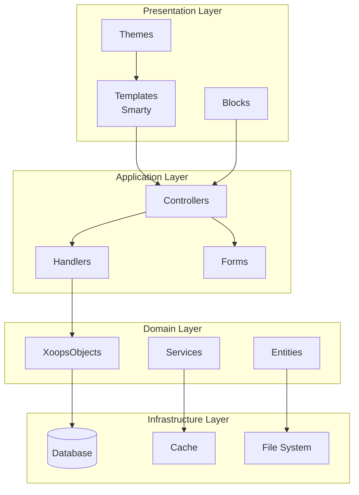
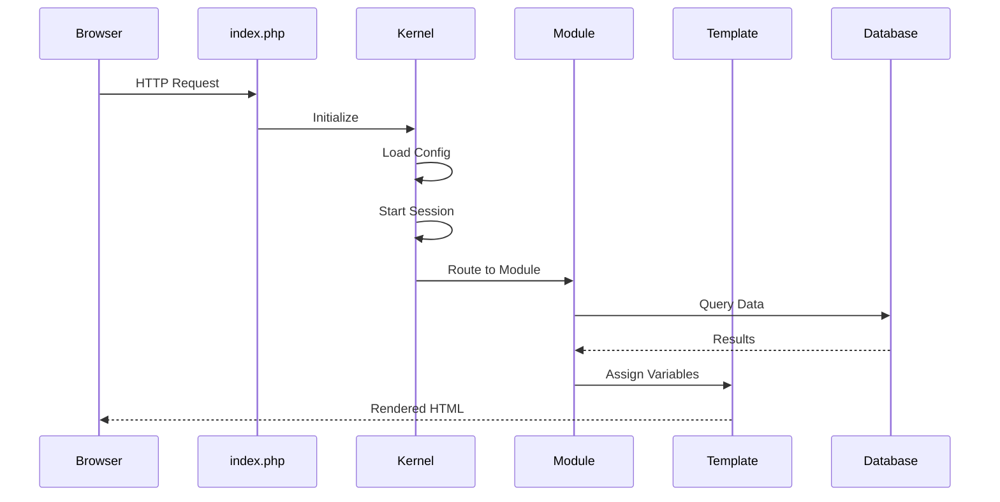

# XOOPS Architecture

## Overview

XOOPS (eXtensible Object Oriented Portal System) follows a modular architecture that separates core functionality from extensible modules. Understanding this architecture is essential for effective module development.

## System Layers



## Core Components

### Kernel

The XOOPS kernel provides foundational services:

| Component | Purpose |
|-----------|---------|
| `XoopsObject` | Base class for all data objects |
| `XoopsObjectHandler` | CRUD operations for objects |
| `XoopsDatabase` | Database abstraction layer |
| `XoopsUser` | User authentication and profile |
| `XoopsModule` | Module metadata and configuration |

### Request Lifecycle



## Module Architecture

### Directory Structure

```
modules/mymodule/
├── class/                  # PHP Classes
│   ├── Common/            # Shared utilities
│   └── Handler/           # Object handlers
├── include/               # Include files
├── language/              # Translations
├── templates/             # Smarty templates
├── admin/                 # Admin panel
├── assets/                # CSS, JS, images
├── sql/                   # Database schemas
├── xoops_version.php      # Module manifest
└── index.php              # Main entry point
```

### Module Manifest

```php
// xoops_version.php
$modversion = [
    'name'        => 'My Module',
    'version'     => '1.0.0',
    'dirname'     => 'mymodule',
    'description' => 'Module description',

    // Database tables
    'tables'      => ['mymodule_items'],

    // Admin menu
    'hasAdmin'    => 1,
    'adminmenu'   => 'admin/menu.php',

    // Main menu
    'hasMain'     => 1,

    // Blocks
    'blocks'      => [...],

    // Templates
    'templates'   => [...],

    // Config options
    'config'      => [...]
];
```

## Handler Pattern

XOOPS uses the Handler pattern for data access:

```php
// Handler creates and manages objects
$itemHandler = xoops_getModuleHandler('item', 'mymodule');

// Create new object
$item = $itemHandler->create();
$item->setVar('title', 'New Item');

// Save object
$itemHandler->insert($item);

// Retrieve object
$item = $itemHandler->get($id);

// Delete object
$itemHandler->delete($item);
```

## Event System

XOOPS provides hooks for extensibility:

| Event Type | Trigger Point |
|------------|---------------|
| `preload` | Before module loads |
| `onInstall` | Module installation |
| `onUpdate` | Module update |
| `onUninstall` | Module removal |

### Preload Classes

```php
// class/Preload.php
class Preload extends \Xmf\Module\Helper\AbstractHelper
{
    public function eventCoreHeaderStart($args)
    {
        // Execute on every page load
    }

    public function eventCoreFooterStart($args)
    {
        // Execute before footer renders
    }
}
```

## Caching Strategy

### Object Cache

```php
$cache = \Xmf\Module\Helper::getHelper('mymodule')->getCache();

// Store value
$cache->write('key', $value, 3600);

// Retrieve value
$value = $cache->read('key');

// Delete value
$cache->delete('key');
```

### Template Cache

Smarty templates are compiled and cached:

```php
// Clear module template cache
$xoopsTpl->clearModuleCompileCache($module->mid());
```

## Security Architecture

### Input Sanitization

```php
use Xmf\Request;

$id = Request::getInt('id', 0);
$title = Request::getString('title', '');
$data = Request::getArray('data', []);
```

### Permission System

```php
// Check module access
$permHandler = xoops_getHandler('groupperm');
$canAccess = $permHandler->checkRight(
    'module_read',
    $module->mid(),
    $userGroups
);
```

## Configuration

### Module Preferences

```php
// Define in xoops_version.php
'config' => [
    [
        'name'        => 'items_per_page',
        'title'       => '_MI_MYMOD_ITEMS_PER_PAGE',
        'description' => '_MI_MYMOD_ITEMS_PER_PAGE_DESC',
        'formtype'    => 'textbox',
        'valuetype'   => 'int',
        'default'     => 10,
    ]
]

// Access in code
$helper = \Xmf\Module\Helper::getHelper('mymodule');
$itemsPerPage = $helper->getConfig('items_per_page');
```

## Related Documentation

- [[../../04-API-Reference/Core/XoopsObject]] - Base object class
- [[../../04-API-Reference/Core/XoopsObjectHandler]] - Handler pattern
- [[../Database/Database-Layer]] - Database abstraction
- [[../../04-API-Reference/Template/Template-System]] - Smarty integration
- [[../Users-Permissions/Permission-System]] - Access control
