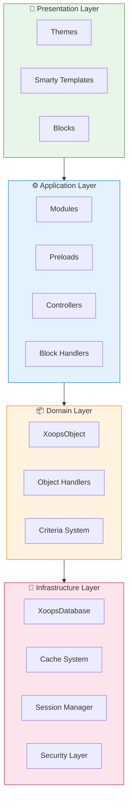
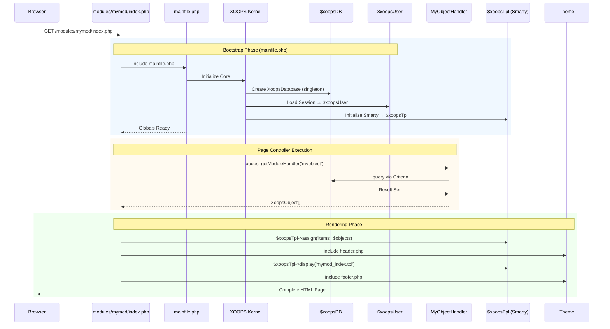

# XOOPS Architecture

!!! info "About This Document"
    This page describes the **conceptual architecture** of XOOPS that applies to both current (2.5.x) and future (4.0.x) versions. Some diagrams show the layered design vision.
    
    **For version-specific details:**
    - **XOOPS 2.5.x Today:** Uses `mainfile.php`, globals (`$xoopsDB`, `$xoopsUser`), preloads, and handler pattern
    - **XOOPS 4.0 Target:** PSR-15 middleware, DI container, router - see [Roadmap](../../07-XOOPS-4.0/XOOPS-4.0-Roadmap.md)


This document provides a comprehensive overview of the XOOPS system architecture, explaining how the various components work together to create a flexible and extensible content management system.

## Overview

XOOPS follows a modular architecture that separates concerns into distinct layers. The system is built around several core principles:

- **Modularity**: Functionality is organized into independent, installable modules
- **Extensibility**: The system can be extended without modifying core code
- **Abstraction**: Database and presentation layers are abstracted from business logic
- **Security**: Built-in security mechanisms protect against common vulnerabilities

## System Layers



### 1. Presentation Layer

The presentation layer handles user interface rendering using the Smarty template engine.

**Key Components:**
- **Themes**: Visual styling and layout
- **Smarty Templates**: Dynamic content rendering
- **Blocks**: Reusable content widgets

### 2. Application Layer

The application layer contains business logic, controllers, and module functionality.

**Key Components:**
- **Modules**: Self-contained functionality packages
- **Handlers**: Data manipulation classes
- **Preloads**: Event listeners and hooks

### 3. Domain Layer

The domain layer contains core business objects and rules.

**Key Components:**
- **XoopsObject**: Base class for all domain objects
- **Handlers**: CRUD operations for domain objects

### 4. Infrastructure Layer

The infrastructure layer provides core services like database access and caching.

## Request Lifecycle

Understanding the request lifecycle is crucial for effective XOOPS development.

### XOOPS 2.5.x Page Controller Flow

The current XOOPS 2.5.x uses a **Page Controller** pattern where each PHP file handles its own request. Globals (`$xoopsDB`, `$xoopsUser`, `$xoopsTpl`, etc.) are initialized during bootstrap and available throughout execution.



### Key Globals in 2.5.x

| Global | Type | Initialized | Purpose |
|--------|------|-------------|---------|
| `$xoopsDB` | `XoopsDatabase` | Bootstrap | Database connection (singleton) |
| `$xoopsUser` | `XoopsUser\|null` | Session load | Current logged-in user |
| `$xoopsTpl` | `XoopsTpl` | Template init | Smarty template engine |
| `$xoopsModule` | `XoopsModule` | Module load | Current module context |
| `$xoopsConfig` | `array` | Config load | System configuration |

!!! note "XOOPS 4.0 Comparison"
    In XOOPS 4.0, the Page Controller pattern is replaced with a **PSR-15 Middleware Pipeline** and router-based dispatching. Globals are replaced with dependency injection. See [Hybrid Mode Contract](../../07-XOOPS-4.0/Specifications/Hybrid-Mode-Contract.md) for compatibility guarantees during migration.


### 1. Bootstrap Phase

```php
// mainfile.php is the entry point
include_once XOOPS_ROOT_PATH . '/mainfile.php';

// Core initialization
$xoops = Xoops::getInstance();
$xoops->boot();
```

**Steps:**
1. Load configuration (`mainfile.php`)
2. Initialize autoloader
3. Set up error handling
4. Establish database connection
5. Load user session
6. Initialize Smarty template engine

### 2. Routing Phase

```php
// Request routing to appropriate module
$module = $GLOBALS['xoopsModule'];
$controller = $module->getController();
$controller->dispatch($request);
```

**Steps:**
1. Parse request URL
2. Identify target module
3. Load module configuration
4. Check permissions
5. Route to appropriate handler

### 3. Execution Phase

```php
// Controller execution
$data = $handler->getObjects($criteria);
$xoopsTpl->assign('items', $data);
```

**Steps:**
1. Execute controller logic
2. Interact with data layer
3. Process business rules
4. Prepare view data

### 4. Rendering Phase

```php
// Template rendering
include XOOPS_ROOT_PATH . '/header.php';
$xoopsTpl->display('db:module_template.tpl');
include XOOPS_ROOT_PATH . '/footer.php';
```

**Steps:**
1. Apply theme layout
2. Render module template
3. Process blocks
4. Output response

## Core Components

### XoopsObject

The base class for all data objects in XOOPS.

```php
<?php
class MyModuleItem extends XoopsObject
{
    public function __construct()
    {
        $this->initVar('id', XOBJ_DTYPE_INT, null, false);
        $this->initVar('title', XOBJ_DTYPE_TXTBOX, '', true, 255);
        $this->initVar('content', XOBJ_DTYPE_TXTAREA, '', false);
        $this->initVar('created', XOBJ_DTYPE_INT, time(), false);
    }
}
```

**Key Methods:**
- `initVar()` - Define object properties
- `getVar()` - Retrieve property values
- `setVar()` - Set property values
- `assignVars()` - Bulk assign from array

### XoopsPersistableObjectHandler

Handles CRUD operations for XoopsObject instances.

```php
<?php
class MyModuleItemHandler extends XoopsPersistableObjectHandler
{
    public function __construct(\XoopsDatabase $db)
    {
        parent::__construct($db, 'mymodule_items', 'MyModuleItem', 'id', 'title');
    }

    public function getActiveItems($limit = 10)
    {
        $criteria = new CriteriaCompo();
        $criteria->add(new Criteria('status', 1));
        $criteria->setSort('created');
        $criteria->setOrder('DESC');
        $criteria->setLimit($limit);

        return $this->getObjects($criteria);
    }
}
```

**Key Methods:**
- `create()` - Create new object instance
- `get()` - Retrieve object by ID
- `insert()` - Save object to database
- `delete()` - Remove object from database
- `getObjects()` - Retrieve multiple objects
- `getCount()` - Count matching objects

### Module Structure

Every XOOPS module follows a standard directory structure:

```
modules/mymodule/
├── class/                  # PHP classes
│   ├── MyModuleItem.php
│   └── MyModuleItemHandler.php
├── include/                # Include files
│   ├── common.php
│   └── functions.php
├── templates/              # Smarty templates
│   ├── mymodule_index.tpl
│   └── mymodule_item.tpl
├── admin/                  # Admin area
│   ├── index.php
│   └── menu.php
├── language/               # Translations
│   └── english/
│       ├── main.php
│       └── modinfo.php
├── sql/                    # Database schema
│   └── mysql.sql
├── xoops_version.php       # Module info
├── index.php               # Module entry
└── header.php              # Module header
```

## Dependency Injection Container

Modern XOOPS development can leverage dependency injection for better testability.

### Basic Container Implementation

```php
<?php
class XoopsDependencyContainer
{
    private array $services = [];

    public function register(string $name, callable $factory): void
    {
        $this->services[$name] = $factory;
    }

    public function resolve(string $name): mixed
    {
        if (!isset($this->services[$name])) {
            throw new \InvalidArgumentException("Service not found: $name");
        }

        $factory = $this->services[$name];

        if (is_callable($factory)) {
            return $factory($this);
        }

        return $factory;
    }

    public function has(string $name): bool
    {
        return isset($this->services[$name]);
    }
}
```

### PSR-11 Compatible Container

```php
<?php
namespace Xmf\Di;

use Psr\Container\ContainerInterface;

class BasicContainer implements ContainerInterface
{
    protected array $definitions = [];

    public function set(string $id, mixed $value): void
    {
        $this->definitions[$id] = $value;
    }

    public function get(string $id): mixed
    {
        if (!$this->has($id)) {
            throw new \InvalidArgumentException("Service not found: $id");
        }

        $entry = $this->definitions[$id];

        if (is_callable($entry)) {
            return $entry($this);
        }

        return $entry;
    }

    public function has(string $id): bool
    {
        return isset($this->definitions[$id]);
    }
}
```

### Usage Example

```php
<?php
// Service registration
$container = new XoopsDependencyContainer();

$container->register('database', function () {
    return XoopsDatabaseFactory::getDatabaseConnection();
});

$container->register('userHandler', function ($c) {
    return new XoopsUserHandler($c->resolve('database'));
});

// Service resolution
$userHandler = $container->resolve('userHandler');
$user = $userHandler->get($userId);
```

## Extension Points

XOOPS provides several extension mechanisms:

### 1. Preloads

Preloads allow modules to hook into core events.

```php
<?php
// modules/mymodule/preloads/core.php
class MymoduleCorePreload extends XoopsPreloadItem
{
    public static function eventCoreHeaderEnd($args)
    {
        // Execute when header processing ends
    }

    public static function eventCoreFooterStart($args)
    {
        // Execute when footer processing starts
    }
}
```

### 2. Plugins

Plugins extend specific functionality within modules.

```php
<?php
// modules/mymodule/plugins/notify.php
class MymoduleNotifyPlugin
{
    public function onItemCreate($item)
    {
        // Send notification when item is created
    }
}
```

### 3. Filters

Filters modify data as it passes through the system.

```php
<?php
// Content filter example
$myts = MyTextSanitizer::getInstance();
$content = $myts->displayTarea($rawContent, 1, 1, 1);
```

## Best Practices

### Code Organization

1. **Use namespaces** for new code:
   ```php
   namespace XoopsModules\MyModule;

   class Item extends \XoopsObject
   {
       // Implementation
   }
   ```

2. **Follow PSR-4 autoloading**:
   ```json
   {
       "autoload": {
           "psr-4": {
               "XoopsModules\\MyModule\\": "class/"
           }
       }
   }
   ```

3. **Separate concerns**:
   - Domain logic in `class/`
   - Presentation in `templates/`
   - Controllers in module root

### Performance

1. **Use caching** for expensive operations
2. **Lazy load** resources when possible
3. **Minimize database queries** using criteria batching
4. **Optimize templates** by avoiding complex logic

### Security

1. **Validate all input** using `Xmf\Request`
2. **Escape output** in templates
3. **Use prepared statements** for database queries
4. **Check permissions** before sensitive operations

## Related Documentation

- [Design-Patterns](Design-Patterns.md) - Design patterns used in XOOPS
- [Database Layer](../Database/Database-Layer.md) - Database abstraction details
- [Smarty Basics](../Templates/Smarty-Basics.md) - Template system documentation
- [Security Best Practices](../Security/Security-Best-Practices.md) - Security guidelines

---

#xoops #architecture #core #design #system-design
