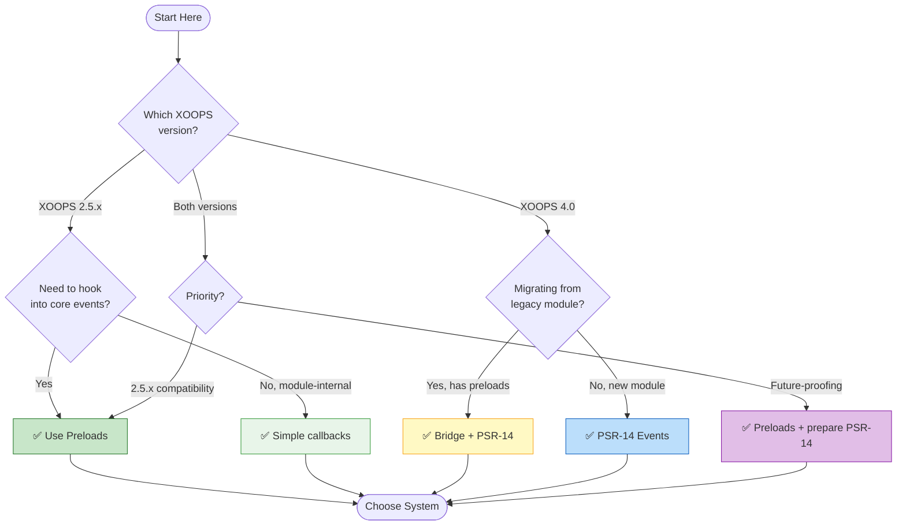

# Choosing an Event System

<span class="version-badge version-25x">2.5.x: Preloads</span> <span class="version-badge version-40x">4.0.x: PSR-14</span>

> **Which event system should I use?** This guide helps you choose between legacy Preloads and modern PSR-14 event dispatching.

---

## Quick Decision Tree



---

## Event System Comparison

| Feature | Preloads (2.5.x) | PSR-14 (4.0.x) |
|---------|-----------------|---------------|
| **Availability** | ✅ Now | 🚧 XOOPS 4.0 |
| **Standards** | XOOPS-specific | PSR-14 compliant |
| **Type Safety** | ❌ Arrays only | ✅ Typed event objects |
| **Testability** | ⚠️ Harder | ✅ Easy mocking |
| **Priority Control** | ❌ Load order | ✅ Numeric priority |
| **Stop Propagation** | ❌ No | ✅ `$event->stopPropagation()` |
| **Discovery** | Filename convention | Attribute/config |
| **IDE Support** | ⚠️ Limited | ✅ Full autocomplete |

---

## When to Use Each System

### ✅ Preloads (XOOPS 2.5.x)

**Best for:** All current XOOPS 2.5.x development

```php
<?php
// class/Preload.php
namespace XoopsModules\MyModule;

class Preload extends \XoopsPreloadItem
{
    /**
     * Runs after user login
     */
    public static function eventCoreUserLogin(array $args): void
    {
        $user = $args[0];
        // Log login, update stats, send notification, etc.
        \XoopsLogger::getInstance()->log("User {$user->getVar('uname')} logged in");
    }

    /**
     * Runs before footer rendering
     */
    public static function eventCoreFooterStart(array $args): void
    {
        // Add tracking script, modify output, etc.
    }
}
```

**Choose Preloads when:**
- Building modules for XOOPS 2.5.x
- Hooking into core lifecycle events
- Modifying page output (header/footer)
- Reacting to user authentication events
- Module installation/update hooks

**Available Core Events:**

| Event | When Triggered |
|-------|---------------|
| `eventCoreHeaderStart` | Before header processing |
| `eventCoreHeaderEnd` | After header processing |
| `eventCoreFooterStart` | Before footer rendering |
| `eventCoreFooterEnd` | After footer rendering |
| `eventCoreUserLogin` | After successful login |
| `eventCoreUserLogout` | After logout |
| `eventCoreModuleInstall` | After module installed |
| `eventCoreModuleUpdate` | After module updated |
| `eventCoreModuleUninstall` | Before module removed |
| `eventCoreException` | When exception thrown |

---

### ✅ PSR-14 Events (XOOPS 4.0)

**Best for:** New XOOPS 4.0 modules

```php
<?php
// src/EventSubscriber/UserSubscriber.php
namespace XoopsModules\MyModule\EventSubscriber;

use Xoops\Core\Event\UserLoginEvent;
use Xoops\Core\Event\UserLogoutEvent;

class UserSubscriber
{
    public function __construct(
        private readonly LoggerInterface $logger,
        private readonly StatsService $stats
    ) {}

    #[AsEventListener(event: UserLoginEvent::class, priority: 10)]
    public function onUserLogin(UserLoginEvent $event): void
    {
        $user = $event->getUser();
        $this->logger->info("User {$user->getUsername()} logged in");
        $this->stats->recordLogin($user);
    }

    #[AsEventListener(event: UserLogoutEvent::class)]
    public function onUserLogout(UserLogoutEvent $event): void
    {
        $this->stats->recordLogout($event->getUser());
    }
}
```

**Choose PSR-14 when:**
- Building new modules for XOOPS 4.0
- You need typed event objects
- You want priority control
- You need to stop event propagation
- You're using dependency injection

**PSR-14 Event Interface:**

```php
<?php
// Creating a custom event
namespace XoopsModules\MyModule\Event;

class ArticlePublishedEvent
{
    public function __construct(
        public readonly int $articleId,
        public readonly string $title,
        public readonly \DateTimeImmutable $publishedAt
    ) {}
}

// Dispatching the event
$dispatcher->dispatch(new ArticlePublishedEvent(
    articleId: 123,
    title: 'Hello World',
    publishedAt: new \DateTimeImmutable()
));
```

---

### ✅ Bridge Pattern (Migration)

**Best for:** Migrating legacy modules to XOOPS 4.0

```php
<?php
// class/Preload.php - Legacy preload that bridges to PSR-14
namespace XoopsModules\MyModule;

use Xoops\Core\Event\LegacyEventBridge;

class Preload extends \XoopsPreloadItem
{
    public static function eventCoreUserLogin(array $args): void
    {
        // Bridge to new event system when available
        if (class_exists(LegacyEventBridge::class)) {
            LegacyEventBridge::dispatch('user.login', $args);
            return;
        }

        // Fallback for 2.5.x
        self::handleLegacyLogin($args);
    }

    private static function handleLegacyLogin(array $args): void
    {
        // Legacy implementation
    }
}
```

---

## Migration Path

```mermaid
flowchart LR
    subgraph Current["XOOPS 2.5.x Today"]
        P1["Preload.php"]
        P2["Static methods"]
        P3["Array arguments"]
    end

    subgraph Bridge["Transition Phase"]
        B1["Keep Preloads"]
        B2["Add event abstractions"]
        B3["Prepare typed events"]
    end

    subgraph Future["XOOPS 4.0"]
        F1["PSR-14 Dispatcher"]
        F2["Event Subscribers"]
        F3["Typed Event Objects"]
    end

    Current -->|"Step 1: Abstract"| Bridge
    Bridge -->|"Step 2: Migrate"| Future

    style Current fill:#c8e6c9
    style Bridge fill:#fff9c4
    style Future fill:#bbdefb
```



### Step 1: Abstract Your Event Logic (Now)

Even in 2.5.x, extract event handling into separate methods:

```php
<?php
class Preload extends \XoopsPreloadItem
{
    public static function eventCoreUserLogin(array $args): void
    {
        // Delegate to a handler class
        $handler = new \XoopsModules\MyModule\Handler\LoginHandler();
        $handler->handle($args[0]); // Pass user object
    }
}
```

### Step 2: Create Typed Wrappers (Optional)

```php
<?php
// Create your own event DTO for type safety
namespace XoopsModules\MyModule\Event;

class UserLoginData
{
    public function __construct(
        public readonly \XoopsUser $user,
        public readonly string $ipAddress,
        public readonly \DateTime $timestamp
    ) {}

    public static function fromArgs(array $args): self
    {
        return new self(
            user: $args[0],
            ipAddress: $_SERVER['REMOTE_ADDR'] ?? 'unknown',
            timestamp: new \DateTime()
        );
    }
}
```

### Step 3: Migrate to PSR-14 (4.0.x)

When 2026 is available, convert to full PSR-14:

```php
<?php
// The bridge auto-converts legacy preload calls to PSR-14 events
// Your existing preloads continue to work
// New code uses PSR-14 directly
```

---

## Quick Reference

| Question | Answer |
|----------|--------|
| **"I'm on 2.5.x"** | Use Preloads |
| **"I'm building for 2026"** | Use PSR-14 |
| **"I want IDE autocomplete"** | Abstract to typed classes now, PSR-14 later |
| **"I need priority control"** | Preloads: not supported. PSR-14: yes |
| **"I need to stop propagation"** | Preloads: not supported. PSR-14: yes |
| **"I want testable code"** | Extract to handler classes |

---

## Related Documentation

- [XOOPS Event System](Event-System.md) - Full documentation
- [XOOPS Architecture](Architecture/XOOPS-Architecture.md) - System overview
- [PSR-14 Event System Guide](../07-XOOPS-4.0/Implementation-Guides/Event-System-Guide.md) *(4.0.x)*
- [Hybrid Mode Contract](../07-XOOPS-4.0/Specifications/Hybrid-Mode-Contract.md)

---

#events #preloads #psr-14 #decision-tree #migration
