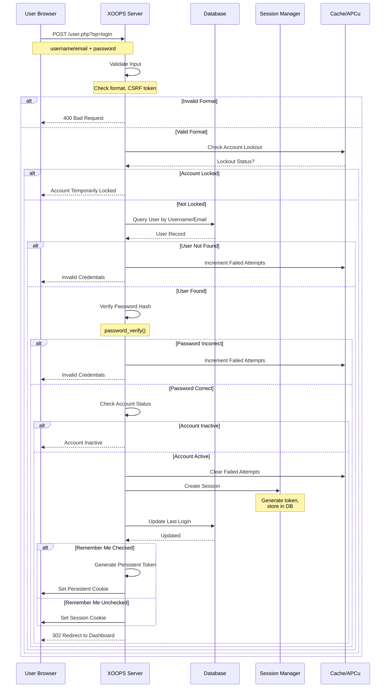
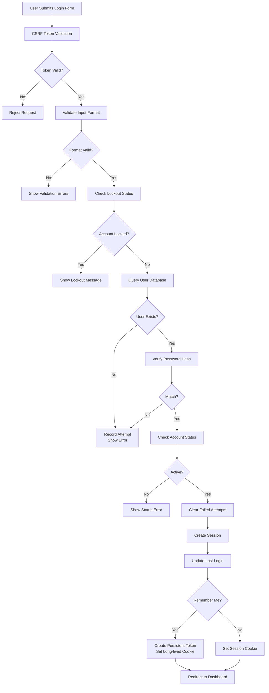

# Authentication in XOOPS

The XOOPS Authentication system provides secure user verification, session management, and advanced security features including two-factor authentication and OAuth integration. This document covers authentication flows, implementation, and best practices.

## Authentication Flow

### Login Sequence Diagram



### Login Process Detailed



## Session Management

### Session Configuration

```php
<?php
/**
 * XOOPS Session Configuration
 * Typically in /include/session.php
 */

// Session cookie parameters for security
session_set_cookie_params([
    'lifetime' => 0,           // Session cookie (deleted on browser close)
    'path' => '/',             // Cookie path
    'domain' => '',            // Cookie domain (empty = current domain)
    'secure' => true,          // HTTPS only
    'httponly' => true,        // Not accessible to JavaScript
    'samesite' => 'Strict'     // CSRF protection
]);

// Set session configuration
ini_set('session.name', 'XOOPSPHPSESSID');
ini_set('session.use_strict_mode', 1);
ini_set('session.use_only_cookies', 1);
ini_set('session.cookie_httponly', 1);
ini_set('session.cookie_secure', 1);
ini_set('session.gc_maxlifetime', 28800);  // 8 hours

// Start session
session_start();

// Verify session fixation protection
if (!isset($_SESSION['initiated'])) {
    session_regenerate_id();
    $_SESSION['initiated'] = true;
}
```

### Session Handler Implementation

```php
<?php
/**
 * XOOPS Session Handler
 */
class XoopsSessionHandler
{
    private $sessionTimeout = 28800; // 8 hours
    private $sessionTokenLength = 32;
    private $db;

    public function __construct()
    {
        $this->db = XoopsDatabaseFactory::getDatabaseConnection();
    }

    /**
     * Create new session
     *
     * @param XoopsUser $user User object
     * @param bool $rememberMe Persistent login flag
     * @return bool Success status
     */
    public function createSession(XoopsUser $user, bool $rememberMe = false): bool
    {
        try {
            // Generate secure token
            $token = bin2hex(random_bytes($this->sessionTokenLength));

            // Store in session
            $_SESSION['xoopsUserId'] = $user->getVar('uid');
            $_SESSION['xoopsUserName'] = $user->getVar('uname');
            $_SESSION['xoopsSessionToken'] = $token;
            $_SESSION['xoopsSessionCreated'] = time();
            $_SESSION['xoopsSessionIP'] = $this->getClientIP();
            $_SESSION['xoopsSessionUA'] = $_SERVER['HTTP_USER_AGENT'] ?? '';

            // Store token in database
            $this->storeSessionToken(
                $user->getVar('uid'),
                $token,
                $this->sessionTimeout
            );

            // Handle persistent login
            if ($rememberMe) {
                $this->createPersistentLogin($user->getVar('uid'));
            }

            return true;
        } catch (Exception $e) {
            error_log('Session creation failed: ' . $e->getMessage());
            return false;
        }
    }

    /**
     * Validate current session
     *
     * @return bool Session valid
     */
    public function validateSession(): bool
    {
        // Check session variables exist
        if (!isset($_SESSION['xoopsUserId'], $_SESSION['xoopsSessionToken'])) {
            return false;
        }

        // Verify session timeout
        $created = $_SESSION['xoopsSessionCreated'] ?? 0;
        if (time() - $created > $this->sessionTimeout) {
            $this->destroySession();
            return false;
        }

        // Verify IP address consistency
        if ($this->getClientIP() !== ($_SESSION['xoopsSessionIP'] ?? '')) {
            error_log('Session IP mismatch - possible session hijacking');
            $this->destroySession();
            return false;
        }

        // Verify User Agent consistency
        $currentUA = $_SERVER['HTTP_USER_AGENT'] ?? '';
        if ($currentUA !== ($_SESSION['xoopsSessionUA'] ?? '')) {
            error_log('Session UA mismatch - possible session hijacking');
            $this->destroySession();
            return false;
        }

        // Verify token in database
        if (!$this->verifySessionToken(
            $_SESSION['xoopsUserId'],
            $_SESSION['xoopsSessionToken']
        )) {
            return false;
        }

        return true;
    }

    /**
     * Destroy session
     */
    public function destroySession(): void
    {
        if (isset($_SESSION['xoopsUserId'])) {
            $this->deleteSessionToken(
                $_SESSION['xoopsUserId'],
                $_SESSION['xoopsSessionToken'] ?? ''
            );
        }

        // Clear session data
        $_SESSION = [];

        // Delete session cookie
        if (ini_get('session.use_cookies')) {
            $params = session_get_cookie_params();
            setcookie(
                session_name(),
                '',
                time() - 42000,
                $params['path'],
                $params['domain'],
                $params['secure'],
                $params['httponly']
            );
        }

        session_destroy();
    }

    /**
     * Store session token in database
     *
     * @param int $uid User ID
     * @param string $token Session token
     * @param int $lifetime Token lifetime in seconds
     */
    private function storeSessionToken(int $uid, string $token, int $lifetime): void
    {
        $tokenHash = hash('sha256', $token);
        $expiresAt = time() + $lifetime;

        $this->db->query(
            "INSERT INTO xoops_sessions (uid, token, ip, user_agent, expires_at)
             VALUES (?, ?, ?, ?, ?)",
            array($uid, $tokenHash, $this->getClientIP(),
                  $_SERVER['HTTP_USER_AGENT'] ?? '', $expiresAt)
        );
    }

    /**
     * Verify session token
     *
     * @param int $uid User ID
     * @param string $token Session token
     * @return bool Valid token
     */
    private function verifySessionToken(int $uid, string $token): bool
    {
        $tokenHash = hash('sha256', $token);

        $result = $this->db->query(
            "SELECT id FROM xoops_sessions
             WHERE uid = ? AND token = ? AND expires_at > ?",
            array($uid, $tokenHash, time())
        );

        return $this->db->getRowCount($result) > 0;
    }

    /**
     * Delete session token
     *
     * @param int $uid User ID
     * @param string $token Session token (optional)
     */
    private function deleteSessionToken(int $uid, string $token = ''): void
    {
        if (!empty($token)) {
            $tokenHash = hash('sha256', $token);
            $this->db->query(
                "DELETE FROM xoops_sessions WHERE uid = ? AND token = ?",
                array($uid, $tokenHash)
            );
        } else {
            // Delete all sessions for user
            $this->db->query(
                "DELETE FROM xoops_sessions WHERE uid = ?",
                array($uid)
            );
        }
    }

    /**
     * Get client IP address
     *
     * @return string IP address
     */
    private function getClientIP(): string
    {
        if (!empty($_SERVER['HTTP_CF_CONNECTING_IP'])) {
            return $_SERVER['HTTP_CF_CONNECTING_IP'];
        } elseif (!empty($_SERVER['HTTP_X_FORWARDED_FOR'])) {
            $ips = explode(',', $_SERVER['HTTP_X_FORWARDED_FOR']);
            return trim($ips[0]);
        } elseif (!empty($_SERVER['HTTP_X_FORWARDED'])) {
            return $_SERVER['HTTP_X_FORWARDED'];
        } elseif (!empty($_SERVER['HTTP_FORWARDED_FOR'])) {
            return $_SERVER['HTTP_FORWARDED_FOR'];
        } elseif (!empty($_SERVER['HTTP_FORWARDED'])) {
            return $_SERVER['HTTP_FORWARDED'];
        } elseif (!empty($_SERVER['REMOTE_ADDR'])) {
            return $_SERVER['REMOTE_ADDR'];
        }
        return '';
    }
}
```

## Remember Me Functionality

### Persistent Login Implementation

```php
<?php
/**
 * Remember Me (Persistent Login) Handler
 */
class PersistentLoginHandler
{
    private $cookieName = 'xoops_persistent_login';
    private $cookieLifetime = 1209600; // 14 days
    private $db;

    public function __construct()
    {
        $this->db = XoopsDatabaseFactory::getDatabaseConnection();
    }

    /**
     * Create persistent login token
     *
     * @param int $uid User ID
     * @return string Cookie token
     */
    public function createPersistentToken(int $uid): string
    {
        // Generate random token
        $token = bin2hex(random_bytes(32));
        $tokenHash = hash('sha256', $token);

        // Store in database
        $expiresAt = time() + $this->cookieLifetime;

        $this->db->query(
            "INSERT INTO xoops_persistent_tokens (uid, token_hash, expires_at)
             VALUES (?, ?, ?)",
            array($uid, $tokenHash, $expiresAt)
        );

        // Set cookie
        setcookie(
            $this->cookieName,
            $token,
            time() + $this->cookieLifetime,
            '/',
            '',
            true,  // HTTPS only
            true   // HttpOnly
        );

        return $token;
    }

    /**
     * Validate persistent login cookie
     *
     * @return XoopsUser|false Authenticated user or false
     */
    public function validatePersistentToken()
    {
        if (!isset($_COOKIE[$this->cookieName])) {
            return false;
        }

        $token = $_COOKIE[$this->cookieName];
        $tokenHash = hash('sha256', $token);

        // Query database
        $result = $this->db->query(
            "SELECT uid FROM xoops_persistent_tokens
             WHERE token_hash = ? AND expires_at > ?",
            array($tokenHash, time())
        );

        if ($this->db->getRowCount($result) === 0) {
            return false;
        }

        $row = $this->db->fetchArray($result);
        $uid = $row['uid'];

        // Get user
        $userHandler = xoops_getHandler('user');
        $user = $userHandler->getUser($uid);

        if (!$user) {
            return false;
        }

        // Refresh token (sliding window)
        $this->refreshPersistentToken($uid, $token);

        return $user;
    }

    /**
     * Refresh persistent token (sliding window)
     *
     * @param int $uid User ID
     * @param string $oldToken Old token
     */
    private function refreshPersistentToken(int $uid, string $oldToken): void
    {
        // Delete old token
        $oldTokenHash = hash('sha256', $oldToken);
        $this->db->query(
            "DELETE FROM xoops_persistent_tokens WHERE token_hash = ?",
            array($oldTokenHash)
        );

        // Create new token
        $this->createPersistentToken($uid);
    }

    /**
     * Clear persistent login
     *
     * @param int $uid User ID
     */
    public function clearPersistentLogin(int $uid): void
    {
        // Delete all tokens for user
        $this->db->query(
            "DELETE FROM xoops_persistent_tokens WHERE uid = ?",
            array($uid)
        );

        // Delete cookie
        setcookie(
            $this->cookieName,
            '',
            time() - 3600,
            '/',
            '',
            true,
            true
        );
    }
}
```

## Password Hashing

### Secure Password Handling

```php
<?php
/**
 * Password hashing and verification
 */
class PasswordManager
{
    /**
     * Hash password using bcrypt
     *
     * @param string $password Plain text password
     * @return string Hashed password
     */
    public static function hash(string $password): string
    {
        return password_hash($password, PASSWORD_BCRYPT, ['cost' => 12]);
    }

    /**
     * Verify password against hash
     *
     * @param string $password Plain text password
     * @param string $hash Password hash
     * @return bool Match status
     */
    public static function verify(string $password, string $hash): bool
    {
        return password_verify($password, $hash);
    }

    /**
     * Check if password needs rehashing (stronger algorithm available)
     *
     * @param string $hash Password hash
     * @return bool Needs rehashing
     */
    public static function needsRehash(string $hash): bool
    {
        return password_needs_rehash($hash, PASSWORD_BCRYPT, ['cost' => 12]);
    }

    /**
     * Validate password strength
     *
     * @param string $password Password to validate
     * @return array Validation result
     */
    public static function validateStrength(string $password): array
    {
        $errors = [];

        // Minimum length
        if (strlen($password) < 8) {
            $errors[] = 'Password must be at least 8 characters';
        }

        // Require uppercase
        if (!preg_match('/[A-Z]/', $password)) {
            $errors[] = 'Password must contain uppercase letter';
        }

        // Require lowercase
        if (!preg_match('/[a-z]/', $password)) {
            $errors[] = 'Password must contain lowercase letter';
        }

        // Require number
        if (!preg_match('/[0-9]/', $password)) {
            $errors[] = 'Password must contain number';
        }

        // Require special character
        if (!preg_match('/[!@#$%^&*(),.?":{}|<>]/', $password)) {
            $errors[] = 'Password must contain special character';
        }

        return [
            'valid' => empty($errors),
            'errors' => $errors
        ];
    }

    /**
     * Generate random password
     *
     * @param int $length Password length
     * @return string Random password
     */
    public static function generateRandom(int $length = 12): string
    {
        $charset = 'ABCDEFGHIJKLMNOPQRSTUVWXYZabcdefghijklmnopqrstuvwxyz0123456789!@#$%^&*';
        $password = '';

        for ($i = 0; $i < $length; $i++) {
            $password .= $charset[random_int(0, strlen($charset) - 1)];
        }

        return $password;
    }
}
```

## Two-Factor Authentication

### 2FA Implementation Overview

```php
<?php
/**
 * Two-Factor Authentication Handler
 */
class TwoFactorAuthHandler
{
    private $db;
    private $qrCodeGenerator;
    private $totpTimeout = 30;

    public function __construct()
    {
        $this->db = XoopsDatabaseFactory::getDatabaseConnection();
    }

    /**
     * Enable 2FA for user
     *
     * @param int $uid User ID
     * @return array Setup data with secret and QR code
     */
    public function enable2FA(int $uid): array
    {
        // Generate secret
        $secret = $this->generateSecret();

        // Generate QR code
        $qrCode = $this->generateQRCode($uid, $secret);

        // Store secret temporarily (not yet confirmed)
        $this->storeTempSecret($uid, $secret);

        return [
            'secret' => $secret,
            'qrCode' => $qrCode
        ];
    }

    /**
     * Confirm 2FA setup with TOTP code
     *
     * @param int $uid User ID
     * @param string $code TOTP code
     * @return bool Confirmation success
     */
    public function confirm2FA(int $uid, string $code): bool
    {
        // Get temporary secret
        $tempSecret = $this->getTempSecret($uid);
        if (!$tempSecret) {
            return false;
        }

        // Verify TOTP code
        if (!$this->verifyTOTP($code, $tempSecret)) {
            return false;
        }

        // Make 2FA active
        $this->db->query(
            "UPDATE xoops_user_2fa SET status = 'active' WHERE uid = ?",
            array($uid)
        );

        return true;
    }

    /**
     * Verify TOTP code during login
     *
     * @param int $uid User ID
     * @param string $code TOTP code
     * @return bool Valid code
     */
    public function verifyTOTP(int $uid, string $code): bool
    {
        // Get active secret
        $result = $this->db->query(
            "SELECT secret FROM xoops_user_2fa WHERE uid = ? AND status = 'active'",
            array($uid)
        );

        if ($this->db->getRowCount($result) === 0) {
            return false;
        }

        $row = $this->db->fetchArray($result);
        $secret = $row['secret'];

        // Verify TOTP
        return $this->verifyTOTPCode($code, $secret);
    }

    /**
     * Verify TOTP code against secret
     *
     * @param string $code TOTP code
     * @param string $secret Shared secret
     * @return bool Valid
     */
    private function verifyTOTPCode(string $code, string $secret): bool
    {
        // Allow for time drift (current, -1, +1)
        $timeSlice = floor(time() / 30);

        for ($i = -1; $i <= 1; $i++) {
            $timestamp = ($timeSlice + $i) * 30;
            $generated = $this->generateTOTP($secret, $timestamp);

            if ($generated === $code) {
                return true;
            }
        }

        return false;
    }

    /**
     * Generate TOTP code
     *
     * @param string $secret Shared secret
     * @param int $timestamp Unix timestamp
     * @return string TOTP code
     */
    private function generateTOTP(string $secret, int $timestamp): string
    {
        $secretBinary = $this->base32Decode($secret);
        $time = pack('N', $timestamp);
        $hmac = hash_hmac('SHA1', $time, $secretBinary, true);

        $offset = ord($hmac[strlen($hmac) - 1]) & 0x0F;
        $code = (ord($hmac[$offset]) & 0x7F) << 24 |
                (ord($hmac[$offset + 1]) & 0xFF) << 16 |
                (ord($hmac[$offset + 2]) & 0xFF) << 8 |
                (ord($hmac[$offset + 3]) & 0xFF);

        return str_pad($code % 1000000, 6, '0', STR_PAD_LEFT);
    }

    /**
     * Generate random secret for 2FA
     *
     * @return string Base32-encoded secret
     */
    private function generateSecret(): string
    {
        $bytes = random_bytes(20);
        return $this->base32Encode($bytes);
    }

    /**
     * Base32 encode
     *
     * @param string $data Data to encode
     * @return string Base32-encoded string
     */
    private function base32Encode(string $data): string
    {
        $alphabet = 'ABCDEFGHIJKLMNOPQRSTUVWXYZ234567';
        $encoded = '';
        $len = strlen($data);
        $bits = 0;
        $value = 0;

        for ($i = 0; $i < $len; $i++) {
            $value = ($value << 8) | ord($data[$i]);
            $bits += 8;

            while ($bits >= 5) {
                $bits -= 5;
                $encoded .= $alphabet[($value >> $bits) & 31];
            }
        }

        if ($bits > 0) {
            $encoded .= $alphabet[($value << (5 - $bits)) & 31];
        }

        return $encoded;
    }

    /**
     * Base32 decode
     *
     * @param string $encoded Base32-encoded string
     * @return string Decoded binary data
     */
    private function base32Decode(string $encoded): string
    {
        $alphabet = 'ABCDEFGHIJKLMNOPQRSTUVWXYZ234567';
        $decoded = '';
        $len = strlen($encoded);
        $bits = 0;
        $value = 0;

        for ($i = 0; $i < $len; $i++) {
            $pos = strpos($alphabet, $encoded[$i]);
            if ($pos === false) continue;

            $value = ($value << 5) | $pos;
            $bits += 5;

            if ($bits >= 8) {
                $bits -= 8;
                $decoded .= chr(($value >> $bits) & 255);
            }
        }

        return $decoded;
    }

    /**
     * Generate QR code for 2FA setup
     *
     * @param int $uid User ID
     * @param string $secret TOTP secret
     * @return string QR code data URL
     */
    private function generateQRCode(int $uid, string $secret): string
    {
        global $xoopsConfig;

        $user = xoops_getHandler('user')->getUser($uid);
        $label = $user->getVar('uname') . '@' . $_SERVER['HTTP_HOST'];
        $otpauthUrl = "otpauth://totp/" . urlencode($label) .
                      "?secret=" . urlencode($secret) .
                      "&issuer=" . urlencode($xoopsConfig['sitename']);

        // Generate QR code using external library
        // This example uses a placeholder - use actual QR code library
        return "data:image/svg+xml,%3Csvg%3E...%3C/svg%3E";
    }
}
```

## OAuth Integration

### OAuth2 Login Flow

```php
<?php
/**
 * OAuth2 Integration
 */
class OAuth2Handler
{
    private $providers = [
        'google' => [
            'client_id' => '',
            'client_secret' => '',
            'auth_url' => 'https://accounts.google.com/o/oauth2/v2/auth',
            'token_url' => 'https://www.googleapis.com/oauth2/v4/token',
            'userinfo_url' => 'https://www.googleapis.com/oauth2/v1/userinfo'
        ],
        'github' => [
            'client_id' => '',
            'client_secret' => '',
            'auth_url' => 'https://github.com/login/oauth/authorize',
            'token_url' => 'https://github.com/login/oauth/access_token',
            'userinfo_url' => 'https://api.github.com/user'
        ]
    ];

    private $db;
    private $userHandler;

    public function __construct()
    {
        $this->db = XoopsDatabaseFactory::getDatabaseConnection();
        $this->userHandler = xoops_getHandler('user');
    }

    /**
     * Get OAuth authorization URL
     *
     * @param string $provider OAuth provider
     * @return string Authorization URL
     */
    public function getAuthorizationUrl(string $provider): string
    {
        if (!isset($this->providers[$provider])) {
            throw new Exception('Unknown provider: ' . $provider);
        }

        $config = $this->providers[$provider];
        $state = bin2hex(random_bytes(16));

        // Store state for verification
        $_SESSION['oauth_state'] = $state;
        $_SESSION['oauth_provider'] = $provider;

        $params = [
            'client_id' => $config['client_id'],
            'redirect_uri' => $this->getCallbackUrl($provider),
            'response_type' => 'code',
            'scope' => 'openid email profile',
            'state' => $state
        ];

        return $config['auth_url'] . '?' . http_build_query($params);
    }

    /**
     * Handle OAuth callback
     *
     * @param string $provider OAuth provider
     * @param string $code Authorization code
     * @return XoopsUser|false Authenticated user or false
     */
    public function handleCallback(string $provider, string $code)
    {
        // Verify state
        if ($_SESSION['oauth_state'] !== ($_GET['state'] ?? '')) {
            throw new Exception('Invalid state parameter');
        }

        if (!isset($this->providers[$provider])) {
            throw new Exception('Unknown provider: ' . $provider);
        }

        $config = $this->providers[$provider];

        // Exchange code for token
        $token = $this->exchangeCodeForToken(
            $provider,
            $code,
            $config
        );

        if (!$token) {
            return false;
        }

        // Get user info
        $userInfo = $this->getUserInfo(
            $provider,
            $token,
            $config
        );

        if (!$userInfo) {
            return false;
        }

        // Find or create user
        return $this->findOrCreateUser($provider, $userInfo);
    }

    /**
     * Exchange authorization code for access token
     *
     * @param string $provider Provider name
     * @param string $code Authorization code
     * @param array $config Provider config
     * @return array|false Token data
     */
    private function exchangeCodeForToken(
        string $provider,
        string $code,
        array $config
    )
    {
        $params = [
            'code' => $code,
            'client_id' => $config['client_id'],
            'client_secret' => $config['client_secret'],
            'redirect_uri' => $this->getCallbackUrl($provider),
            'grant_type' => 'authorization_code'
        ];

        $ch = curl_init($config['token_url']);
        curl_setopt($ch, CURLOPT_RETURNTRANSFER, true);
        curl_setopt($ch, CURLOPT_POST, true);
        curl_setopt($ch, CURLOPT_POSTFIELDS, http_build_query($params));
        curl_setopt($ch, CURLOPT_HEADER, ['Accept: application/json']);

        $response = curl_exec($ch);
        curl_close($ch);

        return json_decode($response, true);
    }

    /**
     * Get user info from provider
     *
     * @param string $provider Provider name
     * @param array $token Access token
     * @param array $config Provider config
     * @return array|false User info
     */
    private function getUserInfo(
        string $provider,
        array $token,
        array $config
    )
    {
        $ch = curl_init($config['userinfo_url']);
        curl_setopt($ch, CURLOPT_RETURNTRANSFER, true);
        curl_setopt($ch, CURLOPT_HTTPHEADER, [
            'Authorization: Bearer ' . $token['access_token'],
            'Accept: application/json'
        ]);

        $response = curl_exec($ch);
        curl_close($ch);

        return json_decode($response, true);
    }

    /**
     * Find or create user from OAuth info
     *
     * @param string $provider Provider name
     * @param array $userInfo User info from provider
     * @return XoopsUser|false
     */
    private function findOrCreateUser(string $provider, array $userInfo)
    {
        // Check if user already linked
        $result = $this->db->query(
            "SELECT uid FROM xoops_oauth_users
             WHERE provider = ? AND provider_id = ?",
            array($provider, $userInfo['id'])
        );

        if ($this->db->getRowCount($result) > 0) {
            $row = $this->db->fetchArray($result);
            return $this->userHandler->getUser($row['uid']);
        }

        // Try to find user by email
        if (isset($userInfo['email'])) {
            $user = $this->userHandler->getUserByEmail($userInfo['email']);
            if ($user) {
                // Link existing user to OAuth account
                $this->linkOAuthAccount(
                    $user->getVar('uid'),
                    $provider,
                    $userInfo['id']
                );
                return $user;
            }
        }

        // Create new user
        $newUser = $this->createOAuthUser($provider, $userInfo);
        return $newUser;
    }

    /**
     * Create new user from OAuth info
     *
     * @param string $provider Provider name
     * @param array $userInfo User info
     * @return XoopsUser|false
     */
    private function createOAuthUser(string $provider, array $userInfo)
    {
        // Generate unique username from provider data
        $baseUsername = preg_replace('/[^a-zA-Z0-9_-]/', '', $userInfo['name'] ?? '');
        $username = $baseUsername ?: 'oauth_' . substr($userInfo['id'], 0, 8);

        // Make unique
        $counter = 1;
        $originalUsername = $username;
        while ($this->userHandler->getUserByName($username)) {
            $username = $originalUsername . $counter;
            $counter++;
        }

        // Create user
        $user = $this->userHandler->create();
        $user->setVar('uname', $username);
        $user->setVar('email', $userInfo['email'] ?? '');
        $user->setVar('pass', password_hash(bin2hex(random_bytes(32)), PASSWORD_BCRYPT));
        $user->setVar('user_regdate', time());

        if (!$this->userHandler->insertUser($user)) {
            return false;
        }

        // Link OAuth account
        $this->linkOAuthAccount(
            $user->getVar('uid'),
            $provider,
            $userInfo['id']
        );

        return $user;
    }

    /**
     * Link OAuth account to user
     *
     * @param int $uid User ID
     * @param string $provider Provider name
     * @param string $providerId Provider user ID
     */
    private function linkOAuthAccount(int $uid, string $provider, string $providerId): void
    {
        $this->db->query(
            "INSERT INTO xoops_oauth_users (uid, provider, provider_id)
             VALUES (?, ?, ?)",
            array($uid, $provider, $providerId)
        );
    }

    /**
     * Get OAuth callback URL
     *
     * @param string $provider Provider name
     * @return string Callback URL
     */
    private function getCallbackUrl(string $provider): string
    {
        global $xoopsConfig;
        return $xoopsConfig['siteurl'] . '/user.php?op=oauth_callback&provider=' . $provider;
    }
}
```

## Security Best Practices

### Authentication Security Checklist

```php
<?php
/**
 * Security best practices
 */

// 1. HTTPS enforced
if (empty($_SERVER['HTTPS']) || $_SERVER['HTTPS'] === 'off') {
    die('HTTPS required for authentication');
}

// 2. CSRF protection
function generateCSRFToken() {
    if (empty($_SESSION['csrf_token'])) {
        $_SESSION['csrf_token'] = bin2hex(random_bytes(32));
    }
    return $_SESSION['csrf_token'];
}

function verifyCSRFToken($token) {
    return hash_equals($_SESSION['csrf_token'] ?? '', $token);
}

// 3. Rate limiting on login attempts
class RateLimiter {
    public static function checkLoginLimit($identifier) {
        $key = 'login_attempt_' . md5($identifier);
        $attempts = apcu_fetch($key) ?: 0;

        if ($attempts > 5) {
            throw new Exception('Too many login attempts');
        }

        apcu_store($key, $attempts + 1, 900); // 15 minute window
    }
}

// 4. Secure password requirements
$passwordValidation = PasswordManager::validateStrength($password);
if (!$passwordValidation['valid']) {
    throw new Exception(implode(', ', $passwordValidation['errors']));
}

// 5. Secure session cookie
header('Strict-Transport-Security: max-age=31536000; includeSubDomains');
header('X-Content-Type-Options: nosniff');
header('X-Frame-Options: DENY');
header('X-XSS-Protection: 1; mode=block');
header('Content-Security-Policy: default-src \'self\'');
```

## Related Links

- [[User-Management|User Management.md]]
- [[Group-System|Group System.md]]
- [[Permission-System|Permission System.md]]
- [[../Security/Security-Guidelines|../../Security/Security-Guidelines.md]]

## Tags

#authentication #login #sessions #security #password-hashing #2fa #oauth #session-management
