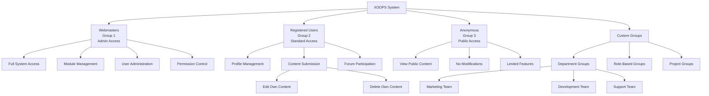
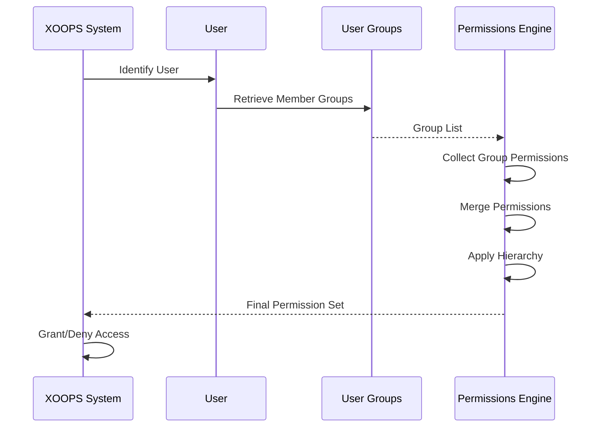

# Group System in XOOPS

The XOOPS Group System provides a hierarchical framework for organizing users and managing collective permissions. This document covers default groups, custom group creation, hierarchy, and practical implementation.

## Default Groups

XOOPS includes three fundamental groups that are created during system installation:

### Webmasters Group (ID: 1)

The Webmasters group represents site administrators with full system access.

**Characteristics:**
- Group ID: 1
- Highest privilege level
- Cannot be deleted
- Full access to all modules and functions
- Access to administration panel

```php
<?php
/**
 * Check if user is webmaster
 */
$groupHandler = xoops_getHandler('group');
$group = $groupHandler->getGroup(1);
$webmasterUsers = $groupHandler->getUsersByGroup(1);

if ($xoopsUser instanceof XoopsUser) {
    $groups = $xoopsUser->getGroups();
    if (in_array(1, $groups)) {
        // User is a webmaster
        echo "Welcome, Site Administrator!";
    }
}
```

### Registered Users Group (ID: 2)

The Registered Users group includes all authenticated users who are not anonymous.

**Characteristics:**
- Group ID: 2
- Default group for new registrations
- Can access user-specific features
- Subject to group-based permissions
- Can be customized for standard user features

```php
<?php
/**
 * Check if user is registered (not anonymous)
 */
if ($xoopsUser instanceof XoopsUser) {
    // User is logged in
    $groups = $xoopsUser->getGroups();
    if (in_array(2, $groups)) {
        // User is in registered group
        echo "Welcome, registered user!";
    }
}
```

### Anonymous Group (ID: 3)

The Anonymous group represents unauthenticated visitors to the site.

**Characteristics:**
- Group ID: 3
- Default group for non-logged-in users
- Limited read-only access typically
- Cannot modify content
- Public viewing permissions

```php
<?php
/**
 * Check if user is anonymous
 */
if (!$xoopsUser instanceof XoopsUser) {
    // User is not logged in
    echo "Public content only";
}

// Alternative using group check
$anonymousUsers = xoops_getHandler('group')->getUsersByGroup(3);
```

## Group Structure

### Database Schema

```sql
CREATE TABLE xoops_groups (
  group_id INT(11) NOT NULL AUTO_INCREMENT PRIMARY KEY,
  group_name VARCHAR(255) NOT NULL UNIQUE,
  group_description TEXT,
  group_type TINYINT(1) NOT NULL DEFAULT 0,
  group_active TINYINT(1) NOT NULL DEFAULT 1,
  created_at TIMESTAMP DEFAULT CURRENT_TIMESTAMP,
  updated_at TIMESTAMP DEFAULT CURRENT_TIMESTAMP ON UPDATE CURRENT_TIMESTAMP
);

CREATE TABLE xoops_group_users (
  group_id INT(11) NOT NULL,
  uid INT(11) NOT NULL,
  PRIMARY KEY (group_id, uid),
  FOREIGN KEY (group_id) REFERENCES xoops_groups(group_id) ON DELETE CASCADE,
  FOREIGN KEY (uid) REFERENCES xoops_users(uid) ON DELETE CASCADE
);
```

### XoopsGroup Class Properties

```php
class XoopsGroup
{
    protected $group_id;
    protected $group_name;
    protected $group_description;
    protected $group_type;
    protected $group_active;
    protected $created_at;
    protected $updated_at;
}
```

## Group Hierarchy

### Hierarchy Diagram



### Permission Inheritance



## Creating Custom Groups

### Group Creation Handler

```php
<?php
/**
 * Custom Group Management
 */
class GroupManager
{
    private $groupHandler;
    private $permissionHandler;

    public function __construct()
    {
        $this->groupHandler = xoops_getHandler('group');
        $this->permissionHandler = xoops_getHandler('permission');
    }

    /**
     * Create new group
     *
     * @param array $data Group data
     * @return XoopsGroup|false New group or false
     */
    public function createGroup(array $data)
    {
        // Validate input
        if (empty($data['group_name'])) {
            throw new Exception('Group name is required');
        }

        if (strlen($data['group_name']) < 3 || strlen($data['group_name']) > 255) {
            throw new Exception('Group name must be between 3 and 255 characters');
        }

        // Check if group already exists
        $existing = $this->groupHandler->getByName($data['group_name']);
        if ($existing) {
            throw new Exception('Group already exists');
        }

        // Create group object
        $group = $this->groupHandler->create();
        $group->setVar('group_name', $data['group_name']);
        $group->setVar('group_description', $data['group_description'] ?? '');
        $group->setVar('group_type', $data['group_type'] ?? 0);
        $group->setVar('group_active', $data['group_active'] ?? 1);

        // Save group
        if ($this->groupHandler->insert($group)) {
            return $group;
        }

        return false;
    }

    /**
     * Update group
     *
     * @param int $groupId Group ID
     * @param array $data Update data
     * @return bool Success status
     */
    public function updateGroup(int $groupId, array $data): bool
    {
        $group = $this->groupHandler->get($groupId);
        if (!$group) {
            return false;
        }

        // Prevent modification of default groups
        if (in_array($groupId, [1, 2, 3])) {
            if (isset($data['group_name']) && $data['group_name'] !== $group->getVar('group_name')) {
                throw new Exception('Cannot rename default groups');
            }
        }

        if (isset($data['group_name'])) {
            $group->setVar('group_name', $data['group_name']);
        }

        if (isset($data['group_description'])) {
            $group->setVar('group_description', $data['group_description']);
        }

        if (isset($data['group_active']) && !in_array($groupId, [1, 2, 3])) {
            $group->setVar('group_active', (int)$data['group_active']);
        }

        if (isset($data['group_type'])) {
            $group->setVar('group_type', (int)$data['group_type']);
        }

        return $this->groupHandler->insert($group);
    }

    /**
     * Add user to group
     *
     * @param int $uid User ID
     * @param int $groupId Group ID
     * @return bool Success status
     */
    public function addUserToGroup(int $uid, int $groupId): bool
    {
        return $this->groupHandler->addUser($uid, $groupId);
    }

    /**
     * Remove user from group
     *
     * @param int $uid User ID
     * @param int $groupId Group ID
     * @return bool Success status
     */
    public function removeUserFromGroup(int $uid, int $groupId): bool
    {
        return $this->groupHandler->removeUser($uid, $groupId);
    }

    /**
     * Get group members
     *
     * @param int $groupId Group ID
     * @return array Array of user objects
     */
    public function getGroupMembers(int $groupId): array
    {
        return $this->groupHandler->getUsersByGroup($groupId);
    }

    /**
     * Get user groups
     *
     * @param int $uid User ID
     * @return array Array of group objects
     */
    public function getUserGroups(int $uid): array
    {
        return $this->groupHandler->getGroupsByUser($uid);
    }

    /**
     * Delete group
     *
     * @param int $groupId Group ID
     * @return bool Success status
     */
    public function deleteGroup(int $groupId): bool
    {
        // Prevent deletion of default groups
        if (in_array($groupId, [1, 2, 3])) {
            throw new Exception('Cannot delete default groups');
        }

        // Remove all group users first
        $db = XoopsDatabaseFactory::getDatabaseConnection();
        $db->query("DELETE FROM xoops_group_users WHERE group_id = ?", array($groupId));

        // Delete group permissions
        $db->query("DELETE FROM xoops_group_permission WHERE group_id = ?", array($groupId));

        // Delete group
        return $this->groupHandler->delete($groupId);
    }
}
```

## Group Permission Assignment

### Assigning Permissions to Groups

```php
<?php
/**
 * Group Permission Assignment
 */
class GroupPermissionAssignment
{
    private $permissionHandler;
    private $groupHandler;
    private $moduleHandler;

    public function __construct()
    {
        $this->permissionHandler = xoops_getHandler('groupperm');
        $this->groupHandler = xoops_getHandler('group');
        $this->moduleHandler = xoops_getHandler('module');
    }

    /**
     * Grant module permission to group
     *
     * @param int $groupId Group ID
     * @param string $permission Permission name
     * @param int $moduleId Module ID
     * @param array $itemIds Item IDs (optional)
     * @return bool Success status
     */
    public function grantModulePermission(
        int $groupId,
        string $permission,
        int $moduleId,
        array $itemIds = []
    ): bool
    {
        if (empty($itemIds)) {
            // Grant module-level permission
            return $this->permissionHandler->addRight(
                $permission,
                $groupId,
                $moduleId
            );
        } else {
            // Grant item-level permissions
            foreach ($itemIds as $itemId) {
                $this->permissionHandler->addRight(
                    $permission,
                    $groupId,
                    $moduleId,
                    $itemId
                );
            }
            return true;
        }
    }

    /**
     * Revoke module permission from group
     *
     * @param int $groupId Group ID
     * @param string $permission Permission name
     * @param int $moduleId Module ID
     * @param array $itemIds Item IDs (optional)
     * @return bool Success status
     */
    public function revokeModulePermission(
        int $groupId,
        string $permission,
        int $moduleId,
        array $itemIds = []
    ): bool
    {
        if (empty($itemIds)) {
            return $this->permissionHandler->deleteRight(
                $permission,
                $groupId,
                $moduleId
            );
        } else {
            foreach ($itemIds as $itemId) {
                $this->permissionHandler->deleteRight(
                    $permission,
                    $groupId,
                    $moduleId,
                    $itemId
                );
            }
            return true;
        }
    }

    /**
     * Check if group has permission
     *
     * @param int $groupId Group ID
     * @param string $permission Permission name
     * @param int $moduleId Module ID
     * @param int $itemId Item ID (optional)
     * @return bool Permission status
     */
    public function hasPermission(
        int $groupId,
        string $permission,
        int $moduleId,
        int $itemId = 0
    ): bool
    {
        return $this->permissionHandler->checkRight(
            $permission,
            $groupId,
            $moduleId,
            $itemId
        );
    }

    /**
     * Get all permissions for group in module
     *
     * @param int $groupId Group ID
     * @param int $moduleId Module ID
     * @return array Permission list
     */
    public function getGroupModulePermissions(
        int $groupId,
        int $moduleId
    ): array
    {
        return $this->permissionHandler->getGroupPermissions(
            $groupId,
            $moduleId
        );
    }

    /**
     * Assign multiple permissions at once
     *
     * @param int $groupId Group ID
     * @param array $permissions Permission data
     * @return bool Success status
     */
    public function assignBulkPermissions(int $groupId, array $permissions): bool
    {
        try {
            foreach ($permissions as $perm) {
                $this->grantModulePermission(
                    $groupId,
                    $perm['permission'],
                    $perm['module_id'],
                    $perm['item_ids'] ?? []
                );
            }
            return true;
        } catch (Exception $e) {
            return false;
        }
    }
}
```

## Practical Examples

### Department Group Setup

```php
<?php
/**
 * Example: Setting up department groups
 */

$groupManager = new GroupManager();
$permissionAssigner = new GroupPermissionAssignment();

// Create Marketing Department group
$marketingGroup = $groupManager->createGroup([
    'group_name' => 'Marketing Department',
    'group_description' => 'Marketing team members',
    'group_type' => 1,
    'group_active' => 1
]);

$marketingId = $marketingGroup->getVar('group_id');

// Create Development Department group
$devGroup = $groupManager->createGroup([
    'group_name' => 'Development Department',
    'group_description' => 'Development team members',
    'group_type' => 1,
    'group_active' => 1
]);

$devId = $devGroup->getVar('group_id');

// Add users to groups
$groupManager->addUserToGroup(5, $marketingId);
$groupManager->addUserToGroup(6, $marketingId);
$groupManager->addUserToGroup(7, $devId);
$groupManager->addUserToGroup(8, $devId);

// Assign permissions
// Marketing can view and submit articles
$permissionAssigner->grantModulePermission(
    $marketingId,
    'module_view',
    2  // Article module
);

$permissionAssigner->grantModulePermission(
    $marketingId,
    'module_submit',
    2
);

// Dev can access all development tools
$permissionAssigner->grantModulePermission(
    $devId,
    'module_view',
    4  // Developer module
);

$permissionAssigner->grantModulePermission(
    $devId,
    'module_admin',
    4
);
```

### Checking User Groups

```php
<?php
/**
 * Example: Checking user group membership
 */

$groupManager = new GroupManager();
$xoopsUser = $GLOBALS['xoopsUser'];

if ($xoopsUser instanceof XoopsUser) {
    $userGroups = $groupManager->getUserGroups($xoopsUser->getVar('uid'));

    // Check specific group membership
    $isInMarketing = false;
    foreach ($userGroups as $group) {
        if ($group->getVar('group_name') === 'Marketing Department') {
            $isInMarketing = true;
            break;
        }
    }

    if ($isInMarketing) {
        echo "Welcome to Marketing!";
    }

    // Get group names
    $groupNames = array_map(function($g) {
        return $g->getVar('group_name');
    }, $userGroups);

    echo "You are member of: " . implode(", ", $groupNames);
}
```

### Multiple Group Assignment

```php
<?php
/**
 * Example: Assigning user to multiple groups
 */

$groupManager = new GroupManager();

// Get group IDs
$groupHandler = xoops_getHandler('group');
$marketingGroup = $groupHandler->getByName('Marketing Department');
$writerGroup = $groupHandler->getByName('Writers');

// Add user to multiple groups
$userId = 12;
$groupManager->addUserToGroup($userId, $marketingGroup->getVar('group_id'));
$groupManager->addUserToGroup($userId, $writerGroup->getVar('group_id'));

// User now has combined permissions from both groups
```

## Best Practices

### Group Organization

1. **Clear Naming**: Use descriptive, clear group names
2. **Documentation**: Document group purposes and permissions
3. **Principle of Least Privilege**: Grant minimal required permissions
4. **Regular Audits**: Periodically review group memberships and permissions
5. **Default Groups**: Preserve default groups (Webmasters, Registered, Anonymous)

### Permission Management

```php
<?php
/**
 * Best practice: Permission audit function
 */
class GroupAudit
{
    /**
     * Audit group permissions
     *
     * @param int $groupId Group ID
     * @return array Audit report
     */
    public function auditGroupPermissions(int $groupId): array
    {
        $permissionHandler = xoops_getHandler('groupperm');
        $groupHandler = xoops_getHandler('group');
        $moduleHandler = xoops_getHandler('module');

        $group = $groupHandler->get($groupId);
        if (!$group) {
            return ['error' => 'Group not found'];
        }

        $modules = $moduleHandler->getList();
        $report = [
            'group_name' => $group->getVar('group_name'),
            'members_count' => count($groupHandler->getUsersByGroup($groupId)),
            'permissions_by_module' => []
        ];

        foreach ($modules as $moduleId => $moduleName) {
            $perms = $permissionHandler->getGroupPermissions($groupId, $moduleId);
            if (!empty($perms)) {
                $report['permissions_by_module'][$moduleName] = $perms;
            }
        }

        return $report;
    }
}
```

## Related Links

- [[User-Management|User Management.md]]
- [[Permission-System|Permission System.md]]
- [[Authentication|Authentication.md]]
- [[../Security/Security-Guidelines|../../Security/Security-Guidelines.md]]

## Tags

#groups #group-management #permissions #access-control #user-organization #hierarchy
