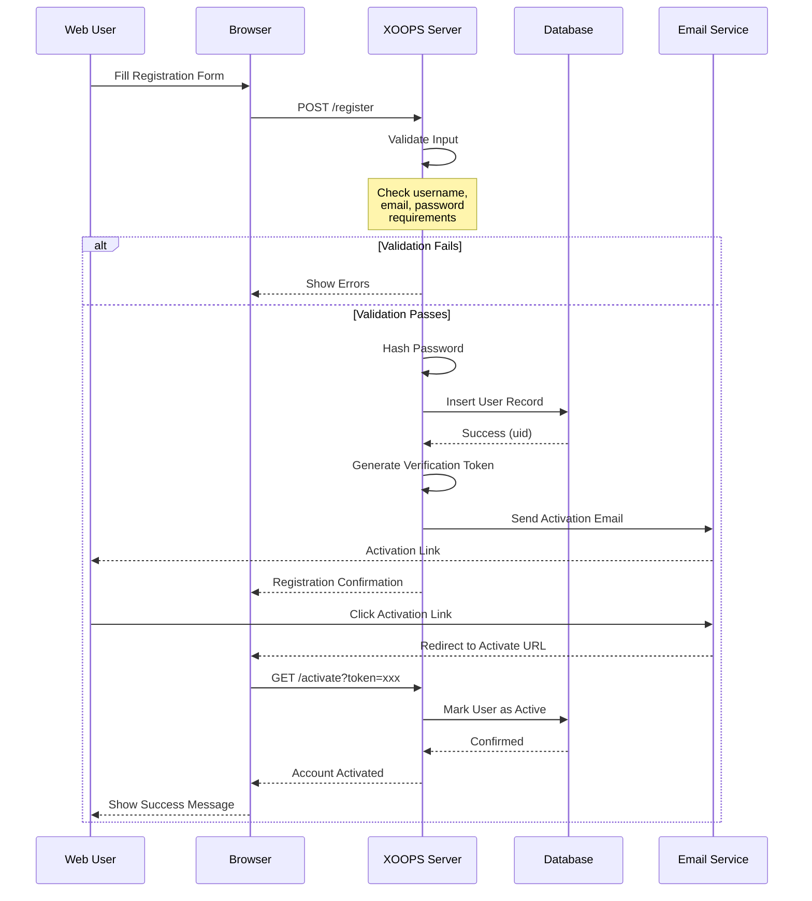
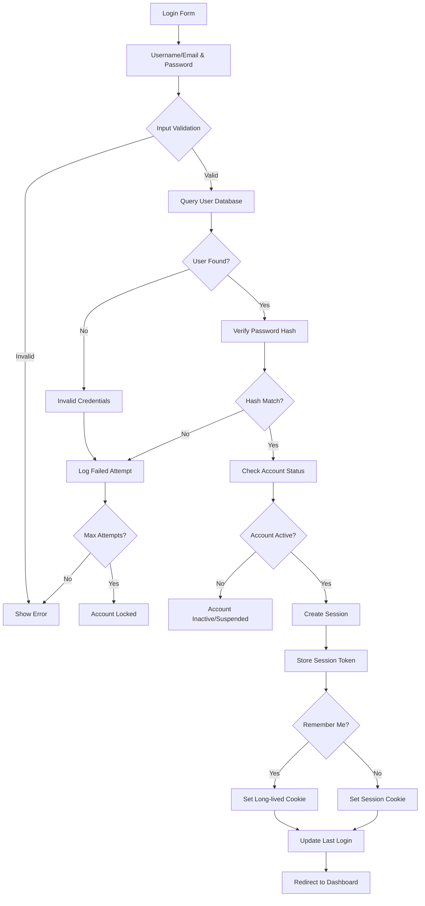

# User Management in XOOPS

The XOOPS User Management system provides a complete framework for handling user registration, authentication, profile management, and user preferences. This document covers the user object structure, registration flows, and practical implementation examples.

## User Object Structure

The core user object in XOOPS is the `XoopsUser` class, which encapsulates all user data and methods.

### Database Schema

```sql
CREATE TABLE xoops_users (
  uid INT(11) NOT NULL AUTO_INCREMENT PRIMARY KEY,
  uname VARCHAR(25) NOT NULL UNIQUE,
  email VARCHAR(60) NOT NULL,
  pass VARCHAR(255) NOT NULL,
  pass_expired DATETIME DEFAULT NULL,
  created_at TIMESTAMP DEFAULT CURRENT_TIMESTAMP,
  updated_at TIMESTAMP DEFAULT CURRENT_TIMESTAMP ON UPDATE CURRENT_TIMESTAMP,
  last_login DATETIME DEFAULT NULL,
  login_attempts INT(11) DEFAULT 0,
  user_avatar VARCHAR(255) NOT NULL DEFAULT 'blank.gif',
  user_regdate INT(11) NOT NULL DEFAULT 0,
  user_icq VARCHAR(15) NOT NULL DEFAULT '',
  user_from VARCHAR(100) NOT NULL DEFAULT '',
  user_sig TEXT,
  user_sig_smilies TINYINT(1) NOT NULL DEFAULT 1,
  user_viewemail TINYINT(1) NOT NULL DEFAULT 0,
  user_attachsig TINYINT(1) NOT NULL DEFAULT 0,
  user_theme VARCHAR(32) NOT NULL DEFAULT '',
  user_language VARCHAR(32) NOT NULL DEFAULT '',
  user_openid VARCHAR(255) NOT NULL DEFAULT '',
  user_notify_method TINYINT(1) NOT NULL DEFAULT 0,
  user_notify_interval INT(11) NOT NULL DEFAULT 0
);
```

### XoopsUser Class Properties

```php
class XoopsUser
{
    protected $uid;
    protected $uname;
    protected $email;
    protected $pass;
    protected $pass_expired;
    protected $created_at;
    protected $updated_at;
    protected $last_login;
    protected $login_attempts;
    protected $user_avatar;
    protected $user_regdate;
    protected $user_icq;
    protected $user_from;
    protected $user_sig;
    protected $user_sig_smilies;
    protected $user_viewemail;
    protected $user_attachsig;
    protected $user_theme;
    protected $user_language;
    protected $user_openid;
    protected $user_notify_method;
    protected $user_notify_interval;
}
```

## User Registration Flow

### Registration Sequence Diagram



### Registration Implementation

```php
<?php
/**
 * User Registration Handler
 */
class RegistrationHandler
{
    private $userHandler;
    private $configHandler;

    public function __construct()
    {
        $this->userHandler = xoops_getHandler('user');
        $this->configHandler = xoops_getHandler('config');
    }

    /**
     * Validate registration input
     *
     * @param array $data Registration form data
     * @return array Validation errors, empty if valid
     */
    public function validateInput(array $data): array
    {
        $errors = [];

        // Username validation
        if (empty($data['uname'])) {
            $errors[] = 'Username is required';
        } elseif (strlen($data['uname']) < 3) {
            $errors[] = 'Username must be at least 3 characters';
        } elseif (!preg_match('/^[a-zA-Z0-9_-]+$/', $data['uname'])) {
            $errors[] = 'Username contains invalid characters';
        } elseif ($this->userHandler->getUserByName($data['uname'])) {
            $errors[] = 'Username already exists';
        }

        // Email validation
        if (empty($data['email'])) {
            $errors[] = 'Email is required';
        } elseif (!filter_var($data['email'], FILTER_VALIDATE_EMAIL)) {
            $errors[] = 'Invalid email format';
        } elseif ($this->userHandler->getUserByEmail($data['email'])) {
            $errors[] = 'Email already registered';
        }

        // Password validation
        if (empty($data['password'])) {
            $errors[] = 'Password is required';
        } elseif (strlen($data['password']) < 8) {
            $errors[] = 'Password must be at least 8 characters';
        } elseif ($data['password'] !== $data['password_confirm']) {
            $errors[] = 'Passwords do not match';
        }

        return $errors;
    }

    /**
     * Register new user
     *
     * @param array $data Registration data
     * @return XoopsUser|false User object or false on failure
     */
    public function registerUser(array $data)
    {
        // Validate input
        $errors = $this->validateInput($data);
        if (!empty($errors)) {
            return false;
        }

        // Create user object
        $user = $this->userHandler->create();
        $user->setVar('uname', $data['uname']);
        $user->setVar('email', $data['email']);
        $user->setVar('user_regdate', time());

        // Hash password using bcrypt
        $hashedPassword = password_hash(
            $data['password'],
            PASSWORD_BCRYPT,
            ['cost' => 12]
        );
        $user->setVar('pass', $hashedPassword);

        // Set default preferences
        $user->setVar('user_theme', $this->configHandler->getConfig('default_theme'));
        $user->setVar('user_language', $this->configHandler->getConfig('default_language'));

        // Save user
        if ($this->userHandler->insertUser($user)) {
            $uid = $user->getVar('uid');

            // Generate verification token
            $token = bin2hex(random_bytes(32));
            $this->saveVerificationToken($uid, $token);

            // Send verification email
            $this->sendVerificationEmail($user, $token);

            return $user;
        }

        return false;
    }

    /**
     * Save verification token
     *
     * @param int $uid User ID
     * @param string $token Verification token
     */
    private function saveVerificationToken(int $uid, string $token): void
    {
        $tokenHandler = xoops_getHandler('usertoken');
        $tokenHandler->saveToken($uid, $token, 'email_verification', 24); // 24 hours
    }

    /**
     * Send verification email
     *
     * @param XoopsUser $user User object
     * @param string $token Verification token
     */
    private function sendVerificationEmail(XoopsUser $user, string $token): void
    {
        global $xoopsConfig;

        $siteUrl = $xoopsConfig['siteurl'];
        $activationUrl = $siteUrl . '/user.php?op=activate&token=' . $token;

        $subject = 'Email Verification - ' . $xoopsConfig['sitename'];
        $body = "Hello " . $user->getVar('uname') . ",\n\n";
        $body .= "Please click the link below to verify your email:\n";
        $body .= $activationUrl . "\n\n";
        $body .= "This link will expire in 24 hours.\n\n";
        $body .= "Regards,\n" . $xoopsConfig['sitename'];

        $mailHandler = xoops_getHandler('mail');
        $mailHandler->send($user->getVar('email'), $subject, $body);
    }
}
```

## User Authentication Process

### Authentication Flow Diagram



### Authentication Implementation

```php
<?php
/**
 * Authentication Handler
 */
class AuthenticationHandler
{
    private $userHandler;
    private $maxLoginAttempts = 5;
    private $lockoutDuration = 900; // 15 minutes

    public function __construct()
    {
        $this->userHandler = xoops_getHandler('user');
    }

    /**
     * Authenticate user by username/email and password
     *
     * @param string $username Username or email
     * @param string $password Plain text password
     * @param bool $rememberMe Remember login
     * @return XoopsUser|false Authenticated user or false
     */
    public function authenticate(
        string $username,
        string $password,
        bool $rememberMe = false
    )
    {
        // Check account lockout
        if ($this->isAccountLocked($username)) {
            throw new Exception('Account temporarily locked due to failed login attempts');
        }

        // Find user by username or email
        $user = $this->userHandler->getUserByName($username);
        if (!$user) {
            $user = $this->userHandler->getUserByEmail($username);
        }

        if (!$user) {
            $this->recordFailedAttempt($username);
            return false;
        }

        // Verify password
        if (!password_verify($password, $user->getVar('pass'))) {
            $this->recordFailedAttempt($username);
            return false;
        }

        // Check account status
        if ($user->getVar('level') == 0) {
            throw new Exception('Account is inactive');
        }

        // Clear failed attempts
        $this->clearFailedAttempts($user->getVar('uid'));

        // Update last login
        $user->setVar('last_login', date('Y-m-d H:i:s'));
        $this->userHandler->insertUser($user);

        // Create session
        $this->createSession($user, $rememberMe);

        return $user;
    }

    /**
     * Create authenticated session
     *
     * @param XoopsUser $user User object
     * @param bool $rememberMe Enable persistent login
     */
    private function createSession(XoopsUser $user, bool $rememberMe = false): void
    {
        // Generate session token
        $token = bin2hex(random_bytes(32));

        $_SESSION['xoopsUserId'] = $user->getVar('uid');
        $_SESSION['xoopsUserName'] = $user->getVar('uname');
        $_SESSION['xoopsSessionToken'] = $token;
        $_SESSION['xoopsSessionCreated'] = time();

        // Store token in database for validation
        $this->storeSessionToken($user->getVar('uid'), $token);

        if ($rememberMe) {
            // Create persistent login cookie (14 days)
            $cookieToken = bin2hex(random_bytes(32));
            setcookie(
                'xoops_persistent_login',
                $cookieToken,
                time() + (14 * 24 * 60 * 60),
                '/',
                '',
                true,  // HTTPS only
                true   // HttpOnly
            );

            // Store cookie token hash
            $this->storePersistentToken(
                $user->getVar('uid'),
                hash('sha256', $cookieToken)
            );
        }
    }

    /**
     * Record failed login attempt
     *
     * @param string $username Username or email
     */
    private function recordFailedAttempt(string $username): void
    {
        $key = 'login_attempt_' . md5($username);
        $attempts = apcu_fetch($key) ?: 0;
        apcu_store($key, $attempts + 1, $this->lockoutDuration);
    }

    /**
     * Check if account is locked
     *
     * @param string $username Username or email
     * @return bool True if locked
     */
    private function isAccountLocked(string $username): bool
    {
        $key = 'login_attempt_' . md5($username);
        $attempts = apcu_fetch($key) ?: 0;
        return $attempts >= $this->maxLoginAttempts;
    }

    /**
     * Clear failed attempts
     *
     * @param int $uid User ID
     */
    private function clearFailedAttempts(int $uid): void
    {
        $user = $this->userHandler->getUser($uid);
        $user->setVar('login_attempts', 0);
        $this->userHandler->insertUser($user);
    }

    /**
     * Store session token
     *
     * @param int $uid User ID
     * @param string $token Session token
     */
    private function storeSessionToken(int $uid, string $token): void
    {
        // Store in database or cache
        $tokenData = [
            'uid' => $uid,
            'token' => hash('sha256', $token),
            'created' => time(),
            'expires' => time() + (8 * 60 * 60) // 8 hours
        ];

        $db = XoopsDatabaseFactory::getDatabaseConnection();
        $db->query("INSERT INTO xoops_sessions (uid, token, created, expires)
                   VALUES (?, ?, ?, ?)",
                   array($uid, $tokenData['token'], $tokenData['created'], $tokenData['expires']));
    }
}
```

## Profile Management

### Profile Update Implementation

```php
<?php
/**
 * User Profile Management
 */
class ProfileManager
{
    private $userHandler;
    private $avatarHandler;

    public function __construct()
    {
        $this->userHandler = xoops_getHandler('user');
        $this->avatarHandler = xoops_getHandler('avatar');
    }

    /**
     * Update user profile
     *
     * @param int $uid User ID
     * @param array $data Profile data
     * @return bool Success status
     */
    public function updateProfile(int $uid, array $data): bool
    {
        $user = $this->userHandler->getUser($uid);
        if (!$user) {
            return false;
        }

        // Update profile fields
        if (isset($data['email'])) {
            // Verify email is unique (excluding current user)
            $existingUser = $this->userHandler->getUserByEmail($data['email']);
            if ($existingUser && $existingUser->getVar('uid') !== $uid) {
                throw new Exception('Email already in use');
            }
            $user->setVar('email', $data['email']);
        }

        if (isset($data['user_icq'])) {
            $user->setVar('user_icq', sanitize_text_field($data['user_icq']));
        }

        if (isset($data['user_from'])) {
            $user->setVar('user_from', sanitize_text_field($data['user_from']));
        }

        if (isset($data['user_sig'])) {
            $sig = $data['user_sig'];
            if (strlen($sig) > 500) {
                throw new Exception('Signature too long');
            }
            $user->setVar('user_sig', $sig);
        }

        if (isset($data['user_sig_smilies'])) {
            $user->setVar('user_sig_smilies', (int)$data['user_sig_smilies']);
        }

        if (isset($data['user_viewemail'])) {
            $user->setVar('user_viewemail', (int)$data['user_viewemail']);
        }

        if (isset($data['user_attachsig'])) {
            $user->setVar('user_attachsig', (int)$data['user_attachsig']);
        }

        if (isset($data['user_theme'])) {
            $user->setVar('user_theme', $data['user_theme']);
        }

        if (isset($data['user_language'])) {
            $user->setVar('user_language', $data['user_language']);
        }

        return $this->userHandler->insertUser($user);
    }

    /**
     * Change user password
     *
     * @param int $uid User ID
     * @param string $currentPassword Current password
     * @param string $newPassword New password
     * @return bool Success status
     */
    public function changePassword(
        int $uid,
        string $currentPassword,
        string $newPassword
    ): bool
    {
        $user = $this->userHandler->getUser($uid);
        if (!$user) {
            return false;
        }

        // Verify current password
        if (!password_verify($currentPassword, $user->getVar('pass'))) {
            throw new Exception('Current password is incorrect');
        }

        // Validate new password
        if (strlen($newPassword) < 8) {
            throw new Exception('New password must be at least 8 characters');
        }

        // Hash new password
        $hashedPassword = password_hash($newPassword, PASSWORD_BCRYPT, ['cost' => 12]);
        $user->setVar('pass', $hashedPassword);

        return $this->userHandler->insertUser($user);
    }

    /**
     * Get user profile data
     *
     * @param int $uid User ID
     * @return array Profile data
     */
    public function getProfile(int $uid): array
    {
        $user = $this->userHandler->getUser($uid);
        if (!$user) {
            return [];
        }

        return [
            'uid' => $user->getVar('uid'),
            'uname' => $user->getVar('uname'),
            'email' => $user->getVar('email'),
            'user_regdate' => $user->getVar('user_regdate'),
            'user_icq' => $user->getVar('user_icq'),
            'user_from' => $user->getVar('user_from'),
            'user_sig' => $user->getVar('user_sig'),
            'user_viewemail' => $user->getVar('user_viewemail'),
            'user_attachsig' => $user->getVar('user_attachsig'),
            'user_theme' => $user->getVar('user_theme'),
            'user_language' => $user->getVar('user_language'),
            'last_login' => $user->getVar('last_login'),
            'avatar' => $user->getVar('user_avatar')
        ];
    }
}
```

## Avatar Handling

### Avatar Management

```php
<?php
/**
 * User Avatar Handler
 */
class AvatarHandler
{
    private $avatarPath = '/uploads/avatars/';
    private $maxSize = 2097152; // 2MB
    private $allowedTypes = ['image/jpeg', 'image/png', 'image/gif'];

    /**
     * Upload user avatar
     *
     * @param int $uid User ID
     * @param array $file $_FILES array
     * @return string|false Avatar filename or false
     */
    public function uploadAvatar(int $uid, array $file)
    {
        // Validate file
        if ($file['error'] !== UPLOAD_ERR_OK) {
            throw new Exception('File upload error: ' . $file['error']);
        }

        if ($file['size'] > $this->maxSize) {
            throw new Exception('File too large (max 2MB)');
        }

        if (!in_array($file['type'], $this->allowedTypes)) {
            throw new Exception('Invalid file type');
        }

        // Verify MIME type
        $finfo = finfo_open(FILEINFO_MIME_TYPE);
        $mimeType = finfo_file($finfo, $file['tmp_name']);
        finfo_close($finfo);

        if (!in_array($mimeType, $this->allowedTypes)) {
            throw new Exception('Invalid file content');
        }

        // Generate unique filename
        $extension = pathinfo($file['name'], PATHINFO_EXTENSION);
        $filename = 'avatar_' . $uid . '_' . time() . '.' . $extension;

        // Create upload directory
        $uploadDir = XOOPS_ROOT_PATH . $this->avatarPath;
        if (!is_dir($uploadDir)) {
            mkdir($uploadDir, 0755, true);
        }

        $filepath = $uploadDir . $filename;

        // Move uploaded file
        if (!move_uploaded_file($file['tmp_name'], $filepath)) {
            throw new Exception('Failed to move uploaded file');
        }

        // Resize image to standard size (150x150)
        $this->resizeImage($filepath, 150, 150);

        // Update user avatar
        $userHandler = xoops_getHandler('user');
        $user = $userHandler->getUser($uid);

        // Delete old avatar if exists
        $oldAvatar = $user->getVar('user_avatar');
        if ($oldAvatar && $oldAvatar !== 'blank.gif') {
            $oldPath = $uploadDir . $oldAvatar;
            if (file_exists($oldPath)) {
                unlink($oldPath);
            }
        }

        // Save new avatar
        $user->setVar('user_avatar', $filename);
        $userHandler->insertUser($user);

        return $filename;
    }

    /**
     * Resize image to specified dimensions
     *
     * @param string $filepath Path to image file
     * @param int $width Target width
     * @param int $height Target height
     */
    private function resizeImage(string $filepath, int $width, int $height): void
    {
        if (!extension_loaded('gd')) {
            return; // GD not available, skip resizing
        }

        $image = imagecreatefromstring(file_get_contents($filepath));
        if (!$image) {
            return;
        }

        $resized = imagecreatetruecolor($width, $height);

        // Preserve transparency for PNG and GIF
        $format = mime_content_type($filepath);
        if ($format === 'image/png' || $format === 'image/gif') {
            imagealphablending($resized, false);
            imagesavealpha($resized, true);
        }

        imagecopyresampled(
            $resized, $image,
            0, 0, 0, 0,
            $width, $height,
            imagesx($image), imagesy($image)
        );

        // Save resized image
        $ext = pathinfo($filepath, PATHINFO_EXTENSION);
        if (strtolower($ext) === 'png') {
            imagepng($resized, $filepath, 9);
        } else {
            imagejpeg($resized, $filepath, 90);
        }

        imagedestroy($image);
        imagedestroy($resized);
    }

    /**
     * Delete user avatar
     *
     * @param int $uid User ID
     * @return bool Success status
     */
    public function deleteAvatar(int $uid): bool
    {
        $userHandler = xoops_getHandler('user');
        $user = $userHandler->getUser($uid);

        if (!$user) {
            return false;
        }

        $avatar = $user->getVar('user_avatar');
        if ($avatar && $avatar !== 'blank.gif') {
            $filepath = XOOPS_ROOT_PATH . $this->avatarPath . $avatar;
            if (file_exists($filepath)) {
                unlink($filepath);
            }
        }

        $user->setVar('user_avatar', 'blank.gif');
        return $userHandler->insertUser($user);
    }
}
```

## User Preferences

### Preference System

```php
<?php
/**
 * User Preferences Handler
 */
class UserPreferencesHandler
{
    private $userHandler;
    private $prefixCache = 'user_pref_';

    public function __construct()
    {
        $this->userHandler = xoops_getHandler('user');
    }

    /**
     * Get user preference
     *
     * @param int $uid User ID
     * @param string $prefKey Preference key
     * @param mixed $default Default value
     * @return mixed Preference value
     */
    public function getPreference(int $uid, string $prefKey, $default = null)
    {
        // Try cache first
        $cacheKey = $this->prefixCache . $uid . '_' . $prefKey;
        $cached = apcu_fetch($cacheKey);
        if ($cached !== false) {
            return $cached;
        }

        // Get from database
        $db = XoopsDatabaseFactory::getDatabaseConnection();
        $result = $db->query(
            "SELECT pref_value FROM xoops_user_preferences
             WHERE uid = ? AND pref_key = ?",
            array($uid, $prefKey)
        );

        if ($result && $db->getRowCount($result) > 0) {
            $row = $db->fetchArray($result);
            $value = unserialize($row['pref_value']);
            apcu_store($cacheKey, $value, 3600); // Cache for 1 hour
            return $value;
        }

        return $default;
    }

    /**
     * Set user preference
     *
     * @param int $uid User ID
     * @param string $prefKey Preference key
     * @param mixed $prefValue Preference value
     * @return bool Success status
     */
    public function setPreference(int $uid, string $prefKey, $prefValue): bool
    {
        $db = XoopsDatabaseFactory::getDatabaseConnection();

        // Check if preference exists
        $result = $db->query(
            "SELECT id FROM xoops_user_preferences
             WHERE uid = ? AND pref_key = ?",
            array($uid, $prefKey)
        );

        $serialized = serialize($prefValue);

        if ($db->getRowCount($result) > 0) {
            // Update existing preference
            $success = $db->query(
                "UPDATE xoops_user_preferences
                 SET pref_value = ?
                 WHERE uid = ? AND pref_key = ?",
                array($serialized, $uid, $prefKey)
            );
        } else {
            // Insert new preference
            $success = $db->query(
                "INSERT INTO xoops_user_preferences (uid, pref_key, pref_value)
                 VALUES (?, ?, ?)",
                array($uid, $prefKey, $serialized)
            );
        }

        if ($success) {
            // Clear cache
            $cacheKey = $this->prefixCache . $uid . '_' . $prefKey;
            apcu_delete($cacheKey);
        }

        return (bool)$success;
    }

    /**
     * Get all user preferences
     *
     * @param int $uid User ID
     * @return array All preferences
     */
    public function getAllPreferences(int $uid): array
    {
        $db = XoopsDatabaseFactory::getDatabaseConnection();
        $result = $db->query(
            "SELECT pref_key, pref_value FROM xoops_user_preferences WHERE uid = ?",
            array($uid)
        );

        $prefs = [];
        while ($row = $db->fetchArray($result)) {
            $prefs[$row['pref_key']] = unserialize($row['pref_value']);
        }

        return $prefs;
    }

    /**
     * Delete user preference
     *
     * @param int $uid User ID
     * @param string $prefKey Preference key
     * @return bool Success status
     */
    public function deletePreference(int $uid, string $prefKey): bool
    {
        $db = XoopsDatabaseFactory::getDatabaseConnection();
        $success = $db->query(
            "DELETE FROM xoops_user_preferences WHERE uid = ? AND pref_key = ?",
            array($uid, $prefKey)
        );

        if ($success) {
            $cacheKey = $this->prefixCache . $uid . '_' . $prefKey;
            apcu_delete($cacheKey);
        }

        return (bool)$success;
    }
}
```

## User Operations Examples

### Common User Operations

```php
<?php
/**
 * Common user operations examples
 */

// Get current logged-in user
$xoopsUser = $GLOBALS['xoopsUser'];
if ($xoopsUser instanceof XoopsUser) {
    $userId = $xoopsUser->getVar('uid');
    $username = $xoopsUser->getVar('uname');
}

// Get user by ID
$userHandler = xoops_getHandler('user');
$user = $userHandler->getUser(1);
echo $user->getVar('uname');

// Get user by username
$user = $userHandler->getUserByName('admin');
if ($user) {
    echo $user->getVar('email');
}

// Get user by email
$user = $userHandler->getUserByEmail('user@example.com');

// Get all users in a group
$users = $userHandler->getUsersByGroup(1);
foreach ($users as $user) {
    echo $user->getVar('uname') . "\n";
}

// Create new user
$user = $userHandler->create();
$user->setVar('uname', 'newuser');
$user->setVar('email', 'newuser@example.com');
$user->setVar('pass', password_hash('password', PASSWORD_BCRYPT));
$user->setVar('user_regdate', time());

if ($userHandler->insertUser($user)) {
    echo "User created: " . $user->getVar('uid');
}

// Delete user
$userHandler->deleteUser(123);

// Get user object from ID
$user = $userHandler->getUser(5);
$profile = [
    'username' => $user->getVar('uname'),
    'email' => $user->getVar('email'),
    'regdate' => date('Y-m-d', $user->getVar('user_regdate')),
    'avatar' => $user->getVar('user_avatar'),
];
```

## Security Best Practices

### Password Security

- Always use `password_hash()` with `PASSWORD_BCRYPT` algorithm
- Use cost parameter of 12 for bcrypt
- Never store plain text passwords
- Implement password expiration policies
- Require password changes for compromised accounts

### Session Security

```php
<?php
// Session configuration
session_set_cookie_params([
    'lifetime' => 0,           // Session cookie (deleted on browser close)
    'path' => '/',
    'domain' => '',
    'secure' => true,          // HTTPS only
    'httponly' => true,        // Inaccessible to JavaScript
    'samesite' => 'Strict'     // CSRF protection
]);

session_start();

// Regenerate session ID after login
session_regenerate_id(true);

// Validate session token
if (!isset($_SESSION['xoopsSessionToken'])) {
    session_destroy();
    redirect('login');
}
```

## Related Links

- [[Group-System|Group System.md]]
- [[Permission-System|Permission System.md]]
- [[Authentication|Authentication.md]]
- [[../Security/Security-Guidelines|../../Security/Security-Guidelines.md]]

## Tags

#users #registration #authentication #profiles #password-security #sessions
