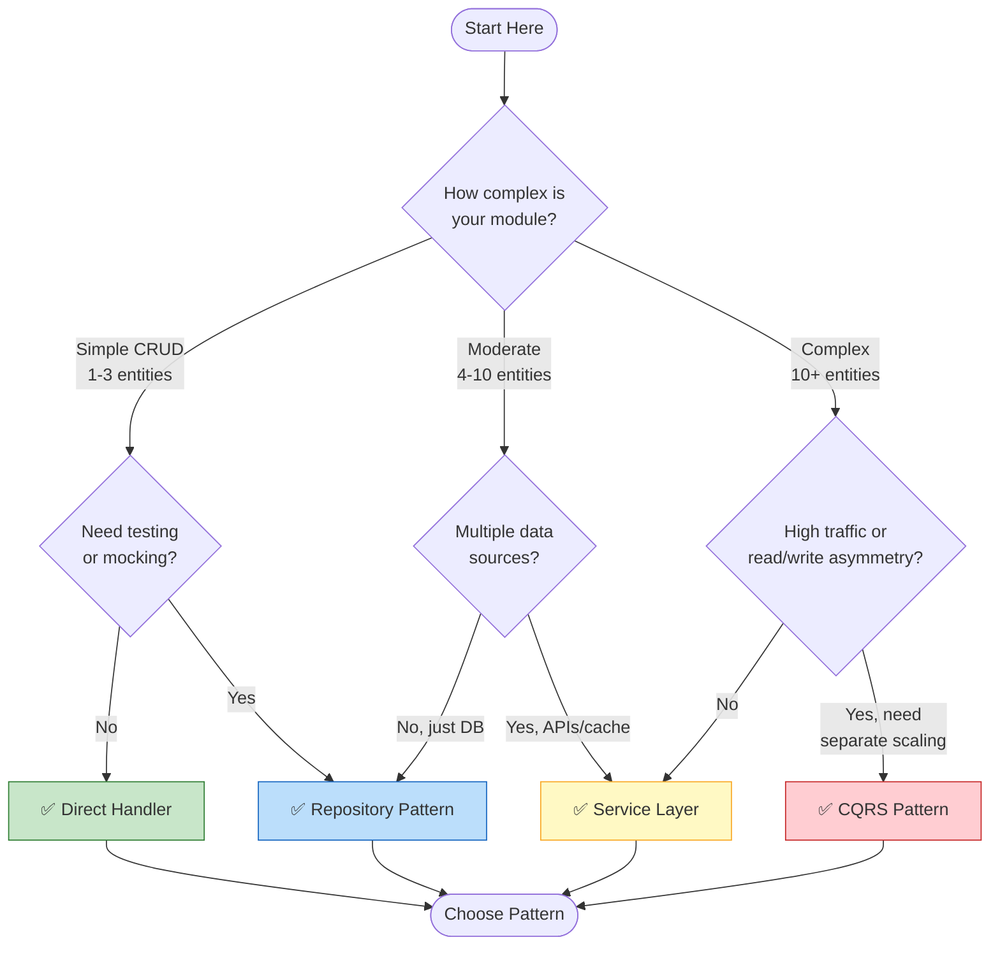
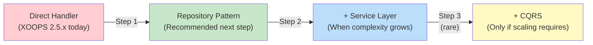

# Choosing a Data Access Pattern

<span class="version-badge version-25x">2.5.x ✅</span> <span class="version-badge version-40x">4.0.x ✅</span>

> **Which pattern should I use?** This decision tree helps you choose between direct handlers, Repository Pattern, Service Layer, and CQRS.

---

## Quick Decision Tree



---

## Pattern Comparison

| Criteria | Direct Handler | Repository | Service Layer | CQRS |
|----------|---------------|------------|---------------|------|
| **Complexity** | ⭐ | ⭐⭐ | ⭐⭐⭐ | ⭐⭐⭐⭐⭐ |
| **Testability** | ❌ Hard | ✅ Good | ✅ Great | ✅ Great |
| **Flexibility** | ❌ Low | ✅ Medium | ✅ High | ✅ Very High |
| **XOOPS 2.5.x** | ✅ Native | ✅ Works | ✅ Works | ⚠️ Complex |
| **XOOPS 4.0** | ⚠️ Deprecated | ✅ Recommended | ✅ Recommended | ✅ For scale |
| **Team Size** | 1 dev | 1-3 devs | 2-5 devs | 5+ devs |
| **Maintenance** | ❌ Higher | ✅ Moderate | ✅ Lower | ⚠️ Requires expertise |

---

## When to Use Each Pattern

### ✅ Direct Handler (`XoopsPersistableObjectHandler`)

**Best for:** Simple modules, quick prototypes, learning XOOPS

```php
// Simple and direct - good for small modules
$handler = xoops_getModuleHandler('article', 'news');
$articles = $handler->getObjects(new Criteria('status', 1));
```

**Choose this when:**
- Building a simple module with 1-3 database tables
- Creating a quick prototype
- You're the only developer and don't need tests
- The module won't grow significantly

**Limitations:**
- Hard to unit test (global dependency)
- Tight coupling to XOOPS database layer
- Business logic tends to leak into controllers

---

### ✅ Repository Pattern

**Best for:** Most modules, teams wanting testability

```php
// Abstraction allows mocking for tests
interface ArticleRepositoryInterface {
    public function findPublished(): array;
    public function save(Article $article): void;
}

class XoopsArticleRepository implements ArticleRepositoryInterface {
    private $handler;

    public function __construct() {
        $this->handler = xoops_getModuleHandler('article', 'news');
    }

    public function findPublished(): array {
        return $this->handler->getObjects(new Criteria('status', 1));
    }
}
```

**Choose this when:**
- You want to write unit tests
- You might change data sources later (DB → API)
- Working with 2+ developers
- Building modules for distribution

**Upgrade path:** This is the recommended pattern for XOOPS 4.0 preparation.

---

### ✅ Service Layer

**Best for:** Modules with complex business logic

```php
// Service coordinates multiple repositories and contains business rules
class ArticlePublicationService {
    public function __construct(
        private ArticleRepositoryInterface $articles,
        private NotificationServiceInterface $notifications,
        private CacheInterface $cache
    ) {}

    public function publish(int $articleId): void {
        $article = $this->articles->find($articleId);
        $article->setStatus('published');
        $article->setPublishedAt(new DateTime());

        $this->articles->save($article);
        $this->notifications->notifySubscribers($article);
        $this->cache->invalidate("article:{$articleId}");
    }
}
```

**Choose this when:**
- Operations span multiple data sources
- Business rules are complex
- You need transaction management
- Multiple parts of the app do the same thing

**Upgrade path:** Combine with Repository for a robust architecture.

---

### ⚠️ CQRS (Command Query Responsibility Segregation)

**Best for:** High-scale modules with read/write asymmetry

```php
// Commands modify state
class PublishArticleCommand {
    public function __construct(
        public readonly int $articleId,
        public readonly int $publisherId
    ) {}
}

// Queries read state (can use denormalized read models)
class GetPublishedArticlesQuery {
    public function __construct(
        public readonly int $limit = 10
    ) {}
}
```

**Choose this when:**
- Reads vastly outnumber writes (100:1 or more)
- You need different scaling for reads vs writes
- Complex reporting/analytics requirements
- Event sourcing would benefit your domain

**Warning:** CQRS adds significant complexity. Most XOOPS modules don't need it.

---

## Recommended Upgrade Path



### Step 1: Wrap Handlers in Repositories (2-4 hours)

1. Create an interface for your data access needs
2. Implement it using the existing handler
3. Inject the repository instead of calling `xoops_getModuleHandler()` directly

### Step 2: Add Service Layer When Needed (1-2 days)

1. When business logic appears in controllers, extract to a Service
2. Service uses repositories, not handlers directly
3. Controllers become thin (route → service → response)

### Step 3: Consider CQRS Only If (rare)

1. You have millions of reads per day
2. Read and write models are significantly different
3. You need event sourcing for audit trails
4. You have a team experienced with CQRS

---

## Quick Reference Card

| Question | Answer |
|----------|--------|
| **"I just need to save/load data"** | Direct Handler |
| **"I want to write tests"** | Repository Pattern |
| **"I have complex business rules"** | Service Layer |
| **"I need to scale reads separately"** | CQRS |
| **"I'm preparing for XOOPS 4.0"** | Repository + Service Layer |

---

## Related Documentation

- [Repository Pattern Guide](Patterns/Repository-Pattern.md)
- [Service Layer Pattern Guide](Patterns/Service-Layer-Pattern.md)
- [Repository & Query Patterns Guide](../07-XOOPS-4.0/Implementation-Guides/Repository-Query-Patterns-Guide.md)
- [Hybrid Mode Contract](../07-XOOPS-4.0/Specifications/Hybrid-Mode-Contract.md)

---

#patterns #data-access #decision-tree #best-practices #xoops
