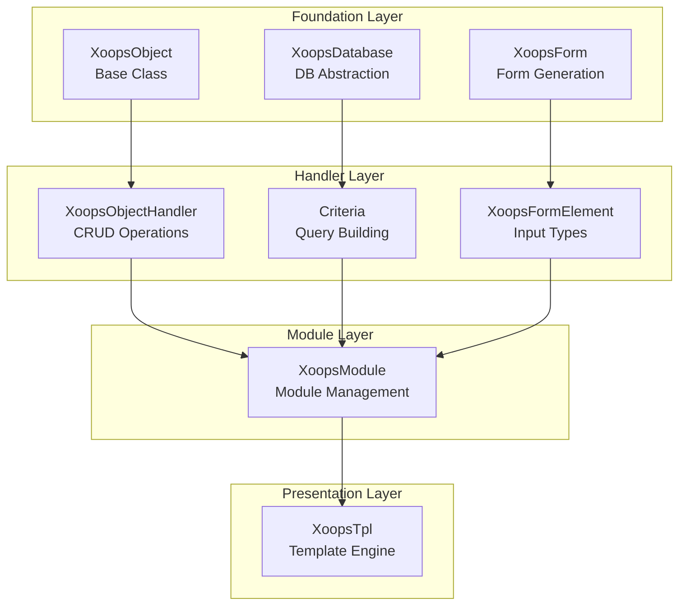
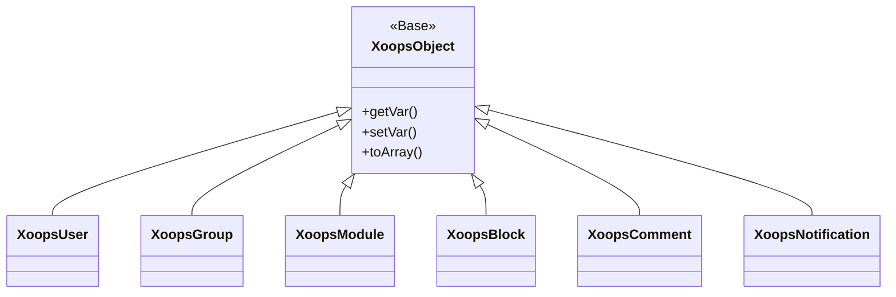
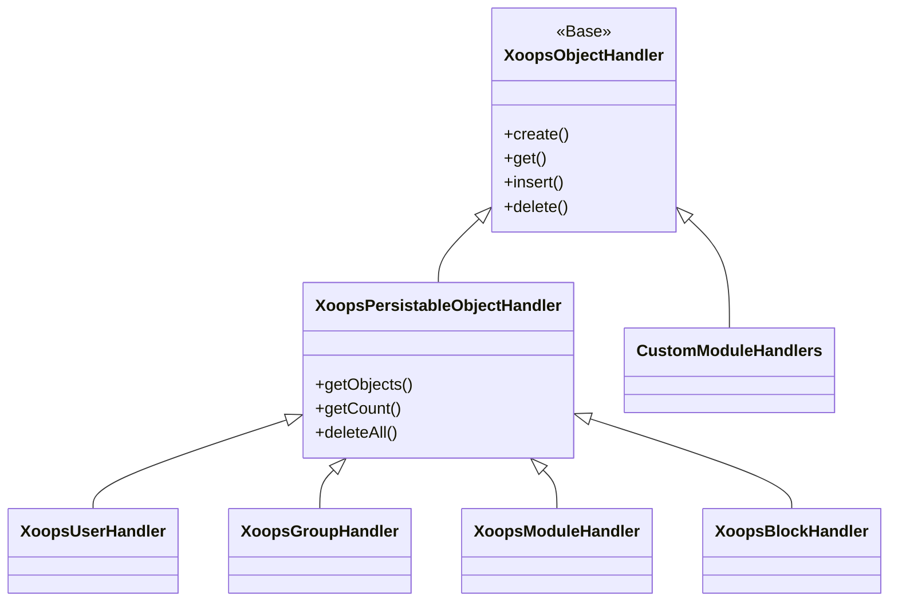
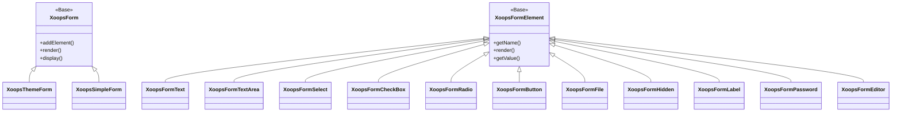

# XOOPS API Reference

Welcome to the comprehensive XOOPS API Reference documentation. This section provides detailed documentation for all core classes, methods, and systems that make up the XOOPS Content Management System.

## Overview

The XOOPS API is organized into several major subsystems, each responsible for a specific aspect of the CMS functionality. Understanding these APIs is essential for developing modules, themes, and extensions for XOOPS.

## API Sections

### Core Classes

The foundation classes that all other XOOPS components build upon.

| Documentation | Description |
|--------------|-------------|
| [[../04-API-Reference/Core/XoopsObject|XoopsObject]] | Base class for all data objects in XOOPS |
| [[../04-API-Reference/Core/XoopsObjectHandler|XoopsObjectHandler]] | Handler pattern for CRUD operations |

### Database Layer

Database abstraction and query building utilities.

| Documentation | Description |
|--------------|-------------|
| [[../04-API-Reference/Database/XoopsDatabase|XoopsDatabase]] | Database abstraction layer |
| [[Database/Criteria|Criteria System]] | Query criteria and conditions |
| [[Database/QueryBuilder|QueryBuilder]] | Modern fluent query building |

### Form System

HTML form generation and validation.

| Documentation | Description |
|--------------|-------------|
| [[../04-API-Reference/Forms/XoopsForm|XoopsForm]] | Form container and rendering |
| [[../02-Core-Concepts/Forms/Form-Elements|Form Elements]] | All available form element types |

### Kernel Classes

Core system components and services.

| Documentation | Description |
|--------------|-------------|
| [[Kernel/Kernel-Classes|Kernel Classes]] | System kernel and core components |

### Module System

Module management and lifecycle.

| Documentation | Description |
|--------------|-------------|
| [[Module/Module-System|Module System]] | Module loading, installation, and management |

### Template System

Smarty template integration.

| Documentation | Description |
|--------------|-------------|
| [[Template/Template-System|Template System]] | Smarty integration and template management |

### User System

User management and authentication.

| Documentation | Description |
|--------------|-------------|
| [[User/User-System|User System]] | User accounts, groups, and permissions |

## Architecture Overview



## Class Hierarchy

### Object Model



### Handler Model



### Form Model



## Design Patterns

The XOOPS API implements several well-known design patterns:

### Singleton Pattern
Used for global services like database connections and container instances.

```php
$db = XoopsDatabase::getInstance();
$container = XoopsContainer::getInstance();
```

### Factory Pattern
Object handlers create domain objects consistently.

```php
$handler = xoops_getHandler('user');
$user = $handler->create();
```

### Composite Pattern
Forms contain multiple form elements; criteria can contain nested criteria.

```php
$criteria = new CriteriaCompo();
$criteria->add(new Criteria('status', 1));
$criteria->add(new CriteriaCompo(...)); // Nested
```

### Observer Pattern
The event system allows loose coupling between modules.

```php
$dispatcher->addListener('module.news.article_published', $callback);
```

## Quick Start Examples

### Creating and Saving an Object

```php
// Get the handler
$handler = xoops_getHandler('user');

// Create a new object
$user = $handler->create();
$user->setVar('uname', 'newuser');
$user->setVar('email', 'user@example.com');

// Save to database
$handler->insert($user);
```

### Querying with Criteria

```php
// Build criteria
$criteria = new CriteriaCompo();
$criteria->add(new Criteria('level', 0, '>'));
$criteria->setSort('uname');
$criteria->setOrder('ASC');
$criteria->setLimit(10);

// Get objects
$handler = xoops_getHandler('user');
$users = $handler->getObjects($criteria);
```

### Creating a Form

```php
$form = new XoopsThemeForm('User Profile', 'userform', 'save.php', 'post', true);
$form->addElement(new XoopsFormText('Username', 'uname', 50, 255, $user->getVar('uname')));
$form->addElement(new XoopsFormTextArea('Bio', 'bio', $user->getVar('bio')));
$form->addElement(new XoopsFormButton('', 'submit', _SUBMIT, 'submit'));
echo $form->render();
```

## API Conventions

### Naming Conventions

| Type | Convention | Example |
|------|-----------|---------|
| Classes | PascalCase | `XoopsUser`, `CriteriaCompo` |
| Methods | camelCase | `getVar()`, `setVar()` |
| Properties | camelCase (protected) | `$_vars`, `$_handler` |
| Constants | UPPER_SNAKE_CASE | `XOBJ_DTYPE_INT` |
| Database Tables | snake_case | `users`, `groups_users_link` |

### Data Types

XOOPS defines standard data types for object variables:

| Constant | Type | Description |
|----------|------|-------------|
| `XOBJ_DTYPE_TXTBOX` | String | Text input (sanitized) |
| `XOBJ_DTYPE_TXTAREA` | String | Textarea content |
| `XOBJ_DTYPE_INT` | Integer | Numeric values |
| `XOBJ_DTYPE_URL` | String | URL validation |
| `XOBJ_DTYPE_EMAIL` | String | Email validation |
| `XOBJ_DTYPE_ARRAY` | Array | Serialized arrays |
| `XOBJ_DTYPE_OTHER` | Mixed | Custom handling |
| `XOBJ_DTYPE_SOURCE` | String | Source code (minimal sanitization) |
| `XOBJ_DTYPE_STIME` | Integer | Short timestamp |
| `XOBJ_DTYPE_MTIME` | Integer | Medium timestamp |
| `XOBJ_DTYPE_LTIME` | Integer | Long timestamp |

## Authentication Methods

The API supports multiple authentication methods:

### API Key Authentication
```
X-API-Key: your-api-key
```

### OAuth Bearer Token
```
Authorization: Bearer your-oauth-token
```

### Session-Based Authentication
Uses existing XOOPS session when logged in.

## REST API Endpoints

When the REST API is enabled:

| Endpoint | Method | Description |
|----------|--------|-------------|
| `/api.php/rest/users` | GET | List users |
| `/api.php/rest/users/{id}` | GET | Get user by ID |
| `/api.php/rest/users` | POST | Create user |
| `/api.php/rest/users/{id}` | PUT | Update user |
| `/api.php/rest/users/{id}` | DELETE | Delete user |
| `/api.php/rest/modules` | GET | List modules |

## Related Documentation

- [[../03-Module-Development/Module-Development|Module Development Guide]]
- [[../02-Core-Concepts/Themes/Theme-Development|Theme Development Guide]]
- [[../01-Getting-Started/Configuration/System-Settings|System Configuration]]
- [[../02-Core-Concepts/Security/Security-Best-Practices|Security Best Practices]]

## Version History

| Version | Changes |
|---------|---------|
| 2.5.11 | Current stable release |
| 2.5.10 | Added GraphQL API support |
| 2.5.9 | Enhanced Criteria system |
| 2.5.8 | PSR-4 autoloading support |

---

*This documentation is part of the XOOPS Knowledge Base. For the latest updates, visit the [XOOPS GitHub repository](https://github.com/XOOPS).*
