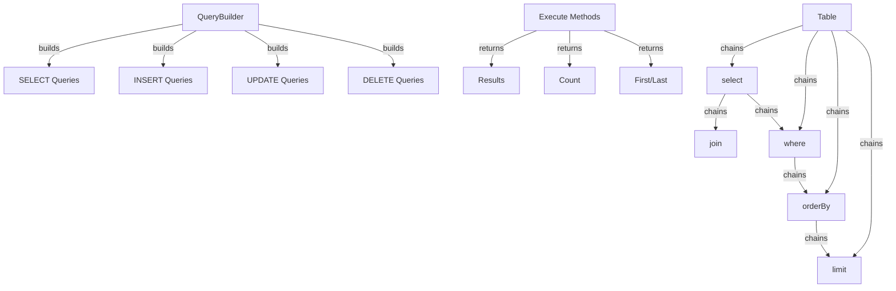

# XOOPS Query Builder

The XOOPS Query Builder provides a modern, fluent interface for building SQL queries. It helps prevent SQL injection, improves readability, and provides database abstraction for multiple database systems.

## Query Builder Architecture



## QueryBuilder Class

The main query builder class with fluent interface.

### Class Overview

```php
namespace Xoops\Database;

class QueryBuilder
{
    protected string $table = '';
    protected string $type = 'SELECT';
    protected array $selects = [];
    protected array $joins = [];
    protected array $wheres = [];
    protected array $orders = [];
    protected int $limit = 0;
    protected int $offset = 0;
    protected array $bindings = [];
}
```

### Static Methods

#### table

Creates a new query builder for a table.

```php
public static function table(string $table): QueryBuilder
```

**Parameters:**

| Parameter | Type | Description |
|-----------|------|-------------|
| `$table` | string | Table name (with or without prefix) |

**Returns:** `QueryBuilder` - Query builder instance

**Example:**
```php
$query = QueryBuilder::table('users');
$query = QueryBuilder::table('xoops_users'); // With prefix
```

## SELECT Queries

### select

Specifies columns to select.

```php
public function select(...$columns): self
```

**Parameters:**

| Parameter | Type | Description |
|-----------|------|-------------|
| `...$columns` | array | Column names or expressions |

**Returns:** `self` - For method chaining

**Example:**
```php
// Simple select
QueryBuilder::table('users')
    ->select('id', 'username', 'email')
    ->get();

// Select with aliases
QueryBuilder::table('users')
    ->select('id as user_id', 'username as name')
    ->get();

// Select all columns
QueryBuilder::table('users')
    ->select('*')
    ->get();

// Select with expressions
QueryBuilder::table('orders')
    ->select('id', 'COUNT(*) as total_items')
    ->groupBy('id')
    ->get();
```

### where

Adds a WHERE condition.

```php
public function where(string $column, string $operator = '=', mixed $value = null): self
```

**Parameters:**

| Parameter | Type | Description |
|-----------|------|-------------|
| `$column` | string | Column name |
| `$operator` | string | Comparison operator |
| `$value` | mixed | Value to compare |

**Returns:** `self` - For method chaining

**Operators:**

| Operator | Description | Example |
|----------|-------------|---------|
| `=` | Equal | `->where('status', '=', 'active')` |
| `!=` or `<>` | Not equal | `->where('status', '!=', 'deleted')` |
| `>` | Greater than | `->where('price', '>', 100)` |
| `<` | Less than | `->where('price', '<', 100)` |
| `>=` | Greater or equal | `->where('age', '>=', 18)` |
| `<=` | Less or equal | `->where('age', '<=', 65)` |
| `LIKE` | Pattern match | `->where('name', 'LIKE', '%john%')` |
| `IN` | In list | `->where('status', 'IN', ['active', 'pending'])` |
| `NOT IN` | Not in list | `->where('id', 'NOT IN', [1, 2, 3])` |
| `BETWEEN` | Range | `->where('age', 'BETWEEN', [18, 65])` |
| `IS NULL` | Is null | `->where('deleted_at', 'IS NULL')` |
| `IS NOT NULL` | Not null | `->where('deleted_at', 'IS NOT NULL')` |

**Example:**
```php
// Single condition
QueryBuilder::table('users')
    ->select('*')
    ->where('status', '=', 'active')
    ->get();

// Multiple conditions (AND)
QueryBuilder::table('users')
    ->select('*')
    ->where('status', '=', 'active')
    ->where('age', '>=', 18)
    ->get();

// IN operator
QueryBuilder::table('products')
    ->select('*')
    ->where('category_id', 'IN', [1, 2, 3])
    ->get();

// LIKE operator
QueryBuilder::table('users')
    ->select('*')
    ->where('email', 'LIKE', '%@example.com')
    ->get();

// NULL check
QueryBuilder::table('users')
    ->select('*')
    ->where('deleted_at', 'IS NULL')
    ->get();
```

### orWhere

Adds an OR condition.

```php
public function orWhere(string $column, string $operator = '=', mixed $value = null): self
```

**Example:**
```php
QueryBuilder::table('users')
    ->select('*')
    ->where('status', '=', 'active')
    ->orWhere('premium', '=', 1)
    ->get();
    // SELECT * FROM users WHERE status = 'active' OR premium = 1
```

### whereIn / whereNotIn

Convenience methods for IN/NOT IN.

```php
public function whereIn(string $column, array $values): self
public function whereNotIn(string $column, array $values): self
```

**Example:**
```php
QueryBuilder::table('posts')
    ->select('*')
    ->whereIn('status', ['published', 'scheduled'])
    ->get();

QueryBuilder::table('comments')
    ->select('*')
    ->whereNotIn('spam_score', [8, 9, 10])
    ->get();
```

### whereNull / whereNotNull

Convenience methods for NULL checks.

```php
public function whereNull(string $column): self
public function whereNotNull(string $column): self
```

**Example:**
```php
QueryBuilder::table('users')
    ->select('*')
    ->whereNotNull('verified_at')
    ->get();
```

### whereBetween

Checks if value is between two values.

```php
public function whereBetween(string $column, array $values): self
```

**Example:**
```php
QueryBuilder::table('products')
    ->select('*')
    ->whereBetween('price', [10, 100])
    ->get();

QueryBuilder::table('orders')
    ->select('*')
    ->whereBetween('created_at', ['2024-01-01', '2024-12-31'])
    ->get();
```

### join

Adds an INNER JOIN.

```php
public function join(
    string $table,
    string $first,
    string $operator = '=',
    string $second = null
): self
```

**Example:**
```php
QueryBuilder::table('posts')
    ->select('posts.*', 'users.username', 'categories.name')
    ->join('users', 'posts.user_id', '=', 'users.id')
    ->join('categories', 'posts.category_id', '=', 'categories.id')
    ->where('posts.published', '=', 1)
    ->get();
```

### leftJoin / rightJoin

Alternative join types.

```php
public function leftJoin(
    string $table,
    string $first,
    string $operator = '=',
    string $second = null
): self

public function rightJoin(
    string $table,
    string $first,
    string $operator = '=',
    string $second = null
): self
```

**Example:**
```php
QueryBuilder::table('users')
    ->select('users.*', 'COUNT(posts.id) as post_count')
    ->leftJoin('posts', 'users.id', '=', 'posts.user_id')
    ->groupBy('users.id')
    ->get();
```

### groupBy

Groups results by column(s).

```php
public function groupBy(...$columns): self
```

**Example:**
```php
QueryBuilder::table('orders')
    ->select('user_id', 'COUNT(*) as order_count', 'SUM(total) as total_spent')
    ->groupBy('user_id')
    ->get();

QueryBuilder::table('sales')
    ->select('department', 'region', 'SUM(amount) as total')
    ->groupBy('department', 'region')
    ->get();
```

### having

Adds a HAVING condition.

```php
public function having(string $column, string $operator = '=', mixed $value = null): self
```

**Example:**
```php
QueryBuilder::table('orders')
    ->select('user_id', 'COUNT(*) as order_count')
    ->groupBy('user_id')
    ->having('order_count', '>', 5)
    ->get();
```

### orderBy

Orders results.

```php
public function orderBy(string $column, string $direction = 'ASC'): self
```

**Parameters:**

| Parameter | Type | Description |
|-----------|------|-------------|
| `$column` | string | Column to order by |
| `$direction` | string | `ASC` or `DESC` |

**Example:**
```php
// Single order
QueryBuilder::table('users')
    ->select('*')
    ->orderBy('created_at', 'DESC')
    ->get();

// Multiple orders
QueryBuilder::table('posts')
    ->select('*')
    ->orderBy('category_id', 'ASC')
    ->orderBy('created_at', 'DESC')
    ->get();

// Random order
QueryBuilder::table('quotes')
    ->select('*')
    ->orderBy('RAND()')
    ->get();
```

### limit / offset

Limits and offsets results.

```php
public function limit(int $limit): self
public function offset(int $offset): self
```

**Example:**
```php
// Simple limit
QueryBuilder::table('posts')
    ->select('*')
    ->limit(10)
    ->get();

// Pagination
$page = 2;
$perPage = 20;
$offset = ($page - 1) * $perPage;

QueryBuilder::table('posts')
    ->select('*')
    ->limit($perPage)
    ->offset($offset)
    ->get();
```

## Execution Methods

### get

Executes query and returns all results.

```php
public function get(): array
```

**Returns:** `array` - Array of result rows

**Example:**
```php
$users = QueryBuilder::table('users')
    ->select('id', 'username', 'email')
    ->where('status', '=', 'active')
    ->orderBy('username')
    ->get();

foreach ($users as $user) {
    echo $user['username'] . ' (' . $user['email'] . ')' . "\n";
}
```

### first

Gets the first result.

```php
public function first(): ?array
```

**Returns:** `?array` - First row or null

**Example:**
```php
$user = QueryBuilder::table('users')
    ->select('*')
    ->where('id', '=', 123)
    ->first();

if ($user) {
    echo 'Found: ' . $user['username'];
}
```

### last

Gets the last result.

```php
public function last(): ?array
```

**Example:**
```php
$latestPost = QueryBuilder::table('posts')
    ->select('*')
    ->orderBy('created_at', 'DESC')
    ->last();
```

### count

Gets the count of results.

```php
public function count(): int
```

**Returns:** `int` - Number of rows

**Example:**
```php
$activeUsers = QueryBuilder::table('users')
    ->where('status', '=', 'active')
    ->count();

echo "Active users: $activeUsers";
```

### exists

Checks if query returns any results.

```php
public function exists(): bool
```

**Returns:** `bool` - True if results exist

**Example:**
```php
if (QueryBuilder::table('users')->where('email', '=', 'test@example.com')->exists()) {
    echo 'User already exists';
}
```

### aggregate

Gets aggregate values.

```php
public function aggregate(string $function, string $column): mixed
```

**Example:**
```php
$maxPrice = QueryBuilder::table('products')
    ->aggregate('MAX', 'price');

$avgAge = QueryBuilder::table('users')
    ->aggregate('AVG', 'age');

$totalSales = QueryBuilder::table('orders')
    ->aggregate('SUM', 'total');
```

## INSERT Queries

### insert

Inserts a row.

```php
public function insert(array $values): bool
```

**Example:**
```php
QueryBuilder::table('users')->insert([
    'username' => 'john',
    'email' => 'john@example.com',
    'password' => password_hash('secret', PASSWORD_BCRYPT),
    'created_at' => date('Y-m-d H:i:s')
]);
```

### insertMany

Inserts multiple rows.

```php
public function insertMany(array $rows): bool
```

**Example:**
```php
QueryBuilder::table('log_entries')->insertMany([
    ['action' => 'login', 'user_id' => 1, 'timestamp' => time()],
    ['action' => 'logout', 'user_id' => 2, 'timestamp' => time()],
    ['action' => 'update', 'user_id' => 3, 'timestamp' => time()]
]);
```

## UPDATE Queries

### update

Updates rows.

```php
public function update(array $values): int
```

**Returns:** `int` - Number of affected rows

**Example:**
```php
// Update single user
QueryBuilder::table('users')
    ->where('id', '=', 123)
    ->update([
        'email' => 'newemail@example.com',
        'updated_at' => date('Y-m-d H:i:s')
    ]);

// Update multiple rows
QueryBuilder::table('posts')
    ->where('status', '=', 'draft')
    ->where('created_at', '<', date('Y-m-d', strtotime('-30 days')))
    ->update([
        'status' => 'archived'
    ]);
```

### increment / decrement

Increments or decrements a column.

```php
public function increment(string $column, int $amount = 1): int
public function decrement(string $column, int $amount = 1): int
```

**Example:**
```php
// Increment view count
QueryBuilder::table('posts')
    ->where('id', '=', 123)
    ->increment('views');

// Decrement stock
QueryBuilder::table('products')
    ->where('id', '=', 456)
    ->decrement('stock', 5);
```

## DELETE Queries

### delete

Deletes rows.

```php
public function delete(): int
```

**Returns:** `int` - Number of deleted rows

**Example:**
```php
// Delete single record
QueryBuilder::table('comments')
    ->where('id', '=', 789)
    ->delete();

// Delete multiple records
QueryBuilder::table('log_entries')
    ->where('created_at', '<', date('Y-m-d', strtotime('-30 days')))
    ->delete();
```

### truncate

Deletes all rows from table.

```php
public function truncate(): bool
```

**Example:**
```php
// Clear all sessions
QueryBuilder::table('sessions')->truncate();
```

## Advanced Features

### Raw Expressions

```php
QueryBuilder::table('products')
    ->select('id', 'name', QueryBuilder::raw('price * quantity as total'))
    ->get();
```

### Subqueries

```php
$recentPostIds = QueryBuilder::table('posts')
    ->select('id')
    ->where('created_at', '>', date('Y-m-d', strtotime('-7 days')))
    ->toSql();

$comments = QueryBuilder::table('comments')
    ->select('*')
    ->whereIn('post_id', $recentPostIds)
    ->get();
```

### Getting the SQL

```php
public function toSql(): string
```

**Example:**
```php
$sql = QueryBuilder::table('users')
    ->select('id', 'username')
    ->where('status', '=', 'active')
    ->toSql();

echo $sql;
// SELECT id, username FROM xoops_users WHERE status = ?
```

## Complete Examples

### Complex Select with Joins

```php
<?php
/**
 * Get posts with author and category info
 */

$posts = QueryBuilder::table('posts')
    ->select(
        'posts.id',
        'posts.title',
        'posts.content',
        'posts.created_at',
        'users.username as author',
        'categories.name as category'
    )
    ->join('users', 'posts.user_id', '=', 'users.id')
    ->join('categories', 'posts.category_id', '=', 'categories.id')
    ->where('posts.published', '=', 1)
    ->orderBy('posts.created_at', 'DESC')
    ->limit(10)
    ->get();

foreach ($posts as $post) {
    echo '<article>';
    echo '<h2>' . htmlspecialchars($post['title']) . '</h2>';
    echo '<p class="meta">By ' . htmlspecialchars($post['author']) . ' in ' . htmlspecialchars($post['category']) . '</p>';
    echo '<p>' . htmlspecialchars($post['content']) . '</p>';
    echo '</article>';
}
```

### Pagination with QueryBuilder

```php
<?php
/**
 * Paginated results
 */

$page = isset($_GET['page']) ? (int)$_GET['page'] : 1;
$perPage = 20;
$offset = ($page - 1) * $perPage;

// Get total count
$total = QueryBuilder::table('articles')
    ->where('status', '=', 'published')
    ->count();

// Get page results
$articles = QueryBuilder::table('articles')
    ->select('*')
    ->where('status', '=', 'published')
    ->orderBy('created_at', 'DESC')
    ->limit($perPage)
    ->offset($offset)
    ->get();

// Calculate pagination
$pages = ceil($total / $perPage);

// Display results
foreach ($articles as $article) {
    echo '<div class="article">' . htmlspecialchars($article['title']) . '</div>';
}

// Display pagination links
if ($pages > 1) {
    echo '<nav class="pagination">';
    for ($i = 1; $i <= $pages; $i++) {
        if ($i == $page) {
            echo '<span class="current">' . $i . '</span>';
        } else {
            echo '<a href="?page=' . $i . '">' . $i . '</a>';
        }
    }
    echo '</nav>';
}
```

### Data Analysis with Aggregates

```php
<?php
/**
 * Sales analysis
 */

// Total sales by region
$regionSales = QueryBuilder::table('orders')
    ->select('region', QueryBuilder::raw('SUM(total) as total_sales'), QueryBuilder::raw('COUNT(*) as order_count'))
    ->groupBy('region')
    ->orderBy('total_sales', 'DESC')
    ->get();

foreach ($regionSales as $region) {
    echo $region['region'] . ': $' . number_format($region['total_sales'], 2) . ' (' . $region['order_count'] . ' orders)' . "\n";
}

// Average order value
$avgOrderValue = QueryBuilder::table('orders')
    ->aggregate('AVG', 'total');

echo 'Average order value: $' . number_format($avgOrderValue, 2);
```

## Best Practices

1. **Use Parameterized Queries** - QueryBuilder handles parameter binding automatically
2. **Chain Methods** - Leverage fluent interface for readable code
3. **Test SQL Output** - Use `toSql()` to verify generated queries
4. **Use Indexes** - Ensure frequently queried columns are indexed
5. **Limit Results** - Always use `limit()` for large datasets
6. **Use Aggregates** - Let database do counting/summing instead of PHP
7. **Escape Output** - Always escape displayed data with `htmlspecialchars()`
8. **Index Performance** - Monitor slow queries and optimize accordingly

## Related Documentation

- [[XoopsDatabase]] - Database layer and connections
- [[Criteria]] - Legacy Criteria-based query system
- [[../Core/XoopsObject]] - Data object persistence
- [[../Module/Module-System]] - Module database operations

---

*See also: [XOOPS Database API](https://github.com/XOOPS/XoopsCore25/tree/master/htdocs/class)*
