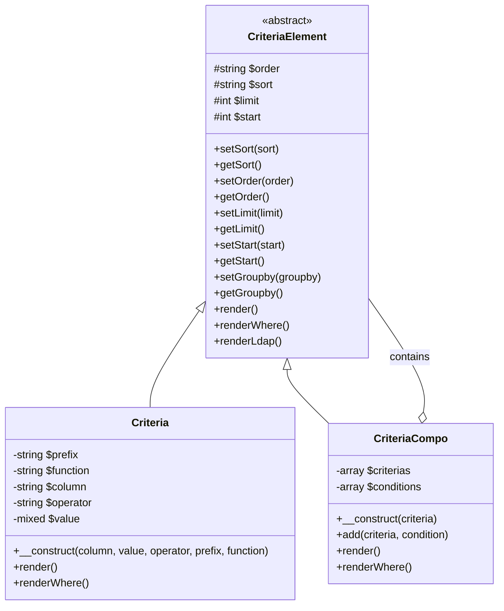
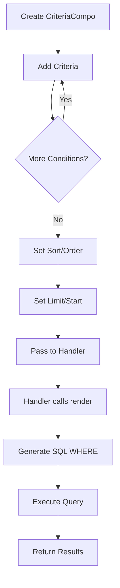
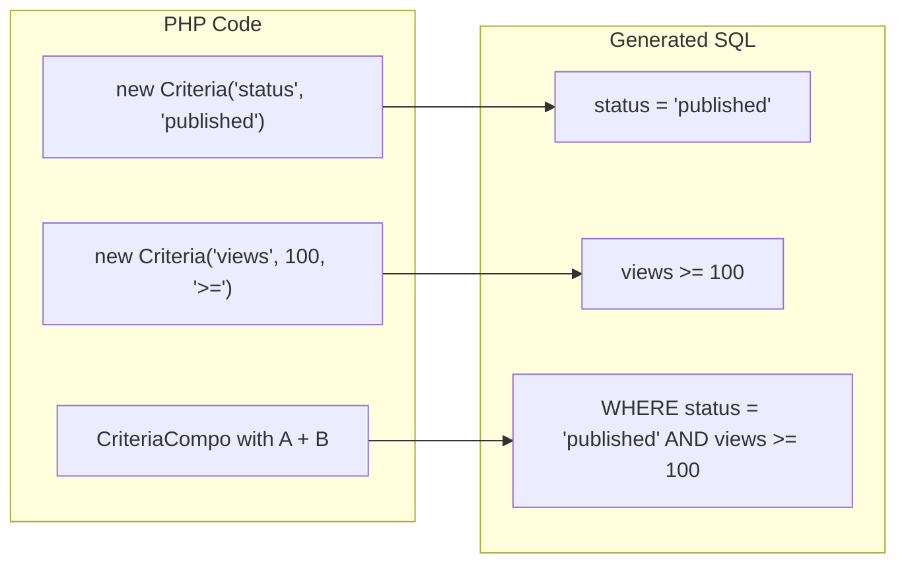
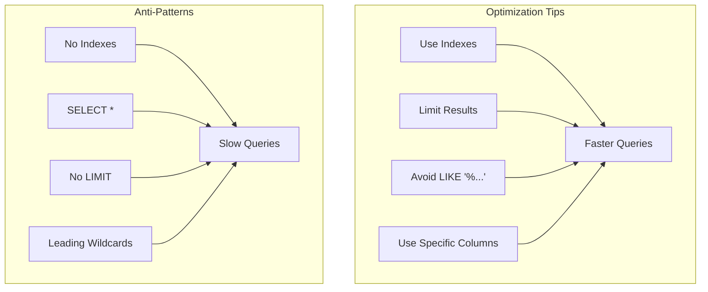

# Criteria API Reference

> Complete API documentation for the XOOPS Criteria query building system.

---

## Criteria System Architecture



---

## Criteria Class

### Constructor

```php
public function __construct(
    string $column,           // Column name
    mixed $value = '',        // Value to compare
    string $operator = '=',   // Comparison operator
    string $prefix = '',      // Table prefix
    string $function = ''     // SQL function wrapper
)
```

### Operators

| Operator | Example | SQL Output |
|----------|---------|------------|
| `=` | `new Criteria('status', 1)` | `status = 1` |
| `!=` | `new Criteria('status', 0, '!=')` | `status != 0` |
| `<>` | `new Criteria('status', 0, '<>')` | `status <> 0` |
| `<` | `new Criteria('age', 18, '<')` | `age < 18` |
| `<=` | `new Criteria('age', 18, '<=')` | `age <= 18` |
| `>` | `new Criteria('age', 18, '>')` | `age > 18` |
| `>=` | `new Criteria('age', 18, '>=')` | `age >= 18` |
| `LIKE` | `new Criteria('title', '%php%', 'LIKE')` | `title LIKE '%php%'` |
| `NOT LIKE` | `new Criteria('title', '%spam%', 'NOT LIKE')` | `title NOT LIKE '%spam%'` |
| `IN` | `new Criteria('id', '(1,2,3)', 'IN')` | `id IN (1,2,3)` |
| `NOT IN` | `new Criteria('id', '(1,2,3)', 'NOT IN')` | `id NOT IN (1,2,3)` |
| `IS NULL` | `new Criteria('deleted', null, 'IS NULL')` | `deleted IS NULL` |
| `IS NOT NULL` | `new Criteria('email', null, 'IS NOT NULL')` | `email IS NOT NULL` |
| `BETWEEN` | `new Criteria('created', '1000 AND 2000', 'BETWEEN')` | `created BETWEEN 1000 AND 2000` |

### Usage Examples

```php
// Simple equality
$criteria = new Criteria('status', 'published');

// Numeric comparison
$criteria = new Criteria('views', 100, '>=');

// Pattern matching
$criteria = new Criteria('title', '%XOOPS%', 'LIKE');

// With table prefix
$criteria = new Criteria('uid', 1, '=', 'u');
// Renders: u.uid = 1

// With SQL function
$criteria = new Criteria('title', '', '!=', '', 'LOWER');
// Renders: LOWER(title) != ''
```

---

## CriteriaCompo Class

### Constructor & Methods

```php
// Create empty compo
$criteria = new CriteriaCompo();

// Or with initial criteria
$criteria = new CriteriaCompo(new Criteria('status', 'active'));

// Add criteria (AND by default)
$criteria->add(new Criteria('views', 10, '>='));

// Add with OR
$criteria->add(new Criteria('featured', 1), 'OR');

// Nesting
$subCriteria = new CriteriaCompo();
$subCriteria->add(new Criteria('author', 1));
$subCriteria->add(new Criteria('author', 2), 'OR');
$criteria->add($subCriteria); // (author = 1 OR author = 2)
```

### Sorting and Pagination

```php
$criteria = new CriteriaCompo();
$criteria->add(new Criteria('status', 'published'));

// Single sort
$criteria->setSort('created');
$criteria->setOrder('DESC');

// Multiple sort columns
$criteria->setSort('category_id, created');
$criteria->setOrder('ASC, DESC');

// Pagination
$criteria->setLimit(10);    // Items per page
$criteria->setStart(0);     // Offset (page * limit)

// Group by
$criteria->setGroupby('category_id');
```

---

## Query Building Flow



---

## Complex Query Examples

### Search with Multiple Conditions

```php
$criteria = new CriteriaCompo();

// Status must be published
$criteria->add(new Criteria('status', 'published'));

// Category is 1, 2, or 3
$criteria->add(new Criteria('category_id', '(1, 2, 3)', 'IN'));

// Created in last 30 days
$thirtyDaysAgo = time() - (30 * 24 * 60 * 60);
$criteria->add(new Criteria('created', $thirtyDaysAgo, '>='));

// Search term in title OR content
$searchCriteria = new CriteriaCompo();
$searchCriteria->add(new Criteria('title', '%' . $searchTerm . '%', 'LIKE'));
$searchCriteria->add(new Criteria('content', '%' . $searchTerm . '%', 'LIKE'), 'OR');
$criteria->add($searchCriteria);

// Sort by views descending
$criteria->setSort('views');
$criteria->setOrder('DESC');

// Paginate
$criteria->setLimit($perPage);
$criteria->setStart($page * $perPage);

// Execute
$items = $itemHandler->getObjects($criteria);
$total = $itemHandler->getCount($criteria);
```

### Date Range Query

```php
$criteria = new CriteriaCompo();

// Between two dates
$startDate = strtotime('2024-01-01');
$endDate = strtotime('2024-12-31');

$criteria->add(new Criteria('created', $startDate, '>='));
$criteria->add(new Criteria('created', $endDate, '<='));

// Or using BETWEEN
$criteria->add(new Criteria('created', "$startDate AND $endDate", 'BETWEEN'));
```

### User Permission Filter

```php
$criteria = new CriteriaCompo();
$criteria->add(new Criteria('status', 'published'));

// If not admin, only show own items or public
if (!$xoopsUser || !$xoopsUser->isAdmin()) {
    $permCriteria = new CriteriaCompo();
    $permCriteria->add(new Criteria('visibility', 'public'));

    if (is_object($xoopsUser)) {
        $permCriteria->add(new Criteria('author_id', $xoopsUser->getVar('uid')), 'OR');
    }

    $criteria->add($permCriteria);
}
```

### Join-like Query

```php
// Get items where category is active
// (Using subquery approach)
$categoryHandler = xoops_getHandler('category');
$activeCatCriteria = new Criteria('status', 'active');
$activeCategories = $categoryHandler->getIds($activeCatCriteria);

if (!empty($activeCategories)) {
    $criteria->add(new Criteria('category_id', '(' . implode(',', $activeCategories) . ')', 'IN'));
}
```

---

## Criteria to SQL Visualization



---

## Handler Integration

```php
// Standard handler methods that accept Criteria

// Get multiple objects
$objects = $handler->getObjects($criteria);
$objects = $handler->getObjects($criteria, true);  // As array
$objects = $handler->getObjects($criteria, true, true); // As array, id as key

// Get count
$count = $handler->getCount($criteria);

// Get list (id => identifier)
$list = $handler->getList($criteria);

// Delete matching
$deleted = $handler->deleteAll($criteria);

// Update matching
$handler->updateAll('status', 'archived', $criteria);
```

---

## Performance Considerations



### Best Practices

1. **Always set LIMIT** for large tables
2. **Use indexes** on columns used in criteria
3. **Avoid leading wildcards** in LIKE (`'%term'` is slow)
4. **Pre-filter in PHP** when possible for complex logic
5. **Use COUNT sparingly** - cache results when possible

---

## Related Documentation

- [[../../02-Core-Concepts/Database/Database-Layer|Database Layer]]
- [[../Core/XoopsObjectHandler|XoopsObjectHandler API]]
- [[../../02-Core-Concepts/Security/SQL-Injection-Prevention|SQL Injection Prevention]]

---

#xoops #api #criteria #database #query #reference
