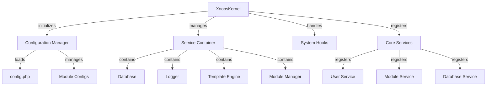

# XOOPS Kernel Classes

The XOOPS Kernel provides the foundational framework for bootstrapping the system, managing configurations, handling system events, and providing core utilities. These classes form the backbone of the XOOPS application.

## System Architecture



## XoopsKernel Class

The main kernel class that initializes and manages the XOOPS system.

### Class Overview

```php
namespace Xoops;

class XoopsKernel
{
    private static ?XoopsKernel $instance = null;
    protected ServiceContainer $services;
    protected ConfigurationManager $config;
    protected array $modules = [];
    protected bool $isLoaded = false;
}
```

### Constructor

```php
private function __construct()
```

Private constructor enforces singleton pattern.

### getInstance

Retrieves the singleton kernel instance.

```php
public static function getInstance(): XoopsKernel
```

**Returns:** `XoopsKernel` - The singleton kernel instance

**Example:**
```php
$kernel = XoopsKernel::getInstance();
```

### Boot Process

The kernel boot process follows these steps:

1. **Initialization** - Set error handlers, define constants
2. **Configuration** - Load configuration files
3. **Service Registration** - Register core services
4. **Module Detection** - Scan and identify active modules
5. **Database Initialization** - Connect to database
6. **Cleanup** - Prepare for request handling

```php
public function boot(): void
```

**Example:**
```php
$kernel = XoopsKernel::getInstance();
$kernel->boot();
```

### Service Container Methods

#### registerService

Registers a service in the service container.

```php
public function registerService(
    string $name,
    callable|object $definition
): void
```

**Parameters:**

| Parameter | Type | Description |
|-----------|------|-------------|
| `$name` | string | Service identifier |
| `$definition` | callable\|object | Service factory or instance |

**Example:**
```php
$kernel->registerService('custom.handler', function($c) {
    return new CustomHandler();
});
```

#### getService

Retrieves a registered service.

```php
public function getService(string $name): mixed
```

**Parameters:**

| Parameter | Type | Description |
|-----------|------|-------------|
| `$name` | string | Service identifier |

**Returns:** `mixed` - The requested service

**Example:**
```php
$database = $kernel->getService('database');
$logger = $kernel->getService('logger');
```

#### hasService

Checks if a service is registered.

```php
public function hasService(string $name): bool
```

**Example:**
```php
if ($kernel->hasService('cache')) {
    $cache = $kernel->getService('cache');
}
```

## Configuration Manager

Manages application configuration and module settings.

### Class Overview

```php
namespace Xoops\Core;

class ConfigurationManager
{
    protected array $config = [];
    protected array $defaults = [];
    protected string $configPath;
}
```

### Methods

#### load

Loads configuration from file or array.

```php
public function load(string|array $source): void
```

**Parameters:**

| Parameter | Type | Description |
|-----------|------|-------------|
| `$source` | string\|array | Config file path or array |

**Example:**
```php
$config = $kernel->getService('config');
$config->load(XOOPS_ROOT_PATH . '/include/config.php');
$config->load(['sitename' => 'My Site', 'admin_email' => 'admin@example.com']);
```

#### get

Retrieves a configuration value.

```php
public function get(string $key, mixed $default = null): mixed
```

**Parameters:**

| Parameter | Type | Description |
|-----------|------|-------------|
| `$key` | string | Configuration key (dot notation) |
| `$default` | mixed | Default value if not found |

**Returns:** `mixed` - Configuration value

**Example:**
```php
$siteName = $config->get('sitename');
$adminEmail = $config->get('admin.email', 'admin@example.com');
```

#### set

Sets a configuration value.

```php
public function set(string $key, mixed $value): void
```

**Parameters:**

| Parameter | Type | Description |
|-----------|------|-------------|
| `$key` | string | Configuration key |
| `$value` | mixed | Configuration value |

**Example:**
```php
$config->set('sitename', 'New Site Name');
$config->set('features.cache_enabled', true);
```

#### getModuleConfig

Gets configuration for a specific module.

```php
public function getModuleConfig(
    string $moduleName
): array
```

**Parameters:**

| Parameter | Type | Description |
|-----------|------|-------------|
| `$moduleName` | string | Module directory name |

**Returns:** `array` - Module configuration array

**Example:**
```php
$publisherConfig = $config->getModuleConfig('publisher');
```

## System Hooks

System hooks allow modules and plugins to execute code at specific points in the application lifecycle.

### HookManager Class

```php
namespace Xoops\Core;

class HookManager
{
    protected array $hooks = [];
    protected array $listeners = [];
}
```

### Methods

#### addHook

Registers a hook point.

```php
public function addHook(string $name): void
```

**Parameters:**

| Parameter | Type | Description |
|-----------|------|-------------|
| `$name` | string | Hook identifier |

**Example:**
```php
$hooks = $kernel->getService('hooks');
$hooks->addHook('system.startup');
$hooks->addHook('user.login');
$hooks->addHook('module.install');
```

#### listen

Attaches a listener to a hook.

```php
public function listen(
    string $hookName,
    callable $callback,
    int $priority = 10
): void
```

**Parameters:**

| Parameter | Type | Description |
|-----------|------|-------------|
| `$hookName` | string | Hook identifier |
| `$callback` | callable | Function to execute |
| `$priority` | int | Execution priority (higher runs first) |

**Example:**
```php
$hooks->listen('user.login', function($user) {
    error_log('User ' . $user->uname . ' logged in');
}, 10);

$hooks->listen('module.install', function($module) {
    // Custom module installation logic
    echo "Installing " . $module->getName();
}, 5);
```

#### trigger

Executes all listeners for a hook.

```php
public function trigger(
    string $hookName,
    mixed $arguments = null
): array
```

**Parameters:**

| Parameter | Type | Description |
|-----------|------|-------------|
| `$hookName` | string | Hook identifier |
| `$arguments` | mixed | Data to pass to listeners |

**Returns:** `array` - Results from all listeners

**Example:**
```php
$results = $hooks->trigger('system.startup');
$results = $hooks->trigger('user.created', $newUser);
```

## Core Services Overview

The kernel registers several core services during boot:

| Service | Class | Purpose |
|---------|-------|---------|
| `database` | XoopsDatabase | Database abstraction layer |
| `config` | ConfigurationManager | Configuration management |
| `logger` | Logger | Application logging |
| `template` | XoopsTpl | Template engine |
| `user` | UserManager | User management service |
| `module` | ModuleManager | Module management |
| `cache` | CacheManager | Caching layer |
| `hooks` | HookManager | System event hooks |

## Complete Usage Example

```php
<?php
/**
 * Custom module boot process utilizing kernel
 */

// Get kernel instance
$kernel = XoopsKernel::getInstance();

// Boot the system
$kernel->boot();

// Get services
$config = $kernel->getService('config');
$database = $kernel->getService('database');
$logger = $kernel->getService('logger');
$hooks = $kernel->getService('hooks');

// Access configuration
$siteName = $config->get('sitename');
$adminEmail = $config->get('admin.email');

// Register module-specific hooks
$hooks->listen('user.login', function($user) {
    // Log user login
    $logger->info('User login: ' . $user->uname);

    // Track in database
    $database->query(
        'INSERT INTO ' . $database->prefix('event_log') .
        ' (type, user_id, message, timestamp) VALUES (?, ?, ?, ?)',
        ['login', $user->uid(), 'User login', time()]
    );
});

$hooks->listen('module.install', function($module) {
    $logger->info('Module installed: ' . $module->getName());
});

// Trigger hooks
$hooks->trigger('system.startup');

// Use database service
$result = $database->query(
    'SELECT * FROM ' . $database->prefix('users') .
    ' LIMIT 10'
);

while ($row = $database->fetchArray($result)) {
    echo "User: " . htmlspecialchars($row['uname']) . "\n";
}

// Register custom service
$kernel->registerService('custom.repository', function($c) {
    return new CustomRepository($c->getService('database'));
});

// Later access custom service
$repo = $kernel->getService('custom.repository');
```

## Core Constants

The kernel defines several important constants during boot:

```php
// System paths
define('XOOPS_ROOT_PATH', '/var/www/xoops');
define('XOOPS_HTDOCS_PATH', XOOPS_ROOT_PATH . '/htdocs');
define('XOOPS_MODULES_PATH', XOOPS_ROOT_PATH . '/htdocs/modules');
define('XOOPS_THEMES_PATH', XOOPS_ROOT_PATH . '/htdocs/themes');

// Web paths
define('XOOPS_URL', 'http://example.com');
define('XOOPS_HTDOCS_URL', XOOPS_URL . '/htdocs');

// Database
define('XOOPS_DB_PREFIX', 'xoops_');
```

## Error Handling

The kernel sets up error handlers during boot:

```php
// Set custom error handler
set_error_handler(function($errno, $errstr, $errfile, $errline) {
    $kernel->getService('logger')->error(
        "Error: $errstr in $errfile:$errline"
    );
});

// Set exception handler
set_exception_handler(function($exception) {
    $kernel->getService('logger')->critical(
        "Exception: " . $exception->getMessage()
    );
});
```

## Best Practices

1. **Single Boot** - Call `boot()` only once during application startup
2. **Use Service Container** - Register and retrieve services through the kernel
3. **Handle Hooks Early** - Register hook listeners before triggering them
4. **Log Important Events** - Use the logger service for debugging
5. **Cache Configuration** - Load config once and reuse
6. **Error Handling** - Always set up error handlers before processing requests

## Related Documentation

- [[../Module/Module-System]] - Module system and lifecycle
- [[../Template/Template-System]] - Template engine integration
- [[../User/User-System]] - User authentication and management
- [[../Database/XoopsDatabase]] - Database layer

---

*See also: [XOOPS Kernel Source](https://github.com/XOOPS/XoopsCore25/tree/master/htdocs/class)*
