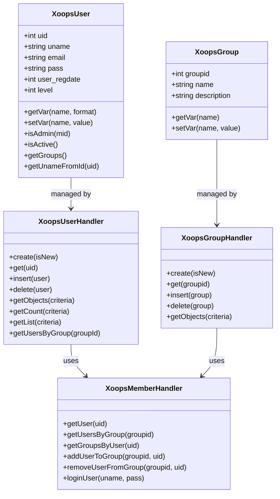
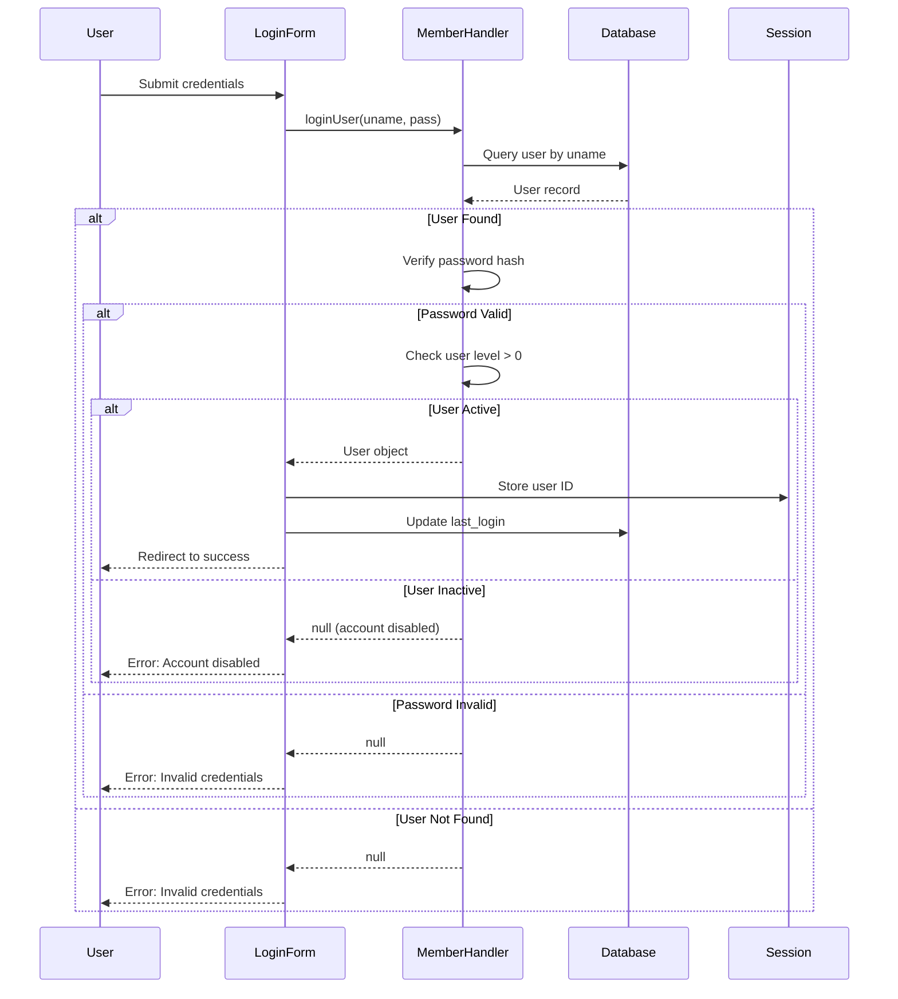
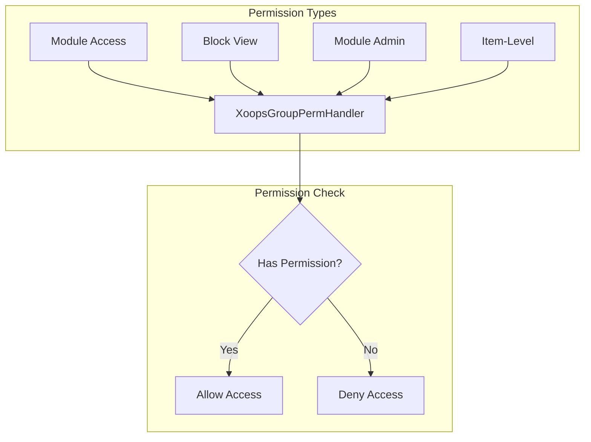
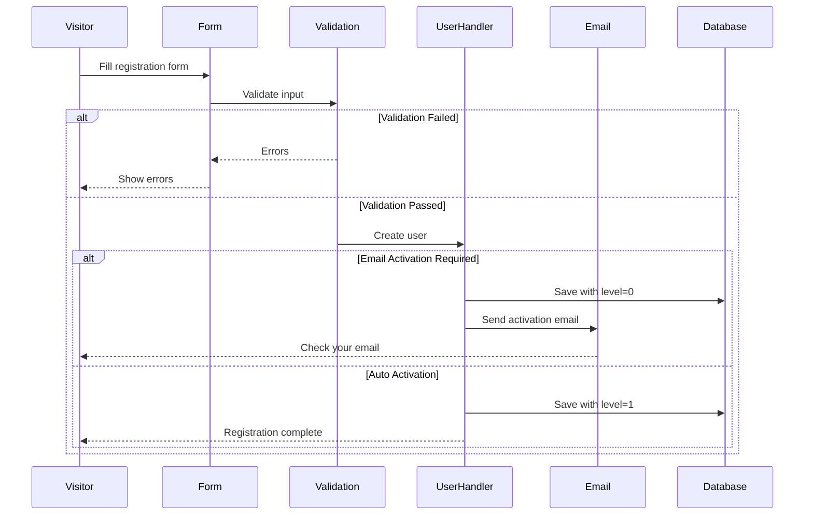

# XoopsUser API Reference

> Complete API documentation for the XOOPS user system.

---

## User System Architecture



---

## XoopsUser Class

### Properties

| Property | Type | Description |
|----------|------|-------------|
| `uid` | int | User ID (primary key) |
| `uname` | string | Username |
| `name` | string | Real name |
| `email` | string | Email address |
| `pass` | string | Password hash |
| `url` | string | Website URL |
| `user_avatar` | string | Avatar filename |
| `user_regdate` | int | Registration timestamp |
| `user_from` | string | Location |
| `user_sig` | string | Signature |
| `user_occ` | string | Occupation |
| `user_intrest` | string | Interests |
| `bio` | string | Biography |
| `posts` | int | Post count |
| `rank` | int | User rank |
| `level` | int | User level (0=inactive, 1=active) |
| `theme` | string | Preferred theme |
| `timezone` | float | Timezone offset |
| `last_login` | int | Last login timestamp |

### Core Methods

```php
// Get current user
global $xoopsUser;

// Check if logged in
if (is_object($xoopsUser)) {
    // User is logged in
    $uid = $xoopsUser->getVar('uid');
    $username = $xoopsUser->getVar('uname');
}

// Get formatted values
$uname = $xoopsUser->getVar('uname');           // Raw value
$unameDisplay = $xoopsUser->getVar('uname', 's'); // Sanitized for display
$unameEdit = $xoopsUser->getVar('uname', 'e');    // For form editing

// Check if admin
$isAdmin = $xoopsUser->isAdmin();              // Site admin
$isModuleAdmin = $xoopsUser->isAdmin($mid);    // Module admin

// Get user groups
$groups = $xoopsUser->getGroups();             // Array of group IDs

// Check if active
$isActive = $xoopsUser->isActive();
```

---

## XoopsUserHandler

### User CRUD Operations

```php
// Get handler
$userHandler = xoops_getHandler('user');

// Create new user
$user = $userHandler->create();
$user->setVar('uname', 'newuser');
$user->setVar('email', 'user@example.com');
$user->setVar('pass', password_hash('password123', PASSWORD_DEFAULT));
$user->setVar('user_regdate', time());
$user->setVar('level', 1);

if ($userHandler->insert($user)) {
    $newUid = $user->getVar('uid');
}

// Get user by ID
$user = $userHandler->get(123);

// Update user
$user->setVar('email', 'newemail@example.com');
$userHandler->insert($user);

// Delete user
$userHandler->delete($user);
```

### Query Users

```php
// Get all active users
$criteria = new Criteria('level', 1);
$users = $userHandler->getObjects($criteria);

// Get users by criteria
$criteria = new CriteriaCompo();
$criteria->add(new Criteria('level', 1));
$criteria->add(new Criteria('posts', 10, '>='));
$criteria->setSort('posts');
$criteria->setOrder('DESC');
$criteria->setLimit(10);
$activePosters = $userHandler->getObjects($criteria);

// Get user count
$count = $userHandler->getCount($criteria);

// Get user list (uid => uname)
$userList = $userHandler->getList($criteria);

// Search users
$criteria = new CriteriaCompo();
$criteria->add(new Criteria('uname', '%john%', 'LIKE'));
$criteria->add(new Criteria('email', '%john%', 'LIKE'), 'OR');
$searchResults = $userHandler->getObjects($criteria);
```

---

## XoopsMemberHandler

### Group Management

```php
$memberHandler = xoops_getHandler('member');

// Get user with groups
$user = $memberHandler->getUser($uid);
$groups = $memberHandler->getGroupsByUser($uid);

// Get users in group
$users = $memberHandler->getUsersByGroup($groupId);
$users = $memberHandler->getUsersByGroup($groupId, true); // Objects
$users = $memberHandler->getUsersByGroup($groupId, false); // UIDs only

// Add user to group
$memberHandler->addUserToGroup($groupId, $uid);

// Remove user from group
$memberHandler->removeUserFromGroup($groupId, $uid);
```

### Authentication

```php
// Login user
$user = $memberHandler->loginUser($username, $password);

if ($user) {
    // Login successful
    $_SESSION['xoopsUserId'] = $user->getVar('uid');
    $user->setVar('last_login', time());
    $userHandler->insert($user);
} else {
    // Login failed
}

// Logout
$_SESSION = [];
session_destroy();
redirect_header(XOOPS_URL, 3, 'Logged out');
```

---

## Authentication Flow



---

## Group System

### Default Groups

| Group ID | Name | Description |
|----------|------|-------------|
| 1 | Webmasters | Full administrative access |
| 2 | Registered Users | Standard registered users |
| 3 | Anonymous | Non-logged in visitors |

### Group Permissions



### Check Permissions

```php
$gpermHandler = xoops_getHandler('groupperm');

// Check module access
$groups = is_object($xoopsUser) ? $xoopsUser->getGroups() : [XOOPS_GROUP_ANONYMOUS];
$hasAccess = $gpermHandler->checkRight('module_read', $moduleId, $groups);

// Check module admin
$isAdmin = $gpermHandler->checkRight('module_admin', $moduleId, $groups);

// Check custom permission
$hasPermission = $gpermHandler->checkRight(
    'item_view',      // Permission name
    $itemId,          // Item ID
    $groups,          // Group IDs
    $moduleId         // Module ID
);

// Get items user can access
$itemIds = $gpermHandler->getItemIds('item_view', $groups, $moduleId);
```

---

## User Registration Flow



---

## Complete Example

```php
<?php
require_once __DIR__ . '/mainfile.php';

use Xmf\Request;

$memberHandler = xoops_getHandler('member');
$userHandler = xoops_getHandler('user');

// Registration handler
if (Request::hasVar('register', 'POST')) {
    // Verify CSRF
    if (!$GLOBALS['xoopsSecurity']->check()) {
        redirect_header('register.php', 3, 'Security error');
    }

    $uname = Request::getString('uname', '', 'POST');
    $email = Request::getEmail('email', '', 'POST');
    $pass = Request::getString('pass', '', 'POST');
    $passConfirm = Request::getString('pass_confirm', '', 'POST');

    $errors = [];

    // Validate username
    if (strlen($uname) < 3 || strlen($uname) > 25) {
        $errors[] = 'Username must be 3-25 characters';
    }

    // Check if username exists
    $criteria = new Criteria('uname', $uname);
    if ($userHandler->getCount($criteria) > 0) {
        $errors[] = 'Username already taken';
    }

    // Validate email
    if (!filter_var($email, FILTER_VALIDATE_EMAIL)) {
        $errors[] = 'Invalid email address';
    }

    // Check if email exists
    $criteria = new Criteria('email', $email);
    if ($userHandler->getCount($criteria) > 0) {
        $errors[] = 'Email already registered';
    }

    // Validate password
    if (strlen($pass) < 8) {
        $errors[] = 'Password must be at least 8 characters';
    }

    if ($pass !== $passConfirm) {
        $errors[] = 'Passwords do not match';
    }

    if (empty($errors)) {
        // Create user
        $user = $userHandler->create();
        $user->setVar('uname', $uname);
        $user->setVar('email', $email);
        $user->setVar('pass', password_hash($pass, PASSWORD_DEFAULT));
        $user->setVar('user_regdate', time());
        $user->setVar('level', 1); // Auto-activate

        if ($userHandler->insert($user)) {
            // Add to Registered Users group
            $memberHandler->addUserToGroup(XOOPS_GROUP_USERS, $user->getVar('uid'));

            redirect_header('index.php', 3, 'Registration successful!');
        } else {
            $errors[] = 'Error creating account';
        }
    }
}

// Display registration form
require_once XOOPS_ROOT_PATH . '/header.php';

if (!empty($errors)) {
    foreach ($errors as $error) {
        echo "<div class='errorMsg'>$error</div>";
    }
}

// Registration form here...

require_once XOOPS_ROOT_PATH . '/footer.php';
```

---

## Related Documentation

- [[../../02-Core-Concepts/Users-Permissions/User-Management|User Management Guide]]
- [[../../02-Core-Concepts/Users-Permissions/Permission-System|Permission System]]
- [[../../02-Core-Concepts/Users-Permissions/Authentication|Authentication]]

---

#xoops #api #user #authentication #reference
