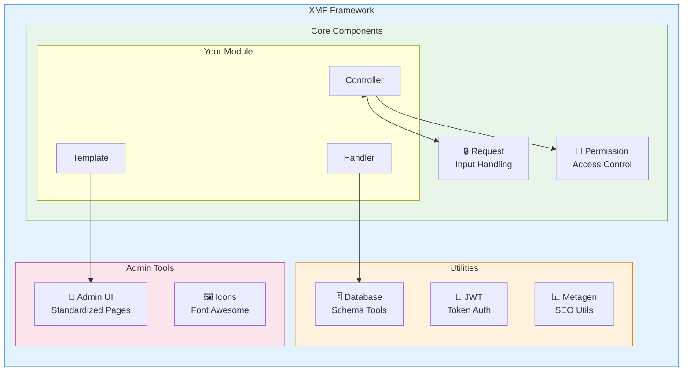
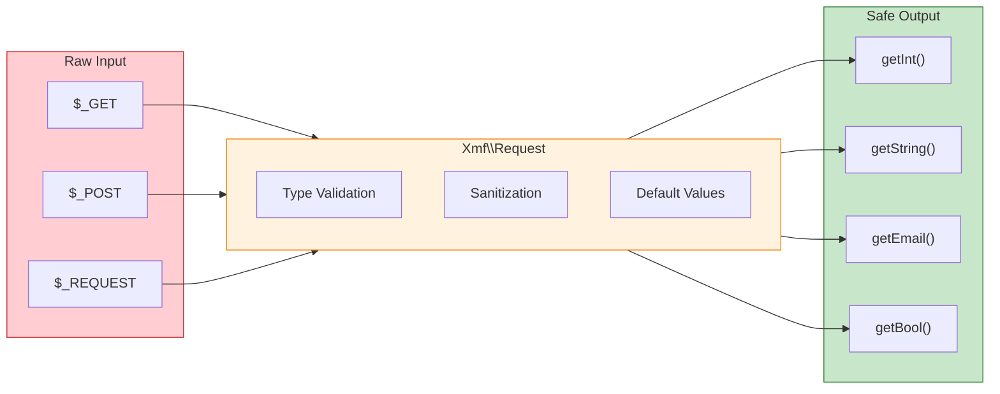

# XMF Framework

<span class="version-badge version-25x">2.5.x ✅</span> <span class="version-badge version-40x">4.0.x ✅</span>

!!! tip "The Bridge to Modern XOOPS"
    XMF works in **both XOOPS 2.5.x and XOOPS 4.0.x**. It's the recommended way to modernize your modules today while preparing for 2026. XMF provides PSR-4 autoloading, namespaces, and helpers that smooth the transition.


The **XOOPS Module Framework (XMF)** is a powerful library designed to simplify and standardize XOOPS module development. XMF provides modern PHP practices including namespaces, autoloading, and a comprehensive set of helper classes that reduce boilerplate code and improve maintainability.

## What is XMF?

XMF is a collection of classes and utilities that provide:

- **Modern PHP Support** - Full namespace support with PSR-4 autoloading
- **Request Handling** - Secure input validation and sanitization
- **Module Helpers** - Simplified access to module configurations and objects
- **Permission System** - Easy-to-use permission management
- **Database Utilities** - Schema migration and table management tools
- **JWT Support** - JSON Web Token implementation for secure authentication
- **Metadata Generation** - SEO and content extraction utilities
- **Admin Interface** - Standardized module administration pages

### XMF Component Overview



## Key Features

### Namespaces and Autoloading

All XMF classes reside in the `Xmf` namespace. Classes are automatically loaded when referenced - no manual includes required.

```php
use Xmf\Request;
use Xmf\Module\Helper;

// Classes load automatically when used
$input = Request::getString('input', '');
$helper = Helper::getHelper('mymodule');
```

### Secure Request Handling

The [Request class](../05-XMF-Framework/Basics/XMF-Request.md) provides type-safe access to HTTP request data with built-in sanitization:



```php
use Xmf\Request;

$id = Request::getInt('id', 0);
$name = Request::getString('name', '');
$email = Request::getEmail('email', '');
```

### Module Helper System

The [Module Helper](../05-XMF-Framework/Basics/XMF-Module-Helper.md) provides convenient access to module-related functionality:

```php
$helper = \Xmf\Module\Helper::getHelper('mymodule');

// Access module configuration
$configValue = $helper->getConfig('setting_name', 'default');

// Get module object
$module = $helper->getModule();

// Access handlers
$handler = $helper->getHandler('items');
```

### Permission Management

The [Permission-Helper](../05-XMF-Framework/Recipes/Permission-Helper.md) simplifies XOOPS permission handling:

```php
$permHelper = new \Xmf\Module\Helper\Permission();

// Check user permission
if ($permHelper->checkPermission('view', $itemId)) {
    // User has permission
}
```

## Documentation Structure

### Basics

- [Getting-Started-with-XMF](../05-XMF-Framework/Basics/Getting-Started-with-XMF.md) - Installation and basic usage
- [XMF-Request](../05-XMF-Framework/Basics/XMF-Request.md) - Request handling and input validation
- [XMF-Module-Helper](../05-XMF-Framework/Basics/XMF-Module-Helper.md) - Module helper class usage

### Recipes

- [Permission-Helper](../05-XMF-Framework/Recipes/Permission-Helper.md) - Working with permissions
- [Module-Admin-Pages](../05-XMF-Framework/Recipes/Module-Admin-Pages.md) - Creating standardized admin interfaces

### Reference

- [JWT](../05-XMF-Framework/Reference/JWT.md) - JSON Web Token implementation
- [Database](../05-XMF-Framework/Reference/Database.md) - Database utilities and schema management
- [Metagen](Reference/Metagen.md) - Metadata and SEO utilities

## Requirements

- XOOPS 2.5.8 or later
- PHP 8.2 or later

## Installation

XMF is included with XOOPS 2.5.8 and later versions. For earlier versions or manual installation:

1. Download the XMF package from the XOOPS repository
2. Extract to your XOOPS `/class/xmf/` directory
3. The autoloader will handle class loading automatically

## Quick Start Example

Here is a complete example showing common XMF usage patterns:

```php
<?php
use Xmf\Request;
use Xmf\Module\Helper;
use Xmf\Module\Helper\Permission;

// Get module helper
$helper = Helper::getHelper('mymodule');

// Get configuration values
$itemsPerPage = $helper->getConfig('items_per_page', 10);

// Handle request input
$op = Request::getCmd('op', 'list');
$id = Request::getInt('id', 0);

// Check permissions
$permHelper = new Permission();
if (!$permHelper->checkPermission('view', $id)) {
    redirect_header('index.php', 3, 'Access denied');
}

// Process based on operation
switch ($op) {
    case 'view':
        $handler = $helper->getHandler('items');
        $item = $handler->get($id);
        // ... display item
        break;
    case 'list':
    default:
        // ... list items
        break;
}
```

## Resources

- [XMF GitHub Repository](https://github.com/XOOPS/XMF)
- [XOOPS Project Website](https://xoops.org)

---

#xmf #xoops #framework #php #module-development
