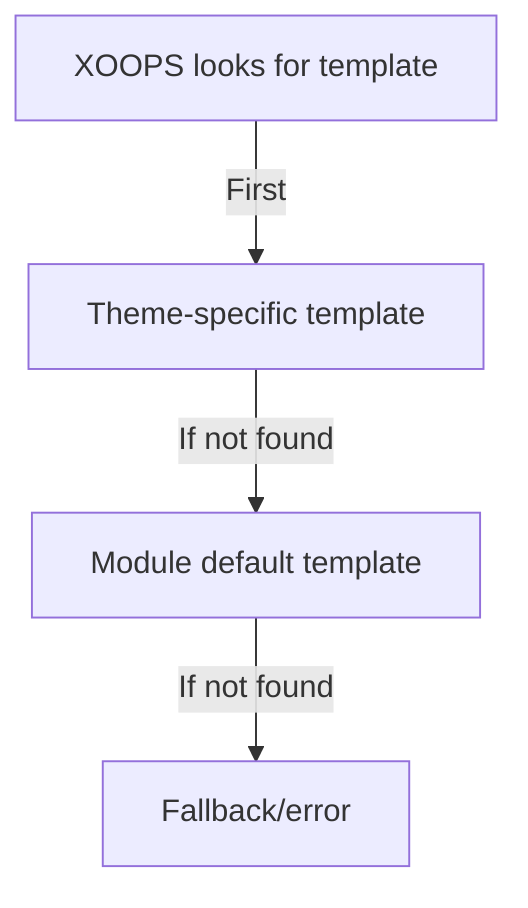

# Custom Templates in Publisher

> Guide to creating and customizing Publisher templates using Smarty, CSS, and HTML overrides.

---

## Template System Overview

### What Are Templates?

Templates control how Publisher displays content:

```
Templates render:
  ├── Article display
  ├── Category listings
  ├── Archive pages
  ├── Article listings
  ├── Comment sections
  ├── Search results
  ├── Blocks
  └── Admin pages
```

### Template Types

```
Base Templates:
  ├── publisher_index.tpl (module home)
  ├── publisher_item.tpl (single article)
  ├── publisher_category.tpl (category page)
  └── publisher_archive.tpl (archive view)

Block Templates:
  ├── publisher_block_latest.tpl
  ├── publisher_block_categories.tpl
  ├── publisher_block_archives.tpl
  └── publisher_block_top.tpl

Admin Templates:
  ├── admin_articles.tpl
  ├── admin_categories.tpl
  └── admin_*
```

---

## Template Directories

### Template File Structure

```
XOOPS Installation:
├── modules/publisher/
│   └── templates/
│       ├── Publisher/ (base templates)
│       │   ├── publisher_index.tpl
│       │   ├── publisher_item.tpl
│       │   ├── publisher_category.tpl
│       │   ├── blocks/
│       │   │   ├── publisher_block_latest.tpl
│       │   │   └── publisher_block_categories.tpl
│       │   └── css/
│       │       └── publisher.css
│       └── Themes/ (theme-specific)
│           ├── Classic/
│           ├── Modern/
│           └── Dark/

themes/yourtheme/
└── modules/
    └── publisher/
        ├── templates/
        │   └── publisher_custom.tpl
        ├── css/
        │   └── custom.css
        └── images/
            └── icons/
```

### Template Hierarchy



---

## Creating Custom Templates

### Copy Template to Theme

**Method 1: Via File Manager**

```
1. Navigate to /themes/yourtheme/modules/publisher/
2. Create directory if not exists:
   - templates/
   - css/
   - js/ (optional)
3. Copy module template file:
   modules/publisher/templates/Publisher/publisher_item.tpl
   → themes/yourtheme/modules/publisher/templates/publisher_item.tpl
4. Edit theme copy (not module copy!)
```

**Method 2: Via FTP/SSH**

```bash
# Create theme override directory
mkdir -p /path/to/xoops/themes/yourtheme/modules/publisher/templates

# Copy template files
cp /path/to/xoops/modules/publisher/templates/Publisher/*.tpl \
   /path/to/xoops/themes/yourtheme/modules/publisher/templates/

# Verify files copied
ls /path/to/xoops/themes/yourtheme/modules/publisher/templates/
```

### Edit Custom Template

Open theme copy in text editor:

```
File: /themes/yourtheme/modules/publisher/templates/publisher_item.tpl

Edit:
  1. Keep Smarty variables intact
  2. Modify HTML structure
  3. Add custom CSS classes
  4. Adjust display logic
```

---

## Smarty Template Basics

### Smarty Variables

Publisher provides variables to templates:

#### Article Variables

```smarty
{* Single Article Variables *}
<h1>{$item->title()}</h1>
<p>{$item->description()}</p>
<p>{$item->body()}</p>
<p>By {$item->uname()} on {$item->date('l, F j, Y')}</p>
<p>Category: {$item->category}</p>
<p>Views: {$item->views()}</p>
```

#### Category Variables

```smarty
{* Category Variables *}
<h2>{$category->name()}</h2>
<p>{$category->description()}</p>
image()}" alt="{$category->name()}">
<p>Articles: {$category->itemCount()}</p>
```

#### Block Variables

```smarty
{* Latest Articles Block *}
{foreach from=$items item=item}
  <div class="article">
    <h3>{$item->title()}</h3>
    <p>{$item->summary()}</p>
  </div>
{/foreach}
```

### Common Smarty Syntax

```smarty
{* Variable *}
{$variable}
{$array.key}
{$object->method()}

{* Conditional *}
{if $condition}
  <p>Content shown if true</p>
{else}
  <p>Content shown if false</p>
{/if}

{* Loop *}
{foreach from=$array item=item}
  <li>{$item}</li>
{/foreach}

{* Functions *}
{$variable|truncate:100:"..."}
{$date|date_format:"%Y-%m-%d"}
{$text|htmlspecialchars}

{* Comments *}
{* This is a Smarty comment, not displayed *}
```

---

## Template Examples

### Single Article Template

**File: publisher_item.tpl**

```smarty
<!-- Article Detail View -->
<div class="publisher-item">

  <!-- Header Section -->
  <div class="article-header">
    <h1>{$item->title()}</h1>

    {if $item->subtitle()}
      <h2 class="article-subtitle">{$item->subtitle()}</h2>
    {/if}

    <div class="article-meta">
      <span class="author">
        By <a href="{$item->authorUrl()}">{$item->uname()}</a>
      </span>
      <span class="date">
        {$item->date('l, F j, Y')}
      </span>
      <span class="category">
        <a href="{$item->categoryUrl()}">
          {$item->category}
        </a>
      </span>
      <span class="views">
        {$item->views()} views
      </span>
    </div>
  </div>

  <!-- Featured Image -->
  {if $item->image()}
    <div class="article-featured-image">
      image()}"
           alt="{$item->title()}"
           class="img-fluid">
    </div>
  {/if}

  <!-- Article Body -->
  <div class="article-content">
    {$item->body()}
  </div>

  <!-- Tags -->
  {if $item->tags()}
    <div class="article-tags">
      <strong>Tags:</strong>
      {foreach from=$item->tags() item=tag}
        <span class="tag">
          <a href="{$tag->url()}">{$tag->name()}</a>
        </span>
      {/foreach}
    </div>
  {/if}

  <!-- Footer Section -->
  <div class="article-footer">
    <div class="article-actions">
      {if $canEdit}
        <a href="{$editUrl}" class="btn btn-primary">Edit</a>
      {/if}
      {if $canDelete}
        <a href="{$deleteUrl}" class="btn btn-danger">Delete</a>
      {/if}
    </div>

    {if $allowRatings}
      <div class="article-rating">
        <!-- Rating component -->
      </div>
    {/if}
  </div>

</div>

<!-- Comments Section -->
{if $allowComments}
  <div class="article-comments">
    <h3>Comments</h3>
    {include file="publisher_comments.tpl"}
  </div>
{/if}
```

### Category Listing Template

**File: publisher_category.tpl**

```smarty
<!-- Category Page -->
<div class="publisher-category">

  <!-- Category Header -->
  <div class="category-header">
    <h1>{$category->name()}</h1>

    {if $category->image()}
      image()}"
           alt="{$category->name()}"
           class="category-image">
    {/if}

    {if $category->description()}
      <p class="category-description">
        {$category->description()}
      </p>
    {/if}
  </div>

  <!-- Subcategories -->
  {if $subcategories}
    <div class="subcategories">
      <h3>Subcategories</h3>
      <ul>
        {foreach from=$subcategories item=sub}
          <li>
            <a href="{$sub->url()}">{$sub->name()}</a>
            ({$sub->itemCount()} articles)
          </li>
        {/foreach}
      </ul>
    </div>
  {/if}

  <!-- Articles List -->
  <div class="articles-list">
    <h2>Articles</h2>

    {if count($items) > 0}
      {foreach from=$items item=item}
        <article class="article-preview">
          {if $item->image()}
            <div class="article-image">
              <a href="{$item->url()}">
                image()}" alt="{$item->title()}">
              </a>
            </div>
          {/if}

          <div class="article-content">
            <h3>
              <a href="{$item->url()}">{$item->title()}</a>
            </h3>

            <div class="article-meta">
              <span class="date">{$item->date('M d, Y')}</span>
              <span class="author">by {$item->uname()}</span>
            </div>

            <p class="article-excerpt">
              {$item->description()|truncate:200:"..."}
            </p>

            <a href="{$item->url()}" class="read-more">
              Read More →
            </a>
          </div>
        </article>
      {/foreach}

      <!-- Pagination -->
      {if $pagination}
        <nav class="pagination">
          {$pagination}
        </nav>
      {/if}
    {else}
      <p class="no-articles">
        No articles in this category yet.
      </p>
    {/if}
  </div>

</div>
```

### Latest Articles Block Template

**File: publisher_block_latest.tpl**

```smarty
<!-- Latest Articles Block -->
<div class="publisher-block-latest">
  <h3>{$block_title|default:"Latest Articles"}</h3>

  {if count($items) > 0}
    <ul class="article-list">
      {foreach from=$items item=item name=articles}
        <li class="article-item">
          <a href="{$item->url()}" title="{$item->title()}">
            {$item->title()}
          </a>
          <span class="date">
            {$item->date('M d, Y')}
          </span>

          {if $show_summary && $item->description()}
            <p class="summary">
              {$item->description()|truncate:80:"..."}
            </p>
          {/if}
        </li>
      {/foreach}
    </ul>
  {else}
    <p>No articles available.</p>
  {/if}
</div>
```

---

## Styling with CSS

### Custom CSS Files

Create custom CSS in theme:

```
/themes/yourtheme/modules/publisher/css/custom.css
```

### Base Template Structure

Understand the HTML structure:

```html
<!-- Publisher Module -->
<div class="publisher-module">

  <!-- Item View -->
  <div class="publisher-item">
    <div class="article-header">...</div>
    <div class="article-featured-image">...</div>
    <div class="article-content">...</div>
    <div class="article-footer">...</div>
  </div>

  <!-- Category View -->
  <div class="publisher-category">
    <div class="category-header">...</div>
    <div class="articles-list">...</div>
  </div>

  <!-- Block -->
  <div class="publisher-block-latest">
    <ul class="article-list">...</ul>
  </div>

</div>
```

### CSS Examples

```css
/* Article Container */
.publisher-item {
  background: #fff;
  border: 1px solid #ddd;
  border-radius: 4px;
  padding: 20px;
  margin-bottom: 20px;
}

/* Article Header */
.article-header {
  border-bottom: 2px solid #f0f0f0;
  padding-bottom: 15px;
  margin-bottom: 20px;
}

.article-header h1 {
  font-size: 2.5em;
  margin: 0 0 10px 0;
  color: #333;
}

.article-subtitle {
  font-size: 1.3em;
  color: #666;
  font-style: italic;
  margin: 0;
}

/* Article Meta Information */
.article-meta {
  font-size: 0.9em;
  color: #999;
}

.article-meta span {
  margin-right: 20px;
}

.article-meta a {
  color: #0066cc;
  text-decoration: none;
}

.article-meta a:hover {
  text-decoration: underline;
}

/* Article Featured Image */
.article-featured-image {
  margin: 20px 0;
  text-align: center;
}

.article-featured-image img {
  max-width: 100%;
  height: auto;
  border-radius: 4px;
}

/* Article Content */
.article-content {
  font-size: 1.1em;
  line-height: 1.8;
  color: #333;
}

.article-content h2 {
  font-size: 1.8em;
  margin: 30px 0 15px 0;
  color: #222;
}

.article-content h3 {
  font-size: 1.4em;
  margin: 20px 0 10px 0;
  color: #444;
}

.article-content p {
  margin-bottom: 15px;
}

.article-content ul,
.article-content ol {
  margin: 15px 0 15px 30px;
}

.article-content li {
  margin-bottom: 8px;
}

/* Article Tags */
.article-tags {
  margin-top: 20px;
  padding-top: 20px;
  border-top: 1px solid #f0f0f0;
}

.tag {
  display: inline-block;
  background: #f0f0f0;
  padding: 5px 10px;
  margin: 5px 5px 5px 0;
  border-radius: 3px;
  font-size: 0.9em;
}

.tag a {
  color: #0066cc;
  text-decoration: none;
}

.tag a:hover {
  text-decoration: underline;
}

/* Category Articles List */
.publisher-category .articles-list {
  margin-top: 30px;
}

.article-preview {
  display: flex;
  margin-bottom: 30px;
  padding-bottom: 30px;
  border-bottom: 1px solid #f0f0f0;
}

.article-preview:last-child {
  border-bottom: none;
}

.article-image {
  flex: 0 0 200px;
  margin-right: 20px;
}

.article-image img {
  width: 100%;
  height: 150px;
  object-fit: cover;
  border-radius: 4px;
}

.article-content {
  flex: 1;
}

/* Responsive */
@media (max-width: 768px) {
  .article-preview {
    flex-direction: column;
  }

  .article-image {
    flex: 1;
    margin: 0 0 15px 0;
  }

  .article-header h1 {
    font-size: 1.8em;
  }
}
```

---

## Template Variables Reference

### Item (Article) Object

```smarty
{* Article Properties *}
{$item->id()}              {* Article ID *}
{$item->title()}           {* Article title *}
{$item->description()}     {* Short description *}
{$item->body()}            {* Full content *}
{$item->subtitle()}        {* Subtitle *}
{$item->uname()}           {* Author username *}
{$item->authorId()}        {* Author user ID *}
{$item->date()}            {* Publication date *}
{$item->modified()}        {* Last modified *}
{$item->image()}           {* Featured image URL *}
{$item->views()}           {* View count *}
{$item->categoryId()}      {* Category ID *}
{$item->category()}        {* Category name *}
{$item->categoryUrl()}     {* Category URL *}
{$item->url()}             {* Article URL *}
{$item->status()}          {* Article status *}
{$item->rating()}          {* Average rating *}
{$item->comments()}        {* Comment count *}
{$item->tags()}            {* Article tags array *}

{* Formatted Methods *}
{$item->date('Y-m-d')}               {* Formatted date *}
{$item->description()|truncate:100}  {* Truncated *}
```

### Category Object

```smarty
{* Category Properties *}
{$category->id()}          {* Category ID *}
{$category->name()}        {* Category name *}
{$category->description()} {* Description *}
{$category->image()}       {* Image URL *}
{$category->parentId()}    {* Parent category ID *}
{$category->itemCount()}   {* Article count *}
{$category->url()}         {* Category URL *}
{$category->status()}      {* Status *}
```

### Block Variables

```smarty
{$items}           {* Array of items *}
{$categories}      {* Array of categories *}
{$pagination}      {* Pagination HTML *}
{$total}           {* Total count *}
{$limit}           {* Items per page *}
{$page}            {* Current page *}
```

---

## Template Conditionals

### Common Conditional Checks

```smarty
{* Check if variable exists and is not empty *}
{if $variable}
  <p>{$variable}</p>
{/if}

{* Check if array has items *}
{if count($items) > 0}
  {foreach from=$items item=item}
    <li>{$item->title()}</li>
  {/foreach}
{else}
  <p>No items available.</p>
{/if}

{* Check user permissions *}
{if $canEdit}
  <a href="edit.php?id={$item->id()}">Edit</a>
{/if}

{if $isAdmin}
  <a href="delete.php?id={$item->id()}">Delete</a>
{/if}

{* Check module settings *}
{if $allowComments}
  {include file="publisher_comments.tpl"}
{/if}

{* Check status *}
{if $item->status() == 1}
  <span class="published">Published</span>
{elseif $item->status() == 0}
  <span class="draft">Draft</span>
{/if}
```

---

## Advanced Template Techniques

### Include Other Templates

```smarty
{* Include another template *}
{include file="publisher_comments.tpl"}

{* Include with variables *}
{include file="publisher_article_preview.tpl" item=$item}

{* Include if exists *}
{include file="custom_header.tpl"|default:"header.tpl"}
```

### Assign Variables in Template

```smarty
{* Assign variable for later use *}
{assign var="articleTitle" value=$item->title()}

{* Use assigned variable *}
<h1>{$articleTitle}</h1>

{* Assign complex values *}
{assign var="count" value=$items|count}
{if $count > 0}
  <p>Found {$count} articles</p>
{/if}
```

### Template Filters

```smarty
{* Text filters *}
{$text|htmlspecialchars}        {* Escape HTML *}
{$text|strip_tags}              {* Remove HTML tags *}
{$text|truncate:100:"..."}     {* Truncate text *}
{$text|upper}                   {* UPPERCASE *}
{$text|lower}                   {* lowercase *}

{* Date filters *}
{$date|date_format:"%Y-%m-%d"}  {* Format date *}
{$date|date_format:"%l, %F %j, %Y"} {* Full format *}

{* Number filters *}
{$number|string_format:"%.2f"}  {* Format number *}
{$number|number_format}         {* Add separators *}

{* Array filters *}
{$array|implode:", "}           {* Join array *}
{$array|count}                  {* Count items *}
```

---

## Debugging Templates

### Display Smarty Variables

For debugging (remove in production):

```smarty
{* Show variable value *}
<pre>{$variable|print_r}</pre>

{* Show all available variables *}
<pre>{$smarty.all|print_r}</pre>

{* Check if variable exists *}
{if isset($variable)}
  Variable exists
{/if}

{* Display debug info *}
{if $debug}
  Item: {$item->id()}<br>
  Title: {$item->title()}<br>
  Category: {$item->categoryId()}<br>
{/if}
```

### Enable Debug Mode

In `/modules/publisher/xoops_version.php` or admin settings:

```php
// Enable debug
define('PUBLISHER_DEBUG', true);
```

---

## Template Migration

### From Old Publisher Version

If upgrading from older version:

1. Compare old and new template files
2. Merge custom changes
3. Use new variable names
4. Test thoroughly
5. Backup old templates

### Upgrade Path

```
Old template          New template          Action
publisher_item.tpl → publisher_item.tpl   Merge customizations
publisher_cat.tpl  → publisher_category.tpl Rename, merge
block_latest.tpl   → publisher_block_latest.tpl Rename, check
```

---

## Best Practices

### Template Guidelines

```
✓ Keep business logic in PHP, display logic in templates
✓ Use meaningful CSS class names
✓ Comment complex sections
✓ Test responsive design
✓ Validate HTML output
✓ Escape user data
✓ Use semantic HTML
✓ Keep templates DRY (Don't Repeat Yourself)
```

### Performance Tips

```
✓ Minimize database queries in templates
✓ Cache compiled templates
✓ Lazy load images
✓ Minify CSS/JavaScript
✓ Use CDN for assets
✓ Optimize images
✗ Avoid complex Smarty logic
```

---

## Related Documentation

- [[../Developer-Guide/API-Reference|API Reference]]
- [[../Developer-Guide/Hooks-and-Events|Hooks and Events]]
- [[../User-Guide/Basic-Configuration|Configuration]]
- [[../User-Guide/Creating-Articles|Article Creation]]

---

## Resources

- [Smarty Documentation](https://www.smarty.net/documentation)
- [Publisher GitHub](https://github.com/XoopsModules25x/publisher)
- [XOOPS Template Guide](../../02-Core-Concepts/Templates/Smarty-Basics.md)

---

#publisher #templates #smarty #customization #themeing #xoops
