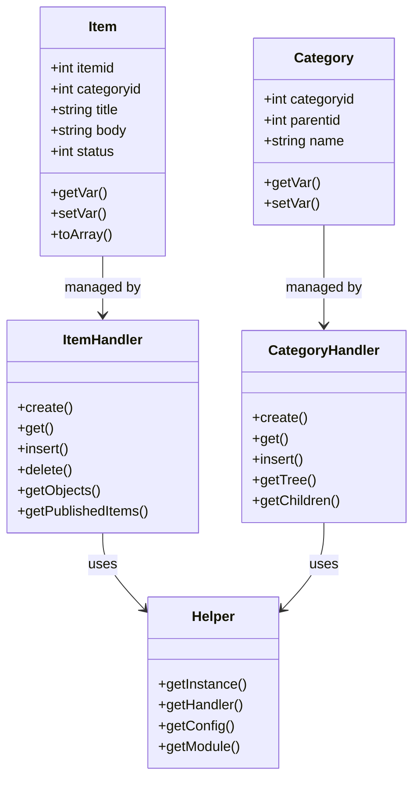
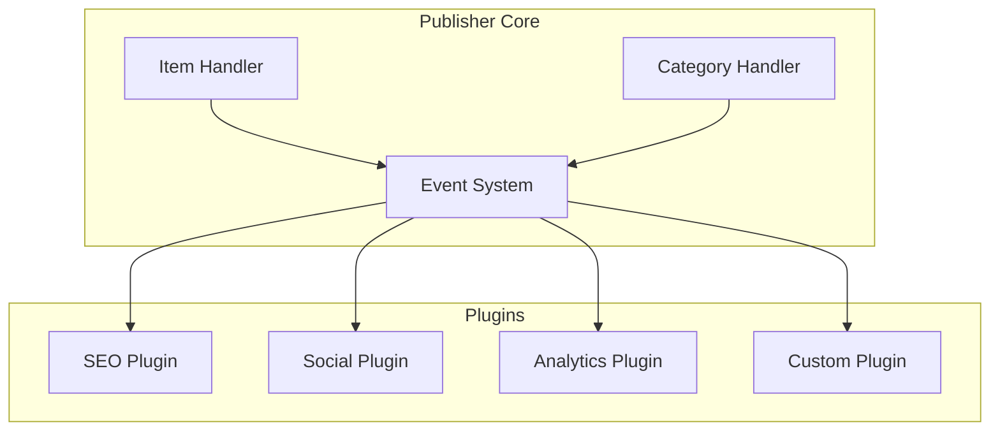

# Extending Publisher

> A developer's guide to customizing and extending the Publisher module.

---

## Architecture Overview



---

## Getting Started

### Access the Helper

```php
<?php
// Get Publisher helper instance
$helper = \XoopsModules\Publisher\Helper::getInstance();

// Get handlers
$itemHandler = $helper->getHandler('Item');
$categoryHandler = $helper->getHandler('Category');

// Get config values
$itemsPerPage = $helper->getConfig('items_perpage');
$allowRatings = $helper->getConfig('perm_rating');
```

### Working with Items

```php
<?php
use XoopsModules\Publisher\Helper;

$helper = Helper::getInstance();
$itemHandler = $helper->getHandler('Item');

// Create new item
$item = $itemHandler->create();
$item->setVar('title', 'My Article');
$item->setVar('categoryid', 1);
$item->setVar('body', 'Article content...');
$item->setVar('summary', 'Brief summary');
$item->setVar('uid', $xoopsUser->getVar('uid'));
$item->setVar('datesub', time());
$item->setVar('status', Constants::PUBLISHER_STATUS_PUBLISHED);

if ($itemHandler->insert($item)) {
    $newId = $item->getVar('itemid');
}

// Get published items
$criteria = new \CriteriaCompo();
$criteria->add(new \Criteria('status', Constants::PUBLISHER_STATUS_PUBLISHED));
$criteria->setSort('datesub');
$criteria->setOrder('DESC');
$criteria->setLimit(10);

$items = $itemHandler->getObjects($criteria);

foreach ($items as $item) {
    echo $item->getVar('title') . "\n";
}
```

### Working with Categories

```php
<?php
$categoryHandler = $helper->getHandler('Category');

// Get category
$category = $categoryHandler->get(1);
echo $category->getVar('name');

// Get category tree
$categoryTree = $categoryHandler->getTree();

// Get children of category
$children = $categoryHandler->getChildren(1);

// Get items in category
$items = $itemHandler->getItemsFromCategory($categoryId, $limit, $start);
```

---

## Custom Queries

### Advanced Item Queries

```php
<?php
// Get items by multiple criteria
$criteria = new \CriteriaCompo();
$criteria->add(new \Criteria('status', Constants::PUBLISHER_STATUS_PUBLISHED));
$criteria->add(new \Criteria('categoryid', '(1, 2, 3)', 'IN'));
$criteria->add(new \Criteria('datesub', time() - (30 * 24 * 60 * 60), '>='));

// Search in title and body
$searchCriteria = new \CriteriaCompo();
$searchCriteria->add(new \Criteria('title', '%keyword%', 'LIKE'));
$searchCriteria->add(new \Criteria('body', '%keyword%', 'LIKE'), 'OR');
$criteria->add($searchCriteria);

$items = $itemHandler->getObjects($criteria);
$count = $itemHandler->getCount($criteria);
```

### Custom SQL Queries

```php
<?php
$db = \XoopsDatabaseFactory::getDatabaseConnection();

$sql = sprintf(
    "SELECT i.*, c.name as category_name
     FROM %s i
     LEFT JOIN %s c ON i.categoryid = c.categoryid
     WHERE i.status = %d
     ORDER BY i.datesub DESC
     LIMIT %d",
    $db->prefix('publisher_items'),
    $db->prefix('publisher_categories'),
    Constants::PUBLISHER_STATUS_PUBLISHED,
    10
);

$result = $db->query($sql);
while ($row = $db->fetchArray($result)) {
    // Process row
}
```

---

## Hooks and Events

### Preloads

Create `preloads/core.php`:

```php
<?php

namespace XoopsModules\Publisher\Preloads;

use XoopsPreloadItem;

class Core extends XoopsPreloadItem
{
    /**
     * Called when an item is created
     */
    public static function eventPublisherItemCreated($args)
    {
        $item = $args['item'];

        // Send notification
        self::notifyNewItem($item);

        // Log activity
        self::logActivity('item_created', $item->getVar('itemid'));
    }

    /**
     * Called when an item is updated
     */
    public static function eventPublisherItemUpdated($args)
    {
        $item = $args['item'];
        // Custom logic here
    }

    /**
     * Called when an item is viewed
     */
    public static function eventPublisherItemViewed($args)
    {
        $item = $args['item'];
        // Track analytics, update view count, etc.
    }

    private static function notifyNewItem($item)
    {
        // Notification logic
    }

    private static function logActivity($action, $itemId)
    {
        // Logging logic
    }
}
```

---

## Custom Templates

### Template Override

Create custom templates in your theme:

```
themes/mytheme/modules/publisher/
├── publisher_index.tpl
├── publisher_item.tpl
├── publisher_category.tpl
└── blocks/
    └── publisher_block_recent.tpl
```

### Template Variables

```smarty
{* Available in item.tpl *}
<article class="publisher-item">
    <h1><{$item.title}></h1>

    <div class="meta">
        <span class="author">By <{$item.author}></span>
        <span class="date"><{$item.datesub}></span>
        <span class="category">
            <a href="<{$item.categorylink}>"><{$item.categoryname}></a>
        </span>
    </div>

    <{if $item.image}>
        " alt="<{$item.title}>">
    <{/if}>

    <div class="summary">
        <{$item.summary}>
    </div>

    <div class="body">
        <{$item.body}>
    </div>

    <{if $item.files}>
        <div class="attachments">
            <h3>Attachments</h3>
            <ul>
            <{foreach item=file from=$item.files}>
                <li><a href="<{$file.url}>"><{$file.name}></a></li>
            <{/foreach}>
            </ul>
        </div>
    <{/if}>

    <{if $item.canRate}>
        <div class="rating">
            <{include file="db:publisher_rating.tpl"}>
        </div>
    <{/if}>

    <{if $item.canComment}>
        <div class="comments">
            <{$item.comments}>
        </div>
    <{/if}>
</article>
```

---

## Custom Blocks

### Create Custom Block

```php
<?php
// blocks/custom_block.php

function publisher_block_custom_show($options)
{
    $helper = \XoopsModules\Publisher\Helper::getInstance();
    $itemHandler = $helper->getHandler('Item');

    $criteria = new \CriteriaCompo();
    $criteria->add(new \Criteria('status', Constants::PUBLISHER_STATUS_PUBLISHED));
    $criteria->setSort($options[1] ?? 'datesub');
    $criteria->setOrder('DESC');
    $criteria->setLimit($options[0] ?? 5);

    $items = $itemHandler->getObjects($criteria);

    $block = [];
    foreach ($items as $item) {
        $block['items'][] = $item->toArray();
    }

    return $block;
}

function publisher_block_custom_edit($options)
{
    $form = '';
    $form .= 'Number of items: <input type="text" name="options[0]" value="' . ($options[0] ?? 5) . '">';
    $form .= '<br>Sort by: <select name="options[1]">';
    $form .= '<option value="datesub"' . (($options[1] ?? '') === 'datesub' ? ' selected' : '') . '>Date</option>';
    $form .= '<option value="counter"' . (($options[1] ?? '') === 'counter' ? ' selected' : '') . '>Views</option>';
    $form .= '<option value="rating"' . (($options[1] ?? '') === 'rating' ? ' selected' : '') . '>Rating</option>';
    $form .= '</select>';

    return $form;
}
```

### Register Block in xoops_version.php

```php
$modversion['blocks'][] = [
    'file'        => 'blocks/custom_block.php',
    'name'        => _MI_PUBLISHER_BLOCK_CUSTOM,
    'description' => _MI_PUBLISHER_BLOCK_CUSTOM_DESC,
    'show_func'   => 'publisher_block_custom_show',
    'edit_func'   => 'publisher_block_custom_edit',
    'options'     => '5|datesub',
    'template'    => 'publisher_block_custom.tpl',
];
```

---

## API Integration

### REST API Endpoint

```php
<?php
// api/items.php

require_once dirname(dirname(dirname(__DIR__))) . '/mainfile.php';

header('Content-Type: application/json');

$helper = \XoopsModules\Publisher\Helper::getInstance();
$itemHandler = $helper->getHandler('Item');

$action = $_GET['action'] ?? 'list';
$response = ['success' => false];

try {
    switch ($action) {
        case 'list':
            $limit = min((int)($_GET['limit'] ?? 10), 50);
            $start = (int)($_GET['start'] ?? 0);

            $criteria = new \CriteriaCompo();
            $criteria->add(new \Criteria('status', Constants::PUBLISHER_STATUS_PUBLISHED));
            $criteria->setLimit($limit);
            $criteria->setStart($start);

            $items = $itemHandler->getObjects($criteria);
            $response = [
                'success' => true,
                'data' => array_map(fn($item) => $item->toArray(), $items),
                'total' => $itemHandler->getCount($criteria)
            ];
            break;

        case 'get':
            $id = (int)($_GET['id'] ?? 0);
            $item = $itemHandler->get($id);

            if ($item && $item->getVar('status') == Constants::PUBLISHER_STATUS_PUBLISHED) {
                $response = [
                    'success' => true,
                    'data' => $item->toArray()
                ];
            } else {
                http_response_code(404);
                $response = ['success' => false, 'error' => 'Item not found'];
            }
            break;
    }
} catch (\Exception $e) {
    http_response_code(500);
    $response = ['success' => false, 'error' => $e->getMessage()];
}

echo json_encode($response);
```

---

## Plugin Architecture



---

## Related Documentation

- [[../User-Guide/Getting-Started|User Guide - Getting Started]]
- [[../../03-Module-Development/Patterns/MVC-Pattern|MVC Pattern]]
- [[../../04-API-Reference/Core/XoopsObject|XoopsObject API]]

---

#xoops #publisher #developer #extending #api
