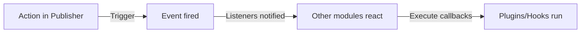

# Publisher Hooks and Events

> Complete guide to extending Publisher functionality using events, hooks, and plugins.

---

## Events System Overview

### What Are Events?

Events allow other modules to react to Publisher actions:

```
Publisher Action → Trigger Event → Other modules listen/react

Examples:
  - Article created → Send notification email
  - Article published → Update social media
  - Comment posted → Notify author
  - Category created → Update search index
```

### Event Flow



---

## Available Events

### Item (Article) Events

#### publisher.item.created

Fired when a new article is created.

```php
// Trigger point in Publisher
xoops_events()->trigger('publisher.item.created', array(
    'item' => $item,
    'itemid' => $item->getVar('itemid'),
    'title' => $item->getVar('title'),
    'uid' => $item->getVar('uid')
));
```

**Example Listener:**

```php
// Listen for article creation
xoops_events()->attach('publisher.item.created', 'onArticleCreated');

function onArticleCreated($item) {
    $itemId = $item['itemid'];
    $title = $item['title'];
    $uid = $item['uid'];

    // Send email notification
    sendEmailNotification($uid, "New article: $title");

    // Log activity
    logActivity('Article created', $itemId);

    // Update search index
    updateSearchIndex($itemId);
}
```

#### publisher.item.updated

Fired when an article is updated.

```php
xoops_events()->trigger('publisher.item.updated', array(
    'item' => $item,
    'itemid' => $itemId,
    'changes' => $changes
));
```

#### publisher.item.deleted

Fired when an article is deleted.

```php
xoops_events()->trigger('publisher.item.deleted', array(
    'itemid' => $itemId,
    'title' => $title,
    'categoryid' => $categoryId
));
```

#### publisher.item.published

Fired when article status changes to published.

```php
xoops_events()->trigger('publisher.item.published', array(
    'item' => $item,
    'itemid' => $itemId
));
```

#### publisher.item.approved

Fired when pending article is approved.

```php
xoops_events()->trigger('publisher.item.approved', array(
    'item' => $item,
    'itemid' => $itemId,
    'uid' => $uid
));
```

#### publisher.item.rejected

Fired when article is rejected.

```php
xoops_events()->trigger('publisher.item.rejected', array(
    'item' => $item,
    'itemid' => $itemId,
    'reason' => $reason
));
```

### Category Events

#### publisher.category.created

Fired when category is created.

```php
xoops_events()->trigger('publisher.category.created', array(
    'category' => $category,
    'categoryid' => $categoryId,
    'name' => $name
));
```

#### publisher.category.updated

Fired when category is updated.

```php
xoops_events()->trigger('publisher.category.updated', array(
    'category' => $category,
    'categoryid' => $categoryId
));
```

#### publisher.category.deleted

Fired when category is deleted.

```php
xoops_events()->trigger('publisher.category.deleted', array(
    'categoryid' => $categoryId,
    'name' => $name,
    'itemCount' => $itemCount
));
```

### Comment Events

#### publisher.comment.created

Fired when comment is posted.

```php
xoops_events()->trigger('publisher.comment.created', array(
    'comment' => $comment,
    'commentid' => $commentId,
    'itemid' => $itemId
));
```

#### publisher.comment.approved

Fired when comment is approved.

```php
xoops_events()->trigger('publisher.comment.approved', array(
    'comment' => $comment,
    'commentid' => $commentId
));
```

#### publisher.comment.deleted

Fired when comment is deleted.

```php
xoops_events()->trigger('publisher.comment.deleted', array(
    'commentid' => $commentId,
    'itemid' => $itemId
));
```

---

## Listening to Events

### Register Event Listener

In your module or plugin:

```php
<?php
// Register listener in xoops_version.php or initialization file
xoops_events()->attach(
    'publisher.item.created',
    array('MyModuleListener', 'onPublisherItemCreated')
);

// Or use function name
xoops_events()->attach(
    'publisher.item.created',
    'my_module_on_item_created'
);
?>
```

### Listener Class Method

```php
<?php
class MyModuleListener {
    public static function onPublisherItemCreated($data) {
        $itemId = $data['itemid'];
        $title = $data['title'];

        // Perform action
        self::notifySubscribers($itemId, $title);
    }

    protected static function notifySubscribers($itemId, $title) {
        // Implementation
    }
}
?>
```

### Listener Function

```php
<?php
function my_module_on_item_created($data) {
    $itemId = $data['itemid'];
    $title = $data['title'];
    $uid = $data['uid'];

    // Send notification
    notifyUser($uid, "Article created: $title");
}
?>
```

---

## Event Examples

### Example 1: Send Email on Article Creation

```php
<?php
// Listen for article creation
xoops_events()->attach(
    'publisher.item.created',
    'send_article_notification_email'
);

function send_article_notification_email($data) {
    $itemId = $data['itemid'];
    $title = $data['title'];
    $uid = $data['uid'];

    // Get user object
    $userHandler = xoops_getHandler('user');
    $user = $userHandler->get($uid);

    if (!$user) {
        return;
    }

    // Get admin emails
    $config = xoops_getModuleConfig();
    $adminEmails = $config['admin_emails'];

    // Prepare email
    $subject = "New Article: $title";
    $message = "A new article has been created:\n\n";
    $message .= "Title: $title\n";
    $message .= "Author: " . $user->getVar('uname') . "\n";
    $message .= "Date: " . date('Y-m-d H:i:s') . "\n";
    $message .= "ID: $itemId\n\n";
    $message .= "Link: " . XOOPS_URL . "/modules/publisher/?op=showitem&itemid=$itemId\n";

    // Send to admins
    foreach (explode(',', $adminEmails) as $email) {
        xoops_mail($email, $subject, $message);
    }
}
?>
```

### Example 2: Update Search Index

```php
<?php
// Listen for article published event
xoops_events()->attach(
    'publisher.item.published',
    'update_search_index'
);

function update_search_index($data) {
    $itemId = $data['itemid'];
    $item = $data['item'];

    // Update search index
    $searchHandler = xoops_getModuleHandler('Search');
    $searchHandler->indexArticle($itemId, array(
        'title' => $item->getVar('title'),
        'content' => $item->getVar('body'),
        'author' => $item->getVar('uname'),
        'date' => $item->getVar('datesub')
    ));
}
?>
```

### Example 3: Auto-Post to Social Media

```php
<?php
// Listen for article publication
xoops_events()->attach(
    'publisher.item.published',
    'post_to_social_media'
);

function post_to_social_media($data) {
    $item = $data['item'];
    $itemId = $data['itemid'];

    // Get config
    $config = xoops_getModuleConfig();

    if ($config['post_to_twitter']) {
        postToTwitter(
            $item->getVar('title'),
            XOOPS_URL . '/modules/publisher/?op=showitem&itemid=' . $itemId
        );
    }

    if ($config['post_to_facebook']) {
        postToFacebook(
            $item->getVar('title'),
            $item->getVar('description')
        );
    }
}

function postToTwitter($text, $url) {
    // Twitter API integration
    // Use Twitter OAuth library
}

function postToFacebook($title, $description) {
    // Facebook API integration
}
?>
```

### Example 4: Sync with External System

```php
<?php
// Listen for article creation and update
xoops_events()->attach(
    'publisher.item.created',
    'sync_external_system'
);

xoops_events()->attach(
    'publisher.item.updated',
    'sync_external_system'
);

function sync_external_system($data) {
    $item = $data['item'];
    $itemId = $data['itemid'];

    // Get external API config
    $config = xoops_getModuleConfig();
    $apiUrl = $config['external_api_url'];
    $apiKey = $config['external_api_key'];

    // Prepare payload
    $payload = json_encode(array(
        'id' => $itemId,
        'title' => $item->getVar('title'),
        'content' => $item->getVar('body'),
        'date' => date('c', $item->getVar('datesub'))
    ));

    // Send to external system
    $ch = curl_init($apiUrl);
    curl_setopt($ch, CURLOPT_POST, true);
    curl_setopt($ch, CURLOPT_POSTFIELDS, $payload);
    curl_setopt($ch, CURLOPT_HTTPHEADER, array(
        'Content-Type: application/json',
        'Authorization: Bearer ' . $apiKey
    ));
    curl_exec($ch);
    curl_close($ch);
}
?>
```

---

## Hooks System

### Publisher Hooks

Hooks allow modifications to Publisher behavior:

#### publisher.view.article.start

Called before article is rendered.

```php
xoops_events()->attach(
    'publisher.view.article.start',
    'modify_article_before_display'
);

function modify_article_before_display(&$item) {
    // Modify item before display
    $title = $item->getVar('title');
    $item->setVar('title', '[FEATURED] ' . $title);
}
```

#### publisher.view.article.end

Called after article is rendered.

```php
xoops_events()->attach(
    'publisher.view.article.end',
    'append_to_article'
);

function append_to_article(&$article) {
    // Add content after article
    $article .= '<div class="related-articles">';
    $article .= '<!-- Related articles content -->';
    $article .= '</div>';
}
```

#### publisher.permission.check

Called when checking permissions.

```php
xoops_events()->attach(
    'publisher.permission.check',
    'custom_permission_logic'
);

function custom_permission_logic(&$allowed, $permission, $itemId) {
    // Custom permission logic
    if (custom_rule_applies($itemId)) {
        $allowed = true;
    }
}
```

---

## Plugin System

### Create a Plugin

Plugins extend Publisher functionality:

**File Structure:**

```
modules/publisher/plugins/
├── myplugin/
│   ├── plugin.php (main file)
│   ├── language/
│   │   └── english.php
│   ├── templates/
│   └── css/
```

**plugin.php:**

```php
<?php
// Plugin information
define('MYPLUGIN_NAME', 'My Publisher Plugin');
define('MYPLUGIN_VERSION', '1.0.0');
define('MYPLUGIN_DESCRIPTION', 'Extends Publisher with custom features');

// Register hooks/events
xoops_events()->attach(
    'publisher.item.created',
    'myplugin_on_item_created'
);

xoops_events()->attach(
    'publisher.view.article.end',
    'myplugin_append_content'
);

// Plugin functions
function myplugin_on_item_created($data) {
    // Handle item creation
}

function myplugin_append_content(&$content) {
    // Append content to article
    $content .= '<div class="myplugin-content">Custom content</div>';
}

// Plugin API
class MyPublisherPlugin {
    public static function getArticles($limit = 10) {
        $itemHandler = xoops_getModuleHandler('Item', 'publisher');
        return $itemHandler->getRecent($limit);
    }

    public static function getCategoryTree() {
        $catHandler = xoops_getModuleHandler('Category', 'publisher');
        return $catHandler->getRoots();
    }
}
?>
```

### Load Plugin

In Publisher initialization:

```php
<?php
// Load plugin
$pluginPath = XOOPS_ROOT_PATH . '/modules/publisher/plugins/myplugin/plugin.php';
if (file_exists($pluginPath)) {
    include_once $pluginPath;
}
?>
```

---

## Filters

### Content Filters

Filters modify data before/after processing:

```php
<?php
// Filter article title
$title = apply_filters('publisher_item_title', $title, $itemId);

// Filter article body
$body = apply_filters('publisher_item_body', $body, $itemId);

// Filter article display
$display = apply_filters('publisher_item_display', $display, $item);
?>
```

### Register Filter

```php
<?php
// Add filter
add_filter('publisher_item_title', 'my_title_filter');

function my_title_filter($title, $itemId) {
    // Modify title
    return strtoupper($title);
}

// Add filter with priority
add_filter(
    'publisher_item_body',
    'my_body_filter',
    10,  // priority (lower = earlier)
    2    // number of arguments
);

function my_body_filter($body, $itemId) {
    // Add watermark to body
    return $body . '<p class="watermark">© ' . date('Y') . '</p>';
}
?>
```

---

## Action Hooks

### Custom Actions

Execute code at specific points:

```php
<?php
// Do action
do_action('publisher_article_saved', $itemId, $item);

// Do action with arguments
do_action('publisher_comment_approved', $commentId, $comment);

// Listen to action
add_action('publisher_article_saved', 'my_action_handler');

function my_action_handler($itemId, $item) {
    // Execute code
    log_article_save($itemId);
    update_statistics();
}
?>
```

---

## Extending with Plugins

### Example Plugin: Related Articles

```php
<?php
// File: modules/publisher/plugins/related-articles/plugin.php

class RelatedArticlesPlugin {
    public static function init() {
        xoops_events()->attach(
            'publisher.view.article.end',
            array(__CLASS__, 'displayRelated')
        );
    }

    public static function displayRelated(&$content) {
        // Get related articles
        $related = self::getRelatedArticles();

        if (count($related) > 0) {
            $html = '<div class="related-articles">';
            $html .= '<h3>Related Articles</h3>';
            $html .= '<ul>';

            foreach ($related as $article) {
                $html .= '<li>';
                $html .= '<a href="' . $article->url() . '">';
                $html .= $article->title();
                $html .= '</a>';
                $html .= '</li>';
            }

            $html .= '</ul>';
            $html .= '</div>';

            $content .= $html;
        }
    }

    protected static function getRelatedArticles() {
        // Get current article
        global $itemId;

        $itemHandler = xoops_getModuleHandler('Item', 'publisher');
        $item = $itemHandler->get($itemId);

        if (!$item) {
            return array();
        }

        // Get articles in same category
        $related = $itemHandler->getByCategory(
            $item->getVar('categoryid'),
            $limit = 5
        );

        // Remove current article
        $related = array_filter($related, function($article) {
            global $itemId;
            return $article->getVar('itemid') != $itemId;
        });

        return array_slice($related, 0, 3);
    }
}

// Initialize plugin
RelatedArticlesPlugin::init();
?>
```

---

## Best Practices

### Event Listener Guidelines

```php
✓ Keep listeners performant
  - Don't do heavy processing in events
  - Cache results when possible

✓ Handle errors gracefully
  - Use try/catch
  - Log errors
  - Don't break main flow

✓ Use meaningful names
  - my_module_on_publisher_item_created
  - Instead of: process_event_1

✓ Document your events
  - Comment what trigger point is
  - List expected data
  - Show usage examples

✓ Unload listeners properly
  - Clean up on module uninstall
  - Remove hooks when no longer needed
```

### Performance Tips

```
✗ Avoid database queries in listeners
✗ Don't block execution with slow operations
✗ Avoid modifying data unnecessarily

✓ Queue long-running tasks
✓ Cache external API calls
✓ Use lazy loading for dependencies
✓ Batch database operations
```

---

## Debugging Events

### Enable Debug Mode

```php
<?php
// In module initialization
if (defined('XOOPS_DEBUG')) {
    xoops_events()->attach(
        'publisher.item.created',
        'publisher_debug_event'
    );
}

function publisher_debug_event($data) {
    error_log('Publisher Event: ' . print_r($data, true));
}
?>
```

### Log Events

```php
<?php
// Log event data
xoops_events()->attach(
    'publisher.item.created',
    'log_publisher_events'
);

function log_publisher_events($data) {
    $log = XOOPS_ROOT_PATH . '/var/log/publisher.log';
    $entry = date('Y-m-d H:i:s') . ' - ';
    $entry .= 'Event: publisher.item.created' . "\n";
    $entry .= 'Data: ' . json_encode($data) . "\n\n";
    file_put_contents($log, $entry, FILE_APPEND);
}
?>
```

---

## Related Documentation

- [[API-Reference|API Reference]]
- [[Custom-Templates|Custom Templates]]
- [[../User-Guide/Creating-Articles|Article Creation]]

---

## Resources

- [Publisher GitHub](https://github.com/XoopsModules25x/publisher)
- [XOOPS Events System](../../03-Module-Development/Module-Development.md)
- [Plugin Development](../../03-Module-Development/Module-Development.md)

---

#publisher #hooks #events #plugins #extensions #customization #xoops
