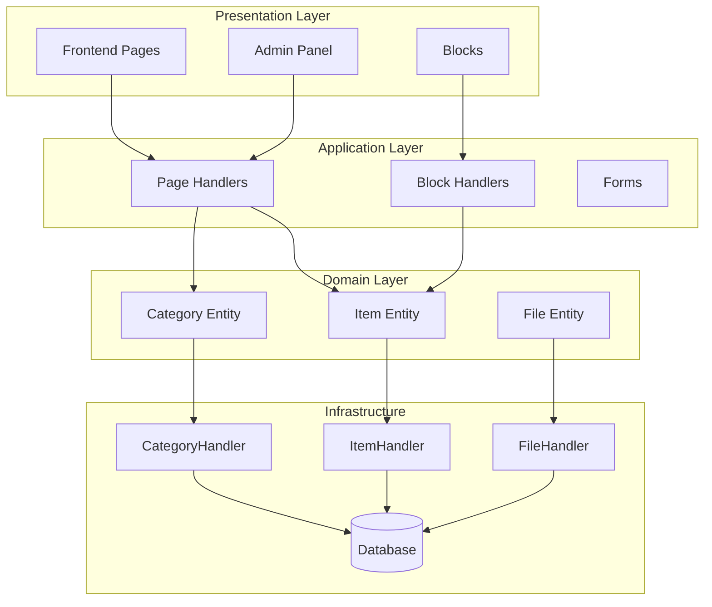
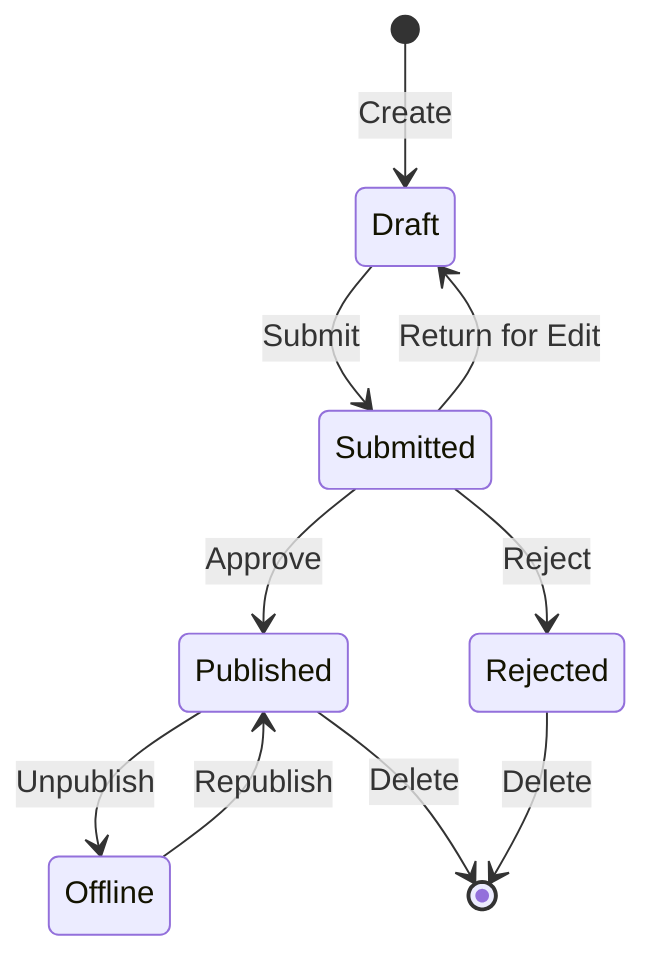

# Publisher Module Analysis

## Overview

This document provides a technical analysis of the Publisher module architecture, patterns, and implementation details. Use this as a reference for understanding how a production-quality XOOPS module is structured.

## Architecture Overview



## Directory Structure

```
publisher/
├── admin/
│   ├── index.php           # Admin dashboard
│   ├── item.php            # Article management
│   ├── category.php        # Category management
│   ├── permission.php      # Permissions
│   ├── file.php            # File manager
│   └── menu.php            # Admin menu
├── assets/
│   ├── css/
│   ├── js/
│   └── images/
├── class/
│   ├── Category.php        # Category entity
│   ├── CategoryHandler.php # Category data access
│   ├── Item.php            # Article entity
│   ├── ItemHandler.php     # Article data access
│   ├── File.php            # File attachment
│   ├── FileHandler.php     # File data access
│   ├── Form/               # Form classes
│   ├── Common/             # Utilities
│   └── Helper.php          # Module helper
├── include/
│   ├── common.php          # Initialization
│   ├── functions.php       # Utility functions
│   ├── oninstall.php       # Install hooks
│   ├── onupdate.php        # Update hooks
│   └── search.php          # Search integration
├── language/
├── templates/
├── sql/
└── xoops_version.php
```

## Entity Analysis

### Item (Article) Entity

```php
class Item extends \XoopsObject
{
    // Fields
    public function initVar(): void
    {
        $this->initVar('itemid', XOBJ_DTYPE_INT, null, false);
        $this->initVar('categoryid', XOBJ_DTYPE_INT, 0, false);
        $this->initVar('title', XOBJ_DTYPE_TXTBOX, '', true);
        $this->initVar('subtitle', XOBJ_DTYPE_TXTBOX, '');
        $this->initVar('summary', XOBJ_DTYPE_TXTAREA, '');
        $this->initVar('body', XOBJ_DTYPE_TXTAREA, '', true);
        $this->initVar('uid', XOBJ_DTYPE_INT, 0);
        $this->initVar('status', XOBJ_DTYPE_INT, 0);
        $this->initVar('datesub', XOBJ_DTYPE_INT, time());
        // ... more fields
    }

    // Business methods
    public function isPublished(): bool
    {
        return $this->getVar('status') == _PUBLISHER_STATUS_PUBLISHED;
    }

    public function canEdit(int $userId): bool
    {
        return $this->getVar('uid') == $userId
            || $this->isAdmin($userId);
    }
}
```

### Handler Pattern

```php
class ItemHandler extends \XoopsPersistableObjectHandler
{
    public function __construct(\XoopsDatabase $db)
    {
        parent::__construct(
            $db,
            'publisher_items',
            Item::class,
            'itemid',
            'title'
        );
    }

    public function getPublishedItems(int $limit = 10): array
    {
        $criteria = new \CriteriaCompo();
        $criteria->add(new \Criteria('status', _PUBLISHER_STATUS_PUBLISHED));
        $criteria->setSort('datesub');
        $criteria->setOrder('DESC');
        $criteria->setLimit($limit);

        return $this->getObjects($criteria);
    }
}
```

## Permission System

### Permission Types

| Permission | Description |
|------------|-------------|
| `publisher_view` | View category/articles |
| `publisher_submit` | Submit new articles |
| `publisher_approve` | Auto-approve submissions |
| `publisher_moderate` | Review pending articles |
| `publisher_global` | Global module permissions |

### Permission Check

```php
class PermissionHandler
{
    public function isGranted(string $permission, int $categoryId): bool
    {
        $userId = $GLOBALS['xoopsUser']?->uid() ?? 0;
        $groups = $this->getUserGroups($userId);

        return $this->grouppermHandler->checkRight(
            $permission,
            $categoryId,
            $groups,
            $this->helper->getModule()->mid()
        );
    }
}
```

## Workflow States



## Template Structure

### Frontend Templates

| Template | Purpose |
|----------|---------|
| `publisher_index.tpl` | Module homepage |
| `publisher_item.tpl` | Single article |
| `publisher_category.tpl` | Category listing |
| `publisher_submit.tpl` | Submission form |
| `publisher_search.tpl` | Search results |

### Block Templates

| Template | Purpose |
|----------|---------|
| `publisher_block_latest.tpl` | Recent articles |
| `publisher_block_spotlight.tpl` | Featured article |
| `publisher_block_category.tpl` | Category menu |

## Key Patterns Used

1. **Handler Pattern** - Data access encapsulation
2. **Value Object** - Status constants
3. **Template Method** - Form generation
4. **Strategy** - Different display modes
5. **Observer** - Notifications on events

## Lessons for Module Development

1. Use XoopsPersistableObjectHandler for CRUD
2. Implement granular permissions
3. Separate presentation from logic
4. Use Criteria for queries
5. Support multiple content statuses
6. Integrate with XOOPS notification system

## Related Documentation

- [[Creating-Articles]] - Article management
- [[Managing-Categories]] - Category system
- [[Permissions-Setup]] - Permission configuration
- [[Developer-Guide/Hooks-and-Events]] - Extension points
