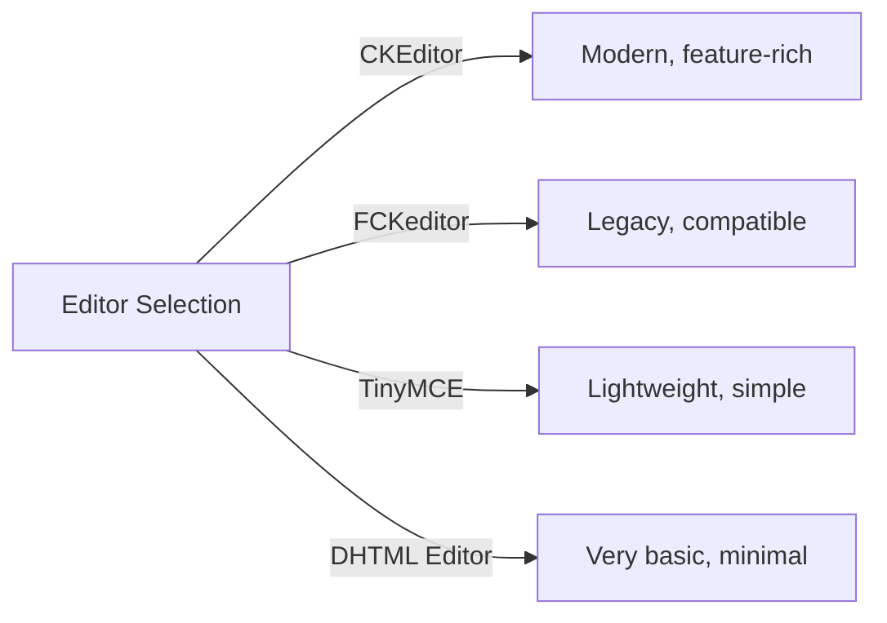
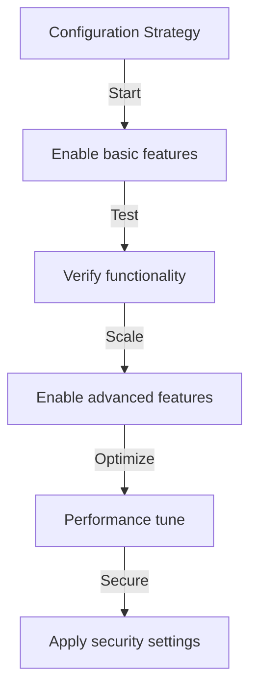

# Publisher Basic Configuration

> Configure Publisher module settings, preferences, and general options for your XOOPS installation.

---

## Accessing Configuration

### Admin Panel Navigation

```
XOOPS Admin Panel
└── Modules
    └── Publisher
        ├── Preferences
        ├── Settings
        └── Configuration
```

1. Log in as **Administrator**
2. Go to **Admin Panel → Modules**
3. Find **Publisher** module
4. Click **Preferences** or **Admin** link

---

## General Settings

### Access Configuration

```
Admin Panel → Modules → Publisher
```

Click the **gear icon** or **Settings** for these options:

#### Display Options

| Setting | Options | Default | Description |
|---------|---------|---------|-------------|
| **Items per page** | 5-50 | 10 | Articles shown in lists |
| **Show breadcrumb** | Yes/No | Yes | Navigation trail display |
| **Use paging** | Yes/No | Yes | Paginate long lists |
| **Show date** | Yes/No | Yes | Display article date |
| **Show category** | Yes/No | Yes | Show article category |
| **Show author** | Yes/No | Yes | Show article author |
| **Show views** | Yes/No | Yes | Show article view count |

**Example Configuration:**

```yaml
Items Per Page: 15
Show Breadcrumb: Yes
Use Paging: Yes
Show Date: Yes
Show Category: Yes
Show Author: Yes
Show Views: Yes
```

#### Author Options

| Setting | Default | Description |
|---------|---------|-------------|
| **Show author name** | Yes | Display real name or username |
| **Use username** | No | Show username instead of name |
| **Show author email** | No | Display author contact email |
| **Show author avatar** | Yes | Display user avatar |

---

## Editor Configuration

### Select WYSIWYG Editor

Publisher supports multiple editors:

#### Available Editors



### CKEditor (Recommended)

**Best for:** Most users, modern browsers, full features

1. Go to **Preferences**
2. Set **Editor**: CKEditor
3. Configure options:

```
Editor: CKEditor 4.x
Toolbar: Full
Height: 400px
Width: 100%
Remove plugins: []
Add plugins: [mathjax, codesnippet]
```

### FCKeditor

**Best for:** Compatibility, older systems

```
Editor: FCKeditor
Toolbar: Default
Custom config: (optional)
```

### TinyMCE

**Best for:** Minimal footprint, basic editing

```
Editor: TinyMCE
Plugins: [paste, table, link, image]
Toolbar: minimal
```

---

## File & Upload Settings

### Configure Upload Directories

```
Admin → Publisher → Preferences → Upload Settings
```

#### File Type Settings

```yaml
Allowed File Types:
  Images:
    - jpg
    - jpeg
    - gif
    - png
    - webp
  Documents:
    - pdf
    - doc
    - docx
    - xls
    - xlsx
    - ppt
    - pptx
  Archives:
    - zip
    - rar
    - 7z
  Media:
    - mp3
    - mp4
    - webm
    - mov
```

#### File Size Limits

| File Type | Max Size | Notes |
|-----------|----------|-------|
| **Images** | 5 MB | Per image file |
| **Documents** | 10 MB | PDF, Office files |
| **Media** | 50 MB | Video/audio files |
| **All files** | 100 MB | Total per upload |

**Configuration:**

```
Max Image Upload Size: 5 MB
Max Document Upload Size: 10 MB
Max Media Upload Size: 50 MB
Total Upload Size: 100 MB
Max Files per Article: 5
```

### Image Resizing

Publisher auto-resizes images for consistency:

```yaml
Thumbnail Size:
  Width: 150
  Height: 150
  Mode: Crop/Resize

Category Image Size:
  Width: 300
  Height: 200
  Mode: Resize

Article Featured Image:
  Width: 600
  Height: 400
  Mode: Resize
```

---

## Comment & Interaction Settings

### Comments Configuration

```
Preferences → Comments Section
```

#### Comment Options

```yaml
Allow Comments:
  - Enabled: Yes/No
  - Default: Yes
  - Per-article override: Yes

Comment Moderation:
  - Moderate comments: Yes/No
  - Moderate guest comments only: Yes/No
  - Spam filter: Enabled
  - Max comments per day: (unlimited)

Comment Display:
  - Display format: Threaded/Flat
  - Comments per page: 10
  - Date format: Full date/Time ago
  - Show comment count: Yes/No
```

### Ratings Configuration

```yaml
Allow Ratings:
  - Enabled: Yes/No
  - Default: Yes
  - Per-article override: Yes

Rating Options:
  - Rating scale: 5 stars (default)
  - Allow user to rate own: No
  - Show average rating: Yes
  - Show rating count: Yes
```

---

## SEO & URL Settings

### Search Engine Optimization

```
Preferences → SEO Settings
```

#### URL Configuration

```yaml
SEO URLs:
  - Enabled: No (set to Yes for SEO URLs)
  - URL rewriting: None/Apache mod_rewrite/IIS rewrite

URL Format:
  - Category: /category/news
  - Article: /article/welcome-to-site
  - Archive: /archive/2024/01

Meta Description:
  - Auto-generate: Yes
  - Max length: 160 characters

Meta Keywords:
  - Auto-generate: Yes
  - From: Article tags, title
```

### Enable SEO URLs (Advanced)

**Prerequisites:**
- Apache with `mod_rewrite` enabled
- `.htaccess` support enabled

**Configuration Steps:**

1. Go to **Preferences → SEO Settings**
2. Set **SEO URLs**: Yes
3. Set **URL Rewriting**: Apache mod_rewrite
4. Verify `.htaccess` file exists in Publisher folder

**.htaccess Configuration:**

```apache
<IfModule mod_rewrite.c>
    RewriteEngine On
    RewriteBase /modules/publisher/

    # Category rewrites
    RewriteRule ^category/([0-9]+)-(.*)\.html$ index.php?op=showcategory&categoryid=$1 [L,QSA]

    # Article rewrites
    RewriteRule ^article/([0-9]+)-(.*)\.html$ index.php?op=showitem&itemid=$1 [L,QSA]

    # Archive rewrites
    RewriteRule ^archive/([0-9]+)/([0-9]+)/$ index.php?op=archive&year=$1&month=$2 [L,QSA]
</IfModule>
```

---

## Cache & Performance

### Caching Configuration

```
Preferences → Cache Settings
```

```yaml
Enable Caching:
  - Enabled: Yes
  - Cache type: File (or Memcache)

Cache Lifetime:
  - Category lists: 3600 seconds (1 hour)
  - Article lists: 1800 seconds (30 minutes)
  - Single article: 7200 seconds (2 hours)
  - Recent articles block: 900 seconds (15 minutes)

Cache Clear:
  - Manual clear: Available in admin
  - Auto-clear on article save: Yes
  - Clear on category change: Yes
```

### Clear Cache

**Manual Cache Clear:**

1. Go to **Admin → Publisher → Tools**
2. Click **Clear Cache**
3. Select cache types to clear:
   - [ ] Category cache
   - [ ] Article cache
   - [ ] Block cache
   - [ ] All cache
4. Click **Clear Selected**

**Command Line:**

```bash
# Clear all Publisher cache
php /path/to/xoops/admin/cache_manage.php publisher

# Or directly delete cache files
rm -rf /path/to/xoops/var/cache/publisher/*
```

---

## Notification & Workflow

### Email Notifications

```
Preferences → Notifications
```

```yaml
Notify Admin on New Article:
  - Enabled: Yes
  - Recipient: Admin email
  - Include summary: Yes

Notify Moderators:
  - Enabled: Yes
  - On new submission: Yes
  - On pending articles: Yes

Notify Author:
  - On approval: Yes
  - On rejection: Yes
  - On comment: No (optional)
```

### Submission Workflow

```yaml
Require Approval:
  - Enabled: Yes
  - Editor approval: Yes
  - Admin approval: No

Draft Save:
  - Auto-save interval: 60 seconds
  - Save local versions: Yes
  - Revision history: Last 5 versions
```

---

## Content Settings

### Publishing Defaults

```
Preferences → Content Settings
```

```yaml
Default Article Status:
  - Draft/Published: Draft
  - Featured by default: No
  - Auto-publish time: None

Default Visibility:
  - Public/Private: Public
  - Show on front page: Yes
  - Show in categories: Yes

Scheduled Publishing:
  - Enabled: Yes
  - Allow per-article: Yes

Content Expiration:
  - Enabled: No
  - Auto-archive old: No
  - Archive after days: (unlimited)
```

### WYSIWYG Content Options

```yaml
Allow HTML:
  - In articles: Yes
  - In comments: No

Allow Embedded Media:
  - Videos (iframe): Yes
  - Images: Yes
  - Plugins: No

Content Filtering:
  - Strip tags: No
  - XSS filter: Yes (recommended)
```

---

## Search Engine Settings

### Configure Search Integration

```
Preferences → Search Settings
```

```yaml
Enable Article Indexing:
  - Include in site search: Yes
  - Index type: Full text/Title only

Search Options:
  - Search in titles: Yes
  - Search in content: Yes
  - Search in comments: Yes

Meta Tags:
  - Auto generate: Yes
  - OG tags (social): Yes
  - Twitter cards: Yes
```

---

## Advanced Settings

### Debug Mode (Development Only)

```
Preferences → Advanced
```

```yaml
Debug Mode:
  - Enabled: No (only for development!)

Development Features:
  - Show SQL queries: No
  - Log errors: Yes
  - Error email: admin@example.com
```

### Database Optimization

```
Admin → Tools → Optimize Database
```

```bash
# Manual optimization
mysql> OPTIMIZE TABLE publisher_items;
mysql> OPTIMIZE TABLE publisher_categories;
mysql> OPTIMIZE TABLE publisher_comments;
```

---

## Module Customization

### Theme Templates

```
Preferences → Display → Templates
```

Select template set:
- Default
- Classic
- Modern
- Dark
- Custom

Each template controls:
- Article layout
- Category listing
- Archive display
- Comment display

---

## Configuration Tips

### Best Practices



1. **Start Simple** - Enable core features first
2. **Test Each Change** - Verify before moving on
3. **Enable Caching** - Improves performance
4. **Backup First** - Export settings before major changes
5. **Monitor Logs** - Check error logs regularly

### Performance Optimization

```yaml
For Better Performance:
  - Enable caching: Yes
  - Cache lifetime: 3600 seconds
  - Limit items per page: 10-15
  - Compress images: Yes
  - Minify CSS/JS: Yes (if available)
```

### Security Hardening

```yaml
For Better Security:
  - Moderate comments: Yes
  - Disable HTML in comments: Yes
  - XSS filtering: Yes
  - File type whitelist: Strict
  - Max upload size: Reasonable limit
```

---

## Export/Import Settings

### Backup Configuration

```
Admin → Tools → Export Settings
```

**To backup current configuration:**

1. Click **Export Configuration**
2. Save downloaded `.cfg` file
3. Store in safe location

**To restore:**

1. Click **Import Configuration**
2. Select `.cfg` file
3. Click **Restore**

---

## Related Configuration Guides

- [[Managing-Categories|Category Management]]
- [[Creating-Articles|Article Creation]]
- [[Permissions-Setup|Permission Configuration]]
- [[Installation|Installation Guide]]

---

## Troubleshooting Configuration

### Settings Won't Save

**Solution:**
1. Check directory permissions on `/var/config/`
2. Verify PHP write access
3. Check PHP error log for issues
4. Clear browser cache and try again

### Editor Not Appearing

**Solution:**
1. Verify editor plugin is installed
2. Check XOOPS editor configuration
3. Try different editor option
4. Check browser console for JavaScript errors

### Performance Issues

**Solution:**
1. Enable caching
2. Reduce items per page
3. Compress images
4. Check database optimization
5. Review slow query log

---

## Next Steps

- Configure [[Permissions-Setup|Group Permissions]]
- Create your first [[Creating-Articles|Article]]
- Set up [[Managing-Categories|Categories]]
- Review [[../Developer-Guide/Custom-Templates|Custom Templates]]

---

#publisher #configuration #preferences #settings #xoops
