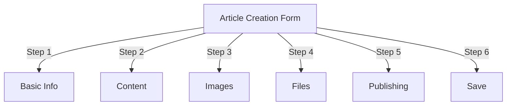
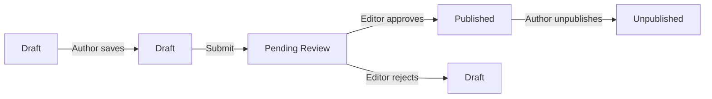
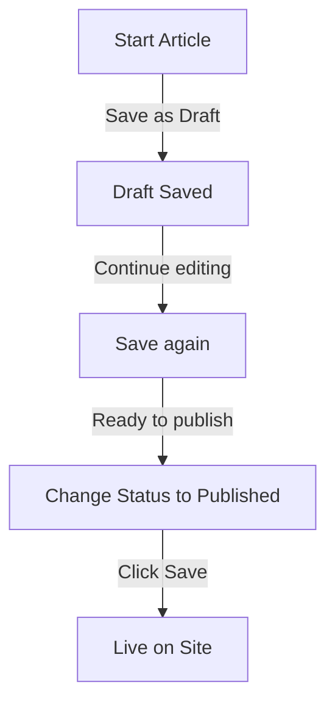

# Creating Articles in Publisher

> Step-by-step guide to creating, editing, formatting, and publishing articles in the Publisher module.

---

## Access Article Management

### Admin Panel Navigation

```
Admin Panel
└── Modules
    └── Publisher
        └── Articles
            ├── Create New
            ├── Edit
            ├── Delete
            └── Publish
```

### Quickest Path

1. Log in as **Administrator**
2. Click **Modules** in admin bar
3. Find **Publisher**
4. Click **Admin** link
5. Click **Articles** in left menu
6. Click **Add Article** button

---

## Article Creation Form

### Basic Information

When creating a new article, fill in the following sections:



---

## Step 1: Basic Information

### Required Fields

#### Article Title

```
Field: Title
Type: Text input (required)
Max length: 255 characters
Example: "Top 5 Tips for Better Photography"
```

**Guidelines:**
- Descriptive and specific
- Include keywords for SEO
- Avoid ALL CAPS
- Keep under 60 characters for best display

#### Select Category

```
Field: Category
Type: Dropdown (required)
Options: List of created categories
Example: Photography > Tutorials
```

**Tips:**
- Parent and subcategories available
- Pick most relevant category
- Only one category per article
- Can be changed later

#### Article Subtitle (Optional)

```
Field: Subtitle
Type: Text input (optional)
Max length: 255 characters
Example: "Learn photography fundamentals in 5 easy steps"
```

**Use for:**
- Summary headline
- Teaser text
- Extended title

### Article Description

#### Short Description

```
Field: Short Description
Type: Textarea (optional)
Max length: 500 characters
```

**Purpose:**
- Article preview text
- Displays in category listing
- Used in search results
- Meta description for SEO

**Example:**
```
"Discover essential photography techniques that will transform your photos
from ordinary to extraordinary. This comprehensive guide covers composition,
lighting, and exposure settings."
```

#### Full Content

```
Field: Article Body
Type: WYSIWYG Editor (required)
Max length: Unlimited
Format: HTML
```

The main article content area with rich text editing.

---

## Step 2: Formatting Content

### Using the WYSIWYG Editor

#### Text Formatting

```
Bold:           Ctrl+B or click [B] button
Italic:         Ctrl+I or click [I] button
Underline:      Ctrl+U or click [U] button
Strikethrough:  Alt+Shift+D or click [S] button
Subscript:      Ctrl+, (comma)
Superscript:    Ctrl+. (period)
```

#### Heading Structure

Create proper document hierarchy:

```html
<h1>Article Title</h1>      <!-- Use once at top -->
<h2>Main Section</h2>        <!-- For major sections -->
<h3>Subsection</h3>          <!-- For subtopics -->
<h4>Sub-subsection</h4>      <!-- For details -->
```

**In Editor:**
- Click **Format** dropdown
- Select heading level (H1-H6)
- Type your heading

#### Lists

**Unordered List (Bullets):**

```markdown
• Point one
• Point two
• Point three
```

Steps in editor:
1. Click [≡] Bullet list button
2. Type each point
3. Press Enter for next item
4. Press Backspace twice to end list

**Ordered List (Numbered):**

```markdown
1. First step
2. Second step
3. Third step
```

Steps in editor:
1. Click [1.] Numbered list button
2. Type each item
3. Press Enter for next
4. Press Backspace twice to end

**Nested Lists:**

```markdown
1. Main point
   a. Sub-point
   b. Sub-point
2. Next point
```

Steps:
1. Create first list
2. Press Tab to indent
3. Create nested items
4. Press Shift+Tab to outdent

#### Links

**Add Hyperlink:**

1. Select text to link
2. Click **[🔗] Link** button
3. Enter URL: `https://example.com`
4. Optional: Add title/target
5. Click **Insert Link**

**Remove Link:**

1. Click within linked text
2. Click **[🔗] Remove Link** button

#### Code & Quotes

**Blockquote:**

```
"This is an important quote from an expert"
- Attribution
```

Steps:
1. Type quote text
2. Click **[❝] Blockquote** button
3. Text is indented and styled

**Code Block:**

```python
def hello_world():
    print("Hello, World!")
```

Steps:
1. Click **Format → Code**
2. Paste code
3. Select language (optional)
4. Code displays with syntax highlight

---

## Step 3: Adding Images

### Featured Image (Hero Image)

```
Field: Featured Image / Main Image
Type: Image upload
Format: JPG, PNG, GIF, WebP
Max size: 5 MB
Recommended: 600x400 px
```

**To Upload:**

1. Click **Upload Image** button
2. Select image from computer
3. Crop/resize if needed
4. Click **Use This Image**

**Image Placement:**
- Displays at top of article
- Used in category listings
- Shown in archive
- Used for social sharing

### Inline Images

Insert images within article text:

1. Position cursor in editor where image should go
2. Click **[🖼️] Image** button in toolbar
3. Choose upload option:
   - Upload new image
   - Select from gallery
   - Enter image URL
4. Configure:
   ```
   Image Size:
   - Width: 300-600 px
   - Height: Auto (maintains ratio)
   - Alignment: Left/Center/Right
   ```
5. Click **Insert Image**

**Wrap Text Around Image:**

In editor after inserting:

```html
<!-- Image floats left, text wraps around -->

```

### Image Gallery

Create multi-image gallery:

1. Click **Gallery** button (if available)
2. Upload multiple images:
   - Single click: Add one
   - Drag & drop: Add multiple
3. Arrange order by dragging
4. Set captions for each image
5. Click **Create Gallery**

---

## Step 4: Attaching Files

### Add File Attachments

```
Field: File Attachments
Type: File upload (multiple allowed)
Supported: PDF, DOC, XLS, ZIP, etc.
Max per file: 10 MB
Max per article: 5 files
```

**To Attach:**

1. Click **Add File** button
2. Select file from computer
3. Optional: Add file description
4. Click **Attach File**
5. Repeat for multiple files

**File Examples:**
- PDF guides
- Excel spreadsheets
- Word documents
- ZIP archives
- Source code

### Manage Attached Files

**Edit File:**

1. Click file name
2. Edit description
3. Click **Save**

**Delete File:**

1. Find file in list
2. Click **[×] Delete** icon
3. Confirm deletion

---

## Step 5: Publishing & Status

### Article Status

```
Field: Status
Type: Dropdown
Options:
  - Draft: Not published, only author sees
  - Pending: Waiting for approval
  - Published: Live on site
  - Archived: Old content
  - Unpublished: Was published, now hidden
```

**Status Workflow:**



### Publishing Options

#### Publish Immediately

```
Status: Published
Start Date: Today (auto-filled)
End Date: (leave blank for no expiration)
```

#### Schedule for Later

```
Status: Scheduled
Start Date: Future date/time
Example: February 15, 2024 at 9:00 AM
```

The article will automatically publish at specified time.

#### Set Expiration

```
Enable Expiration: Yes
Expiration Date: Future date
Action: Archive/Hide/Delete
Example: April 1, 2024 (article auto-archives)
```

### Visibility Options

```yaml
Show Article:
  - Display on front page: Yes/No
  - Show in category: Yes/No
  - Include in search: Yes/No
  - Include in recent articles: Yes/No

Featured Article:
  - Mark as featured: Yes/No
  - Featured section position: (number)
```

---

## Step 6: SEO & Metadata

### SEO Settings

```
Field: SEO Settings (Expand section)
```

#### Meta Description

```
Field: Meta Description
Type: Text (160 characters recommended)
Used by: Search engines, social media

Example:
"Learn photography fundamentals in 5 easy steps.
Discover composition, lighting, and exposure techniques."
```

#### Meta Keywords

```
Field: Meta Keywords
Type: Comma-separated list
Max: 5-10 keywords

Example: Photography, Tutorial, Composition, Lighting, Exposure
```

#### URL Slug

```
Field: URL Slug (auto-generated from title)
Type: Text
Format: lowercase, hyphens, no spaces

Auto: "top-5-tips-for-better-photography"
Edit: Change before publishing
```

#### Open Graph Tags

Auto-generated from article info:
- Title
- Description
- Featured image
- Article URL
- Publication date

Used by Facebook, LinkedIn, WhatsApp, etc.

---

## Step 7: Comments & Interaction

### Comment Settings

```yaml
Allow Comments:
  - Enable: Yes/No
  - Default: Inherit from preferences
  - Override: Specific to this article

Moderate Comments:
  - Require approval: Yes/No
  - Default: Inherit from preferences
```

### Rating Settings

```yaml
Allow Ratings:
  - Enable: Yes/No
  - Scale: 5 stars (default)
  - Show average: Yes/No
  - Show count: Yes/No
```

---

## Step 8: Advanced Options

### Author & Byline

```
Field: Author
Type: Dropdown
Default: Current user
Options: All users with author permission

Display:
  - Show author name: Yes/No
  - Show author bio: Yes/No
  - Show author avatar: Yes/No
```

### Edit Lock

```
Field: Edit Lock
Purpose: Prevent accidental changes

Lock Article:
  - Locked: Yes/No
  - Lock reason: "Final version"
  - Unlock date: (optional)
```

### Revision History

Auto-saved versions of article:

```
View Revisions:
  - Click "Revision History"
  - Shows all saved versions
  - Compare versions
  - Restore previous version
```

---

## Saving & Publishing

### Save Workflow



### Save Article

**Auto-save:**
- Triggered every 60 seconds
- Saves as draft automatically
- Shows "Last saved: 2 minutes ago"

**Manual Save:**
- Click **Save & Continue** to keep editing
- Click **Save & View** to see published version
- Click **Save** to save and close

### Publish Article

1. Set **Status**: Published
2. Set **Start Date**: Now (or future date)
3. Click **Save** or **Publish**
4. Confirmation message appears
5. Article is live (or scheduled)

---

## Editing Existing Articles

### Access Article Editor

1. Go to **Admin → Publisher → Articles**
2. Find article in list
3. Click **Edit** icon/button
4. Make changes
5. Click **Save**

### Bulk Edit

Edit multiple articles at once:

```
1. Go to Articles list
2. Select articles (checkboxes)
3. Choose "Bulk Edit" from dropdown
4. Change selected field
5. Click "Update All"

Available for:
  - Status
  - Category
  - Featured (Yes/No)
  - Author
```

### Preview Article

Before publishing:

1. Click **Preview** button
2. View as readers will see
3. Check formatting
4. Test links
5. Return to editor to adjust

---

## Article Management

### View All Articles

**Articles List View:**

```
Admin → Publisher → Articles

Columns:
  - Title
  - Category
  - Author
  - Status
  - Created date
  - Modified date
  - Actions (Edit, Delete, Preview)

Sorting:
  - By title (A-Z)
  - By date (newest/oldest)
  - By status (Published/Draft)
  - By category
```

### Filter Articles

```
Filter Options:
  - By category
  - By status
  - By author
  - By date range
  - Search by title

Example: Show all "Draft" articles by "John" in "News" category
```

### Delete Article

**Soft Delete (Recommended):**

1. Change **Status**: Unpublished
2. Click **Save**
3. Article hidden but not deleted
4. Can be restored later

**Hard Delete:**

1. Select article in list
2. Click **Delete** button
3. Confirm deletion
4. Article removed permanently

---

## Content Best Practices

### Writing Quality Articles

```
Structure:
  ✓ Compelling title
  ✓ Clear subtitle/description
  ✓ Engaging opening paragraph
  ✓ Logical sections with headers
  ✓ Supporting visuals
  ✓ Conclusion/summary
  ✓ Call-to-action

Length:
  - Blog posts: 500-2000 words
  - News: 300-800 words
  - Guides: 2000-5000 words
  - Minimum: 300 words
```

### SEO Optimization

```
Title Optimization:
  ✓ Include primary keyword
  ✓ Keep under 60 characters
  ✓ Put keyword near beginning
  ✓ Be descriptive and specific

Content Optimization:
  ✓ Use headings (H1, H2, H3)
  ✓ Include keyword in heading
  ✓ Use bold for important terms
  ✓ Add descriptive links
  ✓ Include images with alt text

Meta Description:
  ✓ Include primary keyword
  ✓ 155-160 characters
  ✓ Action-oriented
  ✓ Unique per article
```

### Formatting Tips

```
Readability:
  ✓ Short paragraphs (2-4 sentences)
  ✓ Bullet points for lists
  ✓ Subheadings every 300 words
  ✓ Generous whitespace
  ✓ Line breaks between sections

Visual Appeal:
  ✓ Featured image at top
  ✓ Inline images in content
  ✓ Alt text on all images
  ✓ Code blocks for technical
  ✓ Blockquotes for emphasis
```

---

## Keyboard Shortcuts

### Editor Shortcuts

```
Bold:               Ctrl+B
Italic:             Ctrl+I
Underline:          Ctrl+U
Link:               Ctrl+K
Save Draft:         Ctrl+S
```

### Text Shortcuts

```
-- →  (dash to em dash)
... → … (three dots to ellipsis)
(c) → © (copyright)
(r) → ® (registered)
(tm) → ™ (trademark)
```

---

## Common Tasks

### Copy Article

1. Open article
2. Click **Duplicate** or **Clone** button
3. Article copied as draft
4. Edit title and content
5. Publish

### Schedule Article

1. Create article
2. Set **Start Date**: Future date/time
3. Set **Status**: Published
4. Click **Save**
5. Article publishes automatically

### Batch Publishing

1. Create articles as drafts
2. Set publish dates
3. Articles auto-publish at scheduled times
4. Monitor from "Scheduled" view

### Move Between Categories

1. Edit article
2. Change **Category** dropdown
3. Click **Save**
4. Article appears in new category

---

## Troubleshooting

### Problem: Can't save article

**Solution:**
```
1. Check form for required fields
2. Verify category is selected
3. Check PHP memory limit
4. Try saving as draft first
5. Clear browser cache
```

### Problem: Images not displaying

**Solution:**
```
1. Verify image upload succeeded
2. Check image file format (JPG, PNG)
3. Verify image path in database
4. Check upload directory permissions
5. Try re-uploading image
```

### Problem: Editor toolbar not showing

**Solution:**
```
1. Clear browser cache
2. Try different browser
3. Disable browser extensions
4. Check JavaScript console for errors
5. Verify editor plugin installed
```

### Problem: Article not publishing

**Solution:**
```
1. Verify Status = "Published"
2. Check Start Date is today or earlier
3. Verify permissions allow publishing
4. Check category is published
5. Clear module cache
```

---

## Related Guides

- [[Basic-Configuration|Configuration Guide]]
- [[Managing-Categories|Category Management]]
- [[Permissions-Setup|Permission Setup]]
- [[../Developer-Guide/Custom-Templates|Custom Templates]]

---

## Next Steps

- Create your first [[Creating-Articles|Article]]
- Set up [[Managing-Categories|Categories]]
- Configure [[Permissions-Setup|Permissions]]
- Review [[../Developer-Guide/Custom-Templates|Template Customization]]

---

#publisher #articles #content #creation #formatting #editing #xoops
