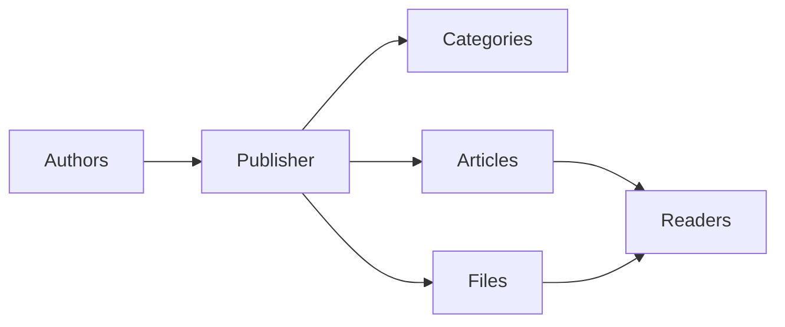
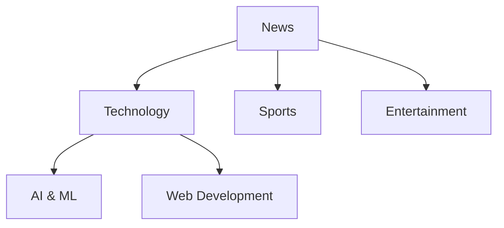
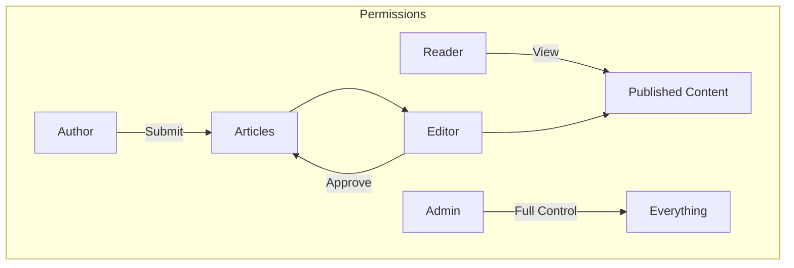
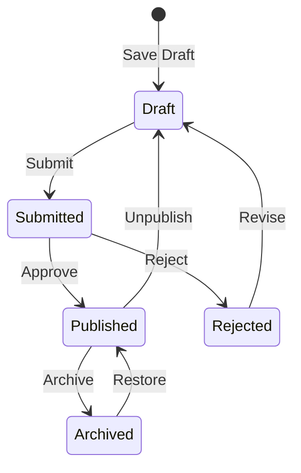

# Getting Started with Publisher

> A step-by-step guide to setting up and using the Publisher news/blog module.

---

## What is Publisher?

Publisher is the premier content management module for XOOPS, designed for:

- **News Sites** - Publish articles with categories
- **Blogs** - Personal or multi-author blogging``
- **Documentation** - Organized knowledge bases
- **Content Portals** - Mixed media content



---

## Quick Setup

### Step 1: Install Publisher

1. Download from [GitHub](https://github.com/XoopsModules25x/publisher)
2. Upload to `modules/publisher/`
3. Go to Admin → Modules → Install

### Step 2: Create Categories



1. Admin → Publisher → Categories
2. Click "Add Category"
3. Fill in:
   - **Name**: Category name
   - **Description**: What this category contains
   - **Image**: Optional category image
4. Set permissions (who can submit/view)
5. Save

### Step 3: Configure Settings

1. Admin → Publisher → Preferences
2. Key settings to configure:

| Setting | Recommended | Description |
|---------|-------------|-------------|
| Items per page | 10-20 | Articles on index |
| Editor | TinyMCE/CKEditor | Rich text editor |
| Allow ratings | Yes | Reader feedback |
| Allow comments | Yes | Discussions |
| Auto-approve | No | Editorial control |

### Step 4: Create Your First Article

1. Main menu → Publisher → Submit Article
2. Fill in the form:
   - **Title**: Article headline
   - **Category**: Where it belongs
   - **Summary**: Short description
   - **Body**: Full article content
3. Add optional elements:
   - Featured image
   - File attachments
   - SEO settings
4. Submit for review or publish

---

## User Roles



### Reader
- View published articles
- Rate and comment
- Search content

### Author
- Submit new articles
- Edit own articles
- Attach files

### Editor
- Approve/reject submissions
- Edit any article
- Manage categories

### Administrator
- Full module control
- Configure settings
- Manage permissions

---

## Writing Articles

### Article Editor

```
┌─────────────────────────────────────────────────────┐
│ Title: [Your Article Title                        ] │
├─────────────────────────────────────────────────────┤
│ Category: [Select Category          ▼]              │
├─────────────────────────────────────────────────────┤
│ Summary:                                            │
│ ┌─────────────────────────────────────────────────┐ │
│ │ Brief description shown in listings...          │ │
│ └─────────────────────────────────────────────────┘ │
├─────────────────────────────────────────────────────┤
│ Body:                                               │
│ ┌─────────────────────────────────────────────────┐ │
│ │ [B] [I] [U] [Link] [Image] [Code]               │ │
│ ├─────────────────────────────────────────────────┤ │
│ │                                                  │ │
│ │ Full article content goes here...               │ │
│ │                                                  │ │
│ └─────────────────────────────────────────────────┘ │
├─────────────────────────────────────────────────────┤
│ [Submit] [Preview] [Save Draft]                     │
└─────────────────────────────────────────────────────┘
```

### Best Practices

1. **Compelling titles** - Clear, engaging headlines
2. **Good summaries** - Entice readers to click
3. **Structured content** - Use headings, lists, images
4. **Proper categorization** - Help readers find content
5. **SEO optimization** - Keywords in title and content

---

## Managing Content

### Article Status Flow



### Status Descriptions

| Status | Description |
|--------|-------------|
| Draft | Work in progress |
| Submitted | Awaiting review |
| Published | Live on site |
| Expired | Past expiration date |
| Rejected | Needs revision |
| Archived | Removed from listings |

---

## Navigation

### Accessing Publisher

- **Main Menu** → Publisher
- **Direct URL**: `yoursite.com/modules/publisher/`

### Key Pages

| Page | URL | Purpose |
|------|-----|---------|
| Index | `/modules/publisher/` | Article listings |
| Category | `/modules/publisher/category.php?id=X` | Category articles |
| Article | `/modules/publisher/item.php?itemid=X` | Single article |
| Submit | `/modules/publisher/submit.php` | New article |
| Search | `/modules/publisher/search.php` | Find articles |

---

## Blocks

Publisher provides several blocks for your site:

### Recent Articles
Displays latest published articles

### Category Menu
Navigation by category

### Popular Articles
Most viewed content

### Random Article
Showcase random content

### Spotlight
Featured articles

---

## Related Documentation

- [[Creating-Articles|Creating and Editing Articles]]
- [[Managing-Categories|Managing Categories]]
- [[../Developer-Guide/Extending-Publisher|Extending Publisher]]

---

#xoops #publisher #user-guide #getting-started #cms
