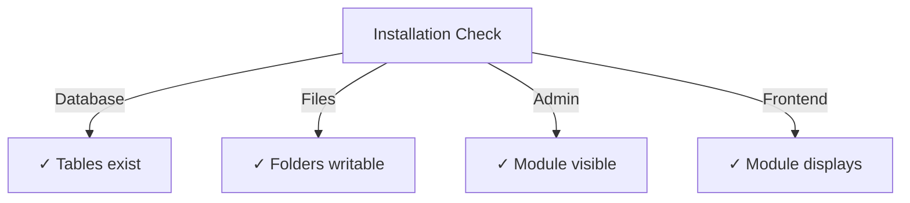

# Publisher Installation Guide

> Complete instructions for installing and configuring the Publisher module for XOOPS CMS.

---

## System Requirements

### Minimum Requirements

| Requirement | Version | Notes |
|-------------|---------|-------|
| XOOPS | 2.5.10+ | Core CMS platform |
| PHP | 7.1+ | PHP 8.x recommended |
| MySQL | 5.7+ | Database server |
| Web Server | Apache/Nginx | With rewrite support |

### PHP Extensions

```
- PDO (PHP Data Objects)
- pdo_mysql or mysqli
- mb_string (multibyte strings)
- curl (for external content)
- json
- gd (image processing)
```

### Disk Space

- **Module files**: ~5 MB
- **Cache directory**: 50+ MB recommended
- **Upload directory**: As needed for content

---

## Pre-Installation Checklist

Before installing Publisher, verify:

- [ ] XOOPS core is installed and running
- [ ] Admin account has module management permissions
- [ ] Database backup created
- [ ] File permissions allow write access to `/modules/` directory
- [ ] PHP memory limit is at least 128 MB
- [ ] File upload size limits are appropriate (min 10 MB)

---

## Installation Steps

### Step 1: Download Publisher

#### Option A: From GitHub (Recommended)

```bash
# Navigate to modules directory
cd /path/to/xoops/htdocs/modules/

# Clone the repository
git clone https://github.com/XoopsModules25x/publisher.git

# Verify download
ls -la publisher/
```

#### Option B: Manual Download

1. Visit [GitHub Publisher Releases](https://github.com/XoopsModules25x/publisher/releases)
2. Download the latest `.zip` file
3. Extract to `modules/publisher/`

### Step 2: Set File Permissions

```bash
# Set proper ownership
chown -R www-data:www-data /path/to/xoops/htdocs/modules/publisher

# Set directory permissions (755)
find publisher -type d -exec chmod 755 {} \;

# Set file permissions (644)
find publisher -type f -exec chmod 644 {} \;

# Make scripts executable
chmod 755 publisher/admin/index.php
chmod 755 publisher/index.php
```

### Step 3: Install via XOOPS Admin

1. Log in to **XOOPS Admin Panel** as administrator
2. Navigate to **System → Modules**
3. Click **Install Module**
4. Find **Publisher** in the list
5. Click **Install** button
6. Wait for installation to complete (shows database tables created)

```
Installation Progress:
✓ Tables created
✓ Configuration initialized
✓ Permissions set
✓ Cache cleared
Installation Complete!
```

---

## Initial Setup

### Step 1: Access Publisher Admin

1. Go to **Admin Panel → Modules**
2. Find **Publisher** module
3. Click **Admin** link
4. You're now in Publisher Administration

### Step 2: Configure Module Preferences

1. Click **Preferences** in the left menu
2. Configure basic settings:

```
General Settings:
- Editor: Select your WYSIWYG editor
- Items per page: 10
- Show breadcrumb: Yes
- Allow comments: Yes
- Allow ratings: Yes

SEO Settings:
- SEO URLs: No (enable later if needed)
- URL rewriting: None

Upload Settings:
- Max upload size: 5 MB
- Allowed file types: jpg, png, gif, pdf, doc, docx
```

3. Click **Save Settings**

### Step 3: Create First Category

1. Click **Categories** in left menu
2. Click **Add Category**
3. Fill in form:

```
Category Name: News
Description: Latest news and updates
Image: (optional) Upload category image
Parent Category: (leave blank for top-level)
Status: Enabled
```

4. Click **Save Category**

### Step 4: Verify Installation

Check these indicators:



#### Database Check

```bash
mysql -u xoops_user -p xoops_database
mysql> SHOW TABLES LIKE 'publisher%';

# Should show tables:
# - publisher_categories
# - publisher_items
# - publisher_comments
# - publisher_files
```

#### Front-End Check

1. Visit your XOOPS homepage
2. Look for **Publisher** or **News** block
3. Should display recent articles

---

## Configuration After Installation

### Editor Selection

Publisher supports multiple WYSIWYG editors:

| Editor | Pros | Cons |
|--------|------|------|
| FCKeditor | Feature-rich | Older, larger |
| CKEditor | Modern standard | Config complexity |
| TinyMCE | Lightweight | Limited features |
| DHTML Editor | Basic | Very basic |

**To change editor:**

1. Go to **Preferences**
2. Scroll to **Editor** setting
3. Select from dropdown
4. Save and test

### Upload Directory Setup

```bash
# Create upload directories
mkdir -p /path/to/xoops/uploads/publisher/
mkdir -p /path/to/xoops/uploads/publisher/categories/
mkdir -p /path/to/xoops/uploads/publisher/images/
mkdir -p /path/to/xoops/uploads/publisher/files/

# Set permissions
chmod 755 /path/to/xoops/uploads/publisher/
chmod 755 /path/to/xoops/uploads/publisher/*
```

### Configure Image Sizes

In Preferences, set thumbnail sizes:

```
Category image size: 300 x 200 px
Article image size: 600 x 400 px
Thumbnail size: 150 x 100 px
```

---

## Post-Installation Steps

### 1. Set Group Permissions

1. Go to **Permissions** in admin menu
2. Configure access for groups:
   - Anonymous: View only
   - Registered Users: Submit articles
   - Editors: Approve/edit articles
   - Admins: Full access

### 2. Configure Module Visibility

1. Go to **Blocks** in XOOPS admin
2. Find Publisher blocks:
   - Publisher - Latest Articles
   - Publisher - Categories
   - Publisher - Archives
3. Configure block visibility per page

### 3. Import Test Content (Optional)

For testing, import sample articles:

1. Go to **Publisher Admin → Import**
2. Select **Sample Content**
3. Click **Import**

### 4. Enable SEO URLs (Optional)

For search-friendly URLs:

1. Go to **Preferences**
2. Set **SEO URLs**: Yes
3. Enable **.htaccess** rewriting
4. Verify `.htaccess` file exists in Publisher folder

```apache
# .htaccess example
<IfModule mod_rewrite.c>
    RewriteEngine On
    RewriteBase /modules/publisher/
    RewriteRule ^category/([0-9]+)-(.*)\.html$ index.php?op=showcategory&categoryid=$1 [L]
    RewriteRule ^article/([0-9]+)-(.*)\.html$ index.php?op=showitem&itemid=$1 [L]
</IfModule>
```

---

## Troubleshooting Installation

### Problem: Module doesn't appear in admin

**Solution:**
```bash
# Check file permissions
ls -la /path/to/xoops/modules/publisher/

# Check xoops_version.php exists
ls /path/to/xoops/modules/publisher/xoops_version.php

# Verify PHP syntax
php -l /path/to/xoops/modules/publisher/xoops_version.php
```

### Problem: Database tables not created

**Solution:**
1. Check MySQL user has CREATE TABLE privilege
2. Check database error log:
   ```bash
   mysql> SHOW WARNINGS;
   ```
3. Manually import SQL:
   ```bash
   mysql -u user -p database < modules/publisher/sql/mysql.sql
   ```

### Problem: File upload fails

**Solution:**
```bash
# Check directory exists and is writable
stat /path/to/xoops/uploads/publisher/

# Fix permissions
chmod 777 /path/to/xoops/uploads/publisher/

# Verify PHP settings
php -i | grep upload_max_filesize
```

### Problem: "Page not found" errors

**Solution:**
1. Check `.htaccess` file is present
2. Verify Apache `mod_rewrite` is enabled:
   ```bash
   a2enmod rewrite
   systemctl restart apache2
   ```
3. Check `AllowOverride All` in Apache config

---

## Upgrade from Previous Versions

### From Publisher 1.x to 2.x

1. **Backup current installation:**
   ```bash
   cp -r modules/publisher/ modules/publisher-backup/
   mysqldump -u user -p database > publisher-backup.sql
   ```

2. **Download Publisher 2.x**

3. **Overwrite files:**
   ```bash
   rm -rf modules/publisher/
   unzip publisher-2.0.zip -d modules/
   ```

4. **Run update:**
   - Go to **Admin → Publisher → Update**
   - Click **Update Database**
   - Wait for completion

5. **Verify:**
   - Check all articles display correctly
   - Verify permissions are intact
   - Test file uploads

---

## Security Considerations

### File Permissions

```
- Core files: 644 (readable by web server)
- Directories: 755 (browseable by web server)
- Upload directories: 755 or 777
- Config files: 600 (not readable by web)
```

### Disable Direct Access to Sensitive Files

Create `.htaccess` in upload directories:

```apache
<FilesMatch "\.(php|phtml|php3|php4|php5|phtml)$">
    Deny from all
</FilesMatch>
```

### Database Security

```bash
# Use strong password
ALTER USER 'publisher_user'@'localhost' IDENTIFIED BY 'strong_password_here';

# Grant minimal permissions
GRANT SELECT, INSERT, UPDATE, DELETE ON publisher_db.* TO 'publisher_user'@'localhost';
FLUSH PRIVILEGES;
```

---

## Verification Checklist

After installation, verify:

- [ ] Module appears in admin modules list
- [ ] Can access Publisher admin section
- [ ] Can create categories
- [ ] Can create articles
- [ ] Articles display on front-end
- [ ] File uploads work
- [ ] Images display correctly
- [ ] Permissions are applied correctly
- [ ] Database tables created
- [ ] Cache directory is writable

---

## Next Steps

After successful installation:

1. Read [[Basic-Configuration|Basic Configuration Guide]]
2. Create your first [[../User-Guide/Creating-Articles|Article]]
3. Set up [[../User-Guide/Permissions-Setup|Group Permissions]]
4. Review [[../User-Guide/Managing-Categories|Category Management]]

---

## Support & Resources

- **GitHub Issues**: [Publisher Issues](https://github.com/XoopsModules25x/publisher/issues)
- **XOOPS Forum**: [Community Support](https://www.xoops.org/modules/newbb/)
- **GitHub Wiki**: [Installation Help](https://github.com/XoopsModules25x/publisher/wiki)

---

#publisher #installation #setup #xoops #module #configuration
