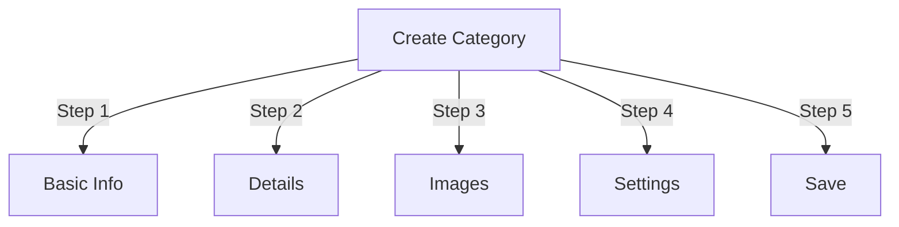

# Managing Categories in Publisher

> Complete guide to creating, organizing hierarchies, and managing categories in the Publisher module.

---

## Category Basics

### What Are Categories?

Categories organize articles into logical groups:

```
Example Structure:

  News (Main Category)
    ├── Technology
    ├── Sports
    └── Entertainment

  Tutorials (Main Category)
    ├── Photography
    │   ├── Basics
    │   └── Advanced
    └── Writing
        └── Blogging
```

### Benefits of Good Category Structure

```
✓ Better user navigation
✓ Organized content
✓ Improved SEO
✓ Easier content management
✓ Better editorial workflow
```

---

## Access Category Management

### Admin Panel Navigation

```
Admin Panel
└── Modules
    └── Publisher
        └── Categories
            ├── Create New
            ├── Edit
            ├── Delete
            ├── Permissions
            └── Organize
```

### Quick Access

1. Log in as **Administrator**
2. Go to **Admin → Modules**
3. Click **Publisher → Admin**
4. Click **Categories** in left menu

---

## Creating Categories

### Category Creation Form



### Step 1: Basic Information

#### Category Name

```
Field: Category Name
Type: Text input (required)
Max length: 100 characters
Uniqueness: Should be unique
Example: "Photography"
```

**Guidelines:**
- Descriptive and singular or plural consistently
- Capitalized properly
- Avoid special characters
- Keep reasonably short

#### Category Description

```
Field: Description
Type: Textarea (optional)
Max length: 500 characters
Used in: Category listing pages, category blocks
```

**Purpose:**
- Explains category content
- Appears above category articles
- Helps users understand scope
- Used for SEO meta description

**Example:**
```
"Photography tips, tutorials, and inspiration for
all skill levels. From composition basics to advanced
lighting techniques, master your craft."
```

### Step 2: Parent Category

#### Create Hierarchy

```
Field: Parent Category
Type: Dropdown
Options: None (root), or existing categories
```

**Hierarchy Examples:**

```
Flat Structure:
  News
  Tutorials
  Reviews

Nested Structure:
  News
    Technology
    Business
    Sports
  Tutorials
    Photography
      Basics
      Advanced
    Writing
```

**Create Subcategory:**

1. Click **Parent Category** dropdown
2. Select parent (e.g., "News")
3. Fill in category name
4. Save
5. New category appears as child

### Step 3: Category Image

#### Upload Category Image

```
Field: Category Image
Type: Image upload (optional)
Format: JPG, PNG, GIF, WebP
Max size: 5 MB
Recommended: 300x200 px (or your theme size)
```

**To Upload:**

1. Click **Upload Image** button
2. Select image from computer
3. Crop/resize if needed
4. Click **Use This Image**

**Where Used:**
- Category listing page
- Category block header
- Breadcrumb (some themes)
- Social media sharing

### Step 4: Category Settings

#### Display Settings

```yaml
Status:
  - Enabled: Yes/No
  - Hidden: Yes/No (hidden from menus, still accessible)

Display Options:
  - Show description: Yes/No
  - Show image: Yes/No
  - Show article count: Yes/No
  - Show subcategories: Yes/No

Layout:
  - Items per page: 10-50
  - Display order: Date/Title/Author
  - Display direction: Ascending/Descending
```

#### Category Permissions

```yaml
Who Can View:
  - Anonymous: Yes/No
  - Registered: Yes/No
  - Specific groups: Configure per group

Who Can Submit:
  - Registered: Yes/No
  - Specific groups: Configure per group
  - Author must have: "submit articles" permission
```

### Step 5: SEO Settings

#### Meta Tags

```
Field: Meta Description
Type: Text (160 characters)
Purpose: Search engine description

Field: Meta Keywords
Type: Comma-separated list
Example: photography, tutorials, tips, techniques
```

#### URL Configuration

```
Field: URL Slug
Type: Text
Auto-generated from category name
Example: "photography" from "Photography"
Can be customized before saving
```

### Save Category

1. Fill all required fields:
   - Category Name ✓
   - Description (recommended)
2. Optional: Upload image, set SEO
3. Click **Save Category**
4. Confirmation message appears
5. Category is now available

---

## Category Hierarchy

### Create Nested Structure

```
Step-by-step example: Create News → Technology subcategory

1. Go to Categories admin
2. Click "Add Category"
3. Name: "News"
4. Parent: (leave blank - this is root)
5. Save
6. Click "Add Category" again
7. Name: "Technology"
8. Parent: "News" (select from dropdown)
9. Save
```

### View Hierarchy Tree

```
Categories view shows tree structure:

📁 News
  📄 Technology
  📄 Sports
  📄 Entertainment
📁 Tutorials
  📄 Photography
    📄 Basics
    📄 Advanced
  📄 Writing
```

Click expand arrows to show/hide subcategories.

### Reorganize Categories

#### Move Category

1. Go to Categories list
2. Click **Edit** on category
3. Change **Parent Category**
4. Click **Save**
5. Category moved to new position

#### Reorder Categories

If available, use drag-and-drop:

1. Go to Categories list
2. Click and drag category
3. Drop in new position
4. Order saves automatically

#### Delete Category

**Option 1: Soft Delete (Hide)**

1. Edit category
2. Set **Status**: Disabled
3. Click **Save**
4. Category hidden but not deleted

**Option 2: Hard Delete**

1. Go to Categories list
2. Click **Delete** on category
3. Choose action for articles:
   ```
   ☐ Move articles to parent category
   ☐ Move articles to root (News)
   ☐ Delete all articles in category
   ```
4. Confirm deletion

---

## Category Operations

### Edit Category

1. Go to **Admin → Publisher → Categories**
2. Click **Edit** on category
3. Modify fields:
   - Name
   - Description
   - Parent category
   - Image
   - Settings
4. Click **Save**

### Edit Category Permissions

1. Go to Categories
2. Click **Permissions** on category (or click category then click Permissions)
3. Configure groups:

```
For each group:
  ☐ View articles in this category
  ☐ Submit articles to this category
  ☐ Edit own articles
  ☐ Edit all articles
  ☐ Approve/Moderate articles
  ☐ Manage category
```

4. Click **Save Permissions**

### Set Category Image

**Upload new image:**

1. Edit category
2. Click **Change Image**
3. Upload or select image
4. Crop/resize
5. Click **Use Image**
6. Click **Save Category**

**Remove image:**

1. Edit category
2. Click **Remove Image** (if available)
3. Click **Save Category**

---

## Category Permissions

### Permission Matrix

```
                 Anonymous  Registered  Editor  Admin
View category        ✓         ✓         ✓       ✓
Submit article       ✗         ✓         ✓       ✓
Edit own article     ✗         ✓         ✓       ✓
Edit all articles    ✗         ✗         ✓       ✓
Moderate articles    ✗         ✗         ✓       ✓
Manage category      ✗         ✗         ✗       ✓
```

### Set Category-Level Permissions

#### Per-Category Access Control

1. Go to **Categories** list
2. Select a category
3. Click **Permissions**
4. For each group, select permissions:

```
Example: News category
  Anonymous:   View only
  Registered:  Submit articles
  Editors:     Approve articles
  Admins:      Full control
```

5. Click **Save**

#### Field-Level Permissions

Control which form fields users can see/edit:

```
Example: Limit field visibility for Registered users

Registered users can see/edit:
  ✓ Title
  ✓ Description
  ✓ Content
  ✗ Author (auto-set to current user)
  ✗ Scheduled date (only editors)
  ✗ Featured (only admins)
```

**Configure in:**
- Category Permissions
- Look for "Field Visibility" section

---

## Best Practices for Categories

### Category Structure

```
✓ Keep hierarchy 2-3 levels deep
✗ Don't create too many top-level categories
✗ Don't create categories with one article

✓ Use consistent naming (plural or singular)
✗ Don't use vague names ("Stuff", "Other")

✓ Create categories for articles that exist
✗ Don't create empty categories in advance
```

### Naming Guidelines

```
Good names:
  "Photography"
  "Web Development"
  "Travel Tips"
  "Business News"

Avoid:
  "Articles" (too vague)
  "Content" (redundant)
  "News&Updates" (inconsistent)
  "PHOTOGRAPHY STUFF" (formatting)
```

### Organization Tips

```
By Topic:
  News
    Technology
    Sports
    Entertainment

By Type:
  Tutorials
    Video
    Text
    Interactive

By Audience:
  For Beginners
  For Experts
  Case Studies

Geographic:
  North America
    United States
    Canada
  Europe
```

---

## Category Blocks

### Publisher Category Block

Display category listings on your site:

1. Go to **Admin → Blocks**
2. Find **Publisher - Categories**
3. Click **Edit**
4. Configure:

```
Block Title: "News Categories"
Show subcategories: Yes/No
Show article count: Yes/No
Height: (pixels or auto)
```

5. Click **Save**

### Category Articles Block

Show latest articles from specific category:

1. Go to **Admin → Blocks**
2. Find **Publisher - Category Articles**
3. Click **Edit**
4. Select:

```
Category: News (or specific category)
Number of articles: 5
Show images: Yes/No
Show description: Yes/No
```

5. Click **Save**

---

## Category Analytics

### View Category Statistics

From Categories admin:

```
Each category shows:
  - Total articles: 45
  - Published: 42
  - Draft: 2
  - Pending approval: 1
  - Total views: 5,234
  - Latest article: 2 hours ago
```

### View Category Traffic

If analytics enabled:

1. Click category name
2. Click **Statistics** tab
3. View:
   - Page views
   - Popular articles
   - Traffic trends
   - Search terms used

---

## Category Templates

### Customize Category Display

If using custom templates, each category can override:

```
publisher_category.tpl
  ├── Category header
  ├── Category description
  ├── Category image
  ├── Article listing
  └── Pagination
```

**To customize:**

1. Copy template file
2. Modify HTML/CSS
3. Assign to category in admin
4. Category uses custom template

---

## Common Tasks

### Create News Hierarchy

```
Admin → Publisher → Categories
1. Create "News" (parent)
2. Create "Technology" (parent: News)
3. Create "Sports" (parent: News)
4. Create "Entertainment" (parent: News)
```

### Move Articles Between Categories

1. Go to **Articles** admin
2. Select articles (checkboxes)
3. Select **"Change Category"** from bulk actions dropdown
4. Choose new category
5. Click **Update All**

### Hide Category Without Deleting

1. Edit category
2. Set **Status**: Disabled/Hidden
3. Save
4. Category not shown in menus (still accessible via URL)

### Create Category for Drafts

```
Best Practice:

Create "In Review" category
  ├── Purpose: Articles awaiting approval
  ├── Permissions: Hidden from public
  ├── Only admins/editors can see
  ├── Move articles here until approved
  └── Move to "News" when published
```

---

## Import/Export Categories

### Export Categories

If available:

1. Go to **Categories** admin
2. Click **Export**
3. Select format: CSV/JSON/XML
4. Download file
5. Backup saved

### Import Categories

If available:

1. Prepare file with categories
2. Go to **Categories** admin
3. Click **Import**
4. Upload file
5. Choose update strategy:
   - Create new only
   - Update existing
   - Replace all
6. Click **Import**

---

## Troubleshooting Categories

### Problem: Subcategories not showing

**Solution:**
```
1. Verify parent category status is "Enabled"
2. Check permissions allow viewing
3. Verify subcategories have status "Enabled"
4. Clear cache: Admin → Tools → Clear Cache
5. Check theme shows subcategories
```

### Problem: Can't delete category

**Solution:**
```
1. Category must have no articles
2. Move or delete articles first:
   Admin → Articles
   Select articles in category
   Change category to another
3. Then delete empty category
4. Or choose "move articles" option when deleting
```

### Problem: Category image not showing

**Solution:**
```
1. Verify image uploaded successfully
2. Check image file format (JPG, PNG)
3. Verify upload directory permissions
4. Check theme displays category images
5. Try re-uploading image
6. Clear browser cache
```

### Problem: Permissions not taking effect

**Solution:**
```
1. Check group permissions in Category
2. Check global Publisher permissions
3. Check user belongs to configured group
4. Clear session cache
5. Log out and log back in
6. Check permission modules installed
```

---

## Category Best Practices Checklist

Before deploying categories:

- [ ] Hierarchy is 2-3 levels deep
- [ ] Each category has 5+ articles
- [ ] Category names are consistent
- [ ] Permissions are appropriate
- [ ] Category images are optimized
- [ ] Descriptions are complete
- [ ] SEO metadata filled in
- [ ] URLs are friendly
- [ ] Categories tested on front-end
- [ ] Documentation updated

---

## Related Guides

- [[Creating-Articles|Article Creation]]
- [[Permissions-Setup|Permission Management]]
- [[Basic-Configuration|Module Configuration]]
- [[Installation|Installation Guide]]

---

## Next Steps

- Create [[Creating-Articles|Articles]] in categories
- Configure [[Permissions-Setup|Permissions]]
- Customize with [[../Developer-Guide/Custom-Templates|Custom Templates]]

---

#publisher #categories #organization #hierarchy #management #xoops
