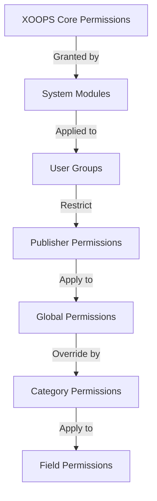

# Publisher Permissions Setup

> Complete guide to configuring group permissions, access control, and managing user access in Publisher.

---

## Permission Basics

### What Are Permissions?

Permissions control what different user groups can do in Publisher:

```
Who can:
  - View articles
  - Submit articles
  - Edit articles
  - Approve articles
  - Manage categories
  - Configure settings
```

### Permission Levels

```
Anonymous
  └── View published articles only

Registered Users
  ├── View articles
  ├── Submit articles (pending approval)
  └── Edit own articles

Editors/Moderators
  ├── All registered permissions
  ├── Approve articles
  ├── Edit all articles
  └── Manage some categories

Administrators
  └── Full access to everything
```

---

## Access Permission Management

### Navigate to Permissions

```
Admin Panel
└── Modules
    └── Publisher
        ├── Permissions
        ├── Category Permissions
        └── Group Management
```

### Quick Access

1. Log in as **Administrator**
2. Go to **Admin → Modules**
3. Click **Publisher → Admin**
4. Click **Permissions** in left menu

---

## Global Permissions

### Module-Level Permissions

Control access to Publisher module and features:

```
Permissions configuration view:
┌─────────────────────────────────────┐
│ Permission             │ Anon │ Reg │ Editor │ Admin │
├────────────────────────┼──────┼─────┼────────┼───────┤
│ View articles          │  ✓   │  ✓  │   ✓    │  ✓   │
│ Submit articles        │  ✗   │  ✓  │   ✓    │  ✓   │
│ Edit own articles      │  ✗   │  ✓  │   ✓    │  ✓   │
│ Edit all articles      │  ✗   │  ✗  │   ✓    │  ✓   │
│ Approve articles       │  ✗   │  ✗  │   ✓    │  ✓   │
│ Manage categories      │  ✗   │  ✗  │   ✗    │  ✓   │
│ Access admin panel     │  ✗   │  ✗  │   ✓    │  ✓   │
└─────────────────────────────────────┘
```

### Permission Descriptions

| Permission | Users | Effect |
|------------|-------|--------|
| **View articles** | All groups | Can see published articles on front-end |
| **Submit articles** | Registered+ | Can create new articles (pending approval) |
| **Edit own articles** | Registered+ | Can edit/delete their own articles |
| **Edit all articles** | Editors+ | Can edit any user's articles |
| **Delete own articles** | Registered+ | Can delete their own unpublished articles |
| **Delete all articles** | Editors+ | Can delete any article |
| **Approve articles** | Editors+ | Can publish pending articles |
| **Manage categories** | Admins | Create, edit, delete categories |
| **Admin access** | Editors+ | Access admin interface |

---

## Configure Global Permissions

### Step 1: Access Permission Settings

1. Go to **Admin → Modules**
2. Find **Publisher**
3. Click **Permissions** (or Admin link then Permissions)
4. You see permission matrix

### Step 2: Set Group Permissions

For each group, configure what they can do:

#### Anonymous Users

```yaml
Anonymous Group Permissions:
  View articles: ✓ YES
  Submit articles: ✗ NO
  Edit articles: ✗ NO
  Delete articles: ✗ NO
  Approve articles: ✗ NO
  Manage categories: ✗ NO
  Admin access: ✗ NO

Result: Anonymous users can only view published content
```

#### Registered Users

```yaml
Registered Group Permissions:
  View articles: ✓ YES
  Submit articles: ✓ YES (with approval required)
  Edit own articles: ✓ YES
  Edit all articles: ✗ NO
  Delete own articles: ✓ YES (drafts only)
  Delete all articles: ✗ NO
  Approve articles: ✗ NO
  Manage categories: ✗ NO
  Admin access: ✗ NO

Result: Registered users can contribute content after approval
```

#### Editors Group

```yaml
Editors Group Permissions:
  View articles: ✓ YES
  Submit articles: ✓ YES
  Edit own articles: ✓ YES
  Edit all articles: ✓ YES
  Delete own articles: ✓ YES
  Delete all articles: ✓ YES
  Approve articles: ✓ YES
  Manage categories: ✓ LIMITED
  Admin access: ✓ YES
  Configure settings: ✗ NO

Result: Editors manage content but not settings
```

#### Administrators

```yaml
Admins Group Permissions:
  ✓ FULL ACCESS to all features

  - All editor permissions
  - Manage all categories
  - Configure all settings
  - Manage permissions
  - Install/uninstall
```

### Step 3: Save Permissions

1. Configure each group's permissions
2. Check boxes for allowed actions
3. Uncheck boxes for denied actions
4. Click **Save Permissions**
5. Confirmation message appears

---

## Category-Level Permissions

### Set Category Access

Control who can view/submit to specific categories:

```
Admin → Publisher → Categories
→ Select category → Permissions
```

### Category Permission Matrix

```
                 Anonymous  Registered  Editor  Admin
View category        ✓         ✓         ✓       ✓
Submit to category   ✗         ✓         ✓       ✓
Edit own in category ✗         ✓         ✓       ✓
Edit all in category ✗         ✗         ✓       ✓
Approve in category  ✗         ✗         ✓       ✓
Manage category      ✗         ✗         ✗       ✓
```

### Configure Category Permissions

1. Go to **Categories** admin
2. Find category
3. Click **Permissions** button
4. For each group, select:
   - [ ] View this category
   - [ ] Submit articles
   - [ ] Edit own articles
   - [ ] Edit all articles
   - [ ] Approve articles
   - [ ] Manage category
5. Click **Save**

### Category Permission Examples

#### Public News Category

```
Anonymous: View only
Registered: View + Submit (pending approval)
Editors: Approve + Edit
Admins: Full control
```

#### Internal Updates Category

```
Anonymous: No access
Registered: View only
Editors: Submit + Approve
Admins: Full control
```

#### Guest Blog Category

```
Anonymous: View only
Registered: Submit (pending approval)
Editors: Approve
Admins: Full control
```

---

## Field-Level Permissions

### Control Form Field Visibility

Restrict which form fields users can see/edit:

```
Admin → Publisher → Permissions → Fields
```

### Field Options

```yaml
Visible Fields for Registered Users:
  ✓ Title
  ✓ Description
  ✓ Content (body)
  ✓ Featured image
  ✓ Category
  ✓ Tags
  ✗ Author (auto-set)
  ✗ Publication date (editors only)
  ✗ Scheduled date (editors only)
  ✗ Featured flag (editors only)
  ✗ Permissions (admins only)
```

### Examples

#### Limited Submission for Registered

Registered users see fewer options:

```
Available fields:
  - Title ✓
  - Description ✓
  - Content ✓
  - Featured image ✓
  - Category ✓

Hidden fields:
  - Author (auto-current user)
  - Publication date (editors decide)
  - Scheduled date (admins only)
  - Featured status (editors choose)
```

#### Full Form for Editors

Editors see all options:

```
Available fields:
  - All basic fields
  - All metadata
  - Author selection ✓
  - Publication date/time ✓
  - Scheduled date ✓
  - Featured status ✓
  - Expiration date ✓
  - Permissions ✓
```

---

## User Group Configuration

### Create Custom Group

1. Go to **Admin → Users → Groups**
2. Click **Create Group**
3. Enter group details:

```
Group Name: "Community Bloggers"
Group Description: "Users who contribute blog content"
Type: Regular group
```

4. Click **Save Group**
5. Go back to Publisher permissions
6. Set permissions for new group

### Group Examples

```
Suggested Groups for Publisher:

Group: Contributors
  - Regular members who submit articles
  - Can edit own articles
  - Cannot approve articles

Group: Reviewers
  - Can see submitted articles
  - Can approve/reject articles
  - Cannot delete others' articles

Group: Editors
  - Can edit any article
  - Can approve articles
  - Can moderate comments
  - Can manage some categories

Group: Publishers
  - Can edit any article
  - Can publish directly (no approval)
  - Can manage all categories
  - Can configure settings
```

---

## Permission Hierarchies

### Permission Flow



### Permission Inheritance

```
Base: Global module permissions
  ↓
Category: Overrides for specific categories
  ↓
Field: Further restricts available fields
  ↓
User: Has permission if ALL levels allow
```

**Example:**

```
User wants to edit article:
1. User group must have "edit articles" permission (global)
2. Category must allow editing (category level)
3. Field restrictions must allow (if applicable)
4. User must be author OR editor (for own vs all)

If ANY level denies → Permission denied
```

---

## Approval Workflow Permissions

### Configure Submission Approval

Control whether articles need approval:

```
Admin → Publisher → Preferences → Workflow
```

#### Approval Options

```yaml
Submission Workflow:
  Require Approval: Yes

  For Registered Users:
    - New articles: Draft (pending approval)
    - Editors must approve
    - User can edit while pending
    - After approval: User can still edit

  For Editors:
    - New articles: Publish directly (optional)
    - Skip approval queue
    - Or always require approval
```

#### Configure Per Group

1. Go to Preferences
2. Find "Submission Workflow"
3. For each group, set:

```
Group: Registered Users
  Require approval: ✓ YES
  Default status: Draft
  Can modify while pending: ✓ YES

Group: Editors
  Require approval: ✗ NO
  Default status: Published
  Can modify published: ✓ YES
```

4. Click **Save**

---

## Moderate Articles

### Approve Pending Articles

For users with "approve articles" permission:

1. Go to **Admin → Publisher → Articles**
2. Filter by **Status**: Pending
3. Click article to review
4. Check content quality
5. Set **Status**: Published
6. Optional: Add editorial notes
7. Click **Save**

### Reject Articles

If article doesn't meet standards:

1. Open article
2. Set **Status**: Draft
3. Add rejection reason (in comment or email)
4. Click **Save**
5. Send message to author explaining rejection

### Moderate Comments

If moderating comments:

1. Go to **Admin → Publisher → Comments**
2. Filter by **Status**: Pending
3. Review comment
4. Options:
   - Approve: Click **Approve**
   - Reject: Click **Delete**
   - Edit: Click **Edit**, fix, save
5. Click **Save**

---

## Manage User Access

### View User Groups

See which users belong to groups:

```
Admin → Users → User Groups

For each user:
  - Primary group (one)
  - Secondary groups (multiple)

Permissions apply from all groups (union)
```

### Add User to Group

1. Go to **Admin → Users**
2. Find user
3. Click **Edit**
4. Under **Groups**, check groups to add
5. Click **Save**

### Change User Permissions

For individual users (if supported):

1. Go to User admin
2. Find user
3. Click **Edit**
4. Look for individual permissions override
5. Configure as needed
6. Click **Save**

---

## Common Permission Scenarios

### Scenario 1: Open Blog

Allow anyone to submit:

```
Anonymous: View
Registered: Submit, edit own, delete own
Editors: Approve, edit all, delete all
Admins: Full control

Result: Open community blog
```

### Scenario 2: Moderated News Site

Strict approval process:

```
Anonymous: View only
Registered: Cannot submit
Editors: Submit, approve others
Admins: Full control

Result: Only approved professionals publish
```

### Scenario 3: Staff Blog

Employees can contribute:

```
Create group: "Staff"
Anonymous: View
Registered: View only (non-staff)
Staff: Submit, edit own, publish directly
Admins: Full control

Result: Staff-authored blog
```

### Scenario 4: Multi-Category with Different Editors

Different editors for different categories:

```
News category:
  Editors group A: Full control

Reviews category:
  Editors group B: Full control

Tutorials category:
  Editors group C: Full control

Result: Decentralized editorial control
```

---

## Permission Testing

### Verify Permissions Work

1. Create test user in each group
2. Log in as each test user
3. Try to:
   - View articles
   - Submit article (should create draft if permitted)
   - Edit article (own and others)
   - Delete article
   - Access admin panel
   - Access categories

4. Verify results match expected permissions

### Common Test Cases

```
Test Case 1: Anonymous user
  [ ] Can view published articles: ✓
  [ ] Cannot submit articles: ✓
  [ ] Cannot access admin: ✓

Test Case 2: Registered user
  [ ] Can submit articles: ✓
  [ ] Articles go to Draft: ✓
  [ ] Can edit own article: ✓
  [ ] Cannot edit others: ✓
  [ ] Cannot access admin: ✓

Test Case 3: Editor
  [ ] Can approve articles: ✓
  [ ] Can edit any article: ✓
  [ ] Can access admin: ✓
  [ ] Cannot delete all: ✓ (or ✓ if allowed)

Test Case 4: Admin
  [ ] Can do everything: ✓
```

---

## Troubleshooting Permissions

### Problem: User can't submit articles

**Check:**
```
1. User group has "submit articles" permission
   Admin → Publisher → Permissions

2. User belongs to allowed group
   Admin → Users → Edit user → Groups

3. Category allows submission from user's group
   Admin → Publisher → Categories → Permissions

4. User is registered (not anonymous)
```

**Solution:**
```bash
1. Verify registered user group has submission permission
2. Add user to appropriate group
3. Check category permissions
4. Clear user session cache
```

### Problem: Editor can't approve articles

**Check:**
```
1. Editor group has "approve articles" permission
2. Articles exist with "Pending" status
3. Editor is in correct group
4. Category allows approval from editor's group
```

**Solution:**
```bash
1. Go to Permissions, check "approve articles" is checked for editor group
2. Create test article, set to Draft
3. Try to approve as editor
4. Check error messages in system log
```

### Problem: Can see articles but can't access category

**Check:**
```
1. Category is not disabled/hidden
2. Category permissions allow viewing
3. User's group is permitted to view category
4. Category is published
```

**Solution:**
```bash
1. Go to Categories, check category status is "Enabled"
2. Check category permissions are set
3. Add user's group to category view permission
```

### Problem: Permissions changed but not taking effect

**Solution:**
```bash
1. Clear cache: Admin → Tools → Clear Cache
2. Clear session: Logout and login again
3. Check system log for errors
4. Verify permissions actually saved
5. Try different browser/incognito window
```

---

## Permission Backup & Export

### Export Permissions

Some systems allow exporting:

1. Go to **Admin → Publisher → Tools**
2. Click **Export Permissions**
3. Save `.xml` or `.json` file
4. Keep as backup

### Import Permissions

Restore from backup:

1. Go to **Admin → Publisher → Tools**
2. Click **Import Permissions**
3. Select backup file
4. Review changes
5. Click **Import**

---

## Best Practices

### Permission Configuration Checklist

- [ ] Decide on user groups
- [ ] Assign clear names to groups
- [ ] Set base permissions for each group
- [ ] Test each permission level
- [ ] Document permission structure
- [ ] Create approval workflow
- [ ] Train editors on moderation
- [ ] Monitor permission usage
- [ ] Review permissions quarterly
- [ ] Backup permission settings

### Security Best Practices

```
✓ Principle of Least Privilege
  - Grant minimum necessary permissions

✓ Role-Based Access
  - Use groups for roles (editor, moderator, etc)

✓ Audit Permissions
  - Review who has what access

✓ Separate Duties
  - Submitter, approver, publisher are different

✓ Regular Review
  - Check permissions quarterly
  - Remove access when users leave
  - Update for new requirements
```

---

## Related Guides

- [[Creating-Articles|Creating Articles]]
- [[Managing-Categories|Managing Categories]]
- [[Basic-Configuration|Basic Configuration]]
- [[Installation|Installation]]

---

## Next Steps

- Set up [[Permissions-Setup|Permissions]] for your workflow
- Create [[Creating-Articles|Articles]] with proper permissions
- Configure [[Managing-Categories|Categories]] with permissions
- Train users on [[Creating-Articles|article creation]]

---

#publisher #permissions #groups #access-control #security #moderation #xoops
