# XOOPS 4.0 Architecture Diagrams

Visual representations of the Clean Architecture patterns used in XOOPS 4.0 modules.

## Overview: Clean Architecture Layers

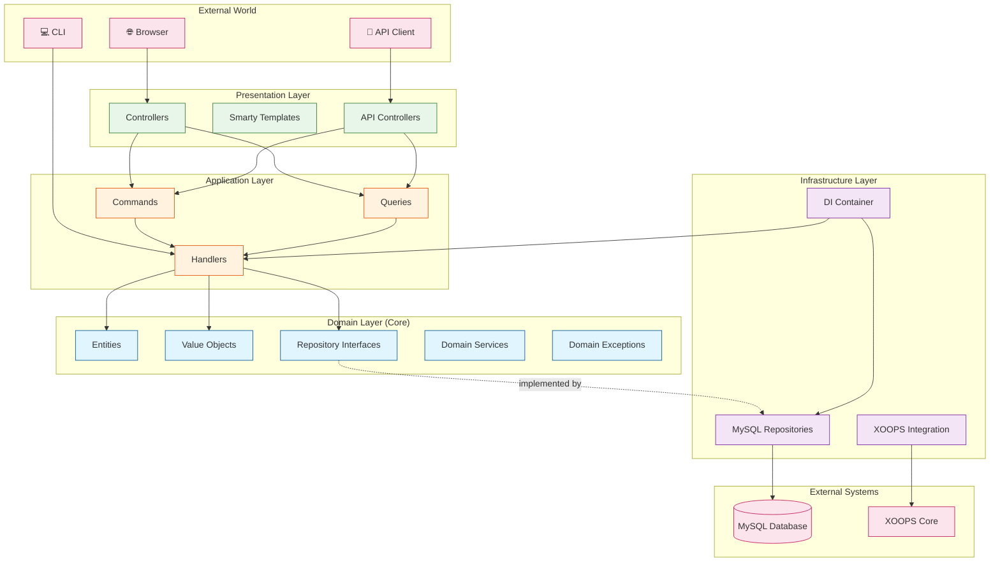

## HTTP Request Flow

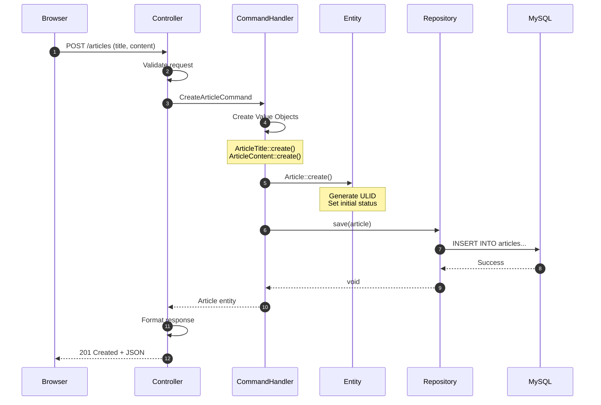

## Command/Query Separation (CQRS)

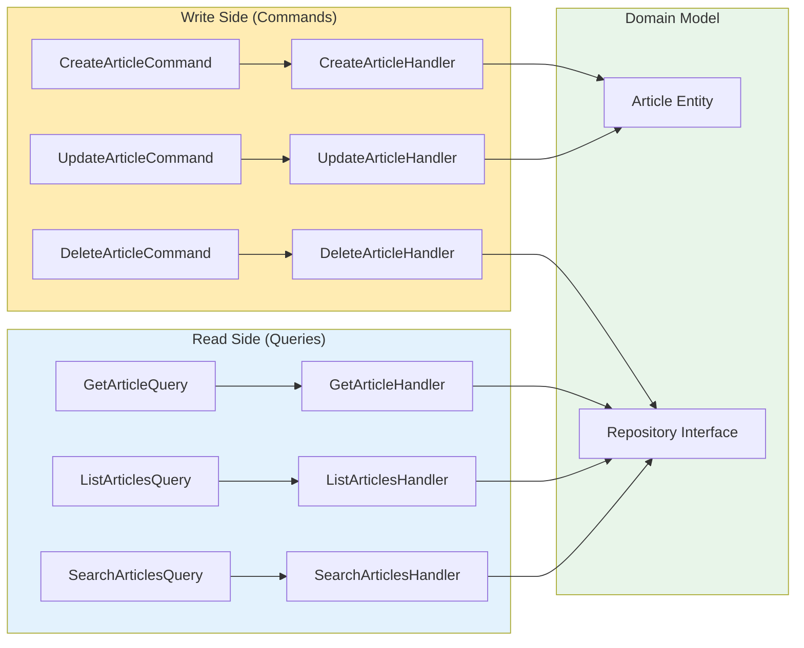

## Entity Lifecycle

```mermaid
stateDiagram-v2
    [*] --> Draft: Article::create()

    Draft --> Published: publish()
    Draft --> Archived: archive()

    Published --> Archived: archive()

    Archived --> Draft: restore()

    note right of Draft
        Initial state
        Can edit content
    end note

    note right of Published
        Visible to public
        Limited editing
    end note

    note right of Archived
        Hidden from public
        Can be restored
    end note
```

## Value Object Validation Flow

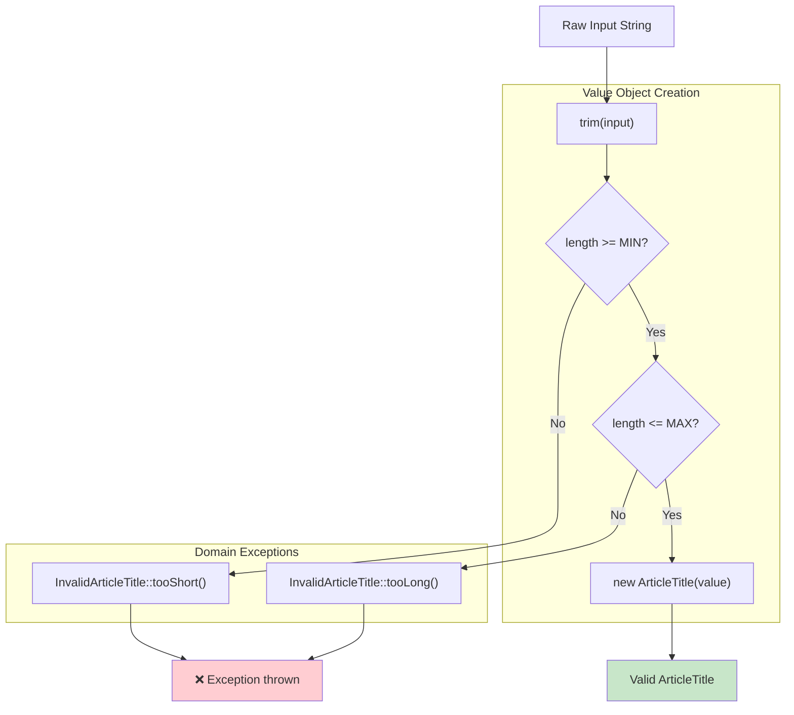

## Repository Pattern

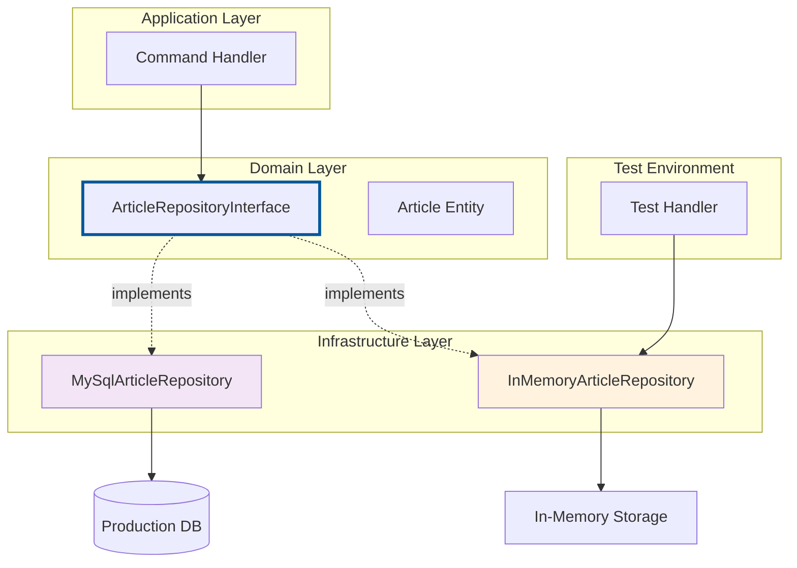

## Dependency Injection Container

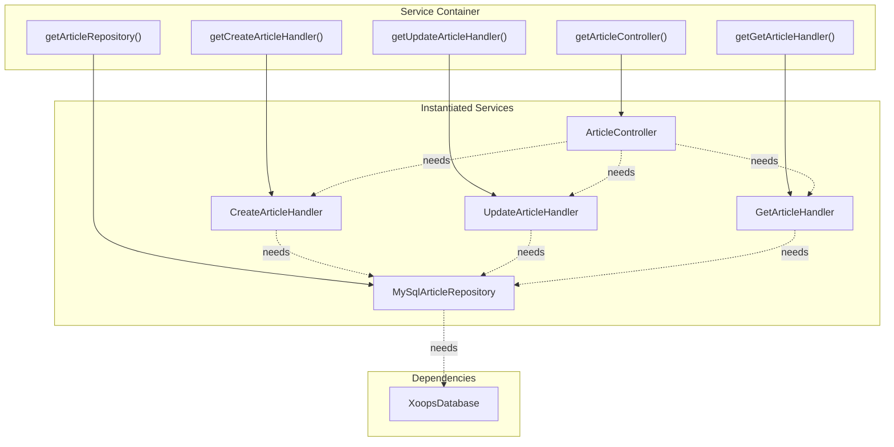

## API Request/Response Cycle

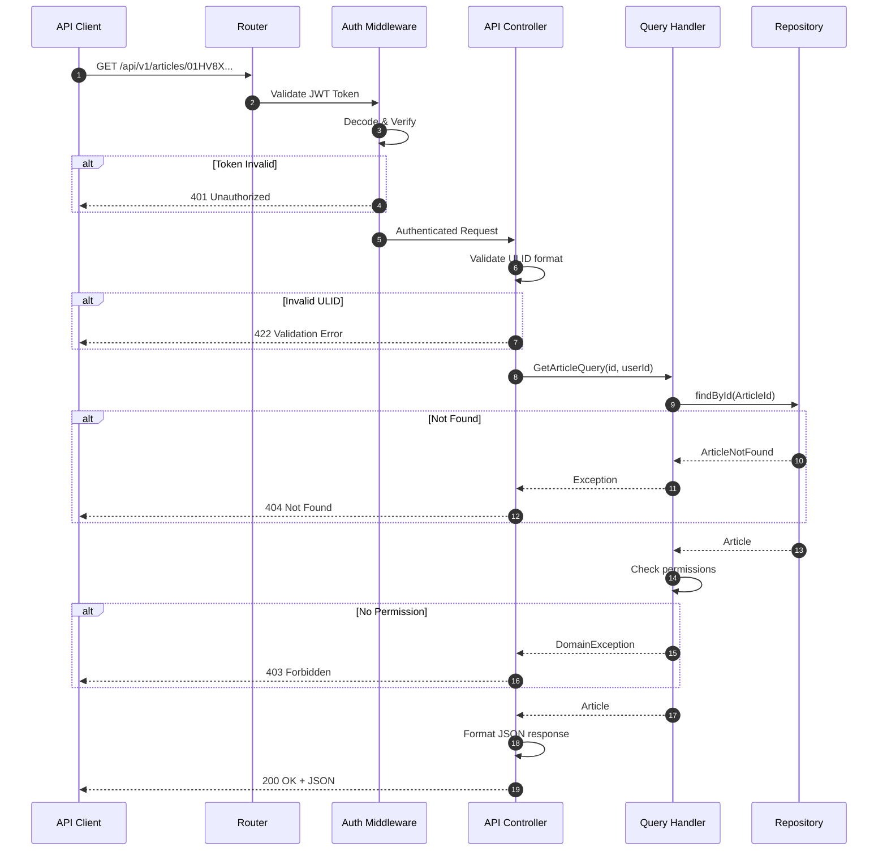

## ULID vs Auto-Increment ID

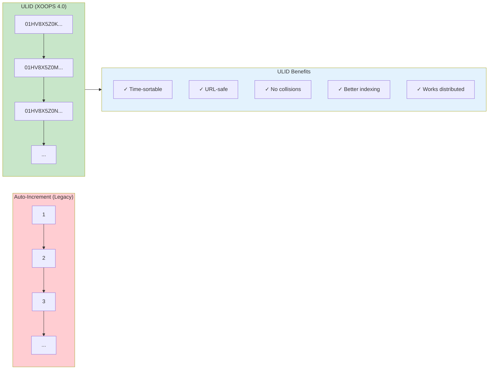

## Module Directory Structure

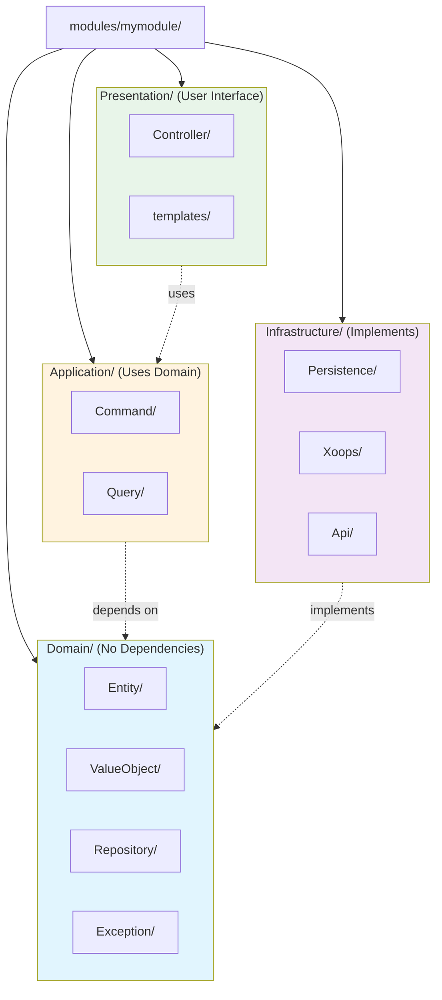

## Exception Handling Flow

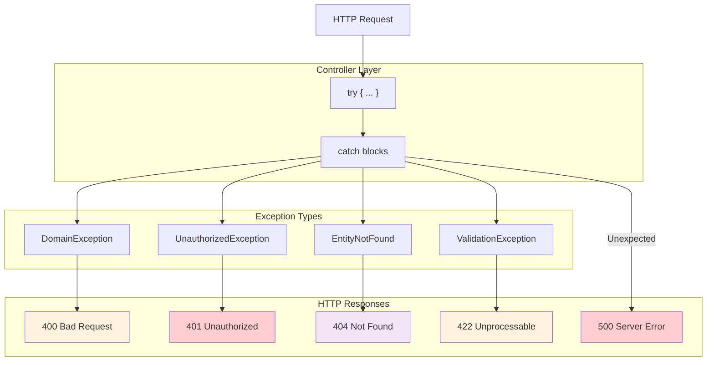

## Test Structure

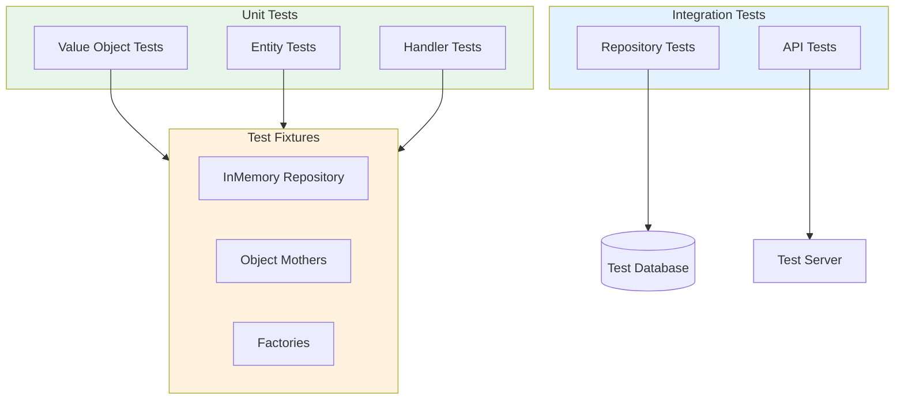

## Complete Request Lifecycle

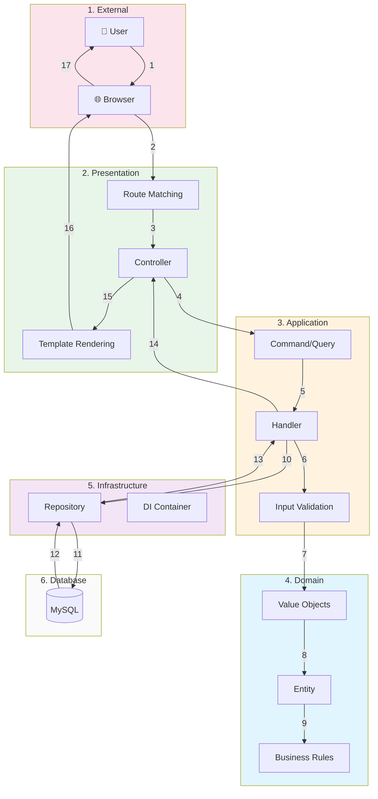

## Related Documentation

- [[../Tutorials/Getting-Started-with-XOOPS-4.0-Module-Development]]
- [[../Quick-Reference-Card]]
- [Repository & Query Patterns](../Implementation-Guides/Repository-Query-Patterns-Guide.md)
- [Error Handling & Validation](../Implementation-Guides/Error-Handling-Validation-Guide.md)
