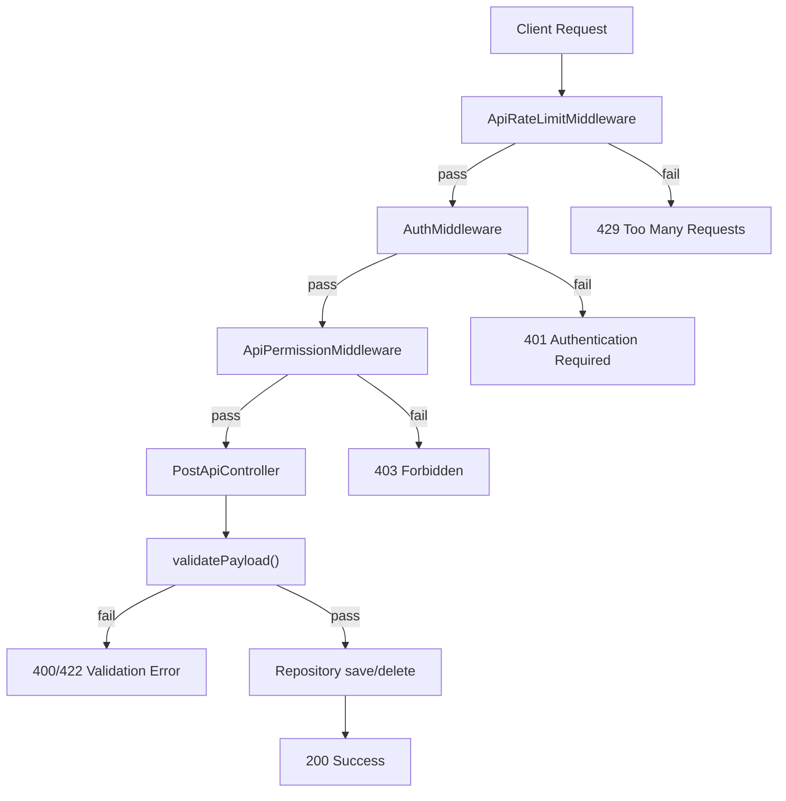

# Error Handling & Validation Guide

> **Request validation, API response patterns, and middleware error handling for XOOPS 4.0 modules.**

XOOPS 4.0 modules use a response-based error model: validation errors, authentication failures, and permission denials are communicated through structured `ApiResponse` objects rather than thrown exceptions. The middleware pipeline handles cross-cutting concerns (rate limiting, authentication, authorization) before requests reach the controller.

This guide uses **xmfblog** as the reference module.

---

## Overview



Each layer returns an `ApiResponse` on failure, short-circuiting the pipeline. On success, the request flows to the next layer.

---

## ApiResponse

`Xmf\Api\ApiResponse` is the standard response object for all API operations:

```php
use Xmf\Api\ApiResponse;

// Success
new ApiResponse(true, $entity, 'Post created successfully.', 201);

// Validation error
new ApiResponse(false, null, 'Validation failed: title is required.', 422);

// Authentication error
new ApiResponse(false, null, 'Authentication required. Please log in.', 401);

// Permission error
new ApiResponse(false, null, 'Forbidden. You do not have permission.', 403);

// Rate limit error
new ApiResponse(false, null, 'Rate limit exceeded. Try again in 45 seconds.', 429);
```

| Property | Type | Purpose |
|----------|------|---------|
| `success` | `bool` | Whether the operation succeeded |
| `data` | `mixed` | Response payload (entity, array, null) |
| `message` | `string` | Human-readable status message |
| `status` | `int` | HTTP status code |

---

## Middleware Pipeline

### Rate Limiting

The first layer protects against abuse with a sliding window counter:

```php
<?php
declare(strict_types=1);

namespace XmfBlog;

use Xmf\Api\ApiResponse;
use Xmf\Cache\CacheManager;
use Xmf\Http\MiddlewareInterface;

class ApiRateLimitMiddleware implements MiddlewareInterface
{
    public function __construct(
        private readonly CacheManager $cache,
        private readonly int $maxRequests = 30,
        private readonly int $windowSeconds = 60,
    ) {
    }

    public function process(array $request, callable $next): array
    {
        $method = strtoupper((string) ($request['method'] ?? 'GET'));

        // Read-only methods pass through
        if (in_array($method, ['GET', 'HEAD', 'OPTIONS'], true)) {
            return $next($request);
        }

        $ip = $_SERVER['REMOTE_ADDR'] ?? '127.0.0.1';
        $key = 'api_rate:' . md5($ip);

        $bucket = $this->cache->get($key);
        $now = time();

        if ($bucket === null || ($now - $bucket['window_start']) >= $this->windowSeconds) {
            $bucket = ['count' => 1, 'window_start' => $now];
        } else {
            $bucket['count']++;
        }

        if ($bucket['count'] > $this->maxRequests) {
            $retryAfter = $this->windowSeconds - ($now - $bucket['window_start']);
            return ['response' => new ApiResponse(
                false, null,
                'Rate limit exceeded. Try again in ' . max(1, $retryAfter) . ' seconds.',
                429,
            )];
        }

        $this->cache->set($key, $bucket, $this->windowSeconds);

        // Pass rate limit info downstream
        $request['rate_limit'] = [
            'remaining' => $this->maxRequests - $bucket['count'],
            'limit'     => $this->maxRequests,
            'reset'     => $bucket['window_start'] + $this->windowSeconds,
        ];

        return $next($request);
    }
}
```

### Authentication

Validates the XOOPS session for mutating requests:

```php
<?php
declare(strict_types=1);

namespace XmfBlog;

use Xmf\Api\ApiResponse;
use Xmf\Http\MiddlewareInterface;

class AuthMiddleware implements MiddlewareInterface
{
    public function process(array $request, callable $next): array
    {
        $method = strtoupper((string) ($request['method'] ?? 'GET'));

        // Read-only methods pass through
        if (in_array($method, ['GET', 'HEAD', 'OPTIONS'], true)) {
            return $next($request);
        }

        // Validate XOOPS user session
        $xoopsUser = $request['xoops_user'] ?? null;
        if (!is_object($xoopsUser)) {
            return ['response' => new ApiResponse(false, null, 'Authentication required. Please log in.', 401)];
        }

        $uid = (int) $xoopsUser->getVar('uid');
        if ($uid <= 0) {
            return ['response' => new ApiResponse(false, null, 'Authentication required. Please log in.', 401)];
        }

        // Inject validated user ID for downstream use
        $request['user'] = $uid;

        return $next($request);
    }
}
```

### Authorization

Maps HTTP methods to XOOPS group permissions using `match`:

```php
<?php
declare(strict_types=1);

namespace XmfBlog;

use Xmf\Api\ApiResponse;
use Xmf\Http\MiddlewareInterface;

class ApiPermissionMiddleware implements MiddlewareInterface
{
    public function __construct(private readonly int $moduleId)
    {
    }

    public function process(array $request, callable $next): array
    {
        $method = strtoupper((string) ($request['method'] ?? 'GET'));

        if (in_array($method, ['GET', 'HEAD', 'OPTIONS'], true)) {
            return $next($request);
        }

        $xoopsUser = $request['xoops_user'] ?? null;
        if (!is_object($xoopsUser)) {
            return ['response' => new ApiResponse(false, null, 'Authentication required.', 401)];
        }

        // Map HTTP method to required XOOPS permission
        $requiredPermission = match ($method) {
            'POST'   => 'xmfblog_submit',
            'PUT'    => 'xmfblog_submit',
            'DELETE' => 'xmfblog_admin',
            default  => null,
        };

        if ($requiredPermission === null) {
            return ['response' => new ApiResponse(false, null, 'Method not allowed.', 405)];
        }

        if (!$this->hasPermission($xoopsUser, $requiredPermission)) {
            return ['response' => new ApiResponse(
                false, null,
                'Forbidden. You do not have permission to perform this action.',
                403,
            )];
        }

        return $next($request);
    }

    private function hasPermission(object $xoopsUser, string $permissionName): bool
    {
        if ($this->moduleId <= 0) {
            return false;
        }

        $groups = $xoopsUser->getGroups();
        if (in_array(XOOPS_GROUP_ADMIN, $groups, true)) {
            return true;
        }

        /** @var \XoopsGroupPermHandler $gpermHandler */
        $gpermHandler = xoops_getHandler('groupperm');

        return $gpermHandler->checkRight($permissionName, 1, $groups, $this->moduleId);
    }
}
```

### Pipeline Wiring

The middleware chain is assembled in `BlogModule::boot()`:

```php
$container->singleton('pipeline', function (Container $c) {
    $pipeline = new Pipeline();
    $pipeline->pipe(new ApiRateLimitMiddleware($c->get('cache'), 30, 60));
    $pipeline->pipe(new AuthMiddleware());
    $pipeline->pipe(new ApiPermissionMiddleware($moduleId));
    return $pipeline;
});
```

---

## Controller Validation

### Payload Validation Pattern

The `PostApiController` validates request data before persistence:

```php
<?php
declare(strict_types=1);

namespace XmfBlog;

use Xmf\Api\ApiResponse;
use Xmf\Api\ApiController;

class PostApiController extends ApiController
{
    public function store(array $request): ApiResponse
    {
        $validation = $this->validatePayload($request, true);
        if ($validation instanceof ApiResponse) {
            return $validation;  // 400 or 422 — short-circuit
        }

        $request['data'] = $validation;
        $response = parent::store($request);
        $this->dispatchPostEvent($response, 'created');
        return $response;
    }

    private function validatePayload(array $request, bool $isCreate): array|ApiResponse
    {
        $data = $request['data'] ?? [];
        if (!is_array($data)) {
            return new ApiResponse(false, null, 'Invalid payload. Expected JSON object.', 400);
        }

        $title = isset($data['title']) ? trim((string) $data['title']) : '';
        $body  = isset($data['body']) ? trim((string) $data['body']) : '';

        // Required field checks (create only)
        if ($isCreate && $title === '') {
            return new ApiResponse(false, null, 'Validation failed: title is required.', 422);
        }
        if ($isCreate && $body === '') {
            return new ApiResponse(false, null, 'Validation failed: body is required.', 422);
        }

        // Length constraints
        if (isset($data['title']) && mb_strlen($title) > 255) {
            return new ApiResponse(false, null, 'Validation failed: title exceeds 255 characters.', 422);
        }
        if (isset($data['excerpt']) && mb_strlen(trim((string) $data['excerpt'])) > 500) {
            return new ApiResponse(false, null, 'Validation failed: excerpt exceeds 500 characters.', 422);
        }

        // Format validation
        if (isset($data['author_email']) && !filter_var((string) $data['author_email'], FILTER_VALIDATE_EMAIL)) {
            return new ApiResponse(false, null, 'Validation failed: author_email must be a valid email.', 422);
        }

        // Sanitize and return clean data
        if (isset($data['title'])) {
            $data['title'] = $title;
        }
        if (isset($data['body'])) {
            $data['body'] = $body;
        }

        return $data;
    }
}
```

### Hydrate and Fill Pattern

The controller uses two methods to map validated data to entities:

```php
// hydrate() — create a new entity from validated data
protected function hydrate(array $data): object
{
    $post = new Post();
    $post->setVar('title', $data['title'] ?? '');
    $post->setVar('body', $data['body'] ?? '');
    $post->setVar('excerpt', $data['excerpt'] ?? '');
    if (isset($data['category_id'])) {
        $post->setVar('category_id', (int) $data['category_id']);
    }
    return $post;
}

// fill() — update an existing entity with partial data
protected function fill(object $entity, array $data): void
{
    if (isset($data['title'])) {
        $entity->setVar('title', $data['title']);
    }
    if (isset($data['body'])) {
        $entity->setVar('body', $data['body']);
    }
    if (isset($data['status'])) {
        $entity->setVar('status', (int) $data['status']);
    }
}
```

---

## Error Response Summary

| HTTP Status | Meaning | Layer | Example |
|-------------|---------|-------|---------|
| **400** | Bad Request | Controller | Malformed JSON payload |
| **401** | Unauthorized | AuthMiddleware | No valid XOOPS session |
| **403** | Forbidden | PermissionMiddleware | User lacks required group permission |
| **405** | Method Not Allowed | PermissionMiddleware | Unsupported HTTP method |
| **422** | Unprocessable Entity | Controller | Validation failure (missing title, bad email) |
| **429** | Too Many Requests | RateLimitMiddleware | Sliding window exceeded |

---

## Design Decisions

### Why Responses Instead of Exceptions?

1. **Middleware compatibility** — The pipeline returns arrays, not thrown values. Each middleware can inspect and transform the response.
2. **Predictable flow** — No hidden control flow. Each error is an explicit return value.
3. **HTTP-native** — Status codes map directly to HTTP semantics.
4. **Performance** — No stack unwinding for expected conditions like validation failures.

### When to Use Exceptions

Use exceptions for truly exceptional conditions that shouldn't happen in normal operation:

- Database connection failures
- Corrupted data that violates invariants
- Framework-level errors (missing services, configuration)

These are handled by the XMF framework's global exception handler, not by module code.

---

## Related

- [Entity Mapping & Database Patterns](Entity-Mapping-Database-Patterns-Guide.md)
- [Repository & Query Patterns](Repository-Query-Patterns-Guide.md)
- [Event-Driven Architecture](Event-Driven-Architecture-Guide.md)
- [Security Best Practices](../../02-Core-Concepts/Security/Security-Best-Practices.md)

---

#error-handling #validation #api #middleware #xoops-4.0
