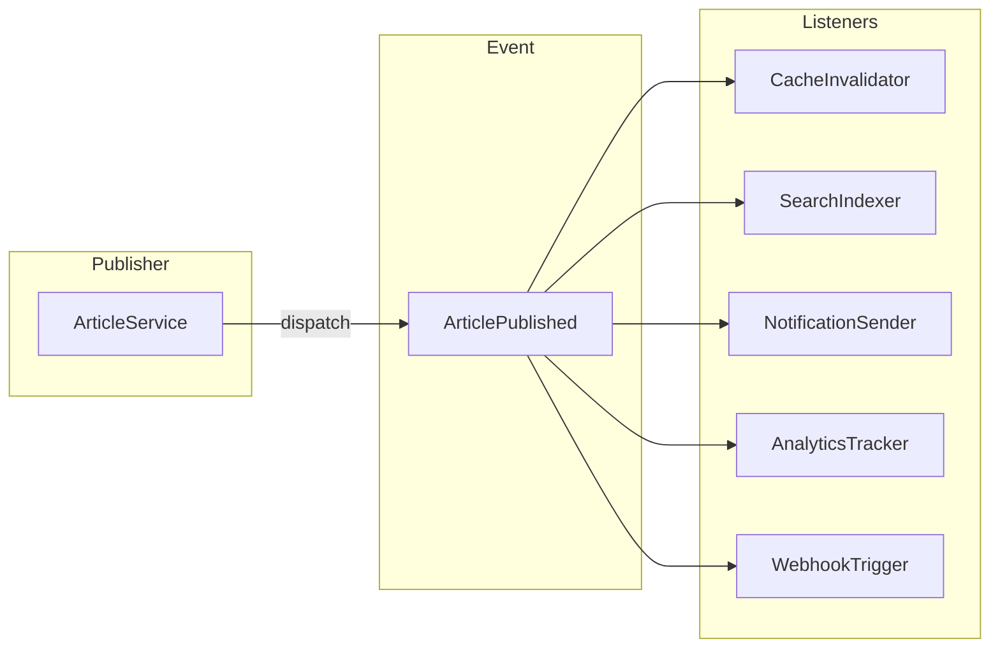
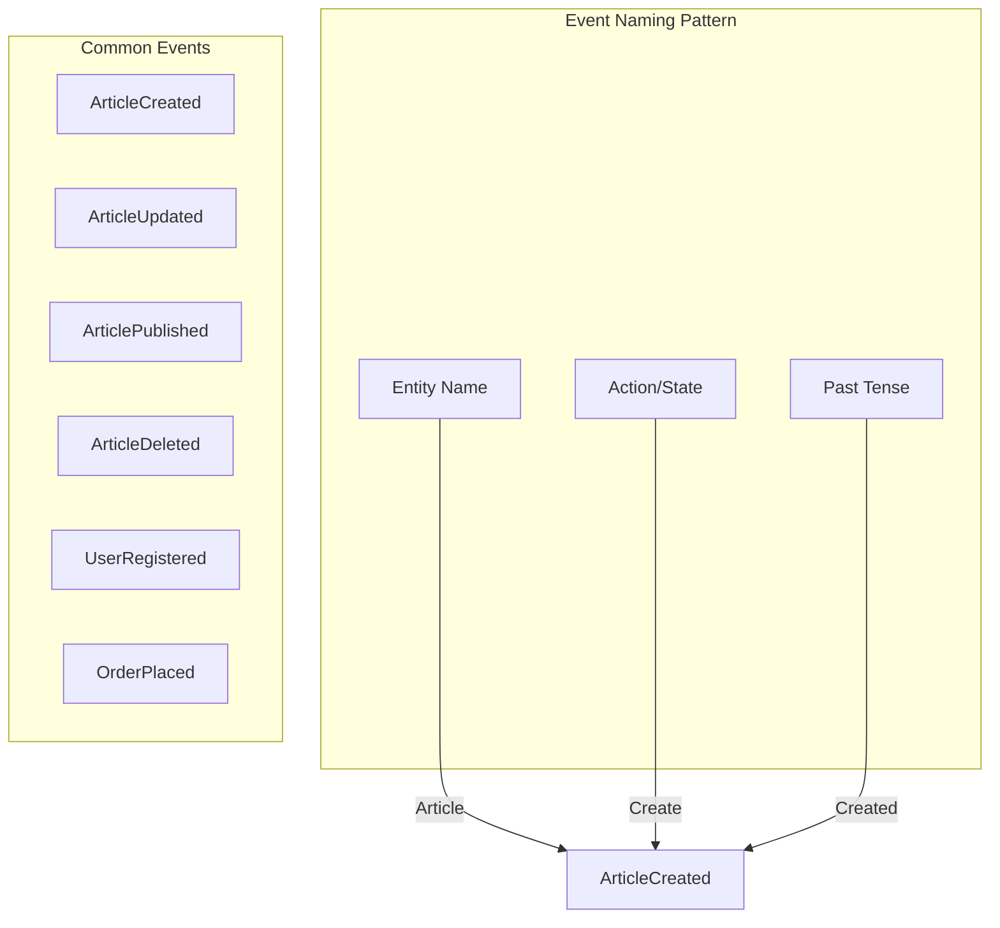
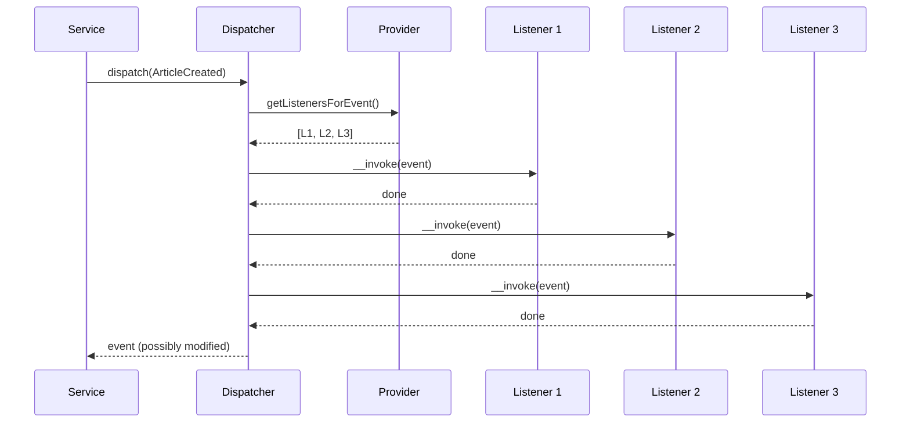
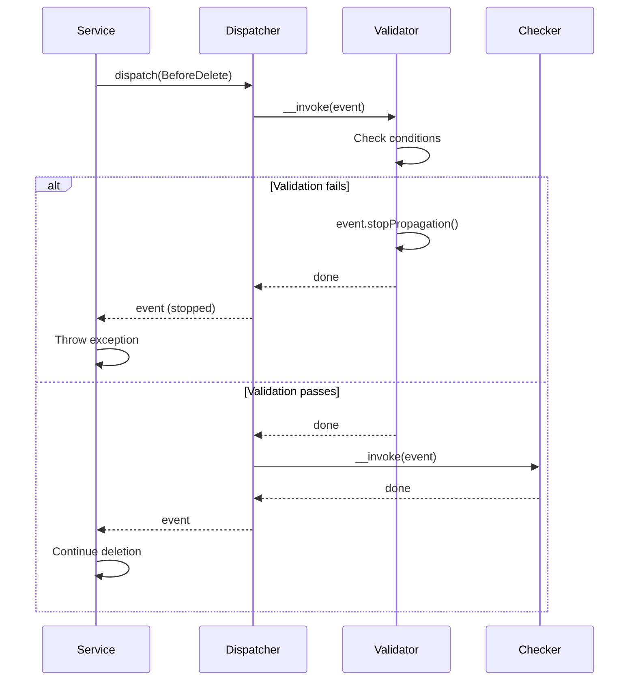
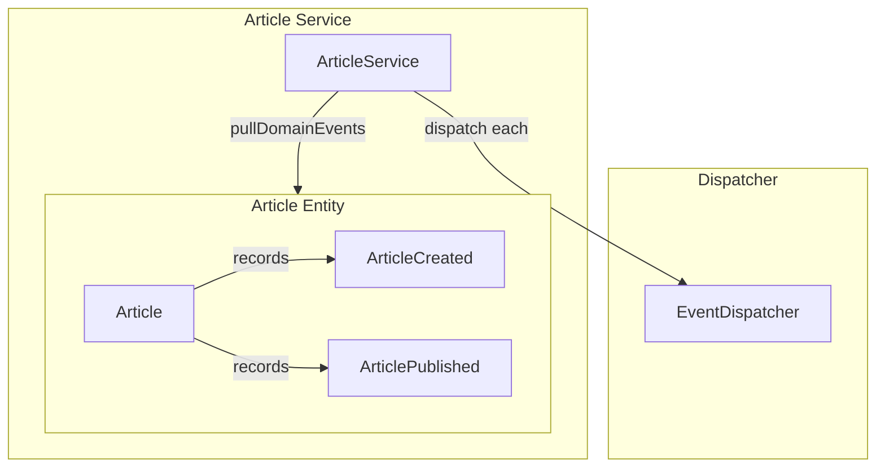
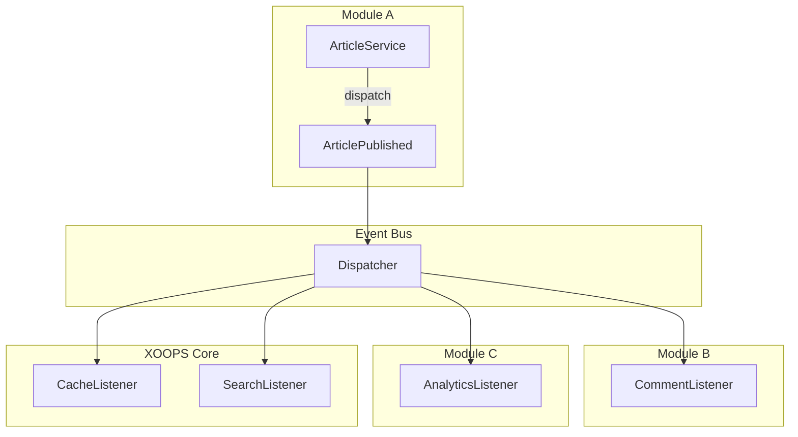

# ⚡ Event System Implementation Guide

> **Build decoupled, extensible applications with XOOPS 4.0's event system.**

Events enable loose coupling between components. When something significant happens, an event is dispatched, and any number of listeners can react without the dispatcher knowing about them.

---

## Why Events?

### The Problem: Tight Coupling

```php
<?php
// ❌ Bad: Direct coupling
class ArticleService
{
    public function publish(Article $article): void
    {
        $article->publish();
        $this->repository->save($article);

        // Tightly coupled to all these concerns
        $this->cache->invalidate('articles');
        $this->searchIndexer->index($article);
        $this->notificationService->notifySubscribers($article);
        $this->analyticsService->trackPublish($article);
        $this->webhookService->triggerWebhooks($article);
        // ... and more
    }
}
```

### The Solution: Events

```php
<?php
// ✅ Good: Event-driven
class ArticleService
{
    public function publish(Article $article): void
    {
        $article->publish();
        $this->repository->save($article);

        // Just dispatch the event
        $this->dispatcher->dispatch(new ArticlePublished($article));
    }
}

// Listeners handle the rest, completely decoupled
```

### Visualization



---

## PSR-14 Event Dispatcher

### The Standard Interfaces

```php
<?php

namespace Psr\EventDispatcher;

interface EventDispatcherInterface
{
    /**
     * Provide all relevant listeners with an event to process.
     */
    public function dispatch(object $event): object;
}

interface ListenerProviderInterface
{
    /**
     * @return iterable<callable>
     */
    public function getListenersForEvent(object $event): iterable;
}

interface StoppableEventInterface
{
    /**
     * Is propagation stopped?
     */
    public function isPropagationStopped(): bool;
}
```

---

## Creating Events

### Basic Event

```php
<?php

declare(strict_types=1);

namespace MyModule\Event;

final readonly class ArticlePublished
{
    public function __construct(
        public int $articleId,
        public string $title,
        public int $authorId,
        public \DateTimeImmutable $publishedAt = new \DateTimeImmutable(),
    ) {}
}
```

### Event with Entity

```php
<?php

declare(strict_types=1);

namespace MyModule\Event;

use MyModule\Entity\Article;

final readonly class ArticleCreated
{
    public function __construct(
        public Article $article,
        public \DateTimeImmutable $occurredAt = new \DateTimeImmutable(),
    ) {}

    public function getArticleId(): int
    {
        return $this->article->getId();
    }
}
```

### Stoppable Event

```php
<?php

declare(strict_types=1);

namespace MyModule\Event;

use Psr\EventDispatcher\StoppableEventInterface;

final class ArticleBeforeDelete implements StoppableEventInterface
{
    private bool $stopped = false;
    private ?string $reason = null;

    public function __construct(
        public readonly Article $article,
    ) {}

    public function stopPropagation(string $reason): void
    {
        $this->stopped = true;
        $this->reason = $reason;
    }

    public function isPropagationStopped(): bool
    {
        return $this->stopped;
    }

    public function getReason(): ?string
    {
        return $this->reason;
    }
}
```

---

## Event Naming Conventions



| Pattern | Example | Use Case |
|---------|---------|----------|
| `{Entity}Created` | `ArticleCreated` | After entity creation |
| `{Entity}Updated` | `ArticleUpdated` | After entity modification |
| `{Entity}Deleted` | `ArticleDeleted` | After entity removal |
| `{Entity}Before{Action}` | `ArticleBeforeDelete` | Before action (cancellable) |
| `{Entity}{State}` | `ArticlePublished` | State transition |

---

## Creating Listeners

### Basic Listener

```php
<?php

declare(strict_types=1);

namespace MyModule\Listener;

use MyModule\Event\ArticlePublished;

final class InvalidateCacheOnArticlePublish
{
    public function __construct(
        private readonly CacheInterface $cache,
    ) {}

    public function __invoke(ArticlePublished $event): void
    {
        $this->cache->delete("article.{$event->articleId}");
        $this->cache->delete('articles.list');
        $this->cache->delete('articles.recent');
    }
}
```

### Listener with Multiple Methods

```php
<?php

declare(strict_types=1);

namespace MyModule\Listener;

final class SearchIndexListener
{
    public function __construct(
        private readonly SearchIndex $index,
    ) {}

    public function onArticleCreated(ArticleCreated $event): void
    {
        $this->index->add($event->article);
    }

    public function onArticleUpdated(ArticleUpdated $event): void
    {
        $this->index->update($event->article);
    }

    public function onArticleDeleted(ArticleDeleted $event): void
    {
        $this->index->remove($event->articleId);
    }
}
```

### Async Listener

```php
<?php

declare(strict_types=1);

namespace MyModule\Listener;

use Xoops\Queue\ShouldQueue;

final class SendNotificationOnPublish implements ShouldQueue
{
    public string $queue = 'notifications';
    public int $delay = 0;

    public function __construct(
        private readonly NotificationService $notifications,
        private readonly SubscriberRepository $subscribers,
    ) {}

    public function __invoke(ArticlePublished $event): void
    {
        $subscribers = $this->subscribers->findByArticleCategory(
            $event->article->getCategoryId()
        );

        foreach ($subscribers as $subscriber) {
            $this->notifications->send($subscriber, $event->article);
        }
    }
}
```

---

## Registering Listeners

### In module.json

```json
{
    "events": {
        "subscribe": [
            {
                "event": "MyModule\\Event\\ArticlePublished",
                "handler": "MyModule\\Listener\\InvalidateCacheOnArticlePublish",
                "priority": 100
            },
            {
                "event": "MyModule\\Event\\ArticlePublished",
                "handler": "MyModule\\Listener\\UpdateSearchIndex",
                "priority": 50
            },
            {
                "event": "MyModule\\Event\\ArticlePublished",
                "handler": "MyModule\\Listener\\SendNotifications",
                "priority": 10
            }
        ]
    }
}
```

### In Service Provider

```php
<?php

declare(strict_types=1);

namespace MyModule\Provider;

use Xoops\Container\ServiceProvider;
use Xoops\Event\ListenerProvider;

final class EventServiceProvider extends ServiceProvider
{
    public function boot(ContainerInterface $container): void
    {
        $provider = $container->get(ListenerProvider::class);

        // Register listeners
        $provider->addListener(
            ArticlePublished::class,
            $container->get(InvalidateCacheOnArticlePublish::class),
            priority: 100
        );

        $provider->addListener(
            ArticlePublished::class,
            $container->get(UpdateSearchIndex::class),
            priority: 50
        );

        // Register subscriber (multiple events)
        $provider->addSubscriber(
            $container->get(ArticleEventSubscriber::class)
        );
    }
}
```

### Using Attributes

```php
<?php

declare(strict_types=1);

namespace MyModule\Listener;

use Xoops\Event\Attribute\Listener;

#[Listener(ArticlePublished::class, priority: 100)]
final class InvalidateCacheOnArticlePublish
{
    public function __invoke(ArticlePublished $event): void
    {
        // Handle event
    }
}

#[Listener(ArticleCreated::class)]
#[Listener(ArticleUpdated::class)]
#[Listener(ArticleDeleted::class)]
final class SearchIndexListener
{
    public function __invoke(object $event): void
    {
        // Handle multiple event types
    }
}
```

---

## Event Subscribers

### Creating a Subscriber

```php
<?php

declare(strict_types=1);

namespace MyModule\Subscriber;

use Xoops\Event\EventSubscriberInterface;

final class ArticleEventSubscriber implements EventSubscriberInterface
{
    public function __construct(
        private readonly CacheInterface $cache,
        private readonly SearchIndex $search,
        private readonly LoggerInterface $logger,
    ) {}

    public static function getSubscribedEvents(): array
    {
        return [
            ArticleCreated::class => [
                ['onCreated', 100],
                ['indexArticle', 50],
            ],
            ArticleUpdated::class => [
                ['onUpdated', 100],
                ['indexArticle', 50],
            ],
            ArticleDeleted::class => [
                ['onDeleted', 100],
                ['removeFromIndex', 50],
            ],
        ];
    }

    public function onCreated(ArticleCreated $event): void
    {
        $this->logger->info('Article created', ['id' => $event->articleId]);
        $this->cache->delete('articles.count');
    }

    public function onUpdated(ArticleUpdated $event): void
    {
        $this->cache->delete("article.{$event->articleId}");
    }

    public function onDeleted(ArticleDeleted $event): void
    {
        $this->cache->delete("article.{$event->articleId}");
        $this->cache->delete('articles.count');
    }

    public function indexArticle(ArticleCreated|ArticleUpdated $event): void
    {
        $this->search->index($event->article);
    }

    public function removeFromIndex(ArticleDeleted $event): void
    {
        $this->search->remove($event->articleId);
    }
}
```

---

## Dispatching Events

### Basic Dispatch

```php
<?php

class ArticleService
{
    public function __construct(
        private readonly ArticleRepository $repository,
        private readonly EventDispatcherInterface $dispatcher,
    ) {}

    public function create(CreateArticleCommand $command): Article
    {
        $article = Article::create(
            title: $command->title,
            content: $command->content,
            authorId: $command->authorId,
        );

        $this->repository->save($article);

        $this->dispatcher->dispatch(new ArticleCreated($article));

        return $article;
    }
}
```

### Event Flow



### Stopping Propagation

```php
<?php

class ArticleService
{
    public function delete(int $articleId): void
    {
        $article = $this->repository->findOrFail($articleId);

        // Dispatch "before" event - can be stopped
        $event = new ArticleBeforeDelete($article);
        $this->dispatcher->dispatch($event);

        if ($event->isPropagationStopped()) {
            throw new CannotDeleteArticleException($event->getReason());
        }

        $this->repository->delete($article);

        // Dispatch "after" event
        $this->dispatcher->dispatch(new ArticleDeleted($articleId));
    }
}
```



---

## Domain Events

### Collecting Events in Entities

```php
<?php

declare(strict_types=1);

namespace MyModule\Entity;

abstract class AggregateRoot
{
    /** @var list<object> */
    private array $domainEvents = [];

    protected function recordEvent(object $event): void
    {
        $this->domainEvents[] = $event;
    }

    /** @return list<object> */
    public function pullDomainEvents(): array
    {
        $events = $this->domainEvents;
        $this->domainEvents = [];
        return $events;
    }
}

final class Article extends AggregateRoot
{
    public static function create(string $title, string $content): self
    {
        $article = new self($title, $content);
        $article->recordEvent(new ArticleCreated($article));
        return $article;
    }

    public function publish(): void
    {
        $this->status = ArticleStatus::Published;
        $this->publishedAt = new \DateTimeImmutable();
        $this->recordEvent(new ArticlePublished($this));
    }

    public function archive(): void
    {
        $this->status = ArticleStatus::Archived;
        $this->recordEvent(new ArticleArchived($this));
    }
}
```

### Dispatching Domain Events

```php
<?php

final class ArticleService
{
    public function publish(int $articleId): void
    {
        $article = $this->repository->findOrFail($articleId);

        $article->publish();

        $this->repository->save($article);

        // Dispatch all domain events
        foreach ($article->pullDomainEvents() as $event) {
            $this->dispatcher->dispatch($event);
        }
    }
}
```



---

## Cross-Module Events

### Publishing Module Events

```json
{
    "events": {
        "publish": [
            "mymodule.article.created",
            "mymodule.article.published",
            "mymodule.article.deleted"
        ]
    }
}
```

### Subscribing to Other Module Events

```json
{
    "events": {
        "subscribe": [
            {
                "event": "user.deleted",
                "handler": "MyModule\\Listener\\CleanupUserArticles"
            },
            {
                "event": "category.deleted",
                "handler": "MyModule\\Listener\\HandleCategoryDeletion"
            }
        ]
    }
}
```

### Event Bus Architecture



---

## Testing Events

### Testing Event Dispatch

```php
<?php

declare(strict_types=1);

namespace Tests\Unit;

use PHPUnit\Framework\TestCase;

final class ArticleServiceTest extends TestCase
{
    public function testPublishDispatchesEvent(): void
    {
        $repository = $this->createMock(ArticleRepository::class);
        $dispatcher = $this->createMock(EventDispatcherInterface::class);

        $article = new Article(1, 'Test', 'Content');
        $repository->method('findOrFail')->willReturn($article);

        // Assert event is dispatched
        $dispatcher->expects($this->once())
            ->method('dispatch')
            ->with($this->callback(function ($event) {
                return $event instanceof ArticlePublished
                    && $event->articleId === 1;
            }));

        $service = new ArticleService($repository, $dispatcher);
        $service->publish(1);
    }
}
```

### Testing Listeners

```php
<?php

declare(strict_types=1);

namespace Tests\Unit\Listener;

use PHPUnit\Framework\TestCase;

final class InvalidateCacheOnArticlePublishTest extends TestCase
{
    public function testInvalidatesCache(): void
    {
        $cache = $this->createMock(CacheInterface::class);

        $cache->expects($this->exactly(3))
            ->method('delete')
            ->withConsecutive(
                ['article.1'],
                ['articles.list'],
                ['articles.recent']
            );

        $listener = new InvalidateCacheOnArticlePublish($cache);

        $listener(new ArticlePublished(
            articleId: 1,
            title: 'Test',
            authorId: 1,
        ));
    }
}
```

---

## Best Practices

### Event Design

```php
<?php

// ✅ Do: Immutable events
final readonly class ArticlePublished
{
    public function __construct(
        public int $articleId,
        public \DateTimeImmutable $publishedAt,
    ) {}
}

// ✅ Do: Include enough context
final readonly class ArticlePublished
{
    public function __construct(
        public int $articleId,
        public string $title,
        public int $authorId,
        public int $categoryId,
        public \DateTimeImmutable $publishedAt,
    ) {}
}

// ❌ Don't: Mutable events
class ArticlePublished
{
    public int $articleId;      // Can be changed!
    public array $metadata = []; // Mutable array
}
```

### Listener Design

```php
<?php

// ✅ Do: Single responsibility
final class InvalidateArticleCache
{
    public function __invoke(ArticlePublished $event): void
    {
        // Only handles caching
    }
}

// ✅ Do: Fast, non-blocking
final class QueueNotification implements ShouldQueue
{
    public function __invoke(ArticlePublished $event): void
    {
        // Queued for async processing
    }
}

// ❌ Don't: Do too much in one listener
final class DoEverything
{
    public function __invoke(ArticlePublished $event): void
    {
        $this->cache->invalidate();
        $this->search->index();
        $this->notify->send();      // Slow!
        $this->analytics->track();
        $this->webhooks->trigger(); // Slow!
    }
}
```

---

## 🔗 Related Documentation

- [[PSR-11-Dependency-Injection-Guide|Dependency Injection]]
- [[PSR-15-Middleware-Guide|PSR-15 Middleware]]
- [[../Roadmap/Architecture-Vision|Architecture Vision]]

---

#events #event-driven #listeners #subscribers #xoops-4.0
