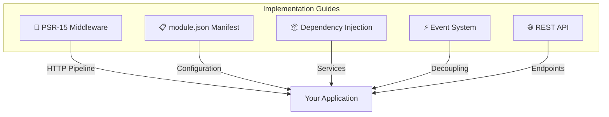
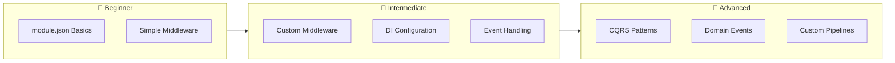

# 📖 XOOPS 4.0 Implementation Guides

> **Comprehensive guides for implementing modern XOOPS 4.0 features.**

These guides provide step-by-step instructions for adopting XOOPS 4.0's modern architecture patterns and features.

---

## Available Guides

---

## Core Guides

| Guide | Description | Difficulty |
|-------|-------------|------------|
| [[PSR-15-Middleware-Guide]] | Implement HTTP middleware pipeline | ⭐⭐⭐ |
| [[PSR-11-Dependency-Injection-Guide]] | PSR-11 container configuration | ⭐⭐⭐ |
| [[Event-System-Guide]] | Publishing and subscribing to events | ⭐⭐⭐ |
| [[REST-API-Design-Guide]] | Building RESTful APIs | ⭐⭐⭐ |
| [[Module-JSON-Specification]] | Modern module manifest format | ⭐⭐ |
| [[XMF-Components-Guide]] | XMF everyday utilities — ULID, Slug, JWT, YAML | ⭐⭐ |
| [[XMF-Advanced-Components]] | XMF architectural subsystems — CommandBus, Repository, EventBus | ⭐⭐⭐ |
| [[XTF-Theme-Framework-Guide]] | Building XOOPS 4.0 themes with XTF | ⭐⭐⭐ |
| [[XBO-Business-Objects-Guide]] | ERP/HR/Finance domain objects with XBO (PHP 8.4) | ⭐⭐⭐ |

---

## Coming Soon

- **Caching Guide** - PSR-6/PSR-16 caching strategies (see XMF-Advanced-Components)
- **Queue Guide** - Async job processing
- **Console Commands Guide** - Building CLI commands

---

## Learning Path

---

## 🔗 Related

- [[../XOOPS-4.0-Roadmap|XOOPS 4.0 Roadmap]]
- [[../Roadmap/Architecture-Vision|Architecture Vision]]
- [Reference Modules (xmfBlog + xmfPortal)](../Reference-Modules/README.md)

---

#guides #implementation #xoops-4.0 #learning
