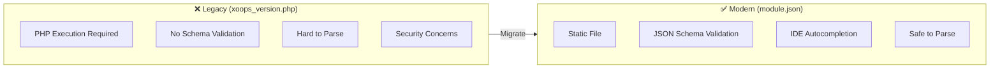
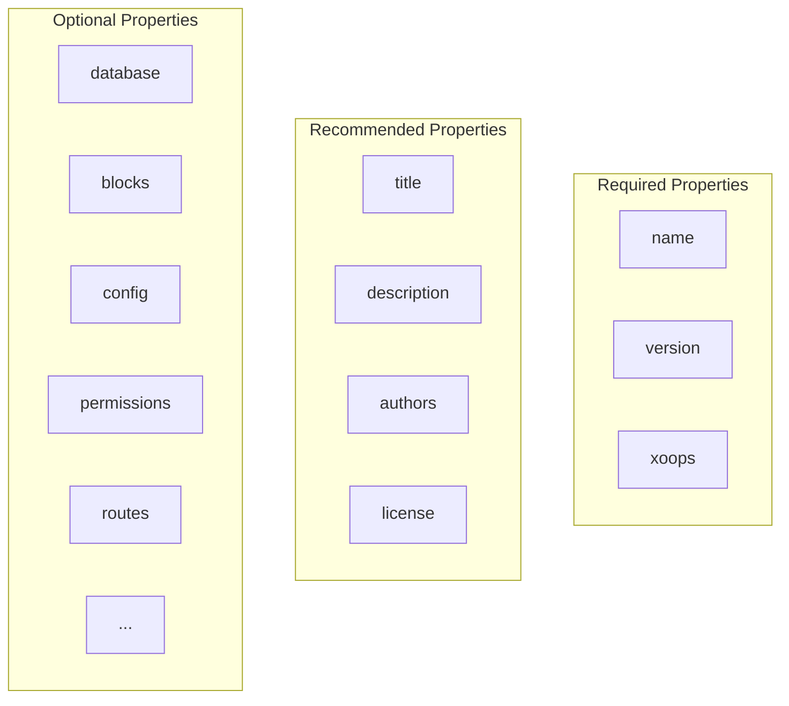
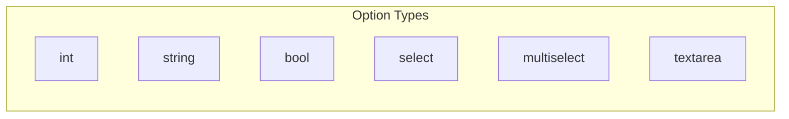
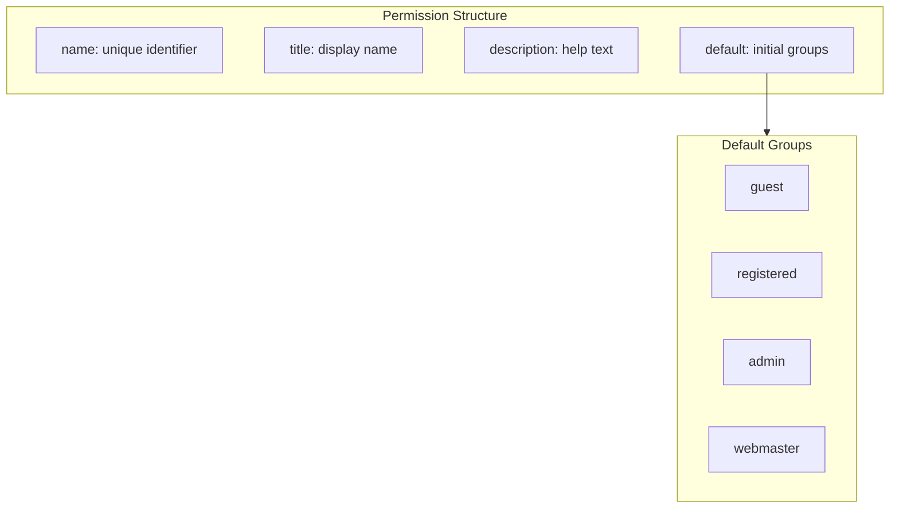

# 📋 module.json Manifest Specification

> **The definitive guide to XOOPS 4.0 module manifest files.**

XOOPS 4.0 replaces the legacy `xoops_version.php` with a modern JSON-based manifest. This provides better tooling support, validation, and interoperability.

---

## Overview

### Why module.json?



### Benefits

| Feature | Legacy PHP | module.json |
|---------|------------|-------------|
| IDE Support | Limited | Full autocompletion |
| Validation | Runtime only | Schema-based |
| Security | Code execution | Static parsing |
| Tooling | Custom parsers | Standard JSON tools |
| Composability | Difficult | Native support |

---

## File Location

```
modules/
└── mymodule/
    ├── config/
    │   └── module.json    ← Module manifest
    ├── src/
    ├── templates/
    └── ...
```

---

## Complete Schema

### Minimal Example

```json
{
    "$schema": "https://xoops.org/schemas/module-1.0.json",
    "name": "mymodule",
    "version": "1.0.0",
    "xoops": {
        "min": "2026.1"
    }
}
```

### Full Example

```json
{
    "$schema": "https://xoops.org/schemas/module-1.0.json",
    "name": "xmfblog",
    "version": "1.0.0",
    "title": "xmfBlog",
    "description": "Reference implementation for XOOPS 4.0 modules",
    "license": "GPL-2.0-or-later",
    "homepage": "https://github.com/mambax7/xmfblog",

    "authors": [
        {
            "name": "XOOPS Team",
            "email": "team@xoops.org",
            "homepage": "https://xoops.org",
            "role": "Developer"
        }
    ],

    "support": {
        "email": "support@xoops.org",
        "issues": "https://github.com/mambax7/xmfblog/issues",
        "forum": "https://xoops.org/forums/xmfblog",
        "docs": "https://docu.xoops.org/xmfblog"
    },

    "xoops": {
        "min": "4.0.0",
        "max": null,
        "php": ">=8.4",
        "extensions": ["pdo", "json", "mbstring"],
        "category": "content"
    },

    "database": {
        "tables": [
            "xmfblog_articles",
            "xmfblog_categories",
            "xmfblog_tags"
        ],
        "migrations": "migrations/"
    },

    "assets": {
        "css": ["assets/css/main.css"],
        "js": ["assets/js/app.js"],
        "images": "assets/images/"
    },

    "templates": {
        "frontend": "templates/frontend/",
        "admin": "templates/admin/",
        "blocks": "templates/blocks/",
        "mail": "templates/mail/"
    },

    "routes": {
        "web": "config/routes.php",
        "api": "config/api-routes.php"
    },

    "services": "config/services.php",
    "middleware": "config/middleware.php",

    "menu": {
        "admin": [
            {
                "title": "Dashboard",
                "link": "admin/index.php",
                "icon": "fa-dashboard"
            },
            {
                "title": "Articles",
                "link": "admin/articles.php",
                "icon": "fa-file-text",
                "submenu": [
                    {"title": "All Articles", "link": "admin/articles.php"},
                    {"title": "Add New", "link": "admin/articles.php?op=new"},
                    {"title": "Categories", "link": "admin/categories.php"}
                ]
            },
            {
                "title": "Settings",
                "link": "admin/settings.php",
                "icon": "fa-cog"
            }
        ]
    },

    "blocks": [
        {
            "name": "recent_articles",
            "title": "Recent Articles",
            "description": "Displays the most recent articles",
            "template": "blocks/recent_articles.tpl",
            "handler": "Xoops\\xmfblog\\Block\\RecentArticles",
            "options": [
                {"name": "limit", "type": "int", "default": 5},
                {"name": "category", "type": "int", "default": 0},
                {"name": "show_date", "type": "bool", "default": true}
            ],
            "cacheable": true,
            "cache_time": 3600
        },
        {
            "name": "category_list",
            "title": "Categories",
            "description": "Displays article categories",
            "template": "blocks/category_list.tpl",
            "handler": "Xoops\\xmfblog\\Block\\CategoryList",
            "options": [
                {"name": "show_count", "type": "bool", "default": true}
            ]
        }
    ],

    "config": [
        {
            "name": "articles_per_page",
            "title": "Articles per Page",
            "description": "Number of articles to display per page",
            "type": "int",
            "default": 10,
            "options": null
        },
        {
            "name": "enable_comments",
            "title": "Enable Comments",
            "description": "Allow comments on articles",
            "type": "bool",
            "default": true
        },
        {
            "name": "default_status",
            "title": "Default Article Status",
            "description": "Status for newly created articles",
            "type": "select",
            "default": "draft",
            "options": {
                "draft": "Draft",
                "published": "Published"
            }
        },
        {
            "name": "allowed_html",
            "title": "Allowed HTML Tags",
            "description": "HTML tags allowed in article content",
            "type": "textarea",
            "default": "<p><br><strong><em><ul><ol><li><a>"
        }
    ],

    "permissions": [
        {
            "name": "view",
            "title": "View Articles",
            "description": "Can view published articles",
            "default": ["guest", "registered"]
        },
        {
            "name": "create",
            "title": "Create Articles",
            "description": "Can create new articles",
            "default": ["registered"]
        },
        {
            "name": "edit_own",
            "title": "Edit Own Articles",
            "description": "Can edit own articles",
            "default": ["registered"]
        },
        {
            "name": "edit_all",
            "title": "Edit All Articles",
            "description": "Can edit any article",
            "default": ["admin"]
        },
        {
            "name": "delete",
            "title": "Delete Articles",
            "description": "Can delete articles",
            "default": ["admin"]
        },
        {
            "name": "publish",
            "title": "Publish Articles",
            "description": "Can publish articles",
            "default": ["admin"]
        }
    ],

    "notifications": [
        {
            "name": "article",
            "title": "Article Notifications",
            "description": "Notifications related to articles",
            "events": [
                {
                    "name": "new",
                    "title": "New Article",
                    "description": "Notify when a new article is published",
                    "template": "mail/article_new.tpl",
                    "subject": "New article: {ARTICLE_TITLE}"
                },
                {
                    "name": "comment",
                    "title": "New Comment",
                    "description": "Notify article author of new comments",
                    "template": "mail/article_comment.tpl",
                    "subject": "New comment on: {ARTICLE_TITLE}"
                }
            ]
        }
    ],

    "search": {
        "enabled": true,
        "handler": "Xoops\\xmfblog\\Search\\ArticleSearch",
        "content_types": ["article", "category"]
    },

    "comments": {
        "enabled": true,
        "handler": "Xoops\\xmfblog\\Comment\\ArticleComment"
    },

    "hooks": {
        "install": "Xoops\\xmfblog\\Installer::install",
        "update": "Xoops\\xmfblog\\Installer::update",
        "uninstall": "Xoops\\xmfblog\\Installer::uninstall"
    },

    "events": {
        "subscribe": [
            {
                "event": "user.deleted",
                "handler": "Xoops\\xmfblog\\Event\\UserDeletedHandler"
            }
        ],
        "publish": [
            "article.created",
            "article.published",
            "article.deleted"
        ]
    },

    "cli": [
        {
            "name": "xmfblog:import",
            "description": "Import articles from external source",
            "handler": "Xoops\\xmfblog\\Cli\\ImportCommand"
        },
        {
            "name": "xmfblog:cleanup",
            "description": "Clean up old drafts and orphaned data",
            "handler": "Xoops\\xmfblog\\Cli\\CleanupCommand"
        }
    ],

    "api": {
        "enabled": true,
        "version": "1.0",
        "prefix": "/api/v1/xmfblog",
        "authentication": ["bearer", "api_key"],
        "rate_limit": {
            "requests": 100,
            "window": 60
        }
    },

    "extra": {
        "custom_key": "custom_value"
    }
}
```

---

## Schema Reference

### Root Properties



### Property Details

#### `name` (required)

```json
{
    "name": "mymodule"
}
```

| Constraint | Value |
|------------|-------|
| Type | string |
| Pattern | `^[a-z][a-z0-9_]*$` |
| Min Length | 2 |
| Max Length | 25 |

#### `version` (required)

Semantic versioning format.

```json
{
    "version": "1.2.3"
}
```

| Constraint | Value |
|------------|-------|
| Type | string |
| Pattern | `^\d+\.\d+\.\d+(-[a-z0-9.]+)?$` |

#### `xoops` (required)

XOOPS compatibility requirements.

```json
{
    "xoops": {
        "min": "2026.1",
        "max": "2026.99",
        "php": ">=8.4",
        "extensions": ["pdo", "json"],
        "category": "content"
    }
}
```

| Property | Type | Required | Description |
|----------|------|----------|-------------|
| min | string | Yes | Minimum XOOPS version |
| max | string | No | Maximum XOOPS version |
| php | string | No | PHP version constraint |
| extensions | array | No | Required PHP extensions |
| category | string | No | Module category |

**Categories:**

| Category | Description |
|----------|-------------|
| `content` | Content management modules |
| `communication` | Forums, messaging, social |
| `tools` | Utilities and administration |
| `media` | Images, video, audio |
| `commerce` | E-commerce and payments |
| `other` | Miscellaneous |

---

### Blocks Schema

```json
{
    "blocks": [
        {
            "name": "recent_articles",
            "title": "Recent Articles",
            "description": "Displays recent articles",
            "template": "blocks/recent.tpl",
            "handler": "Xoops\\Module\\Block\\Recent",
            "options": [
                {
                    "name": "limit",
                    "type": "int",
                    "default": 5,
                    "min": 1,
                    "max": 50
                }
            ],
            "cacheable": true,
            "cache_time": 3600,
            "positions": ["left", "right", "center"]
        }
    ]
}
```

#### Block Option Types



| Type | Description | Additional Properties |
|------|-------------|----------------------|
| `int` | Integer value | min, max, step |
| `string` | Text value | minLength, maxLength, pattern |
| `bool` | Boolean toggle | - |
| `select` | Single selection | choices (object) |
| `multiselect` | Multiple selection | choices (object) |
| `textarea` | Multi-line text | rows |

---

### Config Schema

```json
{
    "config": [
        {
            "name": "setting_name",
            "title": "Setting Title",
            "description": "Setting description",
            "type": "string",
            "default": "default_value",
            "group": "general",
            "order": 10,
            "validation": {
                "required": true,
                "minLength": 3,
                "maxLength": 255
            }
        }
    ]
}
```

#### Config Types

| Type | Description | Options |
|------|-------------|---------|
| `string` | Single line text | - |
| `textarea` | Multi-line text | rows |
| `int` | Integer number | min, max |
| `float` | Decimal number | min, max, precision |
| `bool` | Yes/No toggle | - |
| `select` | Dropdown selection | options object |
| `multiselect` | Multiple selection | options object |
| `color` | Color picker | - |
| `date` | Date picker | format |
| `datetime` | Date/time picker | format |
| `file` | File upload | extensions, maxSize |
| `image` | Image upload | extensions, maxSize, dimensions |

---

### Permissions Schema



```json
{
    "permissions": [
        {
            "name": "view",
            "title": "View Content",
            "description": "Permission to view module content",
            "default": ["guest", "registered"],
            "item_based": false
        },
        {
            "name": "edit_item",
            "title": "Edit Item",
            "description": "Permission to edit specific items",
            "default": ["admin"],
            "item_based": true
        }
    ]
}
```

---

### Events Schema

#### Subscribing to Events

```json
{
    "events": {
        "subscribe": [
            {
                "event": "user.deleted",
                "handler": "Xoops\\Module\\Event\\UserDeleted",
                "priority": 10
            },
            {
                "event": "core.shutdown",
                "handler": "Xoops\\Module\\Event\\Cleanup",
                "priority": 100
            }
        ]
    }
}
```

#### Publishing Events

```json
{
    "events": {
        "publish": [
            "module.article.created",
            "module.article.updated",
            "module.article.deleted",
            "module.article.published"
        ]
    }
}
```

---

### Database Schema

```json
{
    "database": {
        "tables": [
            "module_articles",
            "module_categories"
        ],
        "migrations": "migrations/",
        "seeds": "seeds/"
    }
}
```

#### Migration Files

```
migrations/
├── 001_create_articles_table.php
├── 002_create_categories_table.php
└── 003_add_slug_column.php
```

---

## Validation

### Using JSON Schema

```bash
# Validate using npx
npx ajv-cli validate -s xoops-module-schema.json -d module.json

# Validate using PHP
php xoops_cli.php module:validate mymodule
```

### IDE Configuration

#### VS Code

```json
// .vscode/settings.json
{
    "json.schemas": [
        {
            "fileMatch": ["**/config/module.json"],
            "url": "https://xoops.org/schemas/module-1.0.json"
        }
    ]
}
```

#### PHPStorm

1. Settings → Languages & Frameworks → Schemas and DTDs → JSON Schema Mappings
2. Add mapping for `**/config/module.json`
3. Point to schema URL

---

## Migration from xoops_version.php

### Conversion Tool

```bash
php xoops_cli.php module:convert-manifest mymodule
```

### Manual Conversion

```mermaid
flowchart LR
    subgraph Legacy["xoops_version.php"]
        L1["$modversion['name']"]
        L2["$modversion['version']"]
        L3["$modversion['blocks']"]
    end

    subgraph Modern["module.json"]
        M1['"name": "..."']
        M2['"version": "..."']
        M3['"blocks": [...]']
    end

    L1 --> M1
    L2 --> M2
    L3 --> M3
```

### Mapping Reference

| xoops_version.php | module.json |
|-------------------|-------------|
| `$modversion['name']` | `name` |
| `$modversion['version']` | `version` |
| `$modversion['description']` | `description` |
| `$modversion['credits']` | `authors` |
| `$modversion['dirname']` | (derived from name) |
| `$modversion['modicons16']` | `assets.icons.16` |
| `$modversion['modicons32']` | `assets.icons.32` |
| `$modversion['sqlfile']` | `database.tables` |
| `$modversion['tables']` | `database.tables` |
| `$modversion['templates']` | `templates` |
| `$modversion['blocks']` | `blocks` |
| `$modversion['config']` | `config` |
| `$modversion['hasAdmin']` | `menu.admin` exists |
| `$modversion['adminmenu']` | `menu.admin` |
| `$modversion['hasMain']` | `routes.web` exists |
| `$modversion['hasSearch']` | `search.enabled` |
| `$modversion['search']` | `search.handler` |
| `$modversion['hasComments']` | `comments.enabled` |
| `$modversion['comments']` | `comments.handler` |
| `$modversion['hasNotification']` | `notifications` exists |
| `$modversion['notification']` | `notifications` |
| `$modversion['onInstall']` | `hooks.install` |
| `$modversion['onUpdate']` | `hooks.update` |
| `$modversion['onUninstall']` | `hooks.uninstall` |

---

## Best Practices

### 1. Use Semantic Versioning

```json
{
    "version": "1.2.3"
}
```

- MAJOR: Breaking changes
- MINOR: New features, backward compatible
- PATCH: Bug fixes

### 2. Specify All Requirements

```json
{
    "xoops": {
        "min": "2026.1",
        "php": ">=8.4",
        "extensions": ["pdo_mysql", "json", "mbstring", "gd"]
    }
}
```

### 3. Group Related Config

```json
{
    "config": [
        {"name": "display_title", "group": "display", "order": 1},
        {"name": "display_date", "group": "display", "order": 2},
        {"name": "cache_enabled", "group": "performance", "order": 1},
        {"name": "cache_ttl", "group": "performance", "order": 2}
    ]
}
```

### 4. Document Permissions Clearly

```json
{
    "permissions": [
        {
            "name": "manage_sensitive_data",
            "title": "Manage Sensitive Data",
            "description": "WARNING: Grants access to personal user information. Only assign to trusted administrators.",
            "default": ["admin"]
        }
    ]
}
```

---

## 🔗 Related Documentation

- [[PSR-15-Middleware-Guide|PSR-15 Middleware Guide]]
- [[../Roadmap/Architecture-Vision|Architecture Vision]]
- [[../Migration-Guides/From-2.5-to-4.0|Migration from 2.5]]

---

#module #manifest #json #specification #xoops-4.0
