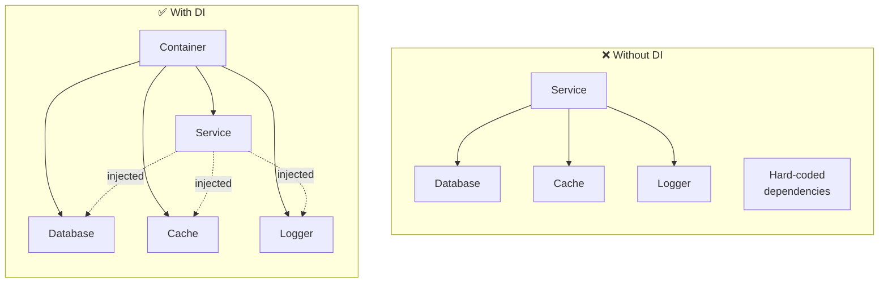
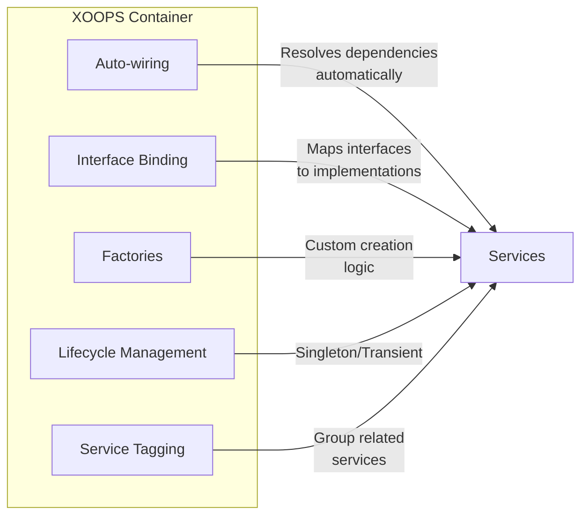
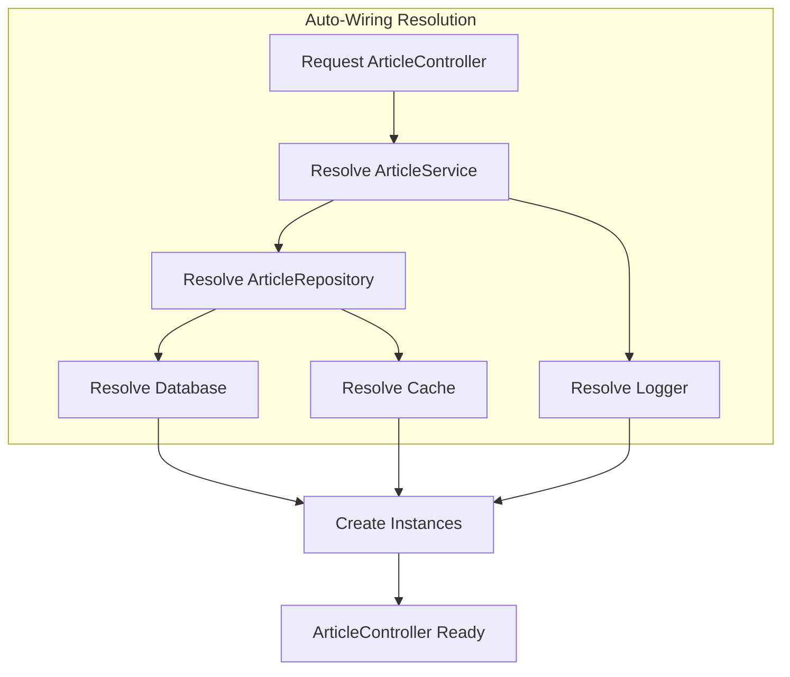
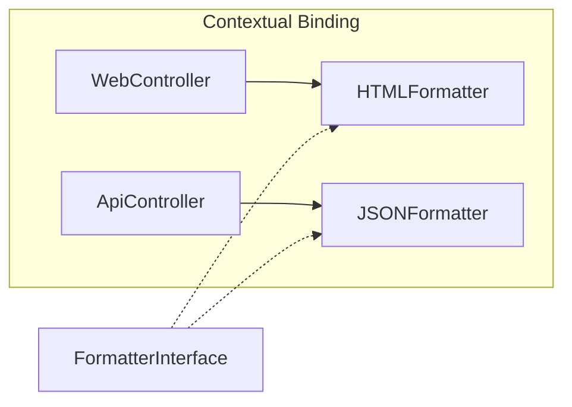
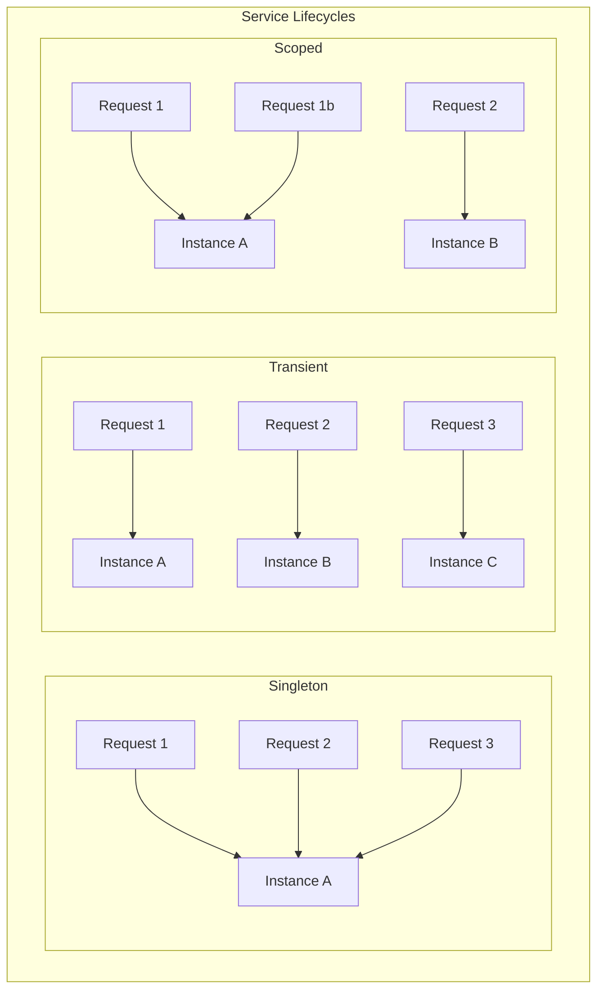
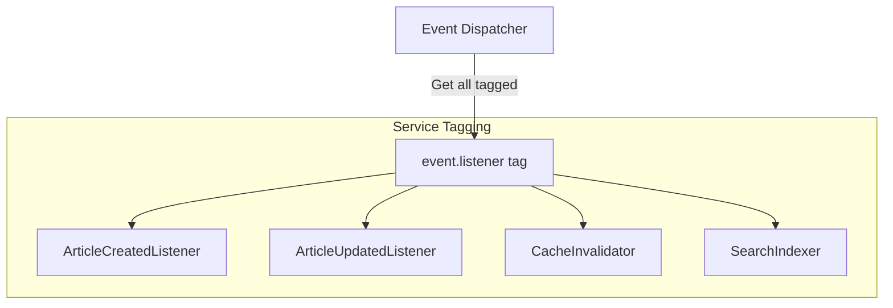
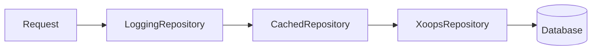
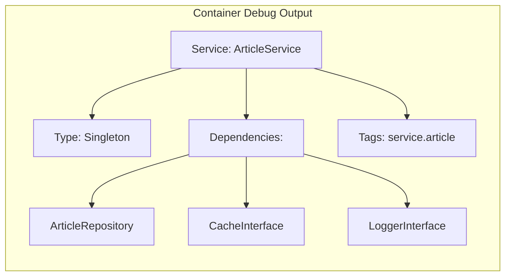

# 📦 PSR-11 Dependency Injection Guide

> **Master dependency injection and service containers in XOOPS 4.0.**

Dependency Injection (DI) is a design pattern that removes hard-coded dependencies, making your code more modular, testable, and maintainable. XOOPS 4.0 uses PSR-11 compliant containers.

---

## Understanding Dependency Injection

### The Problem: Tight Coupling

```php
<?php
// ❌ Bad: Hard-coded dependencies
class ArticleService
{
    public function getArticles(): array
    {
        // Tightly coupled to specific implementation
        $db = new MySQLDatabase();
        $cache = new RedisCache();
        $logger = new FileLogger();

        // Hard to test, hard to change
        return $db->query("SELECT * FROM articles");
    }
}
```

### The Solution: Dependency Injection

```php
<?php
// ✅ Good: Dependencies injected
class ArticleService
{
    public function __construct(
        private readonly DatabaseInterface $db,
        private readonly CacheInterface $cache,
        private readonly LoggerInterface $logger,
    ) {}

    public function getArticles(): array
    {
        return $this->db->query("SELECT * FROM articles");
    }
}
```

### Visualization



---

## PSR-11 Container Interface

### The Standard

```php
<?php

namespace Psr\Container;

interface ContainerInterface
{
    /**
     * Finds an entry of the container by its identifier and returns it.
     *
     * @param string $id Identifier of the entry to look for.
     * @return mixed Entry.
     * @throws NotFoundExceptionInterface  No entry found.
     * @throws ContainerExceptionInterface Error while retrieving.
     */
    public function get(string $id): mixed;

    /**
     * Returns true if the container can return an entry for the given identifier.
     *
     * @param string $id Identifier of the entry to look for.
     * @return bool
     */
    public function has(string $id): bool;
}
```

### XOOPS Container Features



---

## Container Configuration

### Basic Service Registration

```php
<?php
// config/services.php

declare(strict_types=1);

use Psr\Container\ContainerInterface;
use Xoops\Container\ContainerBuilder;

return static function (ContainerBuilder $container): void {
    // Simple binding: interface to implementation
    $container->bind(
        LoggerInterface::class,
        FileLogger::class
    );

    // With constructor arguments
    $container->bind(CacheInterface::class, RedisCache::class)
        ->constructor('localhost', 6379);

    // Singleton (shared instance)
    $container->singleton(
        DatabaseInterface::class,
        MySQLDatabase::class
    );

    // Factory function for complex creation
    $container->bind(ArticleRepository::class)
        ->factory(function (ContainerInterface $c) {
            return new ArticleRepository(
                $c->get(DatabaseInterface::class),
                $c->get(CacheInterface::class),
                $c->get('config.cache_ttl')
            );
        });
};
```

### Auto-Wiring

The container automatically resolves dependencies based on type hints:

```php
<?php

class ArticleController
{
    // Container automatically injects these
    public function __construct(
        private readonly ArticleService $articleService,
        private readonly LoggerInterface $logger,
    ) {}
}

// Container resolves:
// 1. ArticleService needs ArticleRepository, CacheInterface
// 2. ArticleRepository needs DatabaseInterface
// 3. All dependencies resolved recursively
```



---

## Service Definitions

### Interface Binding

```php
<?php

// Bind interface to concrete implementation
$container->bind(
    ArticleRepositoryInterface::class,
    XoopsArticleRepository::class
);

// Now any class requesting ArticleRepositoryInterface
// will receive XoopsArticleRepository
```

### Contextual Binding

Different implementations for different consumers:

```php
<?php

// WebArticleController gets HTMLFormatter
$container->when(WebArticleController::class)
    ->needs(FormatterInterface::class)
    ->give(HTMLFormatter::class);

// ApiArticleController gets JSONFormatter
$container->when(ApiArticleController::class)
    ->needs(FormatterInterface::class)
    ->give(JSONFormatter::class);
```



### Lifecycle Management

```php
<?php

// Singleton: Same instance every time
$container->singleton(DatabaseInterface::class, MySQLDatabase::class);

// Transient: New instance every time (default)
$container->bind(RequestValidator::class);

// Scoped: Same instance within a request
$container->scoped(UserContext::class);
```



---

## Advanced Patterns

### Service Providers

Organize related services into providers:

```php
<?php

declare(strict_types=1);

namespace MyModule\Provider;

use Xoops\Container\ServiceProvider;
use Xoops\Container\ContainerBuilder;

final class ArticleServiceProvider extends ServiceProvider
{
    public function register(ContainerBuilder $container): void
    {
        // Repository
        $container->bind(
            ArticleRepositoryInterface::class,
            XoopsArticleRepository::class
        );

        // Services
        $container->bind(ArticleService::class);
        $container->bind(ArticleSearchService::class);

        // Commands
        $container->bind(CreateArticleHandler::class);
        $container->bind(UpdateArticleHandler::class);
        $container->bind(DeleteArticleHandler::class);
    }

    public function boot(ContainerInterface $container): void
    {
        // Run after all providers are registered
        // Good for subscribing to events, etc.
    }
}
```

### Service Tagging

Group related services for bulk operations:

```php
<?php

// Tag multiple services
$container->bind(ArticleCreatedListener::class)
    ->tag('event.listener', ['event' => 'article.created']);

$container->bind(ArticleUpdatedListener::class)
    ->tag('event.listener', ['event' => 'article.updated']);

$container->bind(CacheInvalidator::class)
    ->tag('event.listener', ['event' => 'article.*']);

// Retrieve all tagged services
$listeners = $container->tagged('event.listener');
foreach ($listeners as $listener) {
    $dispatcher->addListener($listener);
}
```



### Decorators

Wrap services with additional functionality:

```php
<?php

// Original service
$container->bind(ArticleRepositoryInterface::class, XoopsArticleRepository::class);

// Decorate with caching
$container->decorate(
    ArticleRepositoryInterface::class,
    CachedArticleRepository::class
);

// Decorate with logging
$container->decorate(
    ArticleRepositoryInterface::class,
    LoggingArticleRepository::class
);

// Resolution order: Logging → Caching → Original
```



---

## Module Service Configuration

### Module services.php

```php
<?php
// modules/mymodule/config/services.php

declare(strict_types=1);

use Xoops\Container\ContainerBuilder;

return static function (ContainerBuilder $container): void {
    // Module-specific services
    $container->bind(
        \MyModule\Repository\ArticleRepositoryInterface::class,
        \MyModule\Infrastructure\XoopsArticleRepository::class
    );

    // Command handlers
    $container->bind(\MyModule\Application\CreateArticleHandler::class);
    $container->bind(\MyModule\Application\UpdateArticleHandler::class);

    // Controllers (auto-wired by default)
    $container->bind(\MyModule\Controller\ArticleController::class);
    $container->bind(\MyModule\Controller\Admin\ArticleAdminController::class);

    // Use XOOPS core services
    $container->alias('db', \Xoops\Database\DatabaseInterface::class);
    $container->alias('cache', \Psr\SimpleCache\CacheInterface::class);
};
```

### Accessing the Container

```php
<?php

// In a controller (injected automatically)
class ArticleController
{
    public function __construct(
        private readonly ArticleService $service,
    ) {}
}

// Manual access (avoid when possible)
$container = \Xoops\Core\Kernel::getContainer();
$service = $container->get(ArticleService::class);

// In legacy code (bridge)
$service = xoops_getService(ArticleService::class);
```

---

## Configuration Values

### Binding Configuration

```php
<?php

// Bind scalar values
$container->bind('config.cache_ttl', 3600);
$container->bind('config.items_per_page', 10);
$container->bind('config.upload_path', XOOPS_UPLOAD_PATH . '/articles');

// Bind arrays
$container->bind('config.allowed_extensions', ['jpg', 'png', 'gif', 'webp']);

// Use in services
class ImageUploader
{
    public function __construct(
        #[Inject('config.upload_path')]
        private readonly string $uploadPath,

        #[Inject('config.allowed_extensions')]
        private readonly array $allowedExtensions,
    ) {}
}
```

### Environment-Based Configuration

```php
<?php

$container->bind('config.debug', fn() => getenv('APP_DEBUG') === 'true');

$container->bind(CacheInterface::class)
    ->factory(function (ContainerInterface $c) {
        if ($c->get('config.debug')) {
            return new ArrayCache(); // In-memory for development
        }
        return new RedisCache();     // Redis for production
    });
```

---

## Testing with DI

### Mocking Dependencies

```php
<?php

declare(strict_types=1);

namespace Tests\Unit;

use PHPUnit\Framework\TestCase;

final class ArticleServiceTest extends TestCase
{
    public function testGetPublishedArticles(): void
    {
        // Create mock
        $repository = $this->createMock(ArticleRepositoryInterface::class);
        $repository->method('findPublished')
            ->willReturn([
                new Article(1, 'Title 1'),
                new Article(2, 'Title 2'),
            ]);

        $cache = $this->createMock(CacheInterface::class);
        $logger = $this->createMock(LoggerInterface::class);

        // Inject mocks
        $service = new ArticleService($repository, $cache, $logger);

        // Test
        $articles = $service->getPublishedArticles();

        $this->assertCount(2, $articles);
    }
}
```

### Test Container

```php
<?php

declare(strict_types=1);

namespace Tests;

use Xoops\Container\TestContainer;

final class ArticleIntegrationTest extends TestCase
{
    private TestContainer $container;

    protected function setUp(): void
    {
        $this->container = new TestContainer();

        // Override specific services for testing
        $this->container->bind(
            CacheInterface::class,
            ArrayCache::class // Use in-memory cache
        );

        $this->container->bind(
            DatabaseInterface::class,
            SQLiteDatabase::class // Use SQLite for tests
        );
    }

    public function testArticleCreation(): void
    {
        $handler = $this->container->get(CreateArticleHandler::class);

        $result = $handler(new CreateArticle(
            title: 'Test Article',
            content: 'Test content',
            authorId: 1,
        ));

        $this->assertInstanceOf(ArticleId::class, $result);
    }
}
```

---

## Best Practices

### Do's ✅

```php
<?php

// ✅ Use constructor injection
class ArticleService
{
    public function __construct(
        private readonly ArticleRepositoryInterface $repository,
    ) {}
}

// ✅ Depend on abstractions
public function __construct(
    private readonly LoggerInterface $logger, // Interface
) {}

// ✅ Use readonly properties
public function __construct(
    private readonly CacheInterface $cache,
) {}

// ✅ Keep constructors simple
public function __construct(
    private readonly Database $db,
    private readonly Cache $cache,
) {} // Just assignment, no logic
```

### Don'ts ❌

```php
<?php

// ❌ Don't use service locator pattern
class BadService
{
    public function doSomething(): void
    {
        $db = Container::get(Database::class); // Hidden dependency
    }
}

// ❌ Don't inject the container itself
class BadController
{
    public function __construct(
        private readonly ContainerInterface $container, // Anti-pattern
    ) {}
}

// ❌ Don't do work in constructor
class BadService
{
    public function __construct(Database $db)
    {
        $this->data = $db->query("SELECT * FROM config"); // Side effect
    }
}

// ❌ Don't have too many dependencies
class BadService
{
    public function __construct(
        $a, $b, $c, $d, $e, $f, $g, $h, $i, $j // Too many!
    ) {} // Consider refactoring
}
```

---

## Debugging

### Container Dump

```bash
# Dump all registered services
php xoops_cli.php container:debug

# Filter by pattern
php xoops_cli.php container:debug --filter=Article

# Show service details
php xoops_cli.php container:debug ArticleService --verbose
```

### Visualization



---

## 🔗 Related Documentation

- [[PSR-15-Middleware-Guide|PSR-15 Middleware]]
- [[Event-System-Guide|Event System]]
- [[../Modernization/PSR-Standards|PSR Standards]]

---

#psr-11 #dependency-injection #container #services #xoops-4.0
