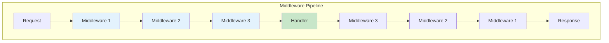
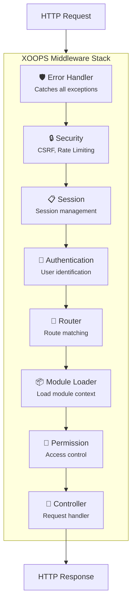
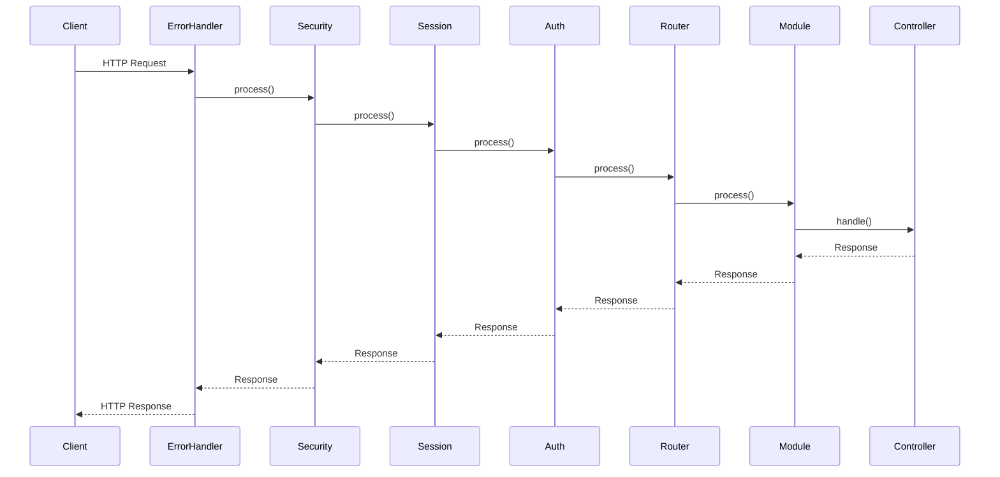
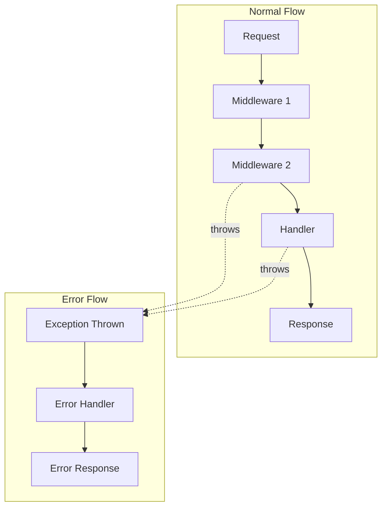

# 🔄 PSR-15 Middleware Implementation Guide

> **Master the art of HTTP middleware in XOOPS 4.0 with PSR-15 compliance.**

PSR-15 defines standard interfaces for HTTP server request handlers and middleware. XOOPS 4.0 fully embraces this standard, providing a robust middleware pipeline for request processing.

---

## Understanding PSR-15

### The Standard Interfaces

```php
<?php

namespace Psr\Http\Server;

use Psr\Http\Message\ResponseInterface;
use Psr\Http\Message\ServerRequestInterface;

/**
 * Handles a server request and produces a response.
 */
interface RequestHandlerInterface
{
    public function handle(ServerRequestInterface $request): ResponseInterface;
}

/**
 * Participant in processing a server request and response.
 */
interface MiddlewareInterface
{
    public function process(
        ServerRequestInterface $request,
        RequestHandlerInterface $handler
    ): ResponseInterface;
}
```

### How Middleware Works



Each middleware can:
1. **Modify the request** before passing it to the next middleware
2. **Pass to the next handler** in the pipeline
3. **Modify the response** before returning it
4. **Short-circuit** by returning a response directly

---

## XOOPS 4.0 Middleware Stack

### Default Pipeline



### Pipeline Configuration

```php
<?php
// config/middleware.php

declare(strict_types=1);

return [
    // Global middleware (always executed)
    'global' => [
        \Xoops\Middleware\ErrorHandler::class,
        \Xoops\Middleware\Security::class,
        \Xoops\Middleware\Session::class,
        \Xoops\Middleware\Authentication::class,
    ],

    // Route-level middleware
    'route' => [
        \Xoops\Middleware\Router::class,
        \Xoops\Middleware\ModuleLoader::class,
        \Xoops\Middleware\Permission::class,
    ],

    // Named middleware (can be applied to routes)
    'named' => [
        'auth' => \Xoops\Middleware\RequireAuthentication::class,
        'admin' => \Xoops\Middleware\RequireAdmin::class,
        'api' => \Xoops\Middleware\ApiAuthentication::class,
        'throttle' => \Xoops\Middleware\RateLimiter::class,
        'cache' => \Xoops\Middleware\HttpCache::class,
    ],
];
```

---

## Creating Custom Middleware

### Basic Middleware Structure

```php
<?php

declare(strict_types=1);

namespace MyModule\Middleware;

use Psr\Http\Message\ResponseInterface;
use Psr\Http\Message\ServerRequestInterface;
use Psr\Http\Server\MiddlewareInterface;
use Psr\Http\Server\RequestHandlerInterface;

final class MyCustomMiddleware implements MiddlewareInterface
{
    public function process(
        ServerRequestInterface $request,
        RequestHandlerInterface $handler
    ): ResponseInterface {
        // Before: Modify request or perform pre-processing
        $request = $this->beforeHandle($request);

        // Delegate to the next handler
        $response = $handler->handle($request);

        // After: Modify response or perform post-processing
        return $this->afterHandle($response);
    }

    private function beforeHandle(ServerRequestInterface $request): ServerRequestInterface
    {
        // Add custom attribute
        return $request->withAttribute('my_timestamp', microtime(true));
    }

    private function afterHandle(ResponseInterface $response): ResponseInterface
    {
        // Add custom header
        return $response->withHeader('X-Processed-By', 'MyModule');
    }
}
```

### Middleware with Dependencies

```php
<?php

declare(strict_types=1);

namespace MyModule\Middleware;

use Psr\Http\Message\ResponseInterface;
use Psr\Http\Message\ServerRequestInterface;
use Psr\Http\Server\MiddlewareInterface;
use Psr\Http\Server\RequestHandlerInterface;
use Psr\Log\LoggerInterface;
use Xoops\Security\TokenValidator;

final class CsrfProtection implements MiddlewareInterface
{
    public function __construct(
        private readonly TokenValidator $tokenValidator,
        private readonly LoggerInterface $logger,
        private readonly ResponseFactory $responseFactory,
    ) {}

    public function process(
        ServerRequestInterface $request,
        RequestHandlerInterface $handler
    ): ResponseInterface {
        // Skip for safe methods
        if (in_array($request->getMethod(), ['GET', 'HEAD', 'OPTIONS'])) {
            return $handler->handle($request);
        }

        // Validate CSRF token
        $token = $this->extractToken($request);

        if (!$this->tokenValidator->validate($token)) {
            $this->logger->warning('CSRF validation failed', [
                'ip' => $request->getServerParams()['REMOTE_ADDR'] ?? 'unknown',
                'uri' => (string) $request->getUri(),
            ]);

            return $this->responseFactory->forbidden('Invalid CSRF token');
        }

        return $handler->handle($request);
    }

    private function extractToken(ServerRequestInterface $request): ?string
    {
        // Check header first
        $token = $request->getHeaderLine('X-CSRF-Token');
        if ($token !== '') {
            return $token;
        }

        // Check body
        $body = $request->getParsedBody();
        return $body['_token'] ?? null;
    }
}
```

---

## Common Middleware Patterns

### 1. Authentication Middleware

```php
<?php

declare(strict_types=1);

namespace Xoops\Middleware;

final class Authentication implements MiddlewareInterface
{
    public function __construct(
        private readonly SessionManager $session,
        private readonly UserRepository $users,
    ) {}

    public function process(
        ServerRequestInterface $request,
        RequestHandlerInterface $handler
    ): ResponseInterface {
        $user = null;

        // Check session for user ID
        $userId = $this->session->get('user_id');
        if ($userId !== null) {
            $user = $this->users->find($userId);
        }

        // Check for API token
        if ($user === null) {
            $user = $this->authenticateViaToken($request);
        }

        // Add user to request attributes
        $request = $request->withAttribute('user', $user);
        $request = $request->withAttribute('is_authenticated', $user !== null);

        return $handler->handle($request);
    }

    private function authenticateViaToken(ServerRequestInterface $request): ?User
    {
        $authHeader = $request->getHeaderLine('Authorization');
        if (str_starts_with($authHeader, 'Bearer ')) {
            $token = substr($authHeader, 7);
            return $this->users->findByApiToken($token);
        }
        return null;
    }
}
```

### 2. Rate Limiting Middleware

```php
<?php

declare(strict_types=1);

namespace Xoops\Middleware;

final class RateLimiter implements MiddlewareInterface
{
    public function __construct(
        private readonly RateLimiterFactory $limiterFactory,
        private readonly ResponseFactory $responseFactory,
        private readonly int $maxAttempts = 60,
        private readonly int $decaySeconds = 60,
    ) {}

    public function process(
        ServerRequestInterface $request,
        RequestHandlerInterface $handler
    ): ResponseInterface {
        $key = $this->resolveRequestSignature($request);
        $limiter = $this->limiterFactory->create($key, $this->maxAttempts, $this->decaySeconds);

        if ($limiter->tooManyAttempts()) {
            return $this->buildTooManyAttemptsResponse($limiter);
        }

        $limiter->hit();

        $response = $handler->handle($request);

        return $this->addRateLimitHeaders($response, $limiter);
    }

    private function resolveRequestSignature(ServerRequestInterface $request): string
    {
        $user = $request->getAttribute('user');
        if ($user !== null) {
            return 'user:' . $user->id;
        }
        return 'ip:' . ($request->getServerParams()['REMOTE_ADDR'] ?? 'unknown');
    }

    private function buildTooManyAttemptsResponse(Limiter $limiter): ResponseInterface
    {
        return $this->responseFactory->json([
            'error' => 'Too many requests',
            'retry_after' => $limiter->availableIn(),
        ], 429)->withHeader('Retry-After', (string) $limiter->availableIn());
    }

    private function addRateLimitHeaders(ResponseInterface $response, Limiter $limiter): ResponseInterface
    {
        return $response
            ->withHeader('X-RateLimit-Limit', (string) $this->maxAttempts)
            ->withHeader('X-RateLimit-Remaining', (string) $limiter->remaining())
            ->withHeader('X-RateLimit-Reset', (string) $limiter->resetTime());
    }
}
```

### 3. Caching Middleware

```php
<?php

declare(strict_types=1);

namespace Xoops\Middleware;

final class HttpCache implements MiddlewareInterface
{
    public function __construct(
        private readonly CacheInterface $cache,
        private readonly int $ttl = 3600,
    ) {}

    public function process(
        ServerRequestInterface $request,
        RequestHandlerInterface $handler
    ): ResponseInterface {
        // Only cache GET requests
        if ($request->getMethod() !== 'GET') {
            return $handler->handle($request);
        }

        // Skip for authenticated users
        if ($request->getAttribute('is_authenticated')) {
            return $handler->handle($request);
        }

        $cacheKey = $this->buildCacheKey($request);

        // Try to get from cache
        $cached = $this->cache->get($cacheKey);
        if ($cached !== null) {
            return $this->hydrateResponse($cached)
                ->withHeader('X-Cache', 'HIT');
        }

        // Generate response
        $response = $handler->handle($request);

        // Cache successful responses
        if ($response->getStatusCode() === 200) {
            $this->cache->set($cacheKey, $this->dehydrateResponse($response), $this->ttl);
        }

        return $response->withHeader('X-Cache', 'MISS');
    }

    private function buildCacheKey(ServerRequestInterface $request): string
    {
        return 'http:' . md5((string) $request->getUri());
    }
}
```

### 4. Logging Middleware

```php
<?php

declare(strict_types=1);

namespace Xoops\Middleware;

final class RequestLogger implements MiddlewareInterface
{
    public function __construct(
        private readonly LoggerInterface $logger,
    ) {}

    public function process(
        ServerRequestInterface $request,
        RequestHandlerInterface $handler
    ): ResponseInterface {
        $startTime = microtime(true);
        $requestId = bin2hex(random_bytes(8));

        // Add request ID to request
        $request = $request->withAttribute('request_id', $requestId);

        $this->logger->info('Request started', [
            'request_id' => $requestId,
            'method' => $request->getMethod(),
            'uri' => (string) $request->getUri(),
            'ip' => $request->getServerParams()['REMOTE_ADDR'] ?? 'unknown',
        ]);

        try {
            $response = $handler->handle($request);

            $this->logger->info('Request completed', [
                'request_id' => $requestId,
                'status' => $response->getStatusCode(),
                'duration_ms' => round((microtime(true) - $startTime) * 1000, 2),
            ]);

            return $response->withHeader('X-Request-Id', $requestId);
        } catch (\Throwable $e) {
            $this->logger->error('Request failed', [
                'request_id' => $requestId,
                'exception' => $e::class,
                'message' => $e->getMessage(),
                'duration_ms' => round((microtime(true) - $startTime) * 1000, 2),
            ]);

            throw $e;
        }
    }
}
```

---

## Middleware Flow Visualization

### Request Lifecycle



### Error Handling Flow



---

## Registering Middleware

### Global Middleware

```php
<?php
// config/middleware.php

return [
    'global' => [
        \App\Middleware\RequestLogger::class,
        \Xoops\Middleware\ErrorHandler::class,
        // ... more middleware
    ],
];
```

### Route-Level Middleware

```php
<?php
// config/routes.php

use Xoops\Routing\Router;

return static function (Router $router): void {
    // Apply middleware to a single route
    $router->get('/api/articles', ArticleController::class)
        ->middleware('throttle:100,60');

    // Apply middleware to a group
    $router->group(['middleware' => ['auth', 'admin']], function (Router $router) {
        $router->get('/admin/dashboard', AdminController::class);
        $router->get('/admin/users', UserController::class);
    });

    // API routes with multiple middleware
    $router->group([
        'prefix' => '/api/v1',
        'middleware' => ['api', 'throttle'],
    ], function (Router $router) {
        $router->resource('articles', ArticleApiController::class);
    });
};
```

### Module Middleware

```php
<?php
// modules/mymodule/config/middleware.php

return [
    // Middleware specific to this module
    'module' => [
        \MyModule\Middleware\AuditLog::class,
        \MyModule\Middleware\FeatureFlags::class,
    ],

    // Middleware for admin routes only
    'admin' => [
        \MyModule\Middleware\AdminAccess::class,
    ],
];
```

---

## Testing Middleware

### Unit Testing

```php
<?php

declare(strict_types=1);

namespace Tests\Unit\Middleware;

use PHPUnit\Framework\TestCase;
use Psr\Http\Message\ServerRequestInterface;
use Psr\Http\Server\RequestHandlerInterface;

final class RateLimiterTest extends TestCase
{
    public function testAllowsRequestUnderLimit(): void
    {
        $limiterFactory = $this->createMock(RateLimiterFactory::class);
        $limiter = $this->createMock(Limiter::class);
        $limiter->method('tooManyAttempts')->willReturn(false);
        $limiter->method('remaining')->willReturn(59);
        $limiterFactory->method('create')->willReturn($limiter);

        $middleware = new RateLimiter($limiterFactory, new ResponseFactory());

        $request = $this->createMock(ServerRequestInterface::class);
        $handler = $this->createMock(RequestHandlerInterface::class);
        $handler->expects($this->once())->method('handle');

        $middleware->process($request, $handler);
    }

    public function testBlocksRequestOverLimit(): void
    {
        $limiterFactory = $this->createMock(RateLimiterFactory::class);
        $limiter = $this->createMock(Limiter::class);
        $limiter->method('tooManyAttempts')->willReturn(true);
        $limiter->method('availableIn')->willReturn(30);
        $limiterFactory->method('create')->willReturn($limiter);

        $middleware = new RateLimiter($limiterFactory, new ResponseFactory());

        $request = $this->createMock(ServerRequestInterface::class);
        $handler = $this->createMock(RequestHandlerInterface::class);
        $handler->expects($this->never())->method('handle');

        $response = $middleware->process($request, $handler);

        $this->assertSame(429, $response->getStatusCode());
    }
}
```

---

## Best Practices

### Do's

1. **Keep middleware focused** - One responsibility per middleware
2. **Use dependency injection** - Don't create dependencies inside middleware
3. **Handle exceptions gracefully** - Let the error handler catch them
4. **Add appropriate headers** - Security headers, cache headers, etc.
5. **Log important events** - Request/response logging for debugging

### Don'ts

1. **Don't modify request body** - PSR-7 requests are immutable
2. **Don't share state between requests** - Use request attributes
3. **Don't catch all exceptions** - Let them bubble to error handler
4. **Don't do heavy processing** - Middleware should be fast
5. **Don't bypass the pipeline** - Always call `$handler->handle()`

---

## 🔗 Related Documentation

- [[../Roadmap/Architecture-Vision|Architecture Vision]]
- [[../Modernization/PSR-Standards|PSR Standards]]
- [[../../02-Core-Concepts/Security/Security-Best-Practices|Security Best Practices]]

---

#psr-15 #middleware #http #xoops-4.0 #implementation
