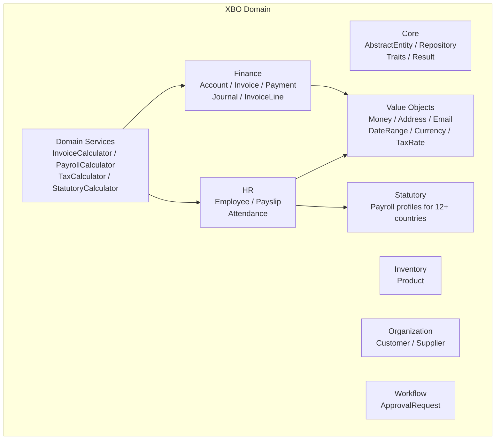

# 🏢 XBO — XOOPS Business Objects Guide

> **XBO is the PHP 8.4 domain library** for building business applications (ERP, CRM, HRM) on XOOPS 4.0. It provides ready-made business entities, value objects, repositories, domain services, and statutory calculation engines.

---

## What Is XBO?

XBO extends XMF with **pre-built business domain objects** that ERP and business-management modules typically need but shouldn't rebuild from scratch in every module.

> Analogy: XMF is the PHP toolbox (hammers, screwdrivers, measuring tape). XBO is the pre-fabricated structural components (walls, floors, staircases). You still design your building (your module), but you don't pour your own concrete for every floor.

---

## Package Details

| Property | Value |
|----------|-------|
| **Package** | `xoops/business-objects` |
| **Namespace** | `Xoops\BusinessObjects\` |
| **PHP Minimum** | **8.4** (uses asymmetric visibility) |
| **Depends on** | `xoops/xmf: ^3.0` |
| **Current Path** | `xoops_lib/vendor/xoops/BusinessObjects/` |
| **Future Path** | `xoops_lib/vendor/xoops/xbo/` *(rename pending)* |

> **Note on PHP 8.4:** XBO uses PHP 8.4's asymmetric visibility (`protected int $id { get => ... }`) and other 8.4 features. XOOPS 4.0 requires PHP 8.4+ as a minimum.

---

## Domain Map



---

## 1. Core Layer (`Xoops\BusinessObjects\Core`)

### AbstractEntity

The base entity for all XBO business objects. Uses `DomainEventAwareInterface` from XMF.

```php
<?php
declare(strict_types=1);

namespace Xoops\BusinessObjects\Core\Entity;

// Key features:
// - PHP 8.4 asymmetric visibility: $id is readable everywhere, writable only internally
// - Built-in audit timestamps (createdAt, updatedAt, createdBy, updatedBy)
// - Organization-scoped (multi-tenant via organizationId)
// - Soft delete via isDeleted flag
// - Domain event recording via DomainEventAwareInterface

abstract class AbstractEntity implements DomainEventAwareInterface
{
    protected int $id {
        get => $this->id ?? 0;
    }
    protected int    $organizationId = 0;
    protected bool   $isDeleted      = false;
    protected bool   $isActive       = true;
    // ... timestamps: createdAt, updatedAt, createdBy, updatedBy
}
```

**Lifecycle methods:**

```php
$entity->getId();              // int — 0 means unsaved (new)
$entity->isNew();              // bool
$entity->isActive();           // bool
$entity->isDeleted();          // bool

$entity->activate();           // sets isActive = true
$entity->deactivate();         // sets isActive = false
$entity->markDeleted();        // soft delete

$entity->touchCreated($userId); // sets createdAt, createdBy, updatedAt, updatedBy
$entity->touchUpdated($userId); // sets updatedAt, updatedBy

$entity->recordEvent($event);  // queue a domain event
$entity->releaseEvents();      // flush queued events (called by Repository)

$entity->toArray();            // array — for DB persistence
$entity->fromArray($row);      // static factory — hydrate from DB row
```

### Specialized Abstract Entities

| Class | When to Extend |
|-------|---------------|
| `AbstractPersonEntity` | People — employees, customers, contacts |
| `AbstractDocumentEntity` | Documents — invoices, orders, payslips |
| `AbstractLineItemEntity` | Line items on a document |

```php
// Example: Employee extends AbstractPersonEntity
class Employee extends AbstractPersonEntity
{
    private string $employeeCode = '';
    private EmploymentType $employmentType = EmploymentType::FullTime;
    // ... department, position, salary, etc.
}
```

### Repository (`AbstractRepository`)

```php
<?php

use Xoops\BusinessObjects\Core\Repository\AbstractRepository;

class InvoiceRepository extends AbstractRepository
{
    protected function getTableName(): string { return 'mod_finance_invoice'; }

    public function findByCustomer(int $customerId): array
    {
        return $this->findBy(['customer_id' => $customerId]);
    }

    public function findUnpaid(): array
    {
        return $this->findBy([
            'status'     => DocumentStatus::Issued->value,
            'is_deleted' => 0,
        ]);
    }
}
```

### Result (`Core\Result\Result`)

A monadic `Result<T>` type that eliminates `try/catch` from service calls.

```php
<?php

use Xoops\BusinessObjects\Core\Result\Result;

// Service returns Result, not throws
$result = $invoiceCalculator->calculate($invoice);

if ($result->isSuccess()) {
    $totals = $result->getValue();
} else {
    $errors = $result->getErrors();  // array of error messages
}

// Fluent chaining
$result
    ->onSuccess(fn($v) => $this->repo->save($v))
    ->onFailure(fn($e) => $this->logger->error($e));
```

### Core Traits

| Trait | Adds |
|-------|------|
| `TimestampedTrait` | `createdAt`, `updatedAt` management |
| `TenantScopeTrait` | `organizationId` scoping |
| `SoftDeleteTrait` | `isDeleted` + `markDeleted()` / `restore()` |

---

## 2. Value Objects (`Xoops\BusinessObjects\Domain\ValueObject`)

XBO ships production-quality value objects so modules don't reinvent them.

### Money

```php
<?php

use Xoops\BusinessObjects\Domain\ValueObject\Money;
use Xoops\BusinessObjects\Domain\ValueObject\Currency;

$myr = new Currency('MYR', 'RM', 2);

// Create from float (stored internally as integer cents)
$price    = Money::of(99.90, $myr);       // 9990 sen
$tax      = Money::of(5.994, $myr);       // 599 sen (rounded half-up)
$total    = $price->add($tax);            // 10589 sen = RM105.89
$discount = $total->percentage(10.0);     // 10% discount = 1059 sen

// Comparison
$price->greaterThan($discount);           // true
$price->compare($discount);              // 1

// Display
echo $total->format();                   // "RM 105.89"

// Allocate to sub-parts without losing cents
[$agentFee, $tax, $net] = $total->allocate([1, 2, 17]);
// Sum is guaranteed to equal $total exactly
```

### Address

```php
<?php

use Xoops\BusinessObjects\Domain\ValueObject\Address;

$address = new Address(
    street1: '123 Jalan Bukit Bintang',
    street2: 'Suite 10',
    city:    'Kuala Lumpur',
    state:   'Wilayah Persekutuan',
    postcode: '50450',
    country: 'MY',
);

echo $address->format();
// 123 Jalan Bukit Bintang
// Suite 10
// 50450 Kuala Lumpur
// Wilayah Persekutuan, Malaysia
```

### Other Value Objects

| Class | Validates |
|-------|----------|
| `Email` | RFC 5321 email address |
| `PhoneNumber` | E.164 international format |
| `DateRange` | Start ≤ end, duration calculations |
| `TaxRate` | 0–100%, scale-correct percentage math |
| `Percentage` | Generic percentage (0–100) |
| `BankAccount` | Account number + bank code |
| `CountryCode` | ISO 3166-1 alpha-2 |
| `IdentityDocument` | Passport / IC / SSN |
| `Coordinate` | Latitude + longitude |
| `Currency` | ISO 4217 code + symbol + decimal places |
| `CurrencyRegistry` | Look up currencies by ISO code |

---

## 3. Finance Domain (`Xoops\BusinessObjects\Domain\Finance`)

### Invoice

```php
<?php

use Xoops\BusinessObjects\Domain\Finance\Invoice;
use Xoops\BusinessObjects\Domain\Finance\InvoiceLine;
use Xoops\BusinessObjects\Domain\Enum\InvoiceType;
use Xoops\BusinessObjects\Domain\Enum\DocumentStatus;

$invoice = new Invoice();
$invoice->setCustomerId($customerId);
$invoice->setType(InvoiceType::Invoice);
$invoice->setStatus(DocumentStatus::Draft);
$invoice->setIssueDate(new \DateTimeImmutable());
$invoice->setDueDate(new \DateTimeImmutable('+30 days'));

$line = new InvoiceLine();
$line->setDescription('XOOPS Development Services');
$line->setQuantity(8.0);
$line->setUnitPrice(Money::of(150.00, $myr));
$line->setTaxRate(new TaxRate(6.0));   // 6% SST

$invoice->addLine($line);

$repo->save($invoice);
```

### Financial Entities

| Entity | Purpose |
|--------|---------|
| `Account` | Chart of accounts (AccountType enum) |
| `Invoice` | Sales / purchase invoices |
| `InvoiceLine` | Invoice line items |
| `Payment` | Payment records |
| `PaymentAllocation` | Allocate payments to invoices |
| `JournalEntry` | Double-entry bookkeeping header |
| `JournalLine` | Debit/credit legs of a journal entry |

### Domain Enums (Finance)

```php
use Xoops\BusinessObjects\Domain\Enum\AccountType;
use Xoops\BusinessObjects\Domain\Enum\DocumentStatus;
use Xoops\BusinessObjects\Domain\Enum\InvoiceType;
use Xoops\BusinessObjects\Domain\Enum\PaymentMethod;
use Xoops\BusinessObjects\Domain\Enum\TaxType;

AccountType::Asset | Liability | Equity | Revenue | Expense
DocumentStatus::Draft | Issued | PartiallyPaid | Paid | Void | Cancelled
InvoiceType::Invoice | CreditNote | DebitNote | Proforma
PaymentMethod::Cash | BankTransfer | Cheque | CreditCard | FPX | EWallet
TaxType::GST | SST | VAT | WithholdingTax | None
```

---

## 4. HR Domain (`Xoops\BusinessObjects\Domain\HR`)

### Employee

```php
<?php

use Xoops\BusinessObjects\Domain\HR\Employee;
use Xoops\BusinessObjects\Domain\Enum\EmploymentType;
use Xoops\BusinessObjects\Domain\Enum\Gender;

$employee = new Employee();
$employee->setName('Ahmad bin Abdullah');
$employee->setEmployeeCode('EMP-0042');
$employee->setEmploymentType(EmploymentType::FullTime);
$employee->setGender(Gender::Male);
$employee->setEmail(new Email('ahmad@company.com'));
$employee->setJoinDate(new \DateTimeImmutable('2024-03-01'));
$employee->setBasicSalary(Money::of(5000.00, $myr));

$repo->save($employee);
```

### Payslip & Payroll

```php
<?php

use Xoops\BusinessObjects\Domain\HR\Payslip;
use Xoops\BusinessObjects\Domain\HR\PayslipLine;

$payslip = new Payslip();
$payslip->setEmployeeId($employee->getId());
$payslip->setPeriodStart(new \DateTimeImmutable('2026-03-01'));
$payslip->setPeriodEnd(new \DateTimeImmutable('2026-03-31'));

$payslip->addLine(PayslipLine::earning('Basic Salary', Money::of(5000, $myr)));
$payslip->addLine(PayslipLine::earning('Housing Allowance', Money::of(500, $myr)));
$payslip->addLine(PayslipLine::deduction('EPF (Employee 11%)', Money::of(605, $myr)));
$payslip->addLine(PayslipLine::deduction('SOCSO', Money::of(23.80, $myr)));
$payslip->addLine(PayslipLine::deduction('Income Tax (PCB)', Money::of(120, $myr)));

echo $payslip->getNetPay()->format();   // "RM 4751.20"
```

### Attendance

```php
use Xoops\BusinessObjects\Domain\HR\Attendance;

$record = new Attendance();
$record->setEmployeeId($employee->getId());
$record->setCheckIn(new \DateTimeImmutable('2026-03-25 08:55:00'));
$record->setCheckOut(new \DateTimeImmutable('2026-03-25 18:05:00'));
// Hours worked, overtime, late minutes are computed properties
```

---

## 5. Statutory Engine (`Xoops\BusinessObjects\Domain\Statutory`)

The Statutory Engine calculates **country-specific payroll deductions** — EPF, SOCSO, PCB, CPF, pension contributions, income tax — without any module needing to hardcode the rules.

### Supported Country Profiles

| Profile | Country | Coverage |
|---------|---------|---------|
| `MalaysiaProfile2024` | 🇲🇾 Malaysia | EPF, SOCSO/EIS, HRD Corp, PCB |
| `SingaporeProfile2024` | 🇸🇬 Singapore | CPF (employee + employer) |
| `UnitedKingdomProfile2024` | 🇬🇧 UK | PAYE, NIC |
| `GermanyProfile2024` | 🇩🇪 Germany | Lohnsteuer, Social insurance |
| `FranceProfile2024` | 🇫🇷 France | Social charges, IR |
| `JapanProfile2024` | 🇯🇵 Japan | Pension, Health, Employment |
| `BrazilProfile2024` | 🇧🇷 Brazil | INSS, FGTS, IRRF |
| `TaiwanProfile2024` | 🇹🇼 Taiwan | NHI, Labor insurance |
| `PolandProfile2024` | 🇵🇱 Poland | ZUS, PIT |
| `RussiaProfile2024` | 🇷🇺 Russia | PFR, MHIF, FSS |
| `ItalyProfile2024` | 🇮🇹 Italy | INPS, IRPEF |
| `SpainProfile2024` | 🇪🇸 Spain | SS, IRPF |

### Using the Statutory Engine

```php
<?php

use Xoops\BusinessObjects\Domain\Statutory\StatutoryEngine;
use Xoops\BusinessObjects\Domain\Statutory\Profiles\MalaysiaProfile2024;

$engine = new StatutoryEngine(new MalaysiaProfile2024());

$result = $engine->calculate(
    grossSalary: Money::of(5000.00, $myr),
    employee: $employee,
);

foreach ($result->getContributions() as $contribution) {
    echo $contribution->getType()->label() . ': ' . $contribution->getAmount()->format();
}
// EPF (Employee 11%): RM 550.00
// EPF (Employer 13%): RM 650.00
// SOCSO: RM 23.80
// EIS: RM 10.00
// PCB (Income Tax): RM 120.00
```

---

## 6. Domain Services

| Service | Responsibility |
|---------|---------------|
| `InvoiceCalculator` | Computes invoice subtotal, tax, total, rounding |
| `PayrollCalculator` | Computes gross → net pay with all earnings/deductions |
| `TaxCalculator` | Applies tax rules (GST, SST, VAT) to line items |
| `StatutoryCalculator` | Wraps `StatutoryEngine` for batch payroll runs |

```php
<?php

use Xoops\BusinessObjects\Domain\Service\InvoiceCalculator;

$calc = new InvoiceCalculator();
$totals = $calc->calculate($invoice);

echo $totals->getSubtotal()->format();    // RM 1,200.00
echo $totals->getTaxAmount()->format();   // RM 72.00 (6% SST)
echo $totals->getTotal()->format();       // RM 1,272.00
```

---

## 7. Organization Domain

```php
<?php

use Xoops\BusinessObjects\Domain\Organization\Customer;
use Xoops\BusinessObjects\Domain\Organization\Supplier;

$customer = new Customer();
$customer->setName('Syarikat Maju Jaya Sdn Bhd');
$customer->setRegistrationNumber('201901234567');
$customer->setEmail(new Email('accounts@majujaya.com.my'));
$customer->setBillingAddress($address);
$customer->setCreditLimit(Money::of(50000, $myr));

$supplier = new Supplier();
$supplier->setName('Tech Supplies Sdn Bhd');
$supplier->setPaymentTerms(30);  // Net 30 days
```

---

## 8. Workflow (`Xoops\BusinessObjects\Domain\Workflow`)

`ApprovalRequest` implements a generic multi-level approval workflow.

```php
<?php

use Xoops\BusinessObjects\Domain\Workflow\ApprovalRequest;

$approval = new ApprovalRequest();
$approval->setEntityType('invoice');
$approval->setEntityId($invoice->getId());
$approval->setRequestedBy($currentUserId);
$approval->setLevels([
    ['approver_id' => $managerId,       'level' => 1],
    ['approver_id' => $financeDirectorId, 'level' => 2],
]);

$approval->approve(level: 1, approvedBy: $managerId, note: 'Looks good');
$approval->approve(level: 2, approvedBy: $financeDirectorId);

$approval->isFullyApproved();  // true
```

---

## 9. Infrastructure Layer

| Class | Purpose |
|-------|---------|
| `XoopsDbAdapter` | Adapts XOOPS's `XoopsDatabase` to XBO's repository queries |
| `AuditLogger` | Persists audit trail entries via XMF's `AuditLogger` |
| `Logger` | PSR-3-compatible logger wrapping XOOPS error log |

---

## Integrating XBO with XMF's Repository Pattern

XBO entities ship with `XmfBusinessRepositoryTrait` for seamless integration with XMF's `Repository` class:

```php
<?php

use Xoops\BusinessObjects\Core\Repository\XmfBusinessRepositoryTrait;
use Xmf\Repository\Repository;

class InvoiceRepository extends Repository
{
    use XmfBusinessRepositoryTrait;

    // XmfBusinessRepositoryTrait adds:
    // - findActive(): array  (excludes soft-deleted)
    // - findByOrganization(int $orgId): array
    // - softDelete(AbstractEntity $entity, int $userId): void
    // - restore(AbstractEntity $entity, int $userId): void
}
```

---

## Path & Namespace Note (Upcoming Rename)

The vendor folder is currently named `BusinessObjects` and will be renamed to `xbo`:

```
# Current:
xoops_lib/vendor/xoops/BusinessObjects/

# After rename:
xoops_lib/vendor/xoops/xbo/
```

The PHP namespace (`Xoops\BusinessObjects\`) may be updated to `Xoops\Xbo\` in a future release. Check the XBO changelog for migration instructions when this rename ships.

For new code, use the namespace as it is now (`Xoops\BusinessObjects\`) and watch the XOOPS 4.0 release notes for the migration guide.

---

## Dependency Chain

```
Your Module
    → Xoops\BusinessObjects\ (XBO — PHP 8.4)
        → Xmf\ (XMF — PHP 8.4)
            → firebase/php-jwt
            → symfony/yaml
            → kint-php/kint
```

---

## 🔗 Related

- [[XMF-Advanced-Components|XMF Advanced Components]] — CommandBus, Repository, EventBus
- [[XMF-Components-Guide|XMF Components Guide]] — ULID, Slug, JWT, YAML
- [[XOOPS-4.0-Architecture|XOOPS 4.0 Architecture]]
- [Repository & Query Patterns](Repository-Query-Patterns-Guide.md)
- [[../Roadmap/4.0-Specification|XOOPS 4.0 Specification]]

---

#xbo #business-objects #ddd #finance #hr #erp #value-objects #xoops-4.0
