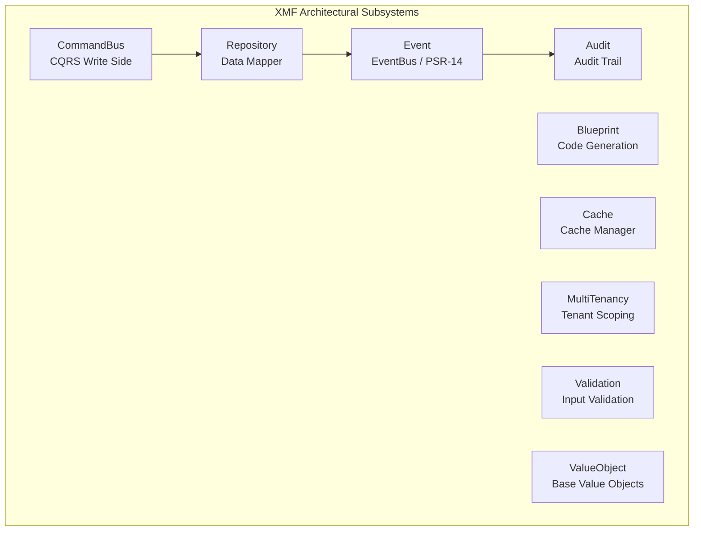
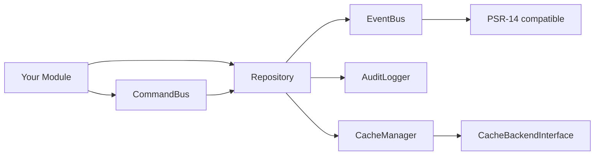

# 🔧 XMF Advanced Components

> **Beyond utilities — the architectural backbone of XMF for XOOPS 4.0 module development.**
>
> The [[XMF-Components-Guide|XMF Components Guide]] covers everyday tools (ULID, Slug, JWT, etc.).
> This guide covers the **structural subsystems** that implement DDD patterns inside XOOPS modules.

---

## Current Version

| Property | Value |
|----------|-------|
| **Package** | `xoops/xmf` |
| **Namespace** | `Xmf\` |
| **PHP Minimum** | 8.2 |
| **Vendor Path** | `xoops_lib/vendor/xoops/xmf/` |

---

## Subsystem Map



---

## 1. CommandBus (`Xmf\CommandBus`)

The CommandBus implements the **CQRS write side**: commands (intentions to mutate state) are dispatched through a middleware pipeline to their handlers.

> Analogy: Think of the CommandBus as a sorting office. You drop in an envelope (a Command), and the sorting office (the pipeline) stamps it, logs it, wraps it in a transaction, then delivers it to the right recipient (the Handler) — all without the sender knowing any of that happened.

### Key Classes

| Class | Role |
|-------|------|
| `SimpleCommandBus` | Dispatches commands through middleware to handlers |
| `CommandBusInterface` | Contract: `dispatch(object $command): mixed` |
| `HandlerResolverInterface` | Maps command class names to callables |
| `MapHandlerResolver` | Configurable map-based resolver |
| `MiddlewareInterface` | Contract: `handle(object $cmd, callable $next): mixed` |

### Built-in Middleware

| Middleware | Purpose |
|-----------|---------|
| `LoggingMiddleware` | Logs every command dispatch with timing |
| `TransactionMiddleware` | Wraps dispatch in a DB transaction |
| `ValidationMiddleware` | Validates commands before dispatch |

### Wiring the CommandBus

```php
<?php
declare(strict_types=1);

use Xmf\CommandBus\SimpleCommandBus;
use Xmf\CommandBus\MapHandlerResolver;
use Xmf\CommandBus\Middleware\LoggingMiddleware;
use Xmf\CommandBus\Middleware\TransactionMiddleware;
use Xmf\CommandBus\Middleware\ValidationMiddleware;

// 1. Map command classes to handler callables
$resolver = new MapHandlerResolver([
    CreateArticleCommand::class  => new CreateArticleHandler($repository),
    PublishArticleCommand::class => new PublishArticleHandler($repository, $events),
    DeleteArticleCommand::class  => new DeleteArticleHandler($repository),
]);

// 2. Build bus with ordered middleware (outermost first)
$bus = new SimpleCommandBus(
    $resolver,
    new LoggingMiddleware($logger),
    new ValidationMiddleware($validator),
    new TransactionMiddleware($db),  // innermost — runs closest to the handler
);
```

### Dispatching Commands

```php
// Write-side CQRS: commands mutate state, return nothing (or a minimal result)
$bus->dispatch(new CreateArticleCommand(
    title: 'Hello XOOPS 4.0',
    content: 'First article under the new architecture.',
    authorId: $currentUser->id,
));

$bus->dispatch(new PublishArticleCommand(articleId: $id));
```

### Writing a Command Handler

```php
<?php
declare(strict_types=1);

final readonly class CreateArticleHandler
{
    public function __construct(
        private ArticleRepositoryInterface $repository,
    ) {}

    public function __invoke(CreateArticleCommand $cmd): void
    {
        $article = Article::create(
            ArticleTitle::create($cmd->title),
            ArticleContent::create($cmd->content),
        );

        $this->repository->save($article);
    }
}
```

---

## 2. Repository (`Xmf\Repository`)

XMF's Repository wraps `XoopsPersistableObjectHandler` with a **Data Mapper** layer. It bridges the legacy XOOPS ORM to the XOOPS 4.0 domain model — without requiring a full rewrite of existing modules.

> Analogy: `XoopsPersistableObjectHandler` is the raw engine room. The XMF `Repository` is the bridge — it takes commands from the modern domain layer and translates them into instructions the engine room understands.

### Key Features

- **QueryBuilder integration**: replaces raw `CriteriaCompo` with a fluent builder
- **Change tracking**: partial `UPDATE` (only dirty fields, via `ChangeTrackingTrait`)
- **Domain event flushing**: after `save()`, domain events are dispatched via `EventBus`
- **Transaction support**: `transaction(callable $fn)` wraps callbacks in `BEGIN`/`COMMIT`/`ROLLBACK`

### Repository Constructor

```php
<?php

use Xmf\Repository\Repository;

$repo = new Repository(
    handler: $xoopsHandler,        // XoopsPersistableObjectHandler
    db: $xoopsDb,                  // XoopsDatabase
    eventBus: $eventBus,           // optional: Xmf\Event\EventBus
    enablePartialUpdates: true,    // default true; uses handler->insertPartial() when available
);
```

### Using QueryBuilder

```php
<?php

use Xmf\Query\QueryBuilder;

// Find published articles, newest first, page 2 (10 per page)
$query = QueryBuilder::create()
    ->where('status', '=', 'published')
    ->orderBy('created_at', 'DESC')
    ->limit(10)
    ->offset(10);

$articles = $repo->findAll($query);
$total    = $repo->count($query);
```

### Transactions

```php
$result = $repo->transaction(function (Repository $r) use ($invoice, $payment) {
    $r->save($invoice);
    $r->save($payment);
    return $invoice;
});
```

### Domain Events Flow

When a `XoopsObject` entity implements `DomainEventAwareInterface`, the Repository automatically flushes events after each `save()`:

```
Article::publish()              // records ArticlePublished event
    → repo->save($article)      // persists
    → foreach releaseEvents()   // flushes
        → eventBus->dispatch()  // notifies subscribers
```

---

## 3. EventBus (`Xmf\Event`)

XMF's `EventBus` is the **PSR-14-aligned event dispatcher** for XOOPS 4.0 modules. It bridges the legacy preload system with typed domain events.

### Key Classes

| Class | Role |
|-------|------|
| `EventBus` | Central dispatcher — `dispatch(object $event): void` |
| `AuditRecorded` | Built-in domain event for audit trail entries |

### Basic Usage

```php
<?php

use Xmf\Event\EventBus;

// Register a listener
$bus = new EventBus();

$bus->listen(ArticlePublished::class, function (ArticlePublished $event): void {
    $this->notificationService->notifySubscribers($event->getArticleId());
});

$bus->listen(ArticlePublished::class, new SearchIndexListener($searchEngine));

// Dispatch from domain code (or via Repository after save())
$bus->dispatch(new ArticlePublished($article->getId()));
```

### Typed Domain Events

```php
<?php
declare(strict_types=1);

final readonly class ArticlePublished
{
    public \DateTimeImmutable $occurredAt;

    public function __construct(
        public readonly string $articleId,
        public readonly int $authorId,
    ) {
        $this->occurredAt = new \DateTimeImmutable();
    }
}
```

---

## 4. Blueprint (`Xmf\Blueprint`)

Blueprint is XMF's **code generation engine**. It reads a `BlueprintDefinition` (a structured description of a module's domain model) and scaffolds the entity class, admin panel, and templates.

> Analogy: Blueprint is to XOOPS modules what `artisan make:model` is to Laravel — except it generates the full domain layer, not just a DB model.

### Blueprint Definition

```php
<?php

use Xmf\Blueprint\BlueprintDefinition;

$blueprint = BlueprintDefinition::create('articles')
    ->withField('title',   'string',  required: true,  maxLength: 200)
    ->withField('content', 'text',    required: true)
    ->withField('status',  'enum',    values: ['draft', 'published', 'archived'])
    ->withField('slug',    'slug',    sourceField: 'title')
    ->withTimestamps()
    ->withSoftDelete();
```

### Generating Code

```php
<?php

use Xmf\Blueprint\EntityGenerator;
use Xmf\Blueprint\AdminGenerator;

$entityGen = new EntityGenerator($blueprint);
$entityGen->generate('/path/to/modules/articles/src/Domain/');

$adminGen = new AdminGenerator($blueprint);
$adminGen->generate('/path/to/modules/articles/');
```

---

## 5. Audit (`Xmf\Audit`)

XMF's audit subsystem records **who changed what, when** — without any module-level boilerplate.

### Key Classes

| Class | Role |
|-------|------|
| `AuditLogger` | Records audit entries |
| `AuditEntry` | Immutable audit record DTO |
| `AuditQuery` | Retrieves audit history with filters |
| `AuditableInterface` | Marks entities as auditable |

### Usage

```php
<?php

use Xmf\Audit\AuditLogger;

// Log is usually called automatically by the Repository when entity is AuditableInterface
$logger->record(
    entity: $article,
    action: 'publish',
    userId: $currentUser->id,
    changes: ['status' => ['draft' => 'published']],
);

// Query history
$query = new AuditQuery();
$entries = $query
    ->forEntity(Article::class, $articleId)
    ->since(new \DateTimeImmutable('-30 days'))
    ->get();
```

---

## 6. Cache (`Xmf\Cache`)

`CacheManager` provides a **backend-agnostic cache** that works with XOOPS's existing cache infrastructure or any PSR-6/PSR-16-compatible backend.

```php
<?php

use Xmf\Cache\CacheManager;

$cache = new CacheManager($backend); // CacheBackendInterface

// Get or compute
$articles = $cache->remember('articles.featured', 3600, fn() => $repo->findFeatured());

// Invalidate
$cache->forget('articles.featured');
$cache->tags(['articles'])->flush();
```

---

## 7. MultiTenancy (`Xmf\MultiTenancy`)

For XOOPS installations running multiple organizations, XMF's MultiTenancy subsystem provides **automatic tenant scoping** — queries are transparently filtered by `organization_id`.

```php
<?php

// In repository — tenant context is injected automatically
$repo->findAll(QueryBuilder::create()); // adds WHERE organization_id = :current_tenant
```

---

## 8. Validation (`Xmf\Validation`)

Structured input validation for commands and form data.

```php
<?php

use Xmf\Validation\Validator;

$validator = new Validator();
$result = $validator->validate($data, [
    'title'      => ['required', 'string', 'max:200'],
    'status'     => ['required', 'in:draft,published,archived'],
    'tags'       => ['array', 'max:10'],
    'tags.*'     => ['string', 'max:30'],
]);

if ($result->fails()) {
    return $result->errors(); // ['title' => ['Title is required']]
}
```

---

## 9. ValueObject Base Classes (`Xmf\ValueObject`)

XMF ships base traits and interfaces for the most common value object patterns, so every module doesn't reinvent them.

```php
<?php

use Xmf\ValueObject\StringValueObject;
use Xmf\ValueObject\IntValueObject;

// Example: typed wrapper for module-specific strings
final readonly class ArticleTitle extends StringValueObject
{
    protected static function validate(string $value): void
    {
        if (mb_strlen($value) < 1 || mb_strlen($value) > 200) {
            throw new \InvalidArgumentException('Title must be 1–200 characters');
        }
    }
}

// Usage
$title = ArticleTitle::create('Hello World');
echo $title->value();  // "Hello World"
$title->equals(ArticleTitle::create('Hello World'));  // true
```

---

## Dependency Map



---

## 🔗 Related

- [[XMF-Components-Guide|XMF Everyday Components]] — ULID, Slug, JWT, YAML, Request
- [Repository & Query Patterns](Repository-Query-Patterns-Guide.md)
- [[Event-System-Guide|Event System Guide]]
- [[PSR-11-Dependency-Injection-Guide|Dependency Injection]]

---

#xmf #commandbus #repository #eventbus #blueprint #cqrs #xoops-4.0
