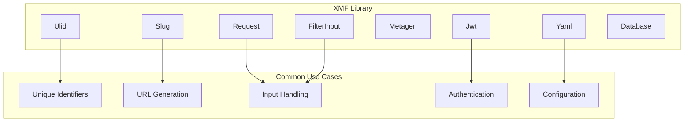
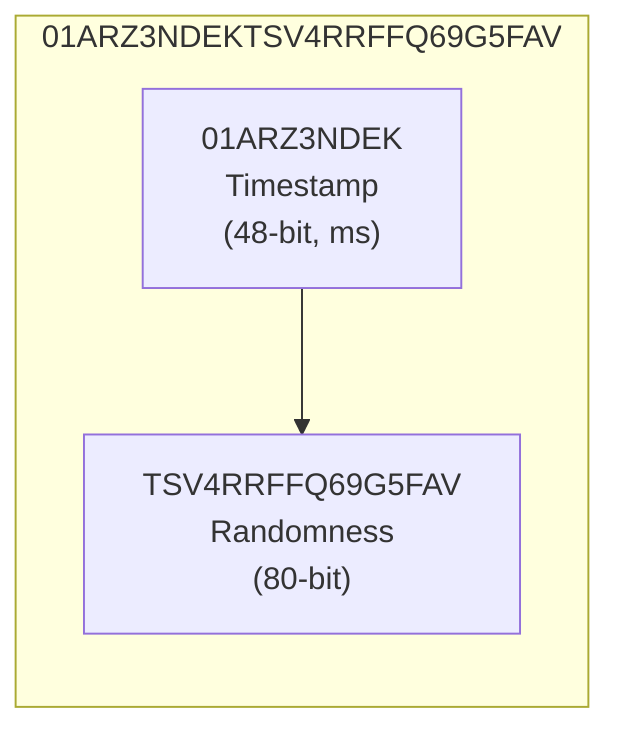
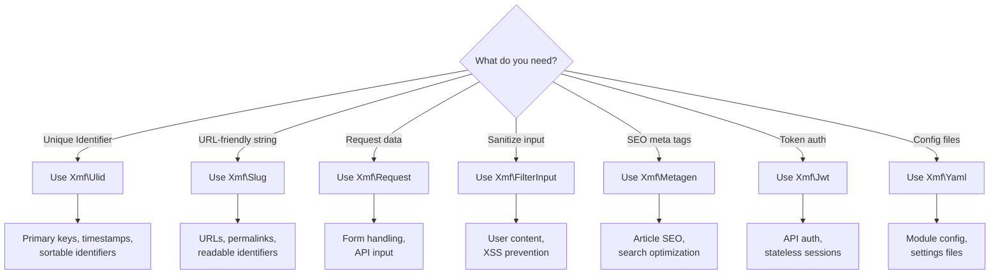

# 🧩 XMF Components Guide

> **Leveraging XMF (XOOPS Module Framework) components for modern XOOPS 4.0 development.**

XMF provides a collection of well-tested, framework-agnostic components that form the foundation of modern XOOPS module development.

---

## Overview



---

## Xmf\Ulid

**Universally Unique Lexicographically Sortable Identifier**

ULIDs provide significant advantages over traditional UUIDs for database-centric applications.

### Why ULID over UUID?

| Feature | ULID | UUID v4 | UUID v7 |
|---------|------|---------|---------|
| Length | 26 chars | 36 chars | 36 chars |
| Sortable | ✓ Lexicographic | ✗ | ✓ |
| URL-safe | ✓ Native | ✗ Needs encoding | ✗ |
| Time-extractable | ✓ | ✗ | ✓ |
| Collision-resistant | ✓ (80-bit random) | ✓ | ✓ |
| DB Index Performance | Excellent | Poor | Good |
| Case-insensitive | ✓ | Depends | Depends |

### ULID Structure



### Basic Usage

```php
<?php

use Xmf\Ulid;

// Generate a new ULID
$ulid = Ulid::generate();
echo $ulid->toString(); // "01HV8X5Z0KDMVR8SDPY62J9ACP"

// Create from string
$ulid = Ulid::fromString('01HV8X5Z0KDMVR8SDPY62J9ACP');

// Validate a ULID string
if (Ulid::isValid($input)) {
    $ulid = Ulid::fromString($input);
}

// Extract timestamp
$timestamp = $ulid->getTimestamp();
echo $timestamp->format('Y-m-d H:i:s.v'); // "2026-01-29 14:30:25.123"

// Compare ULIDs
$ulid1 = Ulid::generate();
usleep(1000); // Wait 1ms
$ulid2 = Ulid::generate();

$ulid1->equals($ulid2);      // false
$ulid1->compareTo($ulid2);   // -1 (ulid1 is older)

// ULIDs are lexicographically sortable
$ids = ['01HV8X5Z0K...', '01HV8X4Y0J...', '01HV8X6A0L...'];
sort($ids); // Sorts chronologically!
```

### Monotonic Generation

Within the same millisecond, XMF ULID ensures monotonic ordering:

```php
<?php

use Xmf\Ulid;

// Generate multiple ULIDs in same millisecond
$ulids = [];
for ($i = 0; $i < 1000; $i++) {
    $ulids[] = Ulid::generate()->toString();
}

// All are unique and sorted within the same millisecond
assert(count(array_unique($ulids)) === 1000);
assert($ulids === array_unique($ulids)); // Already sorted
```

### Database Considerations

```php
<?php

// ULID as primary key - excellent for clustered indexes
// Schema recommendation:
// - CHAR(26) for MySQL (case-insensitive collation)
// - VARCHAR(26) for PostgreSQL
// - Store as binary(16) for optimal storage (decode from Base32)

class Article
{
    #[Column(type: 'string', length: 26)]
    private string $id;

    public function __construct()
    {
        $this->id = Ulid::generate()->toString();
    }
}
```

### Value Object Pattern

```php
<?php

declare(strict_types=1);

namespace Xoops\Module\Domain\ValueObject;

use Xmf\Ulid;

final readonly class EntityId
{
    private function __construct(
        private Ulid $ulid,
    ) {}

    public static function generate(): self
    {
        return new self(Ulid::generate());
    }

    public static function fromString(string $id): self
    {
        if (!Ulid::isValid($id)) {
            throw new InvalidEntityId("Invalid ID format: {$id}");
        }
        return new self(Ulid::fromString($id));
    }

    public function toString(): string
    {
        return $this->ulid->toString();
    }

    public function getCreatedAt(): \DateTimeImmutable
    {
        return $this->ulid->getTimestamp();
    }

    public function equals(self $other): bool
    {
        return $this->ulid->equals($other->ulid);
    }

    public function __toString(): string
    {
        return $this->toString();
    }
}
```

---

## Xmf\Slug

**URL-Friendly String Generator**

XMF Slug provides robust slug generation with proper Unicode handling.

### Features

- Multi-language transliteration (CJK, Cyrillic, Arabic, Hebrew, Greek)
- Configurable separators and length limits
- Word-boundary aware truncation
- Built-in uniqueness suffix support
- SEO-friendly output

### Basic Usage

```php
<?php

use Xmf\Slug;

// Create a slug from text
$slug = Slug::create('Hello World!');
echo $slug->toString(); // "hello-world"

// With options
$slug = Slug::create('My Article Title', [
    'separator' => '-',      // Separator character
    'maxLength' => 50,       // Maximum length
    'lowercase' => true,     // Convert to lowercase
]);

// From existing slug string
$slug = Slug::fromString('existing-slug');

// Validate a slug
if (Slug::isValid($input)) {
    $slug = Slug::fromString($input);
}

// Normalize a slug (clean up)
$normalized = Slug::normalize('  My--Slug--  ');
echo $normalized; // "my-slug"
```

### Unicode Transliteration

```php
<?php

use Xmf\Slug;

// Chinese
$slug = Slug::create('你好世界');
echo $slug; // "ni-hao-shi-jie"

// Japanese
$slug = Slug::create('こんにちは');
echo $slug; // "konnichiha"

// Russian
$slug = Slug::create('Привет мир');
echo $slug; // "privet-mir"

// German
$slug = Slug::create('Größe');
echo $slug; // "groesse"

// French
$slug = Slug::create('Café résumé');
echo $slug; // "cafe-resume"

// Arabic
$slug = Slug::create('مرحبا');
echo $slug; // "mrhba"

// Mixed content
$slug = Slug::create('PHP 8.3 新機能');
echo $slug; // "php-8-3-xin-ji-neng"
```

### Handling Duplicates

```php
<?php

use Xmf\Slug;

class SlugGenerator
{
    public function __construct(
        private readonly ArticleRepository $repository,
    ) {}

    public function generateUniqueSlug(string $title): Slug
    {
        $baseSlug = Slug::create($title, ['maxLength' => 80]);
        $slug = $baseSlug;
        $counter = 1;

        while ($this->repository->slugExists($slug->toString())) {
            $slug = $baseSlug->withSuffix($counter);
            $counter++;
        }

        return $slug;
    }
}

// Usage:
// "my-article" → "my-article"
// "my-article" → "my-article-2"
// "my-article" → "my-article-3"
```

### Integration with Value Objects

```php
<?php

declare(strict_types=1);

namespace Xoops\Module\Domain\ValueObject;

use Xmf\Slug;

final readonly class ArticleSlug
{
    private const MAX_LENGTH = 100;

    private function __construct(
        private Slug $slug,
    ) {}

    public static function fromTitle(string $title): self
    {
        return new self(Slug::create($title, [
            'maxLength' => self::MAX_LENGTH,
            'separator' => '-',
            'lowercase' => true,
        ]));
    }

    public static function fromString(string $slug): self
    {
        if (!Slug::isValid($slug)) {
            throw new InvalidSlug("Invalid slug format: {$slug}");
        }
        return new self(Slug::fromString($slug));
    }

    public function withSuffix(int $number): self
    {
        return new self($this->slug->withSuffix($number));
    }

    public function toString(): string
    {
        return $this->slug->toString();
    }

    public function equals(self $other): bool
    {
        return $this->slug->equals($other->slug);
    }
}
```

---

## Xmf\Request

**HTTP Request Handling**

Secure, type-safe access to request data.

```php
<?php

use Xmf\Request;

// Get request method
$method = Request::getMethod(); // "GET", "POST", etc.

// Get typed values with defaults
$page = Request::getInt('page', 1);
$search = Request::getString('q', '');
$active = Request::getBool('active', true);
$price = Request::getFloat('price', 0.0);

// Get arrays
$ids = Request::getArray('ids', [], 'int');
$tags = Request::getArray('tags', [], 'string');

// Specific request types
$postData = Request::getVar('field', '', 'POST');
$cookie = Request::getVar('session', '', 'COOKIE');

// Check if request is AJAX
if (Request::isAjax()) {
    // Handle AJAX request
}

// Get client IP
$ip = Request::getClientIp();
```

### Request Validation

```php
<?php

use Xmf\Request;

class ArticleController
{
    public function store(): Response
    {
        // Get and validate input
        $title = Request::getString('title', '');
        $categoryId = Request::getInt('category_id', 0);
        $content = Request::getString('content', '');
        $tags = Request::getArray('tags', [], 'string');

        // Validate
        $errors = [];

        if (mb_strlen($title) < 3) {
            $errors['title'] = 'Title must be at least 3 characters';
        }

        if ($categoryId <= 0) {
            $errors['category_id'] = 'Please select a category';
        }

        if (count($tags) > 10) {
            $errors['tags'] = 'Maximum 10 tags allowed';
        }

        if (!empty($errors)) {
            return $this->validationError($errors);
        }

        // Process valid data...
    }
}
```

---

## Xmf\FilterInput

**Input Sanitization**

Clean and sanitize user input safely.

```php
<?php

use Xmf\FilterInput;

// Create filter instance
$filter = FilterInput::getInstance();

// Clean various types
$cleanString = $filter->clean($input, 'STRING');
$cleanInt = $filter->clean($input, 'INT');
$cleanFloat = $filter->clean($input, 'FLOAT');
$cleanBool = $filter->clean($input, 'BOOLEAN');
$cleanEmail = $filter->clean($input, 'EMAIL');
$cleanUrl = $filter->clean($input, 'URL');
$cleanHtml = $filter->clean($input, 'HTML');
$cleanCmd = $filter->clean($input, 'CMD');
$cleanWord = $filter->clean($input, 'WORD');
$cleanAlnum = $filter->clean($input, 'ALNUM');
$cleanPath = $filter->clean($input, 'PATH');
$cleanBase64 = $filter->clean($input, 'BASE64');

// Clean arrays
$cleanArray = $filter->clean($inputArray, 'ARRAY');

// Custom regex pattern
$clean = $filter->clean($input, 'REGEX', '/^[A-Z]{2,3}-\d{4}$/');
```

### XSS Prevention

```php
<?php

use Xmf\FilterInput;

class CommentService
{
    private FilterInput $filter;

    public function __construct()
    {
        $this->filter = FilterInput::getInstance();
    }

    public function sanitizeComment(string $content): string
    {
        // Remove potentially harmful HTML, keep safe tags
        return $this->filter->clean($content, 'HTML', [
            'allowedTags' => ['p', 'br', 'strong', 'em', 'a', 'ul', 'ol', 'li'],
            'allowedAttributes' => ['a' => ['href', 'title']],
        ]);
    }

    public function sanitizePlainText(string $content): string
    {
        // Strip all HTML
        return $this->filter->clean($content, 'STRING');
    }
}
```

---

## Xmf\Metagen

**Meta Tag Generation**

Generate SEO-friendly meta tags from content.

```php
<?php

use Xmf\Metagen;

// Generate meta description from content
$description = Metagen::generateDescription($htmlContent, 160);

// Generate keywords from content
$keywords = Metagen::generateKeywords($htmlContent, 10);

// Generate both
$meta = Metagen::generate($htmlContent, [
    'descriptionLength' => 160,
    'keywordCount' => 10,
    'minWordLength' => 4,
    'stopWords' => ['the', 'and', 'for', 'with'],
]);

echo $meta['description'];
echo implode(', ', $meta['keywords']);
```

### Integration with Articles

```php
<?php

use Xmf\Metagen;

class ArticleSeoService
{
    public function generateMetaTags(Article $article): array
    {
        $content = $article->getContent()->value;

        // Use custom description if set, otherwise generate
        $description = $article->getMetaDescription()
            ?? Metagen::generateDescription($content, 160);

        // Use custom keywords if set, otherwise generate
        $keywords = $article->getMetaKeywords()
            ?? Metagen::generateKeywords($content, 10);

        return [
            'title' => $article->getTitle() . ' | My Site',
            'description' => $description,
            'keywords' => implode(', ', $keywords),
            'og:title' => $article->getTitle(),
            'og:description' => $description,
            'og:type' => 'article',
        ];
    }
}
```

---

## Xmf\Jwt

**JSON Web Token Handling**

Secure JWT creation and validation.

```php
<?php

use Xmf\Jwt;

// Create a JWT
$token = Jwt::create([
    'sub' => $userId,
    'name' => $userName,
    'role' => 'editor',
], $secretKey, [
    'expiresIn' => 3600, // 1 hour
    'issuer' => 'my-app',
]);

echo $token; // "eyJhbGciOiJIUzI1NiIsInR5cCI6IkpXVCJ9..."

// Validate and decode
try {
    $payload = Jwt::verify($token, $secretKey, [
        'issuer' => 'my-app',
    ]);

    echo $payload['sub'];  // User ID
    echo $payload['name']; // User name
} catch (JwtException $e) {
    // Token invalid or expired
}

// Check if token is valid (no exception)
if (Jwt::isValid($token, $secretKey)) {
    // Token is valid
}
```

### API Authentication

```php
<?php

use Xmf\Jwt;
use Psr\Http\Message\ServerRequestInterface;

class JwtAuthMiddleware
{
    public function __construct(
        private readonly string $secretKey,
    ) {}

    public function process(ServerRequestInterface $request, $handler)
    {
        $header = $request->getHeaderLine('Authorization');

        if (!str_starts_with($header, 'Bearer ')) {
            return $this->unauthorized('Missing token');
        }

        $token = substr($header, 7);

        try {
            $payload = Jwt::verify($token, $this->secretKey);

            // Add user info to request
            return $handler->handle(
                $request->withAttribute('user', $payload)
            );
        } catch (JwtExpiredException $e) {
            return $this->unauthorized('Token expired');
        } catch (JwtException $e) {
            return $this->unauthorized('Invalid token');
        }
    }
}
```

---

## Xmf\Yaml

**YAML Configuration Parsing**

Read and write YAML configuration files.

```php
<?php

use Xmf\Yaml;

// Parse YAML string
$config = Yaml::parse($yamlString);

// Parse YAML file
$config = Yaml::parseFile('/path/to/config.yml');

// Dump array to YAML
$yaml = Yaml::dump($configArray, [
    'inline' => 2,      // Inline depth
    'indent' => 4,      // Indentation
]);

// Write to file
Yaml::dumpFile('/path/to/config.yml', $configArray);
```

### Module Configuration

```php
<?php

use Xmf\Yaml;

class ModuleConfig
{
    private array $config;

    public function __construct(string $modulePath)
    {
        $configFile = $modulePath . '/config/module.yml';

        if (!file_exists($configFile)) {
            throw new ConfigurationException('Module config not found');
        }

        $this->config = Yaml::parseFile($configFile);
    }

    public function get(string $key, mixed $default = null): mixed
    {
        $keys = explode('.', $key);
        $value = $this->config;

        foreach ($keys as $k) {
            if (!isset($value[$k])) {
                return $default;
            }
            $value = $value[$k];
        }

        return $value;
    }
}

// config/module.yml:
// database:
//   table_prefix: gs_
//   charset: utf8mb4
// cache:
//   enabled: true
//   ttl: 3600

$config = new ModuleConfig($modulePath);
echo $config->get('database.charset'); // "utf8mb4"
echo $config->get('cache.ttl');        // 3600
```

---

## Xmf\Database

**Database Utilities**

Helper utilities for database operations.

```php
<?php

use Xmf\Database\Tables;
use Xmf\Database\Migrate;

// Table prefix handling
$tables = new Tables();
$fullName = $tables->prefix('articles'); // "xoops_articles"

// Check if table exists
if ($tables->exists('articles')) {
    // Table exists
}

// Migration support
$migrate = new Migrate($connection);
$migrate->addTable('new_table', [
    'id' => 'int(11) UNSIGNED AUTO_INCREMENT PRIMARY KEY',
    'name' => 'varchar(255) NOT NULL',
    'created_at' => 'datetime NOT NULL',
]);

$migrate->addColumn('articles', 'featured', 'tinyint(1) DEFAULT 0');
$migrate->addIndex('articles', 'idx_status', ['status']);

$migrate->execute();
```

---

## Component Comparison

### When to Use Each Component



---

## Best Practices

### 1. Use Value Objects

Wrap XMF components in domain-specific value objects:

```php
// Good
final readonly class ArticleId
{
    public static function generate(): self { ... }
}

// Instead of direct usage everywhere
$id = Ulid::generate();
```

### 2. Centralize Configuration

```php
// config/xmf.php
return [
    'slug' => [
        'maxLength' => 100,
        'separator' => '-',
    ],
    'jwt' => [
        'secret' => $_ENV['JWT_SECRET'],
        'expiry' => 3600,
    ],
];
```

### 3. Type Safety

```php
// Good - strongly typed
public function find(ArticleId $id): ?Article
{
    // $id is guaranteed to be valid ULID
}

// Avoid - stringly typed
public function find(string $id): ?Article
{
    // $id could be anything
}
```

---

## 🔗 Related

- [[PSR-11-Dependency-Injection-Guide|Dependency Injection]]
- [[REST-API-Design-Guide|REST API Design]]
- [[../../03-Module-Development/Best-Practices/Code-Organization|Module Best Practices]]

---

#xmf #ulid #slug #components #library #xoops-4.0
