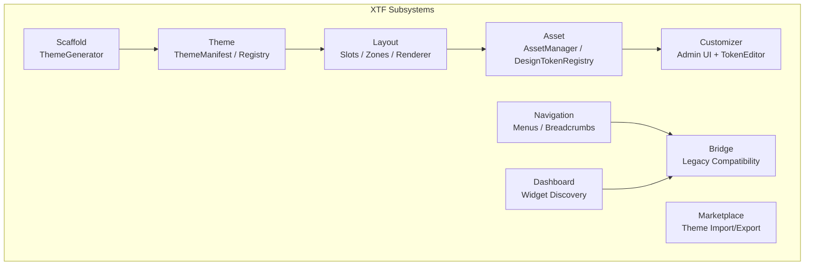

# 🎨 XTF — XOOPS Theme Framework Guide

> **XTF is the official XOOPS 4.0 theming layer** — a structured, contract-driven framework for building themes that are composable, customizable, and upgradeable.
>
> Current version: **XTF v1.2.0-alpha.1**

---

## What Is XTF?

XTF (XOOPS Theme Framework) elevates themes from "a folder of Smarty templates" to **first-class architectural components** — with declared layouts, design tokens, widget slots, a customizer UI, and an asset pipeline.

> Analogy: If XOOPS modules are apps on your phone, XTF is the OS design system. Each app (module) renders into declared regions; the theme controls exactly how those regions look, compose, and behave — without the apps knowing the implementation details of the theme.

---

## Package Details

| Property | Value |
|----------|-------|
| **Package** | `xoops/xtf` |
| **Namespace** | `Xtf\` |
| **PHP Minimum** | 8.2 |
| **Depends on** | `xoops/xmf: *` |
| **Vendor Path** | `xoops_lib/vendor/xoops/xtf/` |
| **Entry Point** | `Xtf\Xtf` (version constant: `Xtf::VERSION`) |

---

## Architecture Overview



---

## 1. `theme.json` — The Theme Manifest

Every XTF-compatible theme declares its capabilities in a `theme.json` file. This is the **single source of truth** for theme identity, assets, layout slots, design tokens, and user preferences.

```json
{
  "name": "My XOOPS Theme",
  "version": "1.0.0",
  "extends": "base-theme",

  "assets": {
    "css": ["assets/css/theme.css"],
    "js":  ["assets/js/theme.js"]
  },

  "slots": ["header", "primary-nav", "sidebar-left", "content", "sidebar-right", "footer"],

  "slot_templates": {
    "header":        "slots/header.html",
    "primary-nav":   "slots/nav.html",
    "sidebar-left":  "slots/sidebar.html",
    "content":       "slots/content.html",
    "footer":        "slots/footer.html"
  },

  "slot_groups": {
    "two-column": {
      "slots":   ["sidebar-left", "content"],
      "wrapper": "groups/two-col.html",
      "class":   "layout-two-col"
    }
  },

  "render_order": ["header", "primary-nav", "@two-column", "footer"],

  "tokens": {
    "color.primary":   "#0057B8",
    "color.secondary": "#FFD700",
    "font.body":       "'Roboto', sans-serif",
    "spacing.base":    "1rem"
  },

  "preferences": {
    "sidebar_position": {
      "default": "left",
      "user_overridable": true
    },
    "dark_mode": {
      "default": false,
      "user_overridable": true
    }
  },

  "options": {
    "supports_rtl":     true,
    "supports_admin":   false
  }
}
```

### ThemeManifest API

```php
<?php

use Xtf\Theme\ThemeManifest;

$manifest = ThemeManifest::load('/path/to/themes/my-theme');

// Identity
$manifest->id();         // "my-theme" (directory name — stable key for DB)
$manifest->name();       // "My XOOPS Theme"
$manifest->version();    // "1.0.0"
$manifest->extends_();   // "base-theme" (parent for inheritance)
$manifest->path();       // "/path/to/themes/my-theme"

// Assets
$manifest->css();        // ["assets/css/theme.css"]
$manifest->js();         // ["assets/js/theme.js"]

// Layout
$manifest->slots();               // ["header", "primary-nav", ...]
$manifest->slotTemplates();       // ["header" => "slots/header.html", ...]
$manifest->slotGroups();          // ["two-column" => [...]]
$manifest->renderOrder();         // ["header", "primary-nav", "@two-column", "footer"]

// Design Tokens
$manifest->tokens();              // ["color.primary" => "#0057B8", ...]
$manifest->tokenDefinitions();    // array<string, TokenDefinition> (typed DTOs, cached)

// Preferences
$manifest->preferences();             // raw array
$manifest->preferenceDefinitions();   // array<string, PreferenceDefinition> (typed DTOs)

// Full raw data
$manifest->raw();        // the full parsed JSON array
```

**Important:** Use `$manifest->id()` (directory name) — not `name()` — as a DB key or cache key. The human-readable name can be updated without breaking stored references.

---

## 2. Theme Registry & Resolver

`ThemeRegistry` discovers and indexes all installed themes. `ThemeResolver` handles inheritance — a theme can `extends` a parent, inheriting its tokens and slot templates and overriding only what it needs.

```php
<?php

use Xtf\Theme\ThemeRegistry;
use Xtf\Theme\ThemeResolver;

// Discover all themes in the themes directory
$registry = new ThemeRegistry('/path/to/themes');
$themes = $registry->all();         // array<string, ThemeManifest>
$active = $registry->get('my-theme');

// Resolve inheritance chain
$resolver = new ThemeResolver($registry);
$resolved = $resolver->resolve('my-theme');  // merged tokens, slots, etc.
```

---

## 3. Layout — Slots & Rendering

XTF's layout system replaces the legacy block placement DB table with a **declarative slot model**.

### Core Classes

| Class | Role |
|-------|------|
| `SlotLayout` | Holds the resolved slot → block assignments |
| `SlotRenderer` | Renders a slot with its assigned widgets |
| `BlockZoneMapper` | Maps legacy XOOPS block zones to XTF slots |
| `WidgetRendererInterface` | Contract for anything renderable into a slot |

### Rendering a Theme

```php
<?php

use Xtf\Layout\SlotRenderer;
use Xtf\Layout\SlotLayout;

$layout = new SlotLayout($manifest->slots());
$layout->assign('header',  [$logoWidget, $searchWidget]);
$layout->assign('content', [$mainContentWidget]);
$layout->assign('footer',  [$footerLinksWidget]);

$renderer = new SlotRenderer($layout);

foreach ($manifest->renderOrder() as $slot) {
    echo $renderer->renderSlot($slot);
}
```

### Legacy Block Zone Bridge

```php
<?php

use Xtf\Layout\BlockZoneMapper;

// Map the 8 legacy XOOPS block positions to XTF slots
$mapper = new BlockZoneMapper([
    'left'   => 'sidebar-left',
    'right'  => 'sidebar-right',
    'center' => 'content',
    'top'    => 'header',
    'bottom' => 'footer',
    // ...
]);
```

---

## 4. Asset Manager & Design Tokens

### AssetManager

Handles CSS/JS registration with cache-busting support.

```php
<?php

use Xtf\Asset\AssetManager;

$assets = new AssetManager($manifest, $themePath);

// Get all CSS paths (with versioning)
foreach ($assets->css() as $path) {
    echo '<link rel="stylesheet" href="' . $path . '">';
}

// Register additional assets at runtime
$assets->addCss('assets/css/custom.css');
$assets->addJs('assets/js/custom.js');
```

### DesignTokenRegistry

Design tokens are CSS custom properties scoped to the theme. The registry emits a `<style>` block.

```php
<?php

use Xtf\Asset\DesignTokenRegistry;

$tokens = DesignTokenRegistry::fromManifest($manifest);

// Render CSS variables block
echo $tokens->toCssBlock();
// Output:
// <style>:root{
//   --color-primary: #0057B8;
//   --color-secondary: #FFD700;
//   --font-body: 'Roboto', sans-serif;
//   --spacing-base: 1rem;
// }</style>

// Override a token at runtime (e.g. from user preference)
$tokens->override('color.primary', '#CC0000');
```

---

## 5. Customizer

The Customizer gives site admins (and optionally users) a live UI to adjust design tokens, sidebar positions, and other preferences — without editing files.

### Admin Customizer Controller

```php
<?php

use Xtf\Customizer\Admin\CustomizerController;

// In your admin entry point
$controller = new CustomizerController($manifest, $preferencesManager, $tokenEditor);
echo $controller->render();
```

### Token Editor

```php
<?php

use Xtf\Customizer\TokenEditor;

$editor = new TokenEditor($manifest);

// Save user token override
$editor->save('color.primary', '#CC0000', userId: $currentUser->id);

// Reset to theme default
$editor->reset('color.primary');
```

### Layout Editor

```php
<?php

use Xtf\Customizer\LayoutEditor;

$layoutEditor = new LayoutEditor($slotPlacementManager);

// Move a widget to a different slot
$layoutEditor->moveWidget(widgetId: 42, toSlot: 'sidebar-right');
```

---

## 6. Navigation

XTF's navigation subsystem aggregates menus from all active modules and the system, and builds breadcrumbs.

```php
<?php

use Xtf\Navigation\MenuAggregator;
use Xtf\Navigation\BreadcrumbBuilder;
use Xtf\Navigation\ModuleMenuProvider;
use Xtf\Navigation\SystemMenuProvider;

// Aggregate menus from system + all modules
$aggregator = new MenuAggregator([
    new SystemMenuProvider(),
    new ModuleMenuProvider($xoopsModuleHandler),
]);

$menu = $aggregator->getMenu('main');

// Build breadcrumb for current page
$breadcrumb = new BreadcrumbBuilder();
$breadcrumb->push('Home', '/');
$breadcrumb->push('Articles', '/articles');
$breadcrumb->push('My Article');  // current (no link)

echo $breadcrumb->render();
```

---

## 7. Dashboard Widgets

The Dashboard subsystem enables module admins to expose data widgets that appear in a configurable admin dashboard.

```php
<?php

use Xtf\Dashboard\DashboardWidgetInterface;
use Xtf\Dashboard\DashboardWidgetDiscovery;
use Xtf\Dashboard\DashboardService;

// Implement a widget in your module
class ArticleStatsWidget implements DashboardWidgetInterface
{
    public function getId(): string      { return 'articles.stats'; }
    public function getTitle(): string   { return 'Article Statistics'; }
    public function getWeight(): int     { return 10; }

    public function render(): string
    {
        return $this->smarty->fetch('dashboard/stats.html');
    }
}

// Auto-discovery scans all modules for widgets
$discovery = new DashboardWidgetDiscovery($moduleHandler);
$widgets   = $discovery->discover();

$service = new DashboardService($widgets);
echo $service->render();   // renders all widgets in weight order
```

---

## 8. Theme Marketplace

XTF's Marketplace subsystem allows themes to be imported, exported, and catalogued.

```php
<?php

use Xtf\Marketplace\ThemeExporter;
use Xtf\Marketplace\ThemeImporter;
use Xtf\Marketplace\WidgetCatalog;

// Export a theme to a zip archive
$exporter = new ThemeExporter($manifest);
$zipPath  = $exporter->export('/tmp/themes/');

// Import a theme zip
$importer = new ThemeImporter('/path/to/themes');
$result   = $importer->import('/uploads/new-theme.zip');

if ($result->isSuccess()) {
    echo 'Theme installed: ' . $result->getThemeId();
}

// Browse available widgets
$catalog = new WidgetCatalog($moduleHandler);
foreach ($catalog->all() as $widget) {
    echo $widget->getTitle();
}
```

---

## 9. Scaffold — Generating New Themes

`ThemeGenerator` scaffolds a complete XTF-compatible theme structure from scratch.

```php
<?php

use Xtf\Scaffold\ThemeGenerator;

$generator = new ThemeGenerator('/path/to/themes');

// Generate a frontend theme skeleton
$generator->createFrontend('my-new-theme', [
    'slots'  => ['header', 'content', 'sidebar', 'footer'],
    'tokens' => ['color.primary' => '#0057B8'],
]);

// Generate an admin theme skeleton
$generator->createAdmin('my-admin-theme');
```

Generated structure:

```
themes/my-new-theme/
├── theme.json              ← XTF manifest
├── assets/
│   ├── css/theme.css
│   └── js/theme.js
├── slots/
│   ├── header.html
│   ├── content.html
│   ├── sidebar.html
│   └── footer.html
├── groups/
│   └── two-col.html
└── templates/
    └── xoops_tpl/          ← module template overrides go here
```

---

## 10. RTL & i18n Support

```php
<?php

use Xtf\I18n\RtlManager;
use Xtf\I18n\LabelNormalizer;

// Detect RTL and set appropriate CSS direction
$rtl = new RtlManager($currentLanguage);
if ($rtl->isRtl()) {
    $assets->addCss('assets/css/theme-rtl.css');
}

// Normalize menu labels across language sources
$normalizer = new LabelNormalizer();
$label = $normalizer->normalize($rawLabel, $locale);
```

---

## Theme Contracts (Interfaces)

Implement these to integrate with XTF:

| Interface | Purpose |
|-----------|---------|
| `ThemeInterface` | Base contract all themes must satisfy |
| `FrontendThemeInterface` | Frontend themes (extends `ThemeInterface`) |
| `AdminThemeInterface` | Admin themes (extends `ThemeInterface`) |
| `LayoutInterface` | Custom layout engines |
| `SlotLayoutInterface` | Slot-based layout contract |
| `AssetManifestInterface` | Custom asset pipelines |
| `MenuProviderInterface` | Navigation menu providers |
| `PreferencesProviderInterface` | User preference storage backends |

---

## Legacy Bridge

XTF ships with bridge classes that adapt XOOPS 2.5.x themes to XTF contracts — so existing themes work without modification in XOOPS 4.0 Hybrid Mode.

| Bridge Class | Adapts |
|-------------|--------|
| `FrontEndThemeAdapter` | Legacy theme → `FrontendThemeInterface` |
| `FrontEndSlotLayout` | Legacy block zones → `SlotLayoutInterface` |
| `FrontEndAssetManifest` | Legacy asset loading → `AssetManifestInterface` |
| `ModuleAdminBridge` | Legacy admin pages → XTF admin theme |

---

## Getting Started Checklist

**For theme authors:**

- [ ] Create `theme.json` in your theme root
- [ ] Declare all layout slots
- [ ] Define design tokens (CSS custom properties)
- [ ] Declare user preferences
- [ ] Implement slot template files
- [ ] Test RTL layout if supporting RTL languages

**For module authors:**

- [ ] Implement `DashboardWidgetInterface` for admin dashboard widgets
- [ ] Implement `MenuProviderInterface` to contribute to site navigation
- [ ] Place module template overrides in `themes/{theme}/templates/xoops_tpl/{module}/`

---

## 🔗 Related

- [[XMF-Components-Guide|XMF Components Guide]]
- [[XMF-Advanced-Components|XMF Advanced Components]]
- [[XOOPS-4.0-Architecture|XOOPS 4.0 Architecture]]
- [[../Specifications/Hybrid-Mode-Contract|Hybrid Mode Contract]]

---

#xtf #themes #theming #design-tokens #layouts #widgets #xoops-4.0
