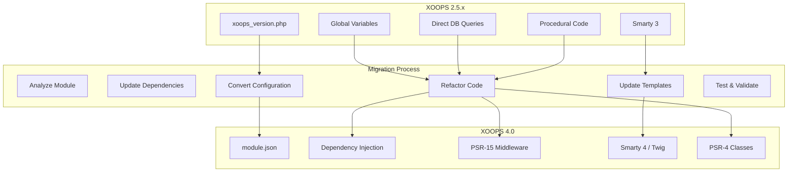
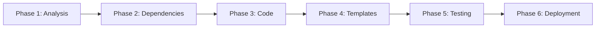

# Migration Guide: XOOPS 2.5.x to 4.0

> Step-by-step guide for migrating your modules and sites to the modern XOOPS 4.0 architecture.

---

## Migration Overview



---

## Migration Checklist



### Phase 1: Analysis
- [ ] Inventory all modules to migrate
- [ ] Document custom modifications
- [ ] Identify deprecated function usage
- [ ] List third-party dependencies

### Phase 2: Dependencies
- [ ] Add composer.json
- [ ] Configure PSR-4 autoloading
- [ ] Update minimum PHP version to 8.2
- [ ] Install required packages

### Phase 3: Code Refactoring
- [ ] Convert xoops_version.php to module.json
- [ ] Replace global variables with DI
- [ ] Update database queries
- [ ] Implement PSR-15 controllers

### Phase 4: Templates
- [ ] Update Smarty syntax for v4
- [ ] Remove deprecated functions
- [ ] Test template rendering

### Phase 5: Testing
- [ ] Run PHPUnit tests
- [ ] Manual functionality testing
- [ ] Performance benchmarking

### Phase 6: Deployment
- [ ] Backup production database
- [ ] Deploy updated module
- [ ] Monitor for errors

---

## Configuration Migration

### From xoops_version.php to module.json

**Before (2.5.x):**
```php
<?php
// xoops_version.php
$modversion['name']        = _MI_MYMODULE_NAME;
$modversion['version']     = '1.0.0';
$modversion['description'] = _MI_MYMODULE_DESC;
$modversion['dirname']     = basename(__DIR__);
$modversion['hasMain']     = 1;
$modversion['hasAdmin']    = 1;

$modversion['sqlfile']['mysql'] = 'sql/mysql.sql';
$modversion['tables'] = ['mymodule_items'];

$modversion['templates'][] = [
    'file' => 'mymodule_index.tpl',
    'description' => 'Index page'
];

$modversion['config'][] = [
    'name' => 'items_per_page',
    'title' => '_MI_MYMODULE_ITEMS_PER_PAGE',
    'formtype' => 'textbox',
    'valuetype' => 'int',
    'default' => 10
];
```

**After (4.0.x):**
```json
{
    "$schema": "https://xoops.org/schemas/module/v1.json",
    "schemaVersion": 1,
    "identity": {
        "slug": "mymodule",
        "namespace": "Xoops\\Module\\MyModule",
        "name": "@modinfo.name",
        "version": "2.0.0",
        "description": "@modinfo.description"
    },
    "requirements": {
        "xoops": "^2026.0",
        "php": ">=8.4"
    },
    "features": {
        "hasMain": true,
        "hasAdmin": true,
        "hasSearch": false
    },
    "database": {
        "tables": ["mymodule_items"],
        "migrations": "database/migrations"
    },
    "routes": {
        "index": {
            "path": "/",
            "method": ["GET"],
            "action": "Controller\\IndexController::index"
        },
        "item": {
            "path": "/item/{id}",
            "method": ["GET"],
            "action": "Controller\\ItemController::show"
        }
    },
    "config": {
        "items_per_page": {
            "title": "@modinfo.config.items_per_page",
            "type": "integer",
            "default": 10,
            "min": 1,
            "max": 100
        }
    },
    "templates": {
        "index": "templates/index.tpl",
        "item": "templates/item.tpl"
    }
}
```

---

## Code Refactoring

### Global Variables to Dependency Injection

**Before (2.5.x):**
```php
<?php
// index.php
require_once dirname(dirname(__DIR__)) . '/mainfile.php';

global $xoopsDB, $xoopsUser, $xoopsTpl, $xoopsModule;

$sql = "SELECT * FROM " . $xoopsDB->prefix('mymodule_items');
$result = $xoopsDB->query($sql);

while ($row = $xoopsDB->fetchArray($result)) {
    $items[] = $row;
}

$xoopsTpl->assign('items', $items);

require_once XOOPS_ROOT_PATH . '/header.php';
$xoopsTpl->display('db:mymodule_index.tpl');
require_once XOOPS_ROOT_PATH . '/footer.php';
```

**After (4.0.x):**
```php
<?php

namespace Xoops\Module\MyModule\Controller;

use Psr\Http\Message\ResponseInterface;
use Psr\Http\Message\ServerRequestInterface;
use Xoops\Core\Database\Connection;
use Xoops\Core\View\ViewRendererInterface;
use Xoops\Core\Http\ApiResponse;

class IndexController
{
    public function __construct(
        private readonly Connection $db,
        private readonly ViewRendererInterface $view,
        private readonly ApiResponse $response
    ) {}

    public function index(ServerRequestInterface $request): ResponseInterface
    {
        $items = $this->db->fetchAll(
            'SELECT * FROM {prefix}_mymodule_items WHERE status = :status',
            ['status' => 'published']
        );

        $html = $this->view->render('@modules/mymodule/index', [
            'items' => $items
        ]);

        return $this->response->html($html);
    }
}
```

### Database Queries

**Before (2.5.x):**
```php
// Direct query with global
global $xoopsDB;

$sql = sprintf(
    "SELECT * FROM %s WHERE status = '%s' ORDER BY created DESC LIMIT %d",
    $xoopsDB->prefix('mymodule_items'),
    $xoopsDB->escape($status),
    $limit
);
$result = $xoopsDB->query($sql);
```

**After ((4.0.x):**
```php
// Using Connection with prepared statements
$items = $this->db->fetchAll(
    'SELECT * FROM {prefix}_mymodule_items
     WHERE status = :status
     ORDER BY created DESC
     LIMIT :limit',
    [
        'status' => $status,
        'limit' => $limit
    ]
);
```

### Unsafe Queries

**Before (2.5.x):**
```php
global $xoopsDB;
$xoopsDB->queryF("UPDATE ... SET views = views + 1 ...");
```

**After (4.0.x):**
```php
// In strict mode, wrap in unsafe() closure
$this->db->unsafe(function ($db) use ($itemId) {
    return $db->execute(
        'UPDATE {prefix}_mymodule_items SET views = views + 1 WHERE id = :id',
        ['id' => $itemId]
    );
});
```

---

## Template Migration

### Smarty 3 to Smarty 4

**Deprecated Syntax:**
```smarty
{* REMOVED: {php} tags *}
{php}
    echo "Hello";
{/php}

{* REMOVED: Direct PHP *}
{$object->method()}

{* DEPRECATED: Short tags in some contexts *}
{$var}
```

**Updated Syntax:**
```smarty
{* Use registered functions instead *}
<{myfunction param="value"}>

{* Use assign for method calls *}
<{assign var="result" value=$object->method()}>
<{$result}>

{* XOOPS-style tags recommended *}
<{$var}>
```

### Common Template Updates

```smarty
{* Before: accessing constants *}
{$smarty.const.MY_CONSTANT}

{* After: same syntax works, but prefer *}
<{$smarty.const._MD_MYMODULE_TITLE}>

{* Before: modifier chaining *}
{$text|escape|nl2br}

{* After: same, but escape is often auto-applied *}
<{$text|nl2br}>

{* Before: include *}
{include file="db:mymodule_header.tpl"}

{* After: same syntax *}
<{include file="db:mymodule_header.tpl"}>
```

---

## Namespace Migration

### File Structure

```
modules/mymodule/
├── class/                    # 2.5.x location
│   ├── Item.php
│   └── ItemHandler.php
└── src/                      # 2026 location (PSR-4)
    └── Xoops/
        └── Module/
            └── MyModule/
                ├── Controller/
                │   └── IndexController.php
                ├── Entity/
                │   └── Item.php
                ├── Repository/
                │   └── ItemRepository.php
                └── Service/
                    └── ItemService.php
```

### Class Updates

**Before (2.5.x):**
```php
<?php
// class/Item.php

class MymoduleItem extends XoopsObject
{
    public function __construct()
    {
        $this->initVar('id', XOBJ_DTYPE_INT);
        $this->initVar('title', XOBJ_DTYPE_TXTBOX);
    }
}

class MymoduleItemHandler extends XoopsPersistableObjectHandler
{
    public function __construct($db)
    {
        parent::__construct($db, 'mymodule_items', 'MymoduleItem', 'id', 'title');
    }
}
```

**After (4.0.x):**
```php
<?php
// src/Entity/Item.php

namespace Xoops\Module\MyModule\Entity;

use Xoops\Core\Database\Entity;

class Item extends Entity
{
    protected static string $table = 'mymodule_items';
    protected static string $primaryKey = 'id';

    protected array $casts = [
        'id' => 'int',
        'created' => 'datetime',
        'updated' => 'datetime',
    ];

    public function getTitle(): string
    {
        return $this->getAttribute('title');
    }
}
```

```php
<?php
// src/Repository/ItemRepository.php

namespace Xoops\Module\MyModule\Repository;

use Xoops\Core\Database\Repository;
use Xoops\Module\MyModule\Entity\Item;

class ItemRepository extends Repository
{
    protected string $entityClass = Item::class;

    public function findPublished(int $limit = 10): array
    {
        return $this->findBy(
            ['status' => 'published'],
            ['created' => 'DESC'],
            $limit
        );
    }
}
```

---

## Composer Setup

### Add composer.json

```json
{
    "name": "xoops-modules/mymodule",
    "description": "My XOOPS Module",
    "type": "xoops-module",
    "license": "GPL-2.0-or-later",
    "require": {
        "php": ">=8.4",
        "xoops/core": "^2026.0"
    },
    "require-dev": {
        "phpunit/phpunit": "^10.0",
        "phpstan/phpstan": "^1.10"
    },
    "autoload": {
        "psr-4": {
            "Xoops\\Module\\MyModule\\": "src/"
        }
    }
}
```

---

## Migration Script

```php
<?php
// migrate.php - Run once during upgrade

namespace Xoops\Module\MyModule\Migration;

use Xoops\Core\Database\Connection;

class Migrate
{
    public function __construct(private Connection $db) {}

    public function run(): void
    {
        $this->updateSchema();
        $this->migrateData();
        $this->cleanupLegacy();
    }

    private function updateSchema(): void
    {
        // Add new columns
        $this->db->execute('
            ALTER TABLE {prefix}_mymodule_items
            ADD COLUMN uuid CHAR(36) AFTER id,
            ADD COLUMN metadata JSON AFTER content,
            ADD INDEX idx_uuid (uuid)
        ');
    }

    private function migrateData(): void
    {
        // Generate UUIDs for existing records
        $items = $this->db->fetchAll('SELECT id FROM {prefix}_mymodule_items WHERE uuid IS NULL');

        foreach ($items as $item) {
            $this->db->execute(
                'UPDATE {prefix}_mymodule_items SET uuid = :uuid WHERE id = :id',
                ['uuid' => $this->generateUuid(), 'id' => $item['id']]
            );
        }
    }

    private function cleanupLegacy(): void
    {
        // Remove deprecated columns if needed
        // $this->db->execute('ALTER TABLE ... DROP COLUMN ...');
    }

    private function generateUuid(): string
    {
        return sprintf(
            '%04x%04x-%04x-%04x-%04x-%04x%04x%04x',
            mt_rand(0, 0xffff), mt_rand(0, 0xffff),
            mt_rand(0, 0xffff),
            mt_rand(0, 0x0fff) | 0x4000,
            mt_rand(0, 0x3fff) | 0x8000,
            mt_rand(0, 0xffff), mt_rand(0, 0xffff), mt_rand(0, 0xffff)
        );
    }
}
```

---

## Testing Migration

```php
<?php
// tests/MigrationTest.php

namespace Xoops\Module\MyModule\Tests;

use PHPUnit\Framework\TestCase;

class MigrationTest extends TestCase
{
    public function testLegacyDataMigrated(): void
    {
        // Verify all records have UUIDs
        $items = $this->db->fetchAll(
            'SELECT COUNT(*) as count FROM {prefix}_mymodule_items WHERE uuid IS NULL'
        );

        $this->assertEquals(0, $items[0]['count']);
    }

    public function testNewSchemaWorks(): void
    {
        // Test insert with new schema
        $this->db->execute(
            'INSERT INTO {prefix}_mymodule_items (uuid, title, metadata) VALUES (:uuid, :title, :meta)',
            [
                'uuid' => 'test-uuid',
                'title' => 'Test',
                'meta' => json_encode(['key' => 'value'])
            ]
        );

        $this->assertTrue(true);
    }
}
```

---

## Related Documentation

- [[../Roadmap/4.0-Specification|XOOPS 4.0 Specification]]
- [[../PSR-Standards/PSR-Standards-Overview|PSR Standards Overview]]
- [[../Modernization/PHP-8-Compatibility|PHP 8 Compatibility]]

---

#xoops #migration #upgrade #2026 #modernization
