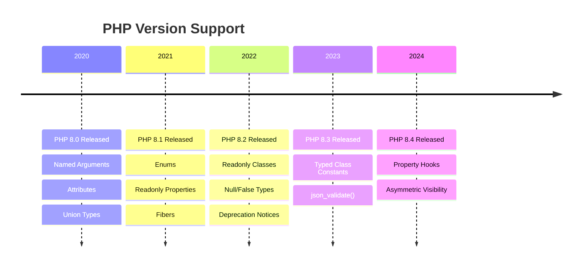
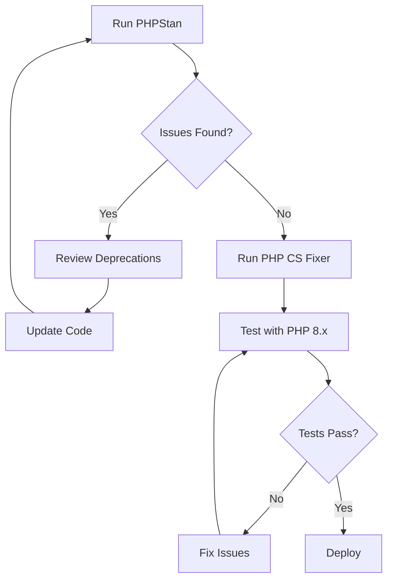

# PHP 8 Compatibility Guide

> Making XOOPS modules compatible with PHP 8.x and leveraging modern features.

---

## PHP Version Timeline



---

## Breaking Changes

### Deprecated/Removed Functions

```php
// ❌ REMOVED in PHP 8.0
create_function('$a', 'return $a * 2');  // Use closures
each($array);                             // Use foreach
$string{0};                               // Use $string[0]

// ❌ DEPRECATED in PHP 8.1
strftime('%Y-%m-%d', $timestamp);         // Use date() or IntlDateFormatter
$GLOBALS assignment

// ❌ DEPRECATED in PHP 8.2
${$varName};                              // Use $$varName or arrays
utf8_encode() / utf8_decode();            // Use mb_convert_encoding()
```

### Type System Changes

```php
// ❌ PHP 8.0+ enforces type declarations
function process(int $id) {
    // Passing string "123" now throws TypeError in strict mode
}

// ✅ Handle with explicit casting
function process(int $id) {
    $id = (int) $id;
}

// ❌ Return type must match
function getData(): array {
    return null;  // TypeError in PHP 8
}

// ✅ Use nullable return type
function getData(): ?array {
    return null;  // OK
}
```

---

## Modern PHP Features for XOOPS

### Named Arguments (PHP 8.0+)

```php
// Before: positional arguments
$form->addElement(new XoopsFormText(
    'Title',      // caption
    'title',      // name
    50,           // size
    255,          // maxlength
    ''            // value
), true);         // required

// After: named arguments (clearer)
$form->addElement(
    element: new XoopsFormText(
        caption: 'Title',
        name: 'title',
        size: 50,
        maxlength: 255,
        value: ''
    ),
    required: true
);
```

### Constructor Property Promotion (PHP 8.0+)

```php
// Before
class ItemHandler
{
    private XoopsDatabase $db;
    private string $table;

    public function __construct(XoopsDatabase $db, string $table)
    {
        $this->db = $db;
        $this->table = $table;
    }
}

// After (PHP 8.0+)
class ItemHandler
{
    public function __construct(
        private XoopsDatabase $db,
        private string $table
    ) {}
}
```

### Union Types (PHP 8.0+)

```php
// Accept multiple types
public function setContent(string|array $content): void
{
    if (is_array($content)) {
        $content = implode("\n", $content);
    }
    $this->content = $content;
}

// Nullable shorthand
public function getUser(): User|null
{
    return $this->user;
}
```

### Match Expression (PHP 8.0+)

```php
// Before: switch statement
switch ($status) {
    case 'draft':
        $label = 'Draft';
        break;
    case 'published':
        $label = 'Published';
        break;
    case 'archived':
        $label = 'Archived';
        break;
    default:
        $label = 'Unknown';
}

// After: match expression
$label = match($status) {
    'draft' => 'Draft',
    'published' => 'Published',
    'archived' => 'Archived',
    default => 'Unknown'
};
```

### Attributes (PHP 8.0+)

```php
use Attribute;

#[Attribute]
class Route
{
    public function __construct(
        public string $path,
        public array $methods = ['GET']
    ) {}
}

class ItemController
{
    #[Route('/items', methods: ['GET'])]
    public function index(): Response
    {
        // ...
    }

    #[Route('/items/{id}', methods: ['GET'])]
    public function show(int $id): Response
    {
        // ...
    }
}
```

### Enums (PHP 8.1+)

```php
// Before: class constants
class ItemStatus
{
    public const DRAFT = 'draft';
    public const PUBLISHED = 'published';
    public const ARCHIVED = 'archived';
}

// After: native enums
enum ItemStatus: string
{
    case Draft = 'draft';
    case Published = 'published';
    case Archived = 'archived';

    public function label(): string
    {
        return match($this) {
            self::Draft => 'Draft',
            self::Published => 'Published',
            self::Archived => 'Archived',
        };
    }

    public function canEdit(): bool
    {
        return $this === self::Draft;
    }
}

// Usage
$item->status = ItemStatus::Published;
echo $item->status->label();  // "Published"
```

### Readonly Properties (PHP 8.1+)

```php
class Item
{
    public function __construct(
        public readonly int $id,
        public readonly string $title,
        public readonly \DateTimeImmutable $created
    ) {}
}

$item = new Item(1, 'Title', new \DateTimeImmutable());
$item->title = 'New Title';  // Error: Cannot modify readonly property
```

### Readonly Classes (PHP 8.2+)

```php
readonly class ItemDTO
{
    public function __construct(
        public int $id,
        public string $title,
        public string $content,
        public \DateTimeImmutable $created
    ) {}
}
```

---

## Migration Patterns

### Null Coalescing

```php
// Before
$value = isset($array['key']) ? $array['key'] : 'default';

// After (PHP 7.0+)
$value = $array['key'] ?? 'default';

// Null coalescing assignment (PHP 7.4+)
$array['key'] ??= 'default';
```

### Arrow Functions

```php
// Before
$ids = array_map(function($item) {
    return $item->id;
}, $items);

// After (PHP 7.4+)
$ids = array_map(fn($item) => $item->id, $items);
```

### Spread Operator

```php
// Array spread
$merged = [...$array1, ...$array2];

// Named argument spread
$config = ['size' => 50, 'maxlength' => 255];
$element = new XoopsFormText(
    caption: 'Title',
    name: 'title',
    ...$config
);
```

---

## Code Compatibility Checker



### PHPStan Configuration

```yaml
# phpstan.neon
parameters:
    level: 8
    phpVersion: 80200
    paths:
        - class/
        - src/
    excludePaths:
        - vendor/
    reportUnmatchedIgnoredErrors: false
```

### Running Analysis

```bash
# Install PHPStan
composer require --dev phpstan/phpstan

# Run analysis
./vendor/bin/phpstan analyse

# With specific PHP version
./vendor/bin/phpstan analyse --php-version=8.4
```

---

## Common Fixes

### String Access

```php
// ❌ Deprecated curly brace syntax
$char = $string{0};

// ✅ Use square brackets
$char = $string[0];
```

### Null Handling

```php
// ❌ Error in PHP 8: strlen(null)
$length = strlen($value);

// ✅ Handle null explicitly
$length = strlen($value ?? '');
// or
$length = $value !== null ? strlen($value) : 0;
```

### Array Functions

```php
// ❌ Passing null to array functions
array_merge(null, $array);

// ✅ Ensure array type
array_merge($array1 ?? [], $array2);
```

### Class Properties

```php
// ❌ Dynamic properties deprecated in PHP 8.2
class Item
{
    // No $title property declared
}
$item = new Item();
$item->title = 'Test';  // Deprecated warning

// ✅ Declare all properties
class Item
{
    public string $title = '';
}
```

---

## Related Documentation

- [[../Roadmap/4.0-Specification|XOOPS 4.0 Specification]]
- [[../Migration-Guides/From-2.5-to-4.0|Migration from 2.5.x]]
- [[../../03-Module-Development/Best-Practices/Code-Organization|Code Organization]]

---

#xoops #php8 #modernization #compatibility #upgrade
