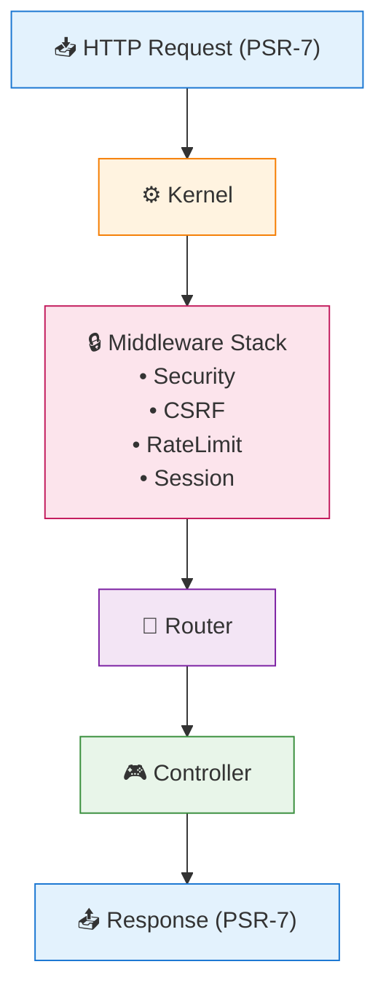

# XOOPS 4.0 Core Specification

## Overview

This document defines the technical specification for XOOPS 4.0. Keywords **MUST**, **SHOULD**, and **MAY** are normative per RFC 2119.

## Developer Tutorial

### The "Hello World" Workflow

#### Step 1: Scaffold

```bash
php bin/xoops module:scaffold hello --level=standard
```

#### Step 2: module.json

The manifest file with IDE autocompletion support via JSON Schema:

```json
{
    "$schema": "https://xoops.org/schemas/module/v1.json",
    "schemaVersion": 1,
    "identity": {
        "slug": "hello",
        "namespace": "Xoops\\Module\\Hello",
        "name": "@modinfo.name",
        "version": "1.0.0"
    },
    "requirements": {
        "xoops": "^2026.0",
        "php": ">=8.4"
    },
    "routes": {
        "index": {
            "path": "/",
            "method": ["GET"],
            "action": "Controller\\IndexController::index"
        }
    }
}
```

#### Step 3: Controller

Controllers **MUST** return a `ResponseInterface`:

```php
namespace Xoops\Module\Hello\Controller;

use Xoops\Core\View\ViewRendererInterface;
use Psr\Http\Message\ServerRequestInterface;
use Psr\Http\Message\ResponseInterface;
use Xoops\Core\Http\ApiResponse;

class IndexController
{
    public function __construct(
        private readonly ViewRendererInterface $view,
        private readonly ApiResponse $response
    ) {}

    public function index(ServerRequestInterface $request): ResponseInterface
    {
        $html = $this->view->render('@modules/hello/index', [
            'name' => $request->getAttribute('name', 'World')
        ]);

        return $this->response->html($html);
    }
}
```

## Core Architecture

### Request Lifecycle

The Core processes requests via a PSR-15 Middleware Pipeline:



### Router Independence

Modules **MUST NOT** depend on specific routing library internals:

```php
interface RouteMatchInterface {
    public function getName(): ?string;
    public function getParams(): array;
    public function getModuleSlug(): ?string;
}
```

## Data Layer and Migrations

### SafeUnsafe Trait

Limits `queryF()` usage and toggles via `XOOPS_SECURITY_LEVEL`:

- **Contract:** `queryF()` calls **MUST** be wrapped in a `$db->unsafe()` closure in strict mode
- **Re-entrancy:** The `unsafe()` wrapper **MUST** be re-entrant and restore previous state even if callback throws

### Stable Entity References

| Concept | Description |
|---------|-------------|
| **Canonical Type** | `blog.post` (Immutable identifier) |
| **Alias Registry** | Maps old types to new handlers |
| **Registration** | Modules register types/aliases |
| **Finalization** | Core validates (no cycles, all canonicals exist) |

## Module System and Manifests

### Manifest Compilation

JSON manifests are compiled to PHP arrays:

- **Hash Strategy:** Compiler **MUST** use fast non-cryptographic hash (`xxh3`/`xxh128`) if available, falling back to `sha256`
- **Schema Stability:** `$schema` URLs **MUST** be versioned and immutable

### Manifest Merger

#### Path Definitions

| Path Type | Description | Example |
|-----------|-------------|---------|
| **List Path** | Array where order matters | `admin.menu`, `assets.css` |
| **Object Path** | Object with named keys | `routes`, `config` |

#### Empty Node Semantics

| Path Type | Input | Behavior | Validation (Strict) |
|-----------|-------|----------|---------------------|
| List Path | `[]` | Clears List | Valid |
| List Path | `{}` | Error | Fatal |
| Object Path | `{}` | No-op | Valid |
| Object Path | `[]` | Error | Fatal |

#### Merge Modes

| Mode | Behavior |
|------|----------|
| `Merge` | Deep merge objects, replace indexed arrays |
| `Append` | Add to end |
| `Unique` | Base + Override, dedupe (first occurrence wins) |
| `Replace` | Overwrite entire node |

## Security and Permissions

### Permission Hints

Search providers **MUST** return a `PermissionHint` for efficient Core evaluation.

### Policy Cache Key Contract

Policies **MUST** return cache key components composed ONLY of:

- `null`
- `bool`
- `int`
- `string`
- `array` of these types

**Rules:**
- Core **MUST** sort associative arrays recursively
- Indexed arrays **MUST** preserve order
- Floats are forbidden (use strings for precision)

## Search and Discovery

### Federated Search Engine

Solves the "Pagination Trap" using **Bounded Overfetch** strategy:

```
Query
  │
  ├──► Provider A ──► Top N Results ──┐
  │                                   │
  ├──► Provider B ──► Top N Results ──┼──► Sort Global ──► Slice Page ──► Results
  │                                   │
  └──► Provider C ──► Top N Results ──┘
```

### Accuracy Contracts

#### Provider Contract

Providers **MUST** return:
- `isTotalExact` (bool): True if count is not estimated
- `wasCapped` (bool): True if internal budget limit was hit

#### Page Accuracy

`isPageAccurate` is **TRUE** if and only if:

1. No provider asserted an error
2. For every provider: `fetchedCount >= requestedCount` OR `providerExhausted = true`
3. `requestedCount` is defined as `min(providerCap, limit + offset)`

#### Total Accuracy

`isTotalAccurate` is **TRUE** if and only if `all(providers.isTotalExact)` AND `no_errors`

## Internationalization (I18n)

### Scoping and Precedence

**Precedence Order (highest to lowest):**

1. Theme
2. Site
3. Module Locale
4. Module Fallback (en)

**Collision Rule:** Higher precedence layer wins

## Frontend and Assets

### View Renderer

```php
interface ViewRendererInterface {
    public function render(string $template, array $data = []): string;
}
```

**Implementations:**
- Smarty (Default)
- Twig (Optional)

### Widget Provider

Contract for Admin Dashboard and Blocks:

```php
interface WidgetProviderInterface {
    public function render(WidgetContext $ctx): string;
    public function getCacheTtl(): int;

    /** MUST return scalar/array-of-scalar components */
    public function getCacheKeyComponents(WidgetContext $ctx): array;

    /** MAY return events that trigger namespace invalidation */
    public function getInvalidationEvents(): array;
}
```

## Operational Strategy

### Versioned Cache

**Normalization Rules:**
- Namespace **MUST** match `[a-z0-9._:-]{1,64}`
- Key **MUST** be hashed (preferred `xxh3`, fallback `sha256`) and encoded as lowercase hex

**Safety Mechanisms:**
- **Null Safety:** Uses internal `NULL_SENTINEL`
- **Miss Detection:** Single-round-trip `get($key, $sentinel)`

## Key Contracts

| Concept | Interface | Key Method |
|---------|-----------|------------|
| **Routing** | `RouteMatchInterface` | `getParams(): array` |
| **Views** | `ViewRendererInterface` | `render(string $tpl, array $data)` |
| **Search** | `SearchProviderInterface` | `search(Query $q, Context $c)` |
| **Cache** | `VersionedCache` | `remember(string $ns, string $k, callable $f)` |
| **Widgets** | `WidgetProviderInterface` | `getCacheKeyComponents(Context $c)` |

## Architectural Decision Record

| Decision | Context | Rationale |
|----------|---------|-----------|
| **Sentinel Cache** | Need to cache `null` | Unique object allows single-round-trip reads |
| **Hex Hash Keys** | Backend limits | Binary strings cause issues in Redis drivers |
| **Bounded Search** | Federated pagination cost | Prioritizes top results/performance |
| **Immutable Entities** | Module renames | Rewriting DB references is risky |
| **Path-Based Merge** | Ambiguity of `[]` | `assets.css: []` intuitively means "clear" |

## See Also

- [[../XOOPS-4.0-Roadmap|XOOPS 4.0 Roadmap]]
- [[Architecture-Vision|Architecture Vision]]
- [[../PSR-Standards/PSR-Standards-Overview|PSR Standards Overview]]
- [[../Migration-Guides/From-2.5-to-4.0|Migration Guide]]

---

#xoops-4.0 #specification #architecture #psr-standards #technical
