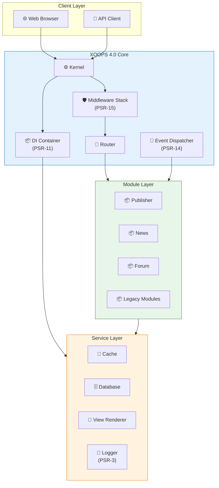
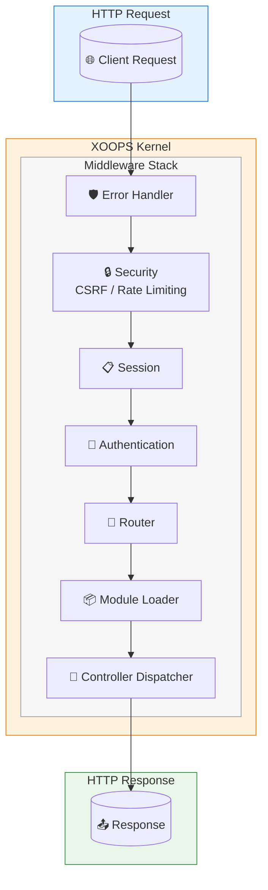
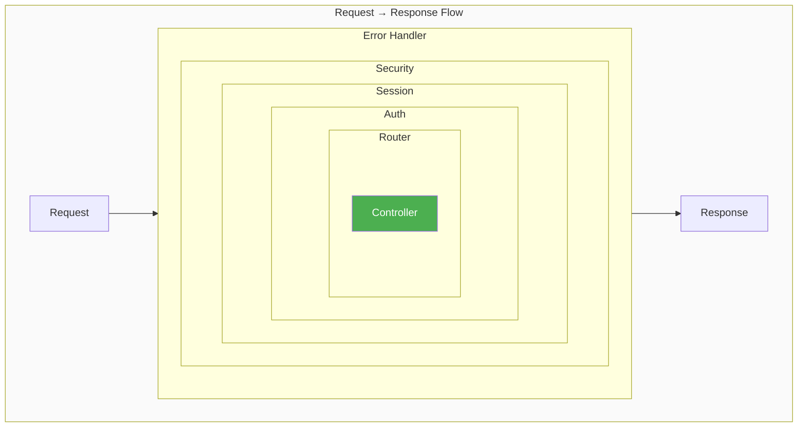
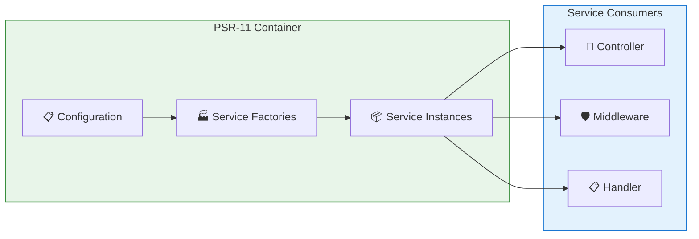
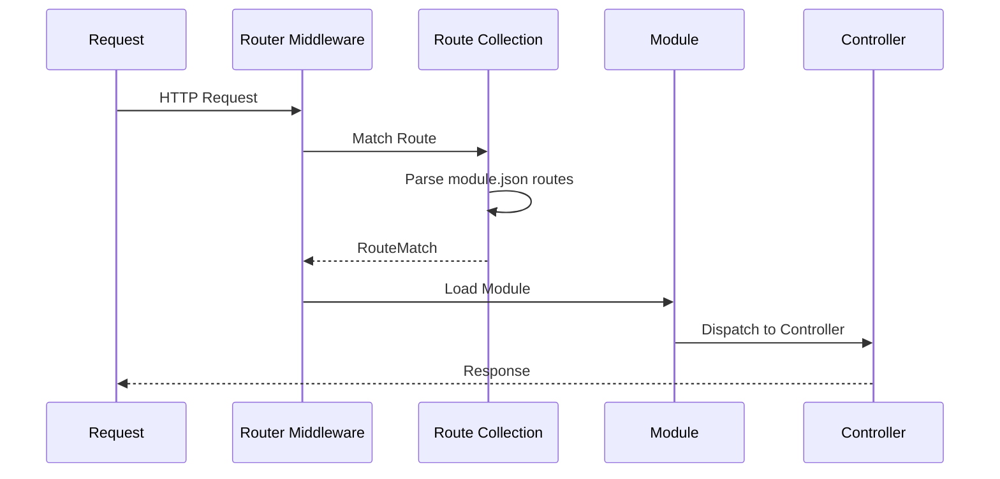
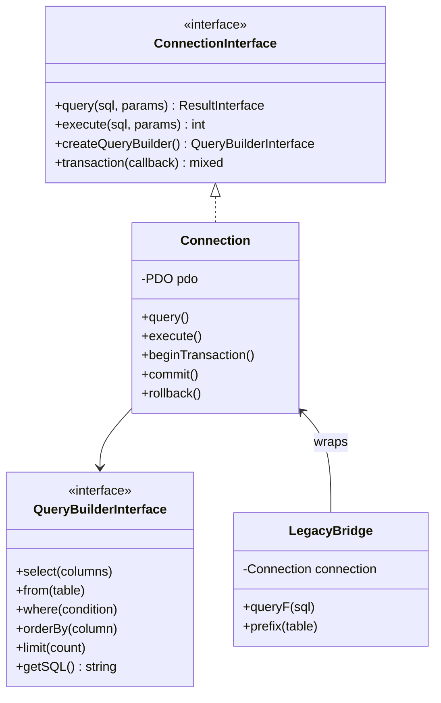
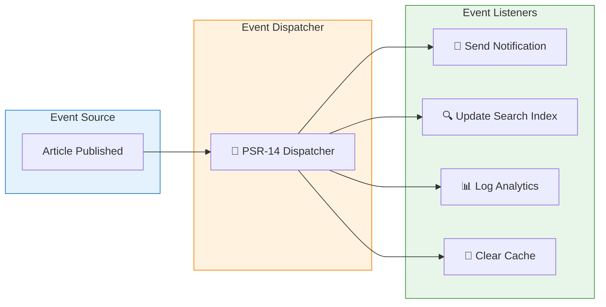
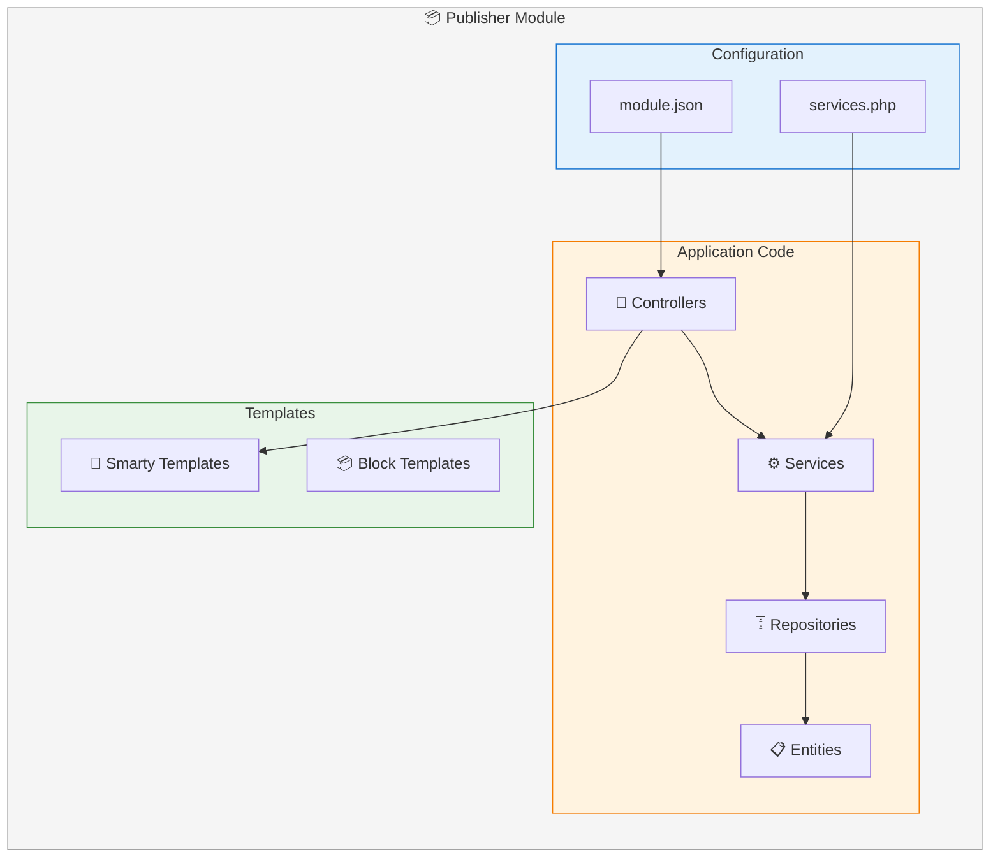
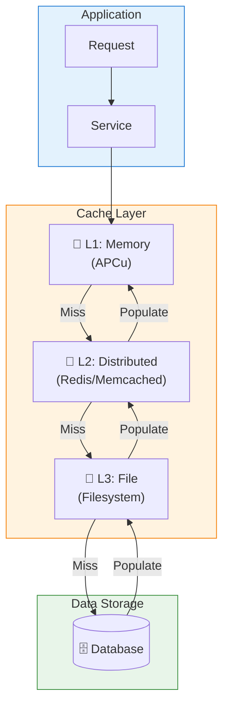

# XOOPS 4.0 Architecture Vision

## Overview

XOOPS 4.0 introduces a fundamentally new architecture based on modern PHP standards, particularly the PSR-15 middleware pipeline. This document outlines the architectural vision and design principles.

### High-Level Architecture



## Core Principles

### 1. Standards Compliance

- Full PSR compliance for interoperability
- Composer-based dependency management
- Type-safe code with PHP 8.4+ features

### 2. Separation of Concerns

- Clear boundaries between layers
- Dependency injection throughout
- Interface-driven design

### 3. Backward Compatibility

- Legacy modules continue to work
- Gradual migration path
- Compatibility shims where needed

## Request Lifecycle

### PSR-15 Middleware Pipeline

The request flows through a stack of middleware, each capable of processing the request or delegating to the next handler:



### Middleware Onion Model



### Middleware Interface

```php
namespace Psr\Http\Server;

use Psr\Http\Message\ResponseInterface;
use Psr\Http\Message\ServerRequestInterface;

interface MiddlewareInterface
{
    public function process(
        ServerRequestInterface $request,
        RequestHandlerInterface $handler
    ): ResponseInterface;
}
```

### Example Middleware Implementation

```php
namespace Xoops\Core\Middleware;

use Psr\Http\Message\ResponseInterface;
use Psr\Http\Message\ServerRequestInterface;
use Psr\Http\Server\MiddlewareInterface;
use Psr\Http\Server\RequestHandlerInterface;

class CsrfMiddleware implements MiddlewareInterface
{
    public function __construct(
        private readonly CsrfTokenManager $tokenManager
    ) {}

    public function process(
        ServerRequestInterface $request,
        RequestHandlerInterface $handler
    ): ResponseInterface {
        // Skip for safe methods
        if (in_array($request->getMethod(), ['GET', 'HEAD', 'OPTIONS'])) {
            return $handler->handle($request);
        }

        // Validate CSRF token
        $token = $request->getParsedBody()['_csrf_token'] ?? '';

        if (!$this->tokenManager->isValid($token)) {
            throw new CsrfValidationException('Invalid CSRF token');
        }

        return $handler->handle($request);
    }
}
```

## Service Container Architecture

### Dependency Injection Flow



### PSR-11 Container

XOOPS 4.0 uses a PSR-11 compliant dependency injection container:

```php
use Psr\Container\ContainerInterface;

interface ContainerInterface
{
    public function get(string $id): mixed;
    public function has(string $id): bool;
}
```

### Service Registration

```php
// services.php
return [
    // Core Services
    'logger' => fn(ContainerInterface $c) => new Monolog\Logger('xoops'),

    'database' => fn(ContainerInterface $c) => new Connection(
        $c->get('config')->get('database')
    ),

    // View Services
    ViewRendererInterface::class => fn(ContainerInterface $c) =>
        new SmartyViewRenderer($c->get('smarty')),

    // Module Services
    'publisher.repository' => fn(ContainerInterface $c) =>
        new ArticleRepository($c->get('database')),
];
```

### Container Bridge for Legacy Modules

```php
namespace Xoops\Core;

use Psr\Container\ContainerInterface;

class Xoops
{
    private static ?ContainerInterface $container = null;

    public static function services(): ContainerInterface
    {
        if (self::$container === null) {
            self::$container = require XOOPS_ROOT_PATH . '/core/bootstrap_container.php';
        }
        return self::$container;
    }

    public static function service(string $id): mixed
    {
        return self::services()->get($id);
    }
}

// Usage in legacy code
$logger = \Xoops::service('logger');
$db = \Xoops::service('database');
```

## Router Architecture

### Routing Flow



### Route Definition

Routes are defined in `module.json`:

```json
{
    "routes": {
        "article.list": {
            "path": "/articles",
            "method": ["GET"],
            "action": "Controller\\ArticleController::list"
        },
        "article.view": {
            "path": "/articles/{id:\\d+}",
            "method": ["GET"],
            "action": "Controller\\ArticleController::view"
        },
        "article.create": {
            "path": "/articles",
            "method": ["POST"],
            "action": "Controller\\ArticleController::create",
            "middleware": ["auth", "csrf"]
        }
    }
}
```

### Router Independence Interface

```php
namespace Xoops\Core\Routing;

interface RouteMatchInterface
{
    public function getName(): ?string;
    public function getParams(): array;
    public function getModuleSlug(): ?string;
    public function getHandler(): string;
    public function getMiddleware(): array;
}
```

### URL Generation

```php
namespace Xoops\Core\Routing;

interface UrlGeneratorInterface
{
    public function generate(
        string $name,
        array $params = [],
        bool $absolute = false
    ): string;
}

// Usage
$url = $urlGenerator->generate('article.view', ['id' => 42]);
// Returns: /modules/publisher/articles/42
```

## View Layer Architecture

### ViewRendererInterface

```php
namespace Xoops\Core\View;

interface ViewRendererInterface
{
    /**
     * Render a template with data
     *
     * @param string $template Template path (e.g., '@modules/news/index')
     * @param array $data Template variables
     * @return string Rendered HTML
     */
    public function render(string $template, array $data = []): string;
}
```

### Smarty Adapter

```php
namespace Xoops\Core\View;

class SmartyViewRenderer implements ViewRendererInterface
{
    public function __construct(
        private readonly \Smarty $smarty,
        private readonly TemplatePathResolver $resolver
    ) {}

    public function render(string $template, array $data = []): string
    {
        $path = $this->resolver->resolve($template);

        foreach ($data as $key => $value) {
            $this->smarty->assign($key, $value);
        }

        return $this->smarty->fetch($path);
    }
}
```

### Template Path Resolution

```
@modules/news/index     → modules/news/templates/index.tpl
@admin/news/list        → modules/news/templates/admin/list.tpl
@theme/blocks/sidebar   → themes/current/templates/blocks/sidebar.tpl
```

## Database Architecture

### Database Layer Structure



### Connection Interface

```php
namespace Xoops\Core\Database;

interface ConnectionInterface
{
    public function query(string $sql, array $params = []): ResultInterface;
    public function execute(string $sql, array $params = []): int;
    public function createQueryBuilder(): QueryBuilderInterface;
    public function transaction(callable $callback): mixed;
}
```

### Safe/Unsafe Query Pattern

```php
namespace Xoops\Core\Database;

trait SafeUnsafeTrait
{
    private bool $unsafeMode = false;

    /**
     * Execute potentially unsafe query (legacy support)
     */
    public function unsafe(callable $callback): mixed
    {
        $previous = $this->unsafeMode;
        $this->unsafeMode = true;

        try {
            return $callback($this);
        } finally {
            $this->unsafeMode = $previous;
        }
    }

    /**
     * Legacy queryF - requires unsafe wrapper in strict mode
     */
    public function queryF(string $sql): mixed
    {
        if (!$this->unsafeMode && getenv('XOOPS_SECURITY_LEVEL') === 'strict') {
            throw new SecurityException(
                'queryF() requires $db->unsafe() wrapper in strict mode'
            );
        }

        return $this->executeRaw($sql);
    }
}

// Usage
$db->unsafe(function($db) use ($sql) {
    return $db->queryF($sql);
});
```

## Event System Architecture

### Event Flow



### PSR-14 Event Dispatcher

```php
namespace Xoops\Core\Event;

use Psr\EventDispatcher\EventDispatcherInterface;
use Psr\EventDispatcher\ListenerProviderInterface;

class EventDispatcher implements EventDispatcherInterface
{
    public function __construct(
        private readonly ListenerProviderInterface $listenerProvider
    ) {}

    public function dispatch(object $event): object
    {
        foreach ($this->listenerProvider->getListenersForEvent($event) as $listener) {
            $listener($event);

            if ($event instanceof StoppableEventInterface && $event->isPropagationStopped()) {
                break;
            }
        }

        return $event;
    }
}
```

### Event Definition

```php
namespace Xoops\Module\Publisher\Event;

class ArticlePublishedEvent
{
    public function __construct(
        public readonly int $articleId,
        public readonly int $authorId,
        public readonly \DateTimeImmutable $publishedAt
    ) {}
}
```

## Module Architecture

### Module Structure



### Module Service Provider

```php
namespace Xoops\Module\Publisher;

use Psr\Container\ContainerInterface;

class ModuleServiceProvider implements ModuleServiceProviderInterface
{
    public function register(ContainerInterface $container): void
    {
        // Register module-specific services
        $container->set('publisher.article_repository', function($c) {
            return new Repository\ArticleRepository($c->get('database'));
        });

        $container->set('publisher.article_service', function($c) {
            return new Service\ArticleService(
                $c->get('publisher.article_repository'),
                $c->get('event_dispatcher')
            );
        });
    }
}
```

### Module Discovery

Modules are discovered via `include/services.php`:

```php
// modules/publisher/include/services.php
return new \Xoops\Module\Publisher\ModuleServiceProvider();
```

## Caching Architecture

### Cache Strategy



### VersionedCache Interface

```php
namespace Xoops\Core\Cache;

interface VersionedCacheInterface
{
    public function get(string $namespace, string $key, mixed $default = null): mixed;

    public function set(
        string $namespace,
        string $key,
        mixed $value,
        int $ttl = 0
    ): void;

    public function remember(
        string $namespace,
        string $key,
        callable $factory,
        int $ttl = 0
    ): mixed;

    public function invalidate(string $namespace): void;
}
```

### Null-Safe Caching

```php
class VersionedCache implements VersionedCacheInterface
{
    private const NULL_SENTINEL = '__XOOPS_NULL_SENTINEL__';

    public function get(string $namespace, string $key, mixed $default = null): mixed
    {
        $cacheKey = $this->buildKey($namespace, $key);
        $value = $this->backend->get($cacheKey, self::NULL_SENTINEL);

        if ($value === self::NULL_SENTINEL) {
            return $default;
        }

        return $value === '__NULL__' ? null : $value;
    }

    public function set(string $namespace, string $key, mixed $value, int $ttl = 0): void
    {
        $cacheKey = $this->buildKey($namespace, $key);
        $this->backend->set(
            $cacheKey,
            $value === null ? '__NULL__' : $value,
            $ttl
        );
    }
}
```

## Security Architecture

### Safe IO Specification

All user input **MUST** go through the Safe IO layer:

```php
namespace Xoops\Core\SafeIo;

class Request
{
    public static function getInt(string $key, int $default = 0): int;
    public static function getString(string $key, string $default = ''): string;
    public static function getBool(string $key, bool $default = false): bool;
    public static function getArray(string $key, array $default = []): array;
}

class Redirect
{
    public static function to(string $path, string $message = '', int $delay = 0): never;
    public static function toReturnPath(string $candidate, string $fallback): never;
    public static function external(string $url, string $message = '', int $delay = 0): never;
}

class Url
{
    public static function toModule(string $module, string $path, array $params = []): string;
    public static function toRoute(string $routeName, array $params = []): string;
}
```

## See Also

- [[../XOOPS-4.0-Roadmap|XOOPS 4.0 Roadmap]]
- [[4.0-Specification|XOOPS 4.0 Specification]]
- [[../PSR-Standards/PSR-15-Middleware|PSR-15 Middleware]]
- [[../PSR-Standards/PSR-11-Container|PSR-11 Container]]

---

#xoops-4.0 #architecture #psr-15 #middleware #design-patterns
