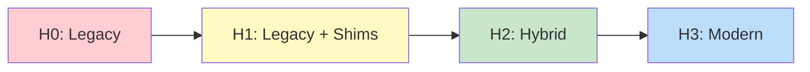
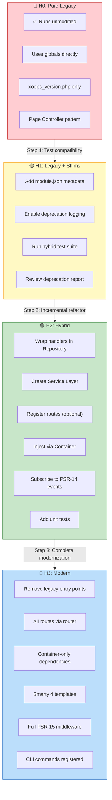

# Hybrid Mode Compatibility Contract (HCC)

> **Purpose:** This document defines the formal compatibility guarantees for running legacy XOOPS modules alongside modern XOOPS 4.0 components.

---

## Overview

Hybrid Mode is the cornerstone of XOOPS 4.0's migration strategy. It ensures that:

1. **Existing modules continue to work** without modification
2. **Gradual migration is possible** page-by-page, module-by-module
3. **New and legacy code can coexist** in the same installation
4. **No ecosystem fragmentation** occurs during the transition

---

## Compatibility Levels

XOOPS 4.0 defines four compatibility levels, allowing module authors to choose their migration pace:

### H0 — Pure Legacy

**Unmodified legacy modules run without any changes.**

| Aspect | Guarantee |
|--------|-----------|
| Entry Points | `modules/<mod>/index.php`, `modules/<mod>/admin/*.php` |
| Globals | `$xoopsDB`, `$xoopsUser`, `$xoopsModule`, `$xoopsTpl` available |
| Handlers | Classic `XoopsPersistableObjectHandler` works |
| Templates | Smarty 3 syntax fully supported |
| Blocks | Legacy block functions and templates work |
| Metadata | `xoops_version.php` is authoritative |

### H1 — Legacy with Compatibility Shims

**Legacy modules run with logging and wrapper adapters enabled.**

| Aspect | Guarantee |
|--------|-----------|
| All H0 features | ✅ Supported |
| Deprecation Warnings | Logged (not displayed) when legacy APIs used |
| Request Wrapper | Legacy `$_GET`/`$_POST` access wrapped for PSR-7 |
| Database Wrapper | Legacy `$xoopsDB` calls forwarded to new connection |
| Template Wrapper | Smarty 3 calls adapted to Smarty 4 |

### H2 — Hybrid Mode

**Modules can opt into new services while using legacy entry points where needed.**

| Aspect | Guarantee |
|--------|-----------|
| Container Access | PSR-11 container available via `Xoops::getContainer()` |
| Event System | Can subscribe to PSR-14 events |
| Router | Can register routes in `module.json` |
| Service Layer | Can inject services into controllers |
| Legacy Bridge | Legacy globals still accessible (but discouraged) |
| Mixed Pages | Some pages can use new stack, others legacy |

### H3 — Modern Only

**Modules use only new stack APIs; legacy globals unavailable by default.**

| Aspect | Guarantee |
|--------|-----------|
| Container | Required for all dependencies |
| Router | All entry points via router |
| Middleware | Full PSR-15 pipeline |
| Templates | Smarty 4 only, no `{php}` blocks |
| Events | PSR-14 event dispatcher |
| CLI | Commands registered via manifest |

---

## Migration Path Visualization

This diagram shows the progressive steps to migrate from H0 (legacy) to H3 (modern):

### Migration Effort by Level

| Transition | Estimated Effort | Complexity | Recommended For |
|------------|-----------------|------------|-----------------|
| **H0 → H1** | 1-2 hours | Low | All modules (safety net) |
| **H1 → H2** | 1-4 days | Medium | Active development modules |
| **H2 → H3** | 1-2 weeks | High | New modules, major rewrites |

### Incremental Adoption Strategy

You don't have to go from H0 to H3 all at once. Here's a recommended approach:

```mermaid
flowchart LR
    subgraph Phase1["Phase 1: Safety (H0→H1)"]
        P1A["1. Add module.json"]
        P1B["2. Enable shim logging"]
        P1C["3. Fix critical deprecations"]
    end

    subgraph Phase2["Phase 2: Foundation (H1→H2)"]
        P2A["4. Create Repository for one handler"]
        P2B["5. Add Service for one feature"]
        P2C["6. Write tests for Service"]
        P2D["7. Repeat for other handlers"]
    end

    subgraph Phase3["Phase 3: Modernize (H2→H3)"]
        P3A["8. Convert pages to routes"]
        P3B["9. Remove global dependencies"]
        P3C["10. Adopt PSR-15 middleware"]
    end

    Phase1 --> Phase2 --> Phase3
```

---

## Execution Guarantees

### Supported Entry Points

| Entry Point | H0 | H1 | H2 | H3 |
|-------------|----|----|----|----|
| `modules/<mod>/index.php` | ✅ | ✅ | ✅ | ❌ |
| `modules/<mod>/admin/*.php` | ✅ | ✅ | ✅ | ❌ |
| Route-based (`/mod/action`) | ❌ | ❌ | ✅ | ✅ |
| Block rendering | ✅ | ✅ | ✅ | ✅ |
| CLI commands | ❌ | ❌ | ✅ | ✅ |

### Bootstrap Order

The following initialization order is guaranteed:

1. **Config Load** — `mainfile.php` or environment config
2. **Error Handler** — Error/exception handling registered
3. **Container Build** — DI container compiled (H2+)
4. **Session Start** — Session initialized
5. **User Load** — `$xoopsUser` available
6. **Module Load** — Current module context set
7. **Template Ready** — `$xoopsTpl` initialized

### Global Availability

| Global | When Available | H0 | H1 | H2 | H3 |
|--------|----------------|----|----|----|----|
| `$xoopsDB` | After bootstrap | ✅ | ✅ | ⚠️ | ❌ |
| `$xoopsUser` | After session | ✅ | ✅ | ✅ | ❌* |
| `$xoopsTpl` | After template init | ✅ | ✅ | ⚠️ | ❌ |
| `$xoopsModule` | In module context | ✅ | ✅ | ✅ | ❌* |
| `$xoopsConfig` | After bootstrap | ✅ | ✅ | ✅ | ❌* |

*Available via container injection in H3

---

## API Stability Promises

### Stable (No Breaking Changes)

These APIs will not change without a major version bump:

- `XoopsObject::getVar()`, `setVar()`, `toArray()`
- `XoopsPersistableObjectHandler` CRUD methods
- `Criteria` and `CriteriaCompo` classes
- `xoops_getModuleHandler()` function
- Block rendering pipeline
- Permission check APIs
- CSRF token utilities

### Deprecated (Works, Will Be Removed)

These APIs work but will be removed in a future major version:

| API | Replacement | Removal Target |
|-----|-------------|----------------|
| `global $xoopsDB` | Container injection | XOOPS 3.0 |
| `$_REQUEST` direct access | `Request::get()` | XOOPS 3.0 |
| `{php}` in templates | Twig functions / modifiers | XOOPS 3.0 |
| `XoopsObjectTree` | Nested Set or Closure Table | XOOPS 3.0 |

### Experimental (May Change)

These APIs are in preview and may change:

- JSON module manifests (`module.json`)
- CLI command registration
- Middleware stack configuration
- Event subscriber attributes

---

## Performance Guarantees

### Boot Overhead Budget

| Level | Max Additional Overhead |
|-------|------------------------|
| H0 | 0 ms (baseline) |
| H1 | < 5 ms |
| H2 | < 15 ms |
| H3 | Container-dependent |

### Caching Behavior

| Feature | Guarantee |
|---------|-----------|
| Template Caching | Works in all levels |
| Block Caching | Unchanged behavior |
| OPcache | Fully compatible |
| Query Caching | Opt-in, same API |

### What Hybrid Mode Will NOT Do

- Disable existing caching
- Require per-request filesystem scans
- Add N+1 query overhead via wrappers
- Force module recompilation on every request

---

## Supported Legacy Patterns

### ✅ Fully Supported

| Pattern | Notes |
|---------|-------|
| Preloads/Hooks | Bridged to new event system |
| Classic handlers + Criteria | Works unchanged |
| Block definitions in `xoops_version.php` | Fully supported |
| Template overrides in themes | Works as before |
| Language files (`language/`) | Loaded automatically |
| Admin menu registration | Works unchanged |

### ⚠️ Supported with Constraints

| Pattern | Constraint |
|---------|------------|
| Direct global usage | Allowed in H0/H1, discouraged in H2, disabled in H3 |
| Custom Smarty plugins | Must register via new mechanism in H2+ |
| Direct SQL queries | Work, but should migrate to repository |

### ❌ Not Supported (Security)

These patterns are **intentionally blocked** for security:

| Pattern | Reason |
|---------|--------|
| Dynamic file includes from user input | Security risk |
| `{php}` blocks in templates | XSS/RCE risk |
| `eval()` on user data | RCE risk |
| Unescaped output | XSS risk |

---

## Migration Promises

### Incremental Migration

1. **Page-by-page migration:** Convert one admin page or one frontend action at a time
2. **Independent adoption:** Adopt the container without adopting the router (or vice versa)
3. **No big-bang required:** Legacy and modern can coexist indefinitely

### Migration Cookbook

The following conversions are documented with examples:

- [ ] Convert one admin page to controller
- [ ] Convert one block to modern rendering
- [ ] Wrap handler in repository pattern
- [ ] Add service layer to existing module
- [ ] Introduce unit tests for handler
- [ ] Migrate from Smarty 3 to Smarty 4 syntax

See: [Migration Guide: 2.5.x to 4.0](../Migration-Guides/From-2.5-to-4.0.md)

---

## Compliance Testing

### Test Suite

The following tests verify Hybrid Mode compliance:

| Test | Description |
|------|-------------|
| `LegacyModuleBootTest` | Legacy demo module loads and renders |
| `Vision2026ModuleTest` | Modern reference module works |
| `MixedModuleTest` | Half legacy/half modern module works |
| `ThemeOverrideTest` | Template overrides work in hybrid |
| `BlockCacheTest` | Block caching works across levels |
| `PermissionTest` | Permission checks work in all levels |

### CI Integration

- All core PRs must pass Hybrid Compliance Suite
- Module developers can run: `php xoops test:hybrid mymodule`

---

## Red Lines (Non-Negotiables)

> **The following guarantees will NEVER be broken without a new major version:**

1. ✅ `xoops_version.php` remains authoritative module metadata
2. ✅ Legacy entry points (`modules/<mod>/*.php`) work via bridge
3. ✅ Block system works with legacy functions and templates
4. ✅ Legacy globals available in H0/H1 levels
5. ✅ Theme template override resolution unchanged
6. ✅ Permission system API unchanged

---

## Related Documents

- [XOOPS 4.0 Roadmap](../XOOPS-4.0-Roadmap.md)
- [Migration Guide: 2.5.x to 4.0](../Migration-Guides/From-2.5-to-4.0.md)
- [PSR-11 Container](../PSR-Standards/PSR-11-Container.md)

---

**Version History:**

| Version | Date | Changes |
|---------|------|---------|
| 1.0.0 | 2026-01-31 | Initial draft |

---

#hybrid-mode #compatibility #migration #specification #xoops-4.0
