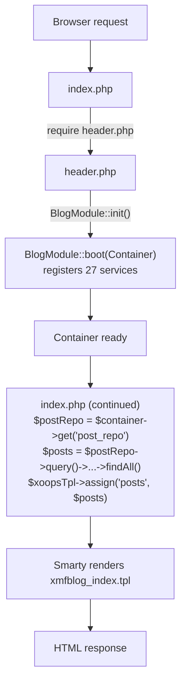
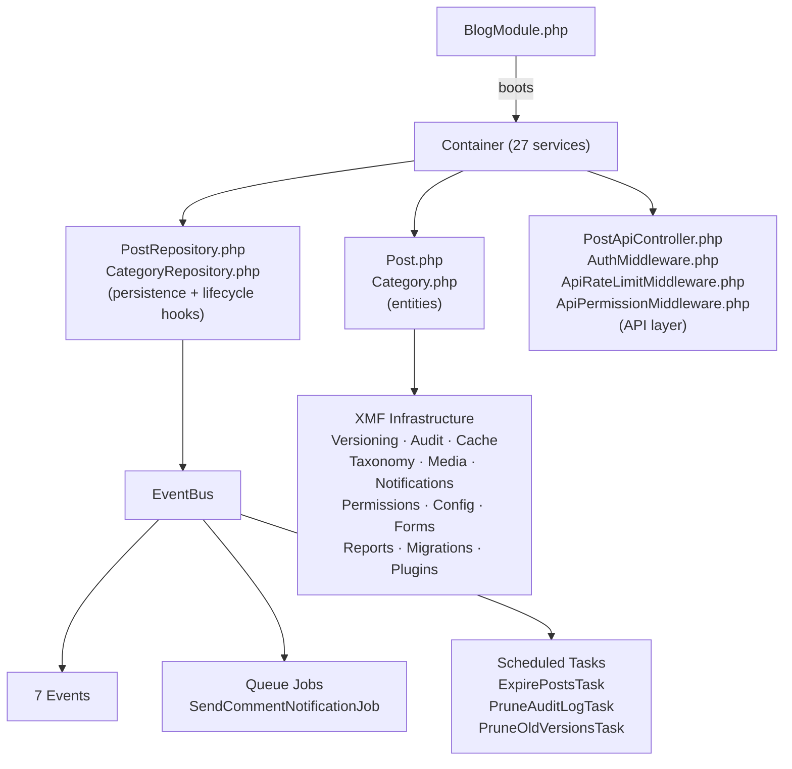

# Anatomy of an XMF Module

> A guided tour through xmfBlog -- follow the code from bootstrap to response.

This is not a build-from-scratch tutorial (see [Getting Started](Getting-Started-with-XOOPS-4.0-Module-Development.md) for that). This is a **"read the code with me"** walkthrough that explains how the pieces connect. Open the source files alongside this guide.

For the complete 50-chapter deep dive, see the [XMF Architecture Tutorial](../Reference-Modules/xmfBlog-Docs/TUTORIAL.md).

---

## The Request Lifecycle

When a user visits `modules/xmfblog/index.php`, here's what happens:



---

## Stop 1: The Bootstrap (`BlogModule.php`)

**File:** `src/BlogModule.php`

Every XMF module has one bootstrap class that wires all services. This is the **composition root** -- the only place where `new` is called for infrastructure objects.

```php
class BlogModule implements ModuleBootstrapInterface
{
    public static function init(): Container
    {
        $container = Container::getInstance();
        $module = new self();
        $module->boot($container);
        return $container;
    }

    public function boot(Container $container): void
    {
        // 1. Database
        $container->singleton('db', fn() => \XoopsDatabaseFactory::getDatabaseConnection());

        // 2. Event system
        $container->singleton('events', fn() => new ListenerProvider());
        $container->singleton('event_bus', fn(Container $c) => new EventBus($c->get('events')));

        // 3. Repositories (depend on db)
        $container->singleton('post_repo', fn(Container $c) =>
            new PostRepository(Post::class, $c->get('db'))
        );

        // ... 24 more services
    }
}
```

**Key insight:** Pages and controllers never instantiate services directly. They call `$container->get('service_name')`. This makes everything swappable and testable.

**Source:** [BlogModule.php](../../modules/xmfblog/src/BlogModule.php) -- read the full `boot()` method to see all 27 registrations.

---

## Stop 2: The Entity (`Post.php`)

**File:** `src/Post.php`

Entities are plain PHP classes. No `XoopsObject` inheritance. Attributes handle the mapping:

```php
#[Table('xmfblog_posts')]
class Post implements VersionAwareInterface, DomainEventAwareInterface,
                      AuditableInterface, TaggableInterface
{
    use EntityBridge;      // getVar()/setVar() for template compat
    use DomainEventTrait;  // recordEvent() for domain events

    #[Column('post_id', primaryKey: true, autoIncrement: true)]
    public private(set) int $id = 0;   // PHP 8.4: public read, private write

    #[Column('title')]
    public string $title = '';

    #[Column('status')]
    public int $status = 0;
    // ...
}
```

**Key insight:** The entity is *just data + contracts*. No business logic, no database calls. The interfaces declare what framework features this entity opts into (versioning, audit, events, tags), and the repository handles the integration.

**Source:** [Post.php](../../modules/xmfblog/src/Post.php) -- 198 lines, every one meaningful.

---

## Stop 3: The Repository (`PostRepository.php`)

**File:** `src/PostRepository.php`

The repository is where entities meet infrastructure. Lifecycle hooks are the extension points:

```php
class PostRepository extends EntityRepository
{
    // BEFORE persistence: set timestamps, snapshot for versioning
    protected function beforeSave(object $entity): bool
    {
        $entity->dateUpdated = time();
        if ($entity->isNew()) {
            $entity->dateCreated = time();
        } else {
            $this->autoVersion($entity);  // snapshot before overwrite
        }
        return true;
    }

    // AFTER persistence: side effects that need the saved ID
    protected function afterSave(object $entity, bool $isNew): void
    {
        // Audit logging
        $auditLogger->log($actorId, $actorIp, 'post', $entity->id, $action, ...);

        // Domain events based on status
        if ($entity->status === ObjectStatus::Published->value) {
            $entity->recordEvent(new PostPublishedEvent(...));
        }

        // Taxonomy sync
        $tm->assignTerms($entity, 'tags', $entity->pendingTags, 'xmfblog');
    }

    // AFTER deletion: cleanup
    protected function afterDelete(object $entity): void
    {
        $entity->recordEvent(new PostDeletedEvent(...));
        $tm->removeAllTerms($entity);
    }
}
```

**Key insight:** `beforeSave()` runs *before* the SQL. `afterSave()` runs *after* the SQL succeeds and receives the `$isNew` flag. Events are recorded on the entity during `afterSave()`, then dispatched by the base `EntityRepository` through `EventBus`.

**Source:** [PostRepository.php](../../modules/xmfblog/src/PostRepository.php) -- 354 lines including image handling and tag module sync.

---

## Stop 4: Domain Events

**Files:** `src/PostPublishedEvent.php`, `src/CategoryCreatedEvent.php`, etc.

Events are immutable data objects. They carry what happened, not what to do about it:

```php
final readonly class PostPublishedEvent
{
    public function __construct(
        public int $postId,
        public string $title,
        public int $authorId,
    ) {
    }
}
```

**The flow:**
1. Entity records event: `$entity->recordEvent(new PostPublishedEvent(...))`
2. Repository dispatches after save: base class calls `EventBus::dispatch()`
3. Listeners react: cache invalidation, notifications, search indexing

**Key insight:** Events decouple the "what happened" from the "what to do about it". Adding a new side effect (e.g., webhook notification) means registering a new listener -- no changes to the entity or repository.

---

## Stop 5: The API Layer

**Files:** `src/PostApiController.php`, `src/AuthMiddleware.php`, `src/ApiRateLimitMiddleware.php`, `src/ApiPermissionMiddleware.php`

API requests pass through a middleware pipeline before reaching the controller:

```
Request → RateLimitMiddleware → AuthMiddleware → PermissionMiddleware → Controller
```

Each middleware can short-circuit with an `ApiResponse`:

```php
// AuthMiddleware -- read requests pass through, writes require session
if (in_array($method, ['GET', 'HEAD', 'OPTIONS'], true)) {
    return $next($request);  // pass through
}
if (!is_object($xoopsUser)) {
    return ['response' => new ApiResponse(false, null, 'Authentication required.', 401)];
}
$request['user'] = (int) $xoopsUser->getVar('uid');
return $next($request);  // pass to next middleware
```

The controller validates, hydrates, and delegates to the repository:

```php
// PostApiController::store()
$validation = $this->validatePayload($request, true);
if ($validation instanceof ApiResponse) {
    return $validation;  // 422 Validation Error
}
$request['data'] = $validation;
return parent::store($request);  // EntityRepository handles persistence
```

**Source:** [PostApiController.php](../../modules/xmfblog/src/PostApiController.php) -- 175 lines.

---

## Stop 6: Async Work

**Files:** `src/SendCommentNotificationJob.php`, `src/ExpirePostsTask.php`

For work that shouldn't block the HTTP response, xmfBlog uses two mechanisms:

**Queue jobs** -- triggered by events, run by `QueueRunner`:
```php
#[QueuedJob(queue: 'notifications', retries: 3, backoff: 30)]
final class SendCommentNotificationJob implements JobInterface
{
    public function handle(Container $c): void
    {
        $nm = $c->get('notification_manager');
        $nm->deliverSync(['in_app'], $this->postAuthorId, $payload);
    }
}
```

**Scheduled tasks** -- CRON-based, run by `TaskRunner`:
```php
final class ExpirePostsTask implements ScheduledTaskInterface
{
    public function getSchedule(): string { return '0 * * * *'; }  // hourly

    public function execute(): void
    {
        // UPDATE ... SET status = Draft WHERE date_expire < NOW()
    }
}
```

**Key insight:** Jobs and tasks both receive the `Container`, so they have access to all services. The `#[QueuedJob]` attribute configures retry behavior declaratively.

---

## Stop 7: The Database Schema

**File:** `sql/mysql.sql`

xmfBlog creates 12 tables. Two are module-specific (`xmfblog_posts`, `xmfblog_categories`). The other 10 are shared XMF infrastructure tables used by any module that needs versioning, comments, media, queue, notifications, audit, taxonomy, or migrations.

The `BlogMigration` class creates these tables programmatically, using static factory methods from each XMF component:

```php
$db->exec(Comment::createTableSql($db->prefix('')));
$db->exec(VersionManager::createTableSql($db->prefix('')));
$db->exec(Queue::createTableSql($db->prefix('')));
```

This is safe to call from multiple modules -- each factory checks if the table already exists.

---

## The Big Picture



---

## Where to Go Next

| Goal | Resource |
|---|---|
| Build your own module from scratch | [Getting Started Tutorial](Getting-Started-with-XOOPS-4.0-Module-Development.md) |
| Deep dive into every XMF component | [XMF Architecture Tutorial](../Reference-Modules/xmfBlog-Docs/TUTORIAL.md) (50 chapters) |
| Fast onboarding (10 steps) | [XMF Quickstart](../Reference-Modules/xmfBlog-Docs/QUICKSTART.md) |
| Understand widget system | [xmfPortal Reference](../Reference-Modules/xmfPortal.md) |
| Modernize a legacy module | [Migration Cookbook](../Reference-Modules/xmfBlog-Docs/MIGRATION_COOKBOOK.md) |
| Learn a specific pattern | [Implementation Guides](../Implementation-Guides/Implementation-Guides.md) |
| Add a REST API | [REST API Tutorial](Adding-REST-API-to-Your-Module.md) |
