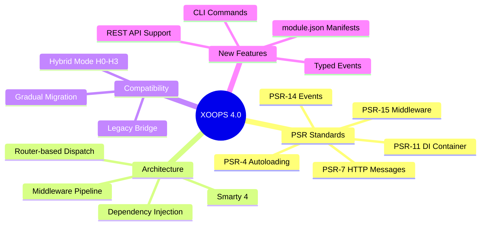
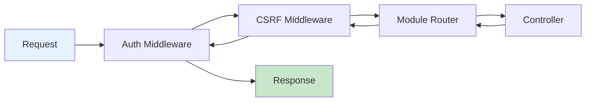
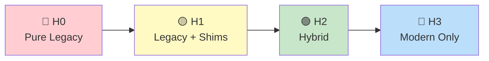

# 🚀 What's New in XOOPS 4.0

> **One-page summary of everything new in XOOPS 4.0** — PSR standards, architecture changes, new APIs, and migration requirements.

---

## At a Glance



---

## Quick Comparison

| Feature | XOOPS 2.5.x | XOOPS 4.0 |
|---------|-------------|------------|
| **PHP Version** | 8.2+ | 8.4+ |
| **Request Handling** | Page Controller (`index.php`) | Router + Middleware |
| **Dependencies** | Global objects (`$xoopsDB`) | PSR-11 Container injection |
| **Events** | Preload system | PSR-14 Event Dispatcher |
| **Templates** | Smarty 3 | Smarty 4 |
| **Autoloading** | Class maps | PSR-4 native |
| **Module Metadata** | `xoops_version.php` | `xoops_version.php` + `module.json` |
| **HTTP Messages** | Superglobals | PSR-7 Request/Response |

---

## PSR Standards Adopted

### PSR-4: Autoloading

**What:** Standard class autoloading based on namespace/directory mapping.

```php
// Before: Manual includes or class maps
require_once XOOPS_ROOT_PATH . '/modules/mymod/class/Item.php';

// After: PSR-4 autoloading
use XoopsModules\MyModule\Item;  // Automatically loaded
```

📖 [Full PSR-4 Guide](PSR-Standards/PSR-4-Autoloading.md)

---

### PSR-7: HTTP Messages

**What:** Standardized request/response objects instead of superglobals.

```php
// Before: Direct superglobal access
$id = $_GET['id'];
echo '<html>...</html>';

// After: PSR-7 objects
public function handle(ServerRequestInterface $request): ResponseInterface
{
    $id = $request->getQueryParams()['id'];
    return new HtmlResponse($this->render('template.tpl'));
}
```

📖 [Full PSR-7 Guide](PSR-Standards/PSR-7-HTTP-Messages.md)

---

### PSR-11: Dependency Injection Container

**What:** Centralized service container for managing dependencies.

```php
// Before: Global access
global $xoopsDB;
$handler = xoops_getModuleHandler('item', 'mymod');

// After: Container injection
public function __construct(
    private readonly ItemRepositoryInterface $items,
    private readonly LoggerInterface $logger
) {}
```

📖 [Full PSR-11 Guide](PSR-Standards/PSR-11-Container.md)

---

### PSR-14: Event Dispatcher

**What:** Typed event objects with subscriber priority and propagation control.

```php
// Before: Preload with array arguments
public static function eventCoreUserLogin(array $args): void {
    $user = $args[0];
}

// After: Typed event objects
#[AsEventListener(event: UserLoginEvent::class, priority: 10)]
public function onLogin(UserLoginEvent $event): void {
    $user = $event->getUser();
}
```

📖 [Full Event System Guide](Implementation-Guides/Event-System-Guide.md)

---

### PSR-15: HTTP Middleware

**What:** Composable request/response processing pipeline.



📖 [Full PSR-15 Guide](PSR-Standards/PSR-15-Middleware.md)

---

## New Module Features

### module.json Manifest

New JSON-based module metadata alongside `xoops_version.php`:

```json
{
  "name": "mymodule",
  "version": "1.0.0",
  "xoops": {
    "min": "2026.0",
    "compatibility": "H2"
  },
  "routes": {
    "mymodule.index": {
      "path": "/mymodule",
      "controller": "IndexController"
    }
  },
  "services": {
    "MyModule\\Service\\ItemService": {
      "autowire": true
    }
  }
}
```

📖 [Module JSON Spec](Implementation-Guides/Module-JSON-Specification.md)

---

### Route-Based Dispatching

```php
// Routes in module.json
"routes": {
    "articles.show": {
        "path": "/articles/{id}",
        "controller": "ArticleController::show",
        "methods": ["GET"]
    }
}

// Clean controller
class ArticleController
{
    public function show(int $id, ArticleService $service): ResponseInterface
    {
        $article = $service->find($id);
        return $this->render('article/show.tpl', ['article' => $article]);
    }
}
```

---

### CLI Commands

Register commands in `module.json`:

```json
"commands": {
    "mymod:import": {
        "class": "MyModule\\Command\\ImportCommand",
        "description": "Import data from CSV"
    }
}
```

Run with:
```bash
php xoops mymod:import --file=data.csv
```

---

### REST API Support

Built-in REST API routing:

```json
"api": {
    "prefix": "/api/v1/mymodule",
    "routes": {
        "articles.list": {
            "path": "/articles",
            "controller": "Api\\ArticleController::list",
            "methods": ["GET"]
        }
    }
}
```

📖 [REST API Guide](Implementation-Guides/REST-API-Design-Guide.md)

---

## Hybrid Mode Compatibility

XOOPS 4.0 maintains backward compatibility through **Hybrid Mode**:



| Level | What Works | Migration Effort |
|-------|-----------|------------------|
| **H0** | Unmodified legacy modules | None required |
| **H1** | Legacy with deprecation logging | 1-2 hours |
| **H2** | Mix of legacy and modern | 1-4 days |
| **H3** | Fully modern (no legacy) | 1-2 weeks |

📖 [Full Hybrid Mode Contract](Specifications/Hybrid-Mode-Contract.md)

---

## Migration Checklist

### Minimum Required (H0 → H1)

- [ ] Test module on PHP 8.4
- [ ] Add `module.json` with basic metadata
- [ ] Run hybrid compatibility test suite
- [ ] Review deprecation log

### Recommended (H1 → H2)

- [ ] Wrap handlers in Repository classes
- [ ] Create Service layer for business logic
- [ ] Replace `global $xoopsDB` with injection
- [ ] Add unit tests for services
- [ ] Register optional routes in `module.json`

### Full Modernization (H2 → H3)

- [ ] Convert all pages to routes
- [ ] Remove all global dependencies
- [ ] Migrate preloads to PSR-14 events
- [ ] Update templates to Smarty 4
- [ ] Register CLI commands

📖 [Complete Migration Guide](Migration-Guides/From-2.5-to-4.0.md)

---

## Breaking Changes

### ⚠️ Removed in 2026

| Feature | Replacement |
|---------|-------------|
| `{php}` template blocks | Smarty functions/modifiers |
| Direct `$_GET`/`$_POST` | `ServerRequestInterface` |
| `global $xoopsDB` (in H3) | Container injection |
| `XoopsObjectTree` | Nested Set / Closure Table |

### ⚠️ Deprecated (works, will be removed)

| Feature | Replacement | Removal Target |
|---------|-------------|----------------|
| `xoops_getModuleHandler()` | Container service | XOOPS 3.0 |
| `$GLOBALS['xoopsUser']` | `UserContext` service | XOOPS 3.0 |
| Preload events | PSR-14 subscribers | XOOPS 3.0 |

---

## What Stays the Same

These APIs remain **stable and unchanged**:

✅ `XoopsObject` — `getVar()`, `setVar()`, `toArray()`
✅ `XoopsPersistableObjectHandler` — CRUD methods
✅ `Criteria` and `CriteriaCompo` — Query building
✅ Block system — Functions and templates
✅ Permission checking — Group/module permissions
✅ Theme template overrides — Resolution unchanged
✅ `xoops_version.php` — Still authoritative

---

## Learning Resources

| Resource | Description |
|----------|-------------|
| [xmfBlog Reference](Reference-Modules/xmfBlog.md) | Primary reference module (25+ XMF components) |
| [xmfPortal Reference](Reference-Modules/xmfPortal.md) | Widget system and presentation layer |
| [Anatomy of an XMF Module](Tutorials/Anatomy-of-an-XMF-Module.md) | Guided code walkthrough |
| [Getting Started Tutorial](Tutorials/Getting-Started-with-XOOPS-4.0-Module-Development.md) | Build a module step-by-step |
| [Pattern Decision Tree](../03-Module-Development/Choosing-Data-Access-Pattern.md) | Choose the right approach |
| [Event Decision Tree](../02-Core-Concepts/Choosing-Event-System.md) | Preloads vs PSR-14 |
| [Documentation Map](../00-Home/Documentation-Map.md) | Navigate all docs |

---

## Timeline

| Milestone | Status | Date |
|-----------|--------|------|
| Alpha Release | 🚧 In Progress | Q2 2026 |
| Beta Release | 📅 Planned | Q3 2026 |
| Release Candidate | 📅 Planned | Q4 2026 |
| Stable Release | 📅 Planned | Q1 2027 |

---

#xoops-4.0 #whats-new #psr #migration #quick-reference
