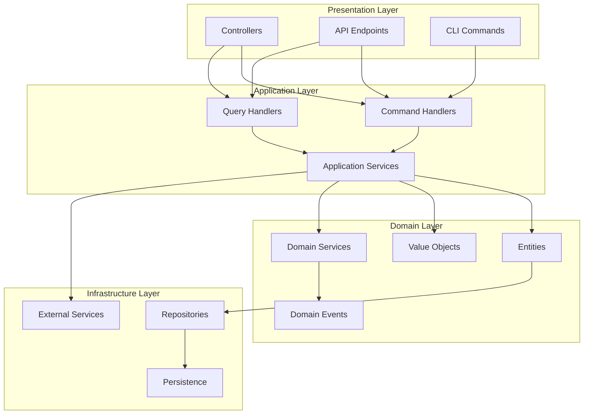

# XOOPS 4.0 Architecture

## Overview

XOOPS 4.0 introduces a modern, clean architecture that embraces Domain-Driven Design (DDD), CQRS patterns, and PSR standards while maintaining backward compatibility with existing modules.

## Architecture Principles



## Core Concepts

### Clean Architecture Layers

| Layer | Purpose | Dependencies |
|-------|---------|--------------|
| **Presentation** | HTTP handling, CLI, templates | Application Layer |
| **Application** | Use cases, orchestration | Domain Layer |
| **Domain** | Business logic, entities | None (pure PHP) |
| **Infrastructure** | External concerns, persistence | All layers |

### Domain Layer

The domain layer contains pure business logic with no external dependencies:

```php
namespace Xoops\Modules\Article\Domain;

final class Article
{
    private function __construct(
        private ArticleId $id,
        private Title $title,
        private Content $content,
        private AuthorId $authorId,
        private ArticleStatus $status,
        private \DateTimeImmutable $createdAt,
        private ?\DateTimeImmutable $publishedAt
    ) {}

    public static function create(
        Title $title,
        Content $content,
        AuthorId $authorId
    ): self {
        return new self(
            id: ArticleId::generate(),
            title: $title,
            content: $content,
            authorId: $authorId,
            status: ArticleStatus::Draft,
            createdAt: new \DateTimeImmutable(),
            publishedAt: null
        );
    }

    public function publish(): void
    {
        if ($this->status === ArticleStatus::Published) {
            throw new ArticleAlreadyPublishedException($this->id);
        }

        $this->status = ArticleStatus::Published;
        $this->publishedAt = new \DateTimeImmutable();
    }
}
```

### Application Layer

The application layer coordinates domain operations:

```php
namespace Xoops\Modules\Article\Application\Commands;

final class PublishArticleCommand
{
    public function __construct(
        public readonly string $articleId
    ) {}
}

final class PublishArticleHandler
{
    public function __construct(
        private readonly ArticleRepository $repository,
        private readonly EventDispatcher $events
    ) {}

    public function handle(PublishArticleCommand $command): void
    {
        $article = $this->repository->findById(
            ArticleId::fromString($command->articleId)
        );

        if (!$article) {
            throw new ArticleNotFoundException($command->articleId);
        }

        $article->publish();

        $this->repository->save($article);
        $this->events->dispatch(new ArticlePublished($article->getId()));
    }
}
```

## Key Components

### ULID Identifiers

All entities use ULIDs for unique identification:

```php
namespace Xoops\Modules\Xmf\Domain\ValueObjects;

final class EntityId
{
    private function __construct(
        private readonly string $value
    ) {}

    public static function generate(): self
    {
        return new self(Ulid::generate());
    }

    public static function fromString(string $value): self
    {
        if (!Ulid::isValid($value)) {
            throw new InvalidEntityIdException($value);
        }
        return new self($value);
    }
}
```

### Repository Pattern

```php
interface ArticleRepository
{
    public function findById(ArticleId $id): ?Article;
    public function save(Article $article): void;
    public function delete(Article $article): void;
    public function findByAuthor(AuthorId $authorId): array;
}
```

### CQRS Pattern

Commands for writes, queries for reads:

```php
// Command (write)
$commandBus->dispatch(new PublishArticleCommand($articleId));

// Query (read)
$articles = $queryBus->dispatch(new GetRecentArticlesQuery(limit: 10));
```

## Integration Points

### PSR Standards

- **PSR-4**: Autoloading
- **PSR-7**: HTTP Messages
- **PSR-11**: Container Interface
- **PSR-15**: HTTP Middleware
- **PSR-14**: Event Dispatcher

### Backward Compatibility

Legacy modules continue to work through adapters:

```php
// Legacy handler adapted to new repository
class LegacyArticleHandlerAdapter implements ArticleRepository
{
    public function __construct(
        private readonly XoopsObjectHandler $legacyHandler
    ) {}

    public function findById(ArticleId $id): ?Article
    {
        $legacyObject = $this->legacyHandler->get($id->toInt());
        return $legacyObject ? ArticleMapper::toDomain($legacyObject) : null;
    }
}
```

## Related Documentation

- [[Architecture/XOOPS-4.0-Architecture-Diagrams|Architecture Diagrams]]
- [[Implementation-Guides/Repository-Query-Patterns-Guide|Repository & Query Patterns]]
- [[Implementation-Guides/Event-Driven-Architecture-Guide|Event-Driven Architecture]]
- [[PSR-Standards/PSR-Standards-Overview|PSR Standards]]
- [[Tools/vscode-snippets/README|XMF Reference Implementation]]
