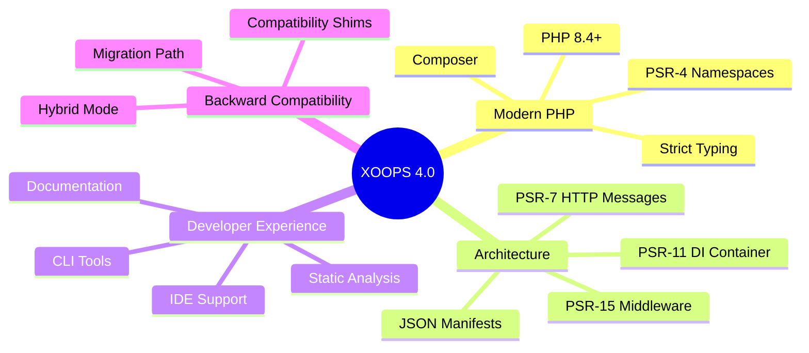
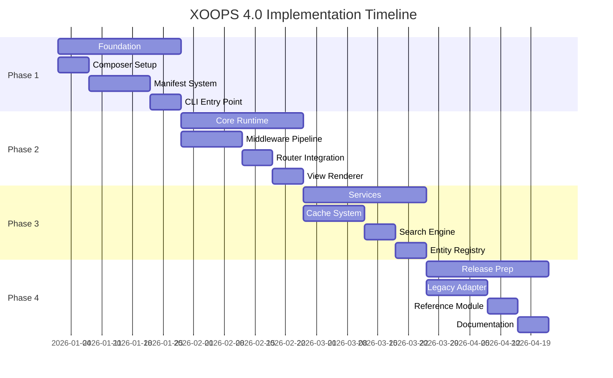

# XOOPS 4.0 Roadmap

## Overview

XOOPS 4.0 represents a fundamental modernization of the XOOPS Content Management System, bringing it into alignment with contemporary PHP practices while maintaining backward compatibility with the extensive ecosystem of existing modules.

## Vision Statement

> Transform XOOPS from a legacy CMS into a modern, PSR-compliant platform that developers love to work with, while protecting the investment of existing site owners and module developers.

## Key Objectives



### 1. Modern PHP Standards

- **Target PHP 8.4+** with strict typing and modern language features
- Full adoption of **PSR standards** for interoperability
- **Composer-based** dependency management
- **Namespace-based** architecture following PSR-4

### 2. Architectural Modernization

- **PSR-15 Middleware Pipeline** for request handling
- **PSR-11 Dependency Injection Container** for service management
- **PSR-7 HTTP Messages** for standardized request/response handling
- **JSON-based module manifests** replacing `xoops_version.php`

### 3. Developer Experience

- Modern CLI tooling with `bin/xoops` commands
- IDE-friendly code with full type hints
- Comprehensive documentation and migration guides
- Static analysis support (PHPStan Level 5+)

### 4. Backward Compatibility

- Hybrid mode supporting both legacy and modern modules
- Gradual migration path for existing modules
- Compatibility shims for legacy APIs

## Documentation Structure

This section contains comprehensive documentation for XOOPS 4.0:

### Roadmap

- [[Roadmap/4.0-Specification|Core Specification]] - The complete technical specification
- [[Roadmap/Architecture-Vision|Architecture Vision]] - PSR-15 middleware and system design

### PSR Standards

- [[PSR-Standards/PSR-Standards-Overview|PSR Standards Overview]] - All PSR standards being adopted
- [[PSR-Standards/PSR-4-Autoloading|PSR-4 Autoloading]] - Class autoloading implementation
- [[PSR-Standards/PSR-7-HTTP-Messages|PSR-7 HTTP Messages]] - HTTP message interfaces
- [[PSR-Standards/PSR-11-Container|PSR-11 Container]] - Dependency injection container
- [[PSR-Standards/PSR-15-Middleware|PSR-15 Middleware]] - HTTP middleware pipeline

### Modernization

- [[../02-Core-Concepts/Templates/Smarty-4-Migration|Smarty 4 Migration]] - Template engine upgrade
- [[Modernization/PHP-8-Compatibility|PHP 8 Compatibility]] - PHP 8.x improvements

### Migration

- [[Migration-Guides/From-2.5-to-4.0|From 2.5 to 4.0]] - Complete migration guide

## Implementation Phases



### Phase 1: Foundation (Weeks 1-4)

**Goal:** A working CLI that can verify a manifest

- Set up `composer.json` with core dependencies
- Implement `ManifestMerger` and `ManifestCompiler`
- Build `bin/xoops` entry point
- Implement `module:scaffold` and `lint:manifest` commands

### Phase 2: Core Runtime (Weeks 5-8)

**Goal:** A "Hello World" HTTP request serving a template

- Implement PSR-15 Middleware pipeline
- Create `RouteMatchInterface` bridge to FastRoute
- Build `ViewRendererInterface` with Smarty/Twig adapters
- Implement `ConnectionFactory` and `SafeUnsafe` trait

### Phase 3: Services and Integration (Weeks 9-12)

**Goal:** Complex modules interacting with each other

- Implement `VersionedCache` with null safety
- Build `FederatedSearchEngine` with bounded overfetch
- Create `TranslationCompiler` with collision detection
- Develop `EntityAliasRegistry`

### Phase 4: Release Readiness (Weeks 13-16)

**Goal:** Beta Release

- Complete `module:convert` legacy adapter
- Implement `bin/xoops doctor` checks
- Build reference "xmfblog" module
- Publish documentation

## CLI Commands

| Command | Purpose |
|---------|---------|
| `bin/xoops module:scaffold <slug>` | Create a new module structure |
| `bin/xoops manifest:compile` | Validate and compile manifests |
| `bin/xoops lint:translations <slug>` | Check for broken JSON or duplicate keys |
| `bin/xoops cache:warmup` | Prepare site for production deployment |
| `bin/xoops doctor` | Check server health and configuration |
| `bin/xoops module:convert <slug>` | Convert legacy module to modern format |

## Directory Structure

```text
modules/my_module/
├── module.json           # The Manifest (Entry Point)
├── src/                  # PSR-4 Code
│   ├── Controller/       # Action Handlers
│   ├── Entity/           # Database Models
│   ├── Service/          # Business Logic
├── config/               # Optional split configs
├── templates/            # Templates
├── language/             # Translations
│   └── en/
│       ├── main.json     # @main.key
├── assets/               # CSS/JS/Images
└── migrations/           # Database Schema Changes
```

## Environment Variables

| Variable | Purpose | Values |
|----------|---------|--------|
| `XOOPS_DEBUG` | Development mode | `true`/`false` |
| `XOOPS_MANIFEST_VALIDATION` | Schema validation level | `strict`/`warn`/`none` |
| `XOOPS_CACHE_STRATEGY` | Manifest invalidation strategy | `hash`/`mtime` |
| `XOOPS_SECURITY_LEVEL` | Security enforcement level | `strict`/`normal` |

## Governance

### Amendment Policy

- **Freeze Period (90 Days):** Only errata corrections allowed
- **Post-Freeze:** Semantic changes require XEP (XOOPS Enhancement Proposal)

### Conformance Requirements

The reference implementation must include tests demonstrating:

- List path clear (`assets.css: []`)
- Object path no-op (`config: {}`)
- Invalid type schema error (strict mode)
- `isPageAccurate` false scenarios
- Cached null round-trip

## Related Resources

- [[Architecture/XOOPS-4.0-Architecture-Diagrams|Architecture Overview]]
- [[../03-Module-Development/Module-Development|Module Development Guide]]
- [[../02-Core-Concepts/Database/Database-Layer|Database Documentation]]

## Quick Links

- [XOOPS GitHub Repository](https://github.com/XOOPS)
- [XOOPS Community Forums](https://xoops.org/modules/newbb/)
- [PHP-FIG PSR Standards](https://www.php-fig.org/psr/)

---

#xoops-4.0 #roadmap #modernization #psr-standards #architecture
