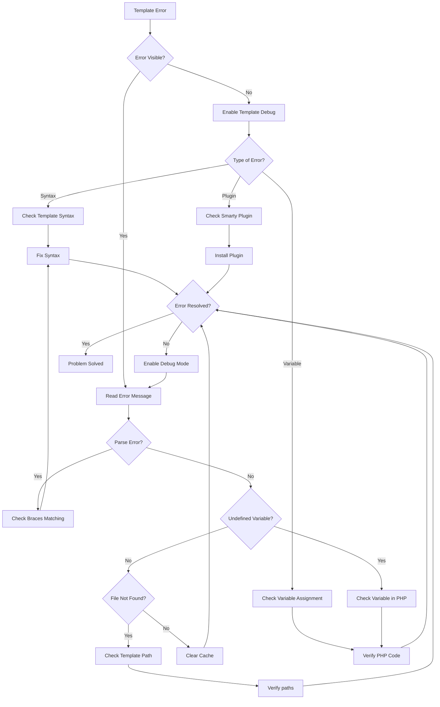
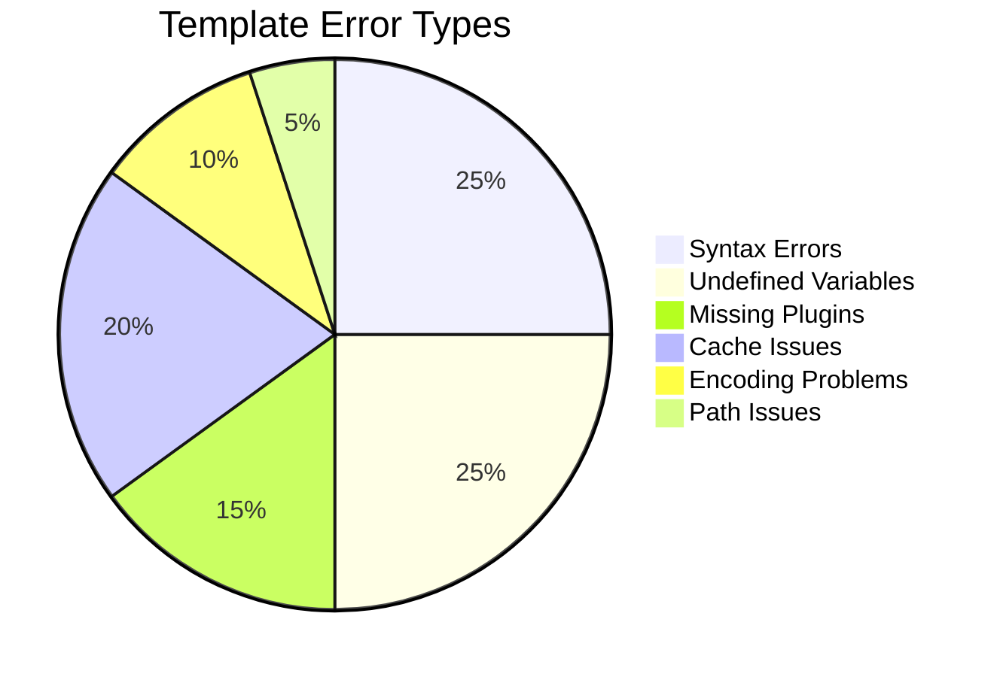

# Template Errors (Smarty Debugging)

> Common Smarty template issues and debugging techniques for XOOPS themes and modules.

---

## Diagnostic Flowchart



---

## Common Smarty Template Errors



---

## 1. Syntax Errors

**Symptoms:**
- "Smarty syntax error" messages
- Templates won't compile
- Blank page with no output

**Error Messages:**
```
Syntax error: unrecognized tag 'myfunction'
Unexpected "}" near end of template
```

### Common Syntax Issues

**Missing closing tag:**
```smarty
{* WRONG *}
{if $user}
User: {$user.name}
{* Missing {/if} *}

{* CORRECT *}
{if $user}
User: {$user.name}
{/if}
```

**Incorrect variable syntax:**
```smarty
{* WRONG *}
{$user->name}          {* Use . not -> *}
{$array[key]}          {* Use quoted keys *}
{$func()}              {* Can't call functions directly *}

{* CORRECT *}
{$user.name}
{$array.key}
{$array['key']}
{$user|@function}      {* Use modifiers instead *}
```

**Mismatched quotes:**
```smarty
{* WRONG *}
{if $name == 'John}     {* Mismatched quotes *}
{assign var="user' value="John"}

{* CORRECT *}
{if $name == 'John'}
{assign var="user" value="John"}
```

**Solutions:**

```smarty
{* Always balance braces *}
{if condition}
  ...
{elseif condition}
  ...
{else}
  ...
{/if}

{* Verify tag format *}
{foreach $items as $item}
  ...
{/foreach}

{* Check all variables are defined *}
{if isset($variable)}
  {$variable}
{/if}
```

---

## 2. Undefined Variable Errors

**Symptoms:**
- "Undefined variable" warnings
- Variable displays as empty
- PHP notice in error log

**Error Messages:**
```
Notice: Undefined variable: myvar
Smarty notice: variable "$user" not available
```

**Debug Script:**

```php
<?php
// In your template file or PHP code
// Create modules/yourmodule/debug_template.php

require_once '../../mainfile.php';

// Get template engine
$tpl = new XoopsTpl();

// Check what variables are assigned
echo "<h1>Template Variables</h1>";
echo "<pre>";
print_r($tpl->get_template_vars());
echo "</pre>";

// Or dump Smarty object
echo "<h1>Smarty Debug</h1>";
echo "<pre>";
$tpl->debug_vars();
echo "</pre>";
?>
```

**Fix in PHP:**

```php
<?php
// Ensure variables are assigned before rendering
$xoopsTpl = new XoopsTpl();

// WRONG - variable not assigned
$xoopsTpl->display('file:templates/page.html');

// CORRECT - assign variables first
$user = [
    'name' => 'John',
    'email' => 'john@example.com'
];
$xoopsTpl->assign('user', $user);
$xoopsTpl->display('file:templates/page.html');
?>
```

**Fix in Template:**

```smarty
{* Check if variable exists before using *}
{if isset($user)}
    <p>User: {$user.name}</p>
{else}
    <p>No user data</p>
{/if}

{* Use default values *}
<p>Name: {$user.name|default:"No name"}</p>

{* Check array key exists *}
{if isset($array.key)}
    {$array.key}
{/if}
```

---

## 3. Missing or Incorrect Modifiers

**Symptoms:**
- Data doesn't format correctly
- Text displays as HTML
- Incorrect case/encoding

**Error Messages:**
```
Warning: undefined modifier 'stripslashes'
```

**Common Modifiers:**

```smarty
{* String operations *}
{$text|upper}                    {* Uppercase *}
{$text|lower}                    {* Lowercase *}
{$text|capitalize}               {* First letter capital *}
{$text|truncate:20:"..."}        {* Truncate to 20 chars *}
{$text|strip_tags}               {* Remove HTML tags *}

{* HTML/Formatting *}
{$html|escape}                   {* HTML escape *}
{$html|escape:'html'}
{$url|escape:'url'}              {* URL escape *}
{$text|nl2br}                    {* Newlines to <br> *}

{* Arrays *}
{$array|@count}                  {* Array count *}
{$array|@implode:', '}           {* Join array *}

{* Default values *}
{$var|default:"No value"}

{* Date formatting *}
{$date|date_format:"%Y-%m-%d"}   {* Format date *}

{* Math operations *}
{$number|math:'+':10}            {* Math operations *}
```

**Register Custom Modifier:**

```php
<?php
// Register in your module
$xoopsTpl = new XoopsTpl();
$xoopsTpl->register_modifier('mymodifier', 'my_modifier_function');

function my_modifier_function($string) {
    return strtoupper($string);
}
?>
```

---

## 4. Cache Problems

**Symptoms:**
- Template changes don't appear
- Old content still shows
- Stale includes or resources

**Solutions:**

```bash
# Clear Smarty cache directories
rm -rf /path/to/xoops/xoops_data/caches/smarty_cache/*
rm -rf /path/to/xoops/xoops_data/caches/smarty_compile/*

# Clear specific module cache
rm -rf /path/to/xoops/xoops_data/caches/smarty_cache/modules/*
```

**Clear Cache in Code:**

```php
<?php
// Clear all Smarty caches
$xoopsTpl = new XoopsTpl();
$xoopsTpl->clear_cache();
$xoopsTpl->clear_compiled_tpl();

// Clear specific template cache
$xoopsTpl->clear_cache('file:templates/page.html');

// Clear all cached files
require_once XOOPS_ROOT_PATH . '/class/xoopsfile.php';
$dh = opendir(XOOPS_CACHE_PATH . '/smarty_cache');
while (($file = readdir($dh)) !== false) {
    if (is_file(XOOPS_CACHE_PATH . '/smarty_cache/' . $file)) {
        unlink(XOOPS_CACHE_PATH . '/smarty_cache/' . $file);
    }
}
closedir($dh);
?>
```

---

## 5. Plugin Not Found Errors

**Symptoms:**
- "Unknown modifier" or "Unknown plugin"
- Custom functions don't work
- Compilation errors with plugins

**Error Messages:**
```
Fatal error: Call to undefined function smarty_modifier_custom
Unknown modifier 'myfunction'
```

**Create Custom Plugin:**

```php
<?php
// Create: modules/yourmodule/plugins/modifier.custom.php

/**
 * Smarty {$var|custom} modifier plugin
 */
function smarty_modifier_custom($string, $param = '') {
    // Your custom code
    return strtoupper($string) . $param;
}
?>
```

**Register Plugin:**

```php
<?php
// In your module's init code
$xoopsTpl = new XoopsTpl();

// Add plugin directory to Smarty
$xoopsTpl->addPluginDir(
    XOOPS_ROOT_PATH . '/modules/yourmodule/plugins'
);

// Or manually register
$xoopsTpl->register_modifier(
    'custom',
    'smarty_modifier_custom'
);
?>
```

**Plugin Types:**

```php
<?php
// Modifier plugin: modifier.name.php
function smarty_modifier_name($string) {
    return $string;
}

// Block plugin: block.name.php
function smarty_block_name($params, $content, &$smarty, &$repeat) {
    if (!isset($smarty->security_settings['IF_FUNCS'])) {
        $smarty->security_settings['IF_FUNCS'] = [];
    }
    return $content;
}

// Function plugin: function.name.php
function smarty_function_name($params, &$smarty) {
    return 'output';
}

// Filter plugin: filter.name.php
function smarty_filter_name($code, &$smarty) {
    return $code;
}
?>
```

---

## 6. Template Include/Extends Issues

**Symptoms:**
- Included templates don't load
- Parent template not found
- CSS/JS not loading

**Error Messages:**
```
Template file 'file:path/to/template.html' not found
Can't find template file 'header.html'
```

**Correct Include Syntax:**

```smarty
{* Include template *}
{include file="file:templates/header.html"}

{* Include with variables *}
{include file="file:templates/header.html" title="My Page"}

{* Template inheritance *}
{extends file="file:templates/base.html"}

{* Named blocks *}
{block name="content"}
    Page content here
{/block}

{* Static resources *}
<link rel="stylesheet" href="{$xoops_url}/themes/{$xoops_theme}/style.css">
<script src="{$xoops_url}/modules/{$xoops_module_dir}/js/script.js"></script>
```

**Check Template Path:**

```bash
# Verify template file exists
ls -la /path/to/xoops/themes/mytheme/templates/
ls -la /path/to/xoops/modules/mymodule/templates/

# Check permissions
stat /path/to/xoops/themes/mytheme/templates/header.html
```

---

## 7. Variable Array/Object Access

**Symptoms:**
- Can't access array values
- Object properties don't display
- Complex variables fail

**Error Messages:**
```
Undefined variable: user.profile.name
```

**Correct Syntax:**

```smarty
{* Array access *}
{$array.key}                     {* Use . for keys *}
{$array['key']}
{$array.0}                       {* Numeric indexes *}
{$array.$variable_key}           {* Dynamic keys *}

{* Nested arrays *}
{$user.profile.name}
{$data.items.0.title}

{* Object properties *}
{$object.property}
{$object.method|escape}          {* Method calls *}

{* Safe access with isset *}
{if isset($array.key)}
    {$array.key}
{/if}

{* Check length *}
{if count($array) > 0}
    Items found
{/if}
```

---

## 8. Character Encoding Issues

**Symptoms:**
- Garbled text in templates
- Special characters display incorrectly
- UTF-8 characters broken

**Solutions:**

**Template File Encoding:**

```smarty
{* Set charset in meta tag *}
<meta charset="UTF-8">

{* Or in HTML head *}
<meta http-equiv="Content-Type" content="text/html; charset=utf-8">

{* Proper PHP declaration *}
header('Content-Type: text/html; charset=utf-8');
```

**PHP Code:**

```php
<?php
// Set output encoding
header('Content-Type: text/html; charset=utf-8');

// Ensure database uses UTF-8
$conn = new mysqli('localhost', 'user', 'pass', 'db');
$conn->set_charset('utf8mb4');

// Or in SQL
SET NAMES utf8mb4;
SET CHARACTER SET utf8mb4;

// Assign data properly
$text = mb_convert_encoding($text, 'UTF-8', 'UTF-8');
$xoopsTpl->assign('text', $text);
?>
```

---

## Debug Mode Configuration

**Enable Template Debugging:**

```php
<?php
// In mainfile.php
define('XOOPS_DEBUG_LEVEL', 2);

// In Smarty configuration
$xoopsTpl->debugging = true;
$xoopsTpl->debug_tpl = SMARTY_DIR . 'debug.tpl';

// Or in module
$tpl = new XoopsTpl();
$tpl->debugging = true;
?>
```

**Debug Console Output:**

```php
<?php
// Create modules/yourmodule/debug_smarty.php

require_once '../../mainfile.php';
require_once XOOPS_ROOT_PATH . '/class/smarty/Smarty.class.php';

$smarty = new Smarty();
$smarty->debugging = true;

// Check compiled template
$compiled_dir = $smarty->getCompileDir();
echo "<h1>Compiled Templates</h1>";
$files = glob($compiled_dir . '/*.php');
foreach ($files as $file) {
    echo "<p>" . basename($file) . "</p>";
}

// View compiled code
echo "<h1>Compiled Code</h1>";
echo "<pre>";
$latest = max(array_map('filemtime', $files));
foreach ($files as $file) {
    if (filemtime($file) == $latest) {
        echo htmlspecialchars(file_get_contents($file));
        break;
    }
}
echo "</pre>";
?>
```

---

## Template Validation Checklist

```mermaid
graph TD
    A[Template Validation] --> B["1. Syntax Check"]
    A --> C["2. Variable Verification"]
    A --> D["3. Plugin Check"]
    A --> E["4. File Paths"]
    A --> F["5. Encoding"]
    A --> G["6. Cache"]

    B --> B1["✓ All braces matched"]
    B --> B2["✓ All tags closed"]
    B --> B3["✓ Proper syntax"]

    C --> C1["✓ Variables assigned"]
    C --> C2["✓ Correct property access"]
    C --> C3["✓ Default values set"]

    D --> D1["✓ Modifiers available"]
    D --> D2["✓ Plugins registered"]
    D --> D3["✓ Custom functions work"]

    E --> E1["✓ Relative paths correct"]
    E --> E2["✓ Files exist"]
    E --> E3["✓ Permissions correct"]

    F --> F1["✓ UTF-8 declared"]
    F --> F2["✓ HTML charset set"]
    F --> F3["✓ Database UTF-8"]

    G --> G1["✓ Cache cleared"]
    G --> G2["✓ Compiled fresh"]
```



---

## Prevention & Best Practices

1. **Enable debugging** during development
2. **Validate templates** before deploying
3. **Clear cache** after changes
4. **Use git** to track template changes
5. **Test in multiple browsers** for encoding issues
6. **Document custom plugins** and modifiers
7. **Use template inheritance** for consistency

---

## Related Documentation

- [[../Debugging/Smarty-Debugging|Smarty Debugging Guide]]
- [[../../02-Core-Concepts/Templates/Smarty-Templating|Smarty Templating]]
- [[../Debugging/Enable-Debug-Mode|Enable Debug Mode]]
- [[../FAQ/Theme-FAQ|Theme FAQ]]

---

#xoops #troubleshooting #templates #smarty #debugging
