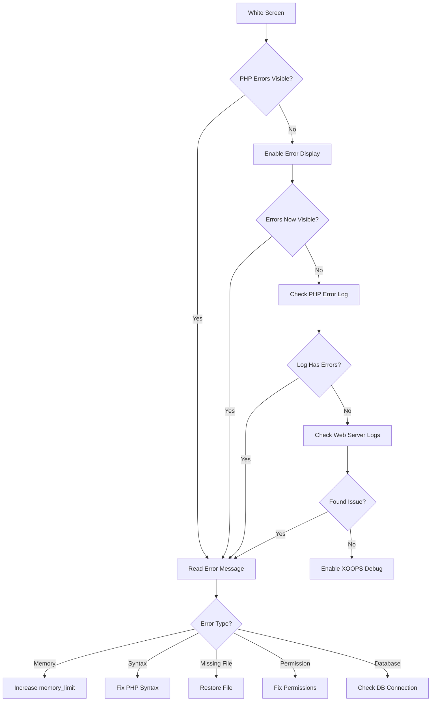
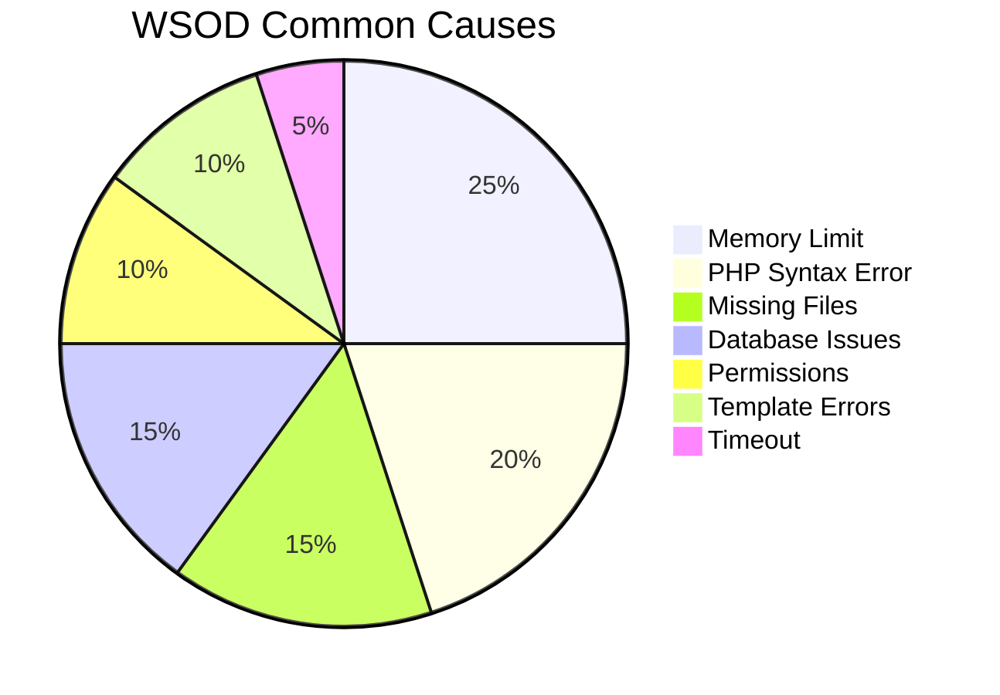
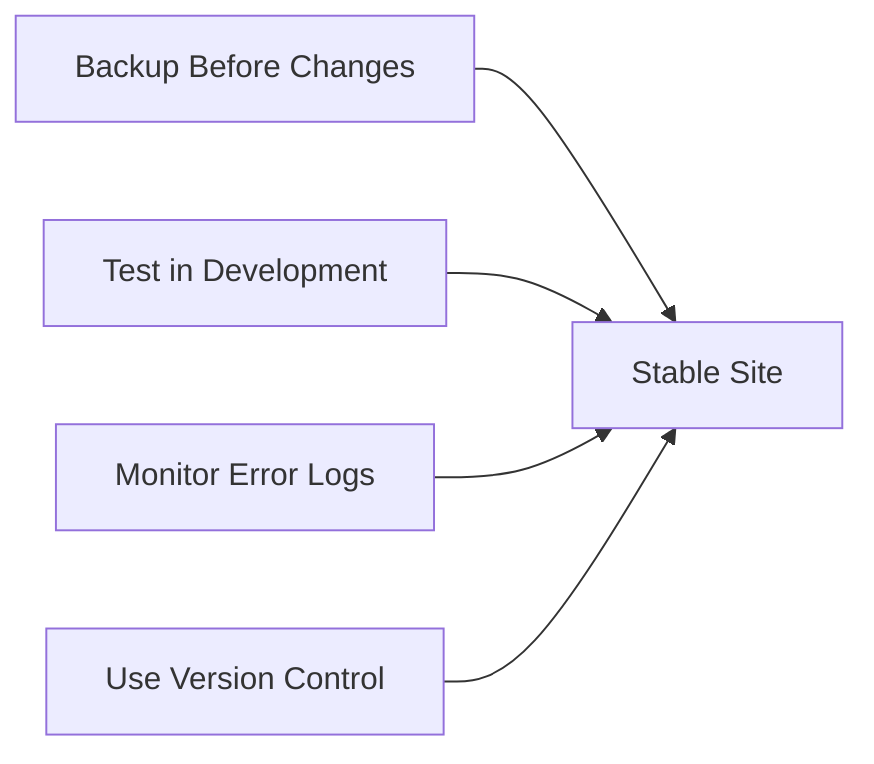

# White Screen of Death (WSOD)

> How to diagnose and fix blank white pages in XOOPS.

---

## Diagnostic Flowchart



---

## Quick Diagnosis

### Step 1: Enable PHP Error Display

Add to `mainfile.php` temporarily:

```php
<?php
// Add at the very top, after <?php
error_reporting(E_ALL);
ini_set('display_errors', '1');
ini_set('display_startup_errors', '1');
```

### Step 2: Check PHP Error Log

```bash
# Common log locations
tail -100 /var/log/php/error.log
tail -100 /var/log/apache2/error.log
tail -100 /var/log/nginx/error.log

# Or check PHP info for log location
php -i | grep error_log
```

### Step 3: Enable XOOPS Debug

```php
// In mainfile.php
define('XOOPS_DEBUG_LEVEL', 2);
```

---

## Common Causes & Solutions



### 1. Memory Limit Exceeded

**Symptoms:**
- Blank page on large operations
- Works for small data, fails for large

**Error:**
```
Fatal error: Allowed memory size of 134217728 bytes exhausted
```

**Solutions:**

```php
// In mainfile.php
ini_set('memory_limit', '256M');

// Or in .htaccess
php_value memory_limit 256M

// Or in php.ini
memory_limit = 256M
```

### 2. PHP Syntax Error

**Symptoms:**
- WSOD after editing PHP file
- Specific page fails, others work

**Error:**
```
Parse error: syntax error, unexpected '}' in /path/file.php on line 123
```

**Solutions:**

```bash
# Check file for syntax errors
php -l /path/to/file.php

# Check all PHP files in module
find modules/mymodule -name "*.php" -exec php -l {} \;
```

### 3. Missing Required File

**Symptoms:**
- WSOD after upload/migration
- Random pages fail

**Error:**
```
Fatal error: require_once(): Failed opening required 'class/Helper.php'
```

**Solutions:**

```bash
# Re-upload missing files
# Compare against fresh installation
diff -r /path/to/xoops /path/to/fresh-xoops

# Check file permissions
ls -la class/
```

### 4. Database Connection Failed

**Symptoms:**
- All pages show WSOD
- Static files (images, CSS) work

**Error:**
```
Warning: mysqli_connect(): Access denied for user
```

**Solutions:**

```php
// Verify credentials in mainfile.php
define('XOOPS_DB_HOST', 'localhost');
define('XOOPS_DB_USER', 'your_user');
define('XOOPS_DB_PASS', 'your_password');
define('XOOPS_DB_NAME', 'your_database');

// Test connection manually
<?php
$conn = new mysqli('localhost', 'user', 'pass', 'database');
if ($conn->connect_error) {
    die("Connection failed: " . $conn->connect_error);
}
echo "Connected successfully";
```

### 5. Permission Issues

**Symptoms:**
- WSOD when writing files
- Cache/compile errors

**Solutions:**

```bash
# Fix directory permissions
chmod -R 755 htdocs/
chmod -R 777 xoops_data/
chmod -R 777 uploads/

# Fix ownership
chown -R www-data:www-data /path/to/xoops
```

### 6. Smarty Template Error

**Symptoms:**
- WSOD on specific pages
- Works after clearing cache

**Solutions:**

```bash
# Clear Smarty cache
rm -rf xoops_data/caches/smarty_cache/*
rm -rf xoops_data/caches/smarty_compile/*

# Check template syntax
```

### 7. Maximum Execution Time

**Symptoms:**
- WSOD after ~30 seconds
- Long operations fail

**Error:**
```
Fatal error: Maximum execution time of 30 seconds exceeded
```

**Solutions:**

```php
// In mainfile.php
set_time_limit(300);

// Or in .htaccess
php_value max_execution_time 300
```

---

## Debug Script

Create `debug.php` in XOOPS root:

```php
<?php
/**
 * XOOPS Debug Script
 * Delete after troubleshooting!
 */

error_reporting(E_ALL);
ini_set('display_errors', '1');

echo "<h1>XOOPS Debug</h1>";

// Check PHP version
echo "<h2>PHP Version</h2>";
echo "PHP " . PHP_VERSION . "<br>";

// Check required extensions
echo "<h2>Required Extensions</h2>";
$required = ['mysqli', 'gd', 'curl', 'json', 'mbstring'];
foreach ($required as $ext) {
    $status = extension_loaded($ext) ? '✓' : '✗';
    echo "$status $ext<br>";
}

// Check file permissions
echo "<h2>Directory Permissions</h2>";
$dirs = [
    'xoops_data' => 'xoops_data',
    'uploads' => 'uploads',
    'cache' => 'xoops_data/caches'
];
foreach ($dirs as $name => $path) {
    $writable = is_writable($path) ? '✓ Writable' : '✗ Not writable';
    echo "$name: $writable<br>";
}

// Test database connection
echo "<h2>Database Connection</h2>";
if (file_exists('mainfile.php')) {
    // Extract credentials (simple regex, not production safe)
    $mainfile = file_get_contents('mainfile.php');
    preg_match("/XOOPS_DB_HOST.*'(.+?)'/", $mainfile, $host);
    preg_match("/XOOPS_DB_USER.*'(.+?)'/", $mainfile, $user);
    preg_match("/XOOPS_DB_PASS.*'(.+?)'/", $mainfile, $pass);
    preg_match("/XOOPS_DB_NAME.*'(.+?)'/", $mainfile, $name);

    if (!empty($host[1])) {
        $conn = @new mysqli($host[1], $user[1], $pass[1], $name[1]);
        if ($conn->connect_error) {
            echo "✗ Connection failed: " . $conn->connect_error;
        } else {
            echo "✓ Connected to database";
            $conn->close();
        }
    }
} else {
    echo "mainfile.php not found";
}

// Memory info
echo "<h2>Memory</h2>";
echo "Memory Limit: " . ini_get('memory_limit') . "<br>";
echo "Current Usage: " . round(memory_get_usage() / 1024 / 1024, 2) . " MB<br>";

// Check error log location
echo "<h2>Error Log</h2>";
echo "Location: " . ini_get('error_log');
```

---

## Prevention



1. **Always backup** before making changes
2. **Test locally** before deploying
3. **Monitor error logs** regularly
4. **Use git** for tracking changes
5. **Keep PHP updated** within supported versions

---

## Related Documentation

- [[Database-Connection-Errors|Database Connection Errors]]
- [[Permission-Denied|Permission Denied Errors]]
- [[../Debugging/Enable-Debug-Mode|Enable Debug Mode]]

---

#xoops #troubleshooting #wsod #debugging #errors
